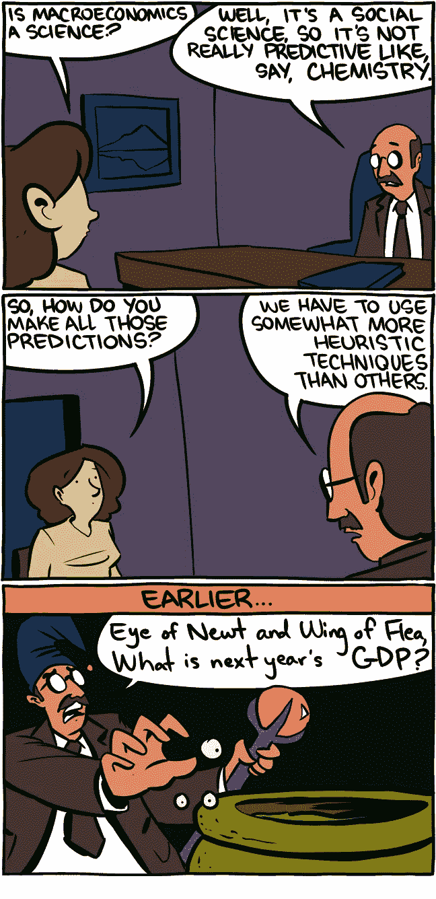
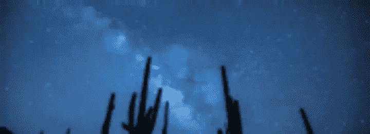

# 天空中的眼睛:作为大数据的卫星图像。

> 原文：<https://towardsdatascience.com/the-eyes-in-the-sky-on-satellite-imagery-as-big-data-210830722f3d?source=collection_archive---------9----------------------->

我们迫切需要卫星图像可能提供的更广阔的图景。

艺术和科学长期以来推动人类探索大小和规模的极限。这两个领域的进步都以这样或那样的方式受到人类对极大和极小事物的兴趣的影响。想想微积分、微生物学、硅藻、望远镜、纳米技术和许多其他科学领域的例子。圣彼得大教堂的壁画，莫扎特作品的非凡长度，甚至列奥纳多·达·芬奇的插图和绘画的规模都是艺术中突出的例子。大小和比例通常让人类着迷，因为它们的极端与我们的自然感知格格不入。在他的文章介绍中(我推荐你阅读)**。散文作家凯文·西姆勒陈述如下:**

> *没有显微镜、望远镜或计算机，不久前的人类几乎没有办法在与日常生活大不相同的尺度上体验现实。仰望天空，远眺海洋，或者穿越峡谷，让我们对一些额外的数量级有了更多的欣赏。更进一步需要想象力。*
> 
> *今天，由于技术和科学，我们有工具在改变思维的尺度上理解现实。我们现在可以在几代人之前无法想象的维度上思考时间和空间。*

*科学上一个奇特的飞跃是使用卫星图像作为现成的数据来源。除其他原因外，这种特殊性源于卫星图像的使用在大光谱和小光谱的两端:*

## *漂浮在巨人的肩膀上，看得更远，看得更详细。*

*艾萨克·牛顿(Isaac Newton)的格言一直激励着我，即依靠以前的工作来推动我们的进步:*

> *为了看得更远，我不得不站在巨人的肩膀上*

*很酷的故事艾萨克。但是，你看，遥感和卫星图像提供了一个不同的进步视角，其重要性不受学科边界的限制。*

## *另一种观点*

*卫星图像作为大数据的本质可以从我们看待世界的范式转变中看出。想想我们是如何看待衡量经济进步的指标的。大多数人信任经济模型，即使这些模型的方法在不合适的地方也会被使用。但是有了遥感技术(包括使用卫星和无人机等),我们可以从我们的夜灯图像中获得关于我们经济状况的相当有见地的信息。*

*现在你可能想说“好吧，这太荒谬了，伙计，我们电气化房屋的照片告诉了我们什么关于我们的经济，难道我们不需要复杂的图表和方程来理解这些吗”？我个人不这么认为:*

**

*然而，对此更合理的回应可以在*的《每个人都在说谎》一书中找到，塞斯·斯蒂芬斯-达维多维茨在书中写道:**

> *为什么夜灯可以很好地衡量 GDP？在世界上非常贫穷的地方，人们努力支付电费。因此，当经济状况不佳时，家庭和村庄会大幅减少夜间的采光量。*

*遥感卫星图像记录的夜间光线变化与全球许多发展中地区的经济波动相关，这种相关性显然暗示着因果关系。*

*卫星图像的使用也与环境建模和监测相关。像 NDVI、NDBI 和 NDWI 这样的归一化差异光谱指数提供了数据，分别为我们提供了直接植被、人工和开放水域环境状态的众多视角。*

*   *归一化植被指数差异与森林监测、确定作物水分胁迫、湿地健康、河流流域管理甚至干旱监测相关*
*   *另一方面，标准化的差异建造指数可以为城市化速度、城市规划提供信息，甚至允许我们将媒介传播疾病的扩散与居住模式的变化联系起来。*
*   *标准化的差异水指数能够提取或描绘开放水域的特征，并能告诉你你家后院的湖有多浑浊，只要它在地球轨道上可见。此外，当嵌入机器学习系统和其他统计方法时，可以预测与洪水相关的主要灾害。这样美国人就可以在飓风出生前给它们命名:*

**

## *为什么是卫星图像？*

*想想大多数撒哈拉以南非洲居民依赖的行业:农业。除了监测和预测干旱，卫星图像还可以提供对农田缺水可能性的见解，基本上在灌溉对作物生产造成威胁之前就通知灌溉需求。这强调了遥感和卫星图像的特殊意义，以及在我们追求可持续发展的未来时，这些技术为我们带来的希望。*

*卫星图像作为多用途数据源脱颖而出的另一个原因是其领域独立性。卫星图像的使用跨越了工业界和学术界，为各种决策和研究方法提供了信息。此外，insights 卫星图像能够以多种方式提供超过许多已为相同目的发明的技术。*

## *透视反转*

*传统数据源并没有过时或无用。它们得到了新数据源的很好补充，新数据源能够给予我们以前从未想象过的洞察力。我们从遥感和卫星图像中获得的环境的光谱和空间细节包含了大量的数据，等待从中获得最佳的洞察力。然而，大小并不是最重要的。正是与遥感和卫星图像有关的领域知识的多样性使其成为一个独特的数据来源。*

## *坍缩成致密物质！*

**

*[加入](https://goo.gl/forms/pb3NQWoU3m6GjaYA3)星云研究时事通讯，获取更多关于一次一项技术让世界变得更美好的文章。点击[这里](https://goo.gl/forms/pb3NQWoU3m6GjaYA3)报名*