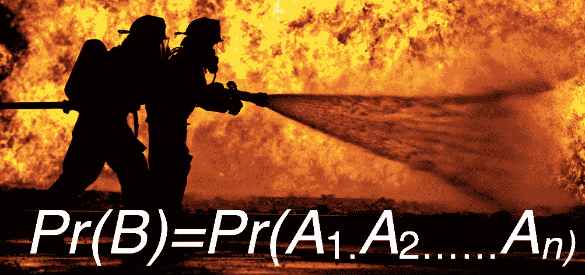
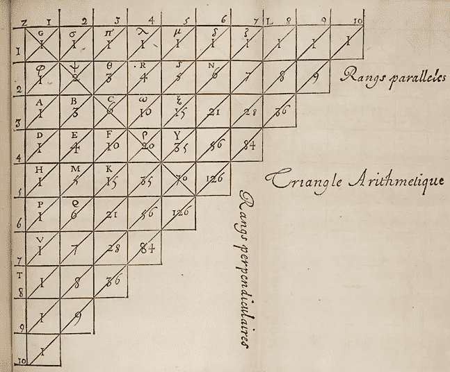
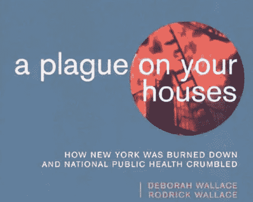
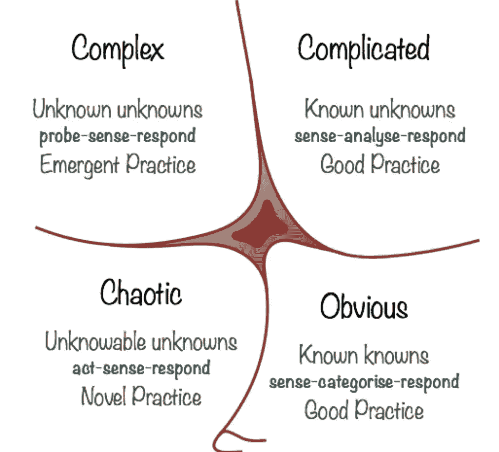
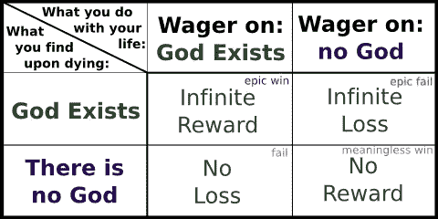

# 复杂世界中预测的谬误

> 原文：<https://towardsdatascience.com/the-fallacy-of-forecasting-in-a-complex-world-c83b765107bd?source=collection_archive---------3----------------------->

“统计预测只在无菌的实验室条件下有效，这突然变得不像以前那样有用了。”——Gary King

我注意到基于“预测分析”、“预测”、“统计分析”和最新术语“近似预测”的火灾和 EMS 部署模型有上升趋势。最近，一份基于奥兰治县消防局(OCFA)的“覆盖标准”报告提出了一种部署模型，该模型基于夜间低水平的火灾减少了午夜时段的灭火单位。当我读到这些报告时，我想站起来大声说“事情不是这样的；这一切都不是这样的。”
首先，发生的频率不等于风险水平。换句话说，一个事件从未发生过，并不意味着它发生的概率很低。考虑被蛇咬伤的情况。我从未被响尾蛇咬过；因此，我的出现频率为零。但是被蛇咬的频率为零并不能说明被蛇咬的风险。如果我把手伸到有响尾蛇的岩石下，我被咬的风险非常高，不管发生的频率如何。但这正是《OCRA 覆盖标准》的作者在提出基于发生频率的部署模型时所使用的逻辑。

在试图解释所发生的事情时，研究历史统计数据会非常有用。但是仅仅识别统计数据中的趋势并不能自动转化为对未来的预测。统计是解释工具，不是预测工具。如果你试图将统计数据整合到预测模型中，你可能会发现自己溺死在平均只有 4 英尺深的湖里，或者在平均温度为 75 度的建筑物中被烧死。

## **在平均温度 75 度的建筑里被烧伤**

想象一下，你带着两辆车来到一栋四层公寓楼的火警现场；布莱斯和皮埃尔都是世界著名的统计学家。当布莱斯和皮埃尔认出这个地址是他们研究了多年的一栋建筑时，他们的脸上露出了兴奋的表情，这栋建筑的每个房间都安装了远程传感器。他们立即在手机上打开一个应用程序，访问该建筑的统计数据。

火警面板显示四楼有火警。你的船员拿起装备，向楼梯走去。皮埃尔突然抗议道。根据这些数据，Pierre 声称你应该离开设备，乘电梯而不是爬楼梯。“我们有所有的数据”皮埃尔喊道。“大楼里的平均温度只有 75 度。我们已经监视这座建筑很多年了，根据统计趋势，我们有 99%的把握没有发生火灾。这栋建筑的火灾是一个 sigma 事件。”

你的船员无视皮埃尔，爬上楼梯。坚持不懈，皮埃尔跟着，继续用诸如相关性、中心极限定理、干扰和回归分析等术语来攻击你。

在四楼，当你打开通往烟雾弥漫的走廊的楼梯井的门时，皮埃尔发出了最后一次抗议；"发生火灾几乎是不可能的，我担心你对拉普拉斯定律缺乏了解。"就在掩饰之前，你大声回应；是的，先生，但是我担心你对墨菲定律缺乏了解

## 墨菲定律——“任何可能发生的事情都会发生”——奥古斯都·德·摩根，1866 年

墨菲定律的起源是不确定的，但它通过我们的文化的超越是对其真理的认可。虽然不是普遍适用的(你的车不会变成火鸡)，墨菲定律的哲学与应急管理领域相关；在我们的理想世界中，我们期待最好的，但在现实世界中，我们做最坏的打算，准备大吃一惊。

## **理想主义者 vs 现实主义者**

在理想世界中，事件以一种孤立的、可预测的模式发生；所有可能的变量都可以绘制出来，并与备选方案进行权衡，从而产生精确的预测。

然而，在现实世界中，事件并不是孤立的，模式是不稳定的，无数的变量相互作用，创造出难以想象的事件，就像生命本身一样。唯心主义和现实主义对立的世界观从一开始就困扰着概率领域。

## **概率的起源——赌博公元 1653 年**

先验的，事前知道的

1653 年，年轻的法国学者布莱士·帕斯卡发表了《算术三角形论》，现在被称为帕斯卡三角形。帕斯卡发明了一种方法来预测游戏的结果，通过绘制出每一种可能的结果，并将其与备选结果进行比较。

例如，如果我问在六面骰子上掷出“3”的几率，帕斯卡的理论是我们如何计算几率为 1/6，因为“3”是六个同等可能性选项中的一个。如果我问在八面骰子上掷出“1”或“2”的几率，几率是八分之二。随着变量的增加，程序变得指数级复杂，但是过程仍然是相同的。

Pascal’s Triangle based on the roll of two ten sides dice

尽管很聪明， **Pascal 方法是为在无菌和受控的环境中玩游戏而设计的。帕斯卡从未打算将他的工作应用于现实世界，正如我们将在他的个人生活中看到的那样，帕斯卡使用了一种完全不同的方法，我称之为“风险管理”。**

## **弥合差距——从理想到现实**

后验——基于过去的事件

帕斯卡之后大约一百年，皮埃尔·西蒙·拉普拉斯想在现实世界中做出预测，特别是天体的运动。由于缺乏帕斯卡在他的机会游戏中所享受的每个变量的确切知识，拉普拉斯用历史数据代替了游戏中的已知变量。换句话说，帕斯卡知道每个骰子的边数，而拉普拉斯方法通过观察多次滚动来猜测骰子的边数，或者更确切地说是出现的频率。但是拉普拉斯并没有预测在六面骰子上掷出“1”的几率；他在预测明天太阳升起的几率。拉普拉斯的工作演变成一个复杂的领域，需要根据数据的质量和大小来衡量对结果准确性的信心，而帕斯卡的预测非常准确，因为他在游戏开始前就知道所有的变量。拉普拉斯是学者中真正的巨人，推动了数学、统计学、物理学和天文学的发展。然而，他的方法可能会被错误应用和过度利用；站在巨人的背上伴随着悲惨坠落的风险。

**墨菲定律 Vs 拉普拉斯**

顺便说一下，拉普拉斯根据历史数据计算出明天太阳升起的几率为 99.999999…..%，这是基于历史数据可以做出的最有把握的预测。然而，太阳的衰老保证了太阳没有升起的一天。按照墨菲定律，拉普拉斯的预测充其量是 99%准确，但总有一天会 100%错误。

**比喻利用历史数据进行预测**

想象一下，你正在驾驶一辆挡风玻璃被遮住的汽车，后视镜是你唯一的导航工具。后视镜提供了周围环境的线索，如道路的宽度、路肩的深度、地形的坡度和道路的模式。通过大量的努力和一点点直觉，你会适应你身后的画面，让你根据你注意到的趋势选择一个舒适的速度。一条简单的直路和宽阔的路肩可以让你加速，而一条复杂的弯道会让你减速。但是如果路况改变，你的速度永远不会超过你的恢复能力。

在你的旅途中，你会遇到一个被轻微烧伤的法国统计学家，皮埃尔。你的新乘客对保持汽车行驶所需的努力感到惊讶，并主动提供帮助。他确定了一个与道路方向“高度相关”的“描述性数据样本”，或者用外行人的话来说，他说只要看看道路上画的黄线就行了。

接受 Pierre 的建议，你把注意力集中在黄线上，这比测量整个环境要容易得多。你放松并享受旅程，感谢你的新朋友。

在匆忙去当地诊所检查烧伤的时候，Pierre 建议你开快点，因为他 99%的信心是当前的趋势会继续下去，误差很小。如果道路急转弯，仅仅基于预测的新速度超出了你的恢复能力。当汽车加速时，一种本能的恐惧爬上你的心头，皮埃尔令人眼花缭乱的数学超越了你的判断。

## **金融业从预测中学到了什么**

一个预测模型，“风险价值”(VaR)被广泛认为是 2006 年金融危机的原因。简而言之，VaR 将金融公司的累积风险总结为一个基于概率的指标；创建一个优雅、精确的风险衡量标准，但这个标准存在严重缺陷。用对冲基金经理大卫·艾因霍恩(David Einhorn)的话来说，风险值“当它的使用在高管中造成一种虚假的安全感时，可能是灾难性的。”

A VaR chart showing a 95% probability the portfolio will stay above 42 mil.

风险值误导预测的可能性遭到了猛烈抨击，风险经理和学者纳西姆·塔勒布(Nassim Taleb)在国会作证，要求禁止金融机构使用风险值。事实上，出于直觉，塔勒布在 1997 年公开预测了过度杠杆化预测模型所造成的损害，声称 VaR“忽视了 2500 年的经验，而倾向于非交易者建立的未经测试的模型”，这些模型“给出了错误的信心”，因为“不可能估计罕见事件的风险。”

尽管有这些缺点， **VaR 型预测模型已经投入使用**。从 1972 年 RAND 报告“纽约市消防项目部署研究”开始，一个令人印象深刻的预测分析显示建议关闭消防站。“确信他们的统计训练胜过了经验丰富的消防官员的经验，”兰德花了几年时间建立计算机模型来预测火灾，并根据分析结果实施车站关闭。其结果是许多不受控制的火灾和超过 60 万人从烧毁的家园流离失所。FDNY 让令人眼花缭乱的数学超越了他们的判断。

A scientific study showing the result of cutting the NY fire department, including the spread of tuberculosis and HIV

*预测就像电锯，很容易用，很难用好，而且总是很危险。*

随着亚特兰大和辛辛那提等城市投入预测分析，纽约正在用 FireCast 进行另一次尝试，“一种将来自五个城市机构的数据组织成大约 60 个风险因素的算法，然后用于创建最容易发生火灾的建筑物列表。”根据脆弱性对建筑物进行排名似乎是合理的，但是一旦你开始预测一个复杂系统中的事件，挑战就出现了。

想想预测 2016 年世界职业棒球大赛第七场冠军的难度。相对而言，这是一个简单的问题；你只有 50 个参与者在有限的时间内玩一个规定的游戏。你的参与者都有大量来自相对无菌环境的描述性和预测性数据。然而这场比赛的结果直到比赛结束都不为人知。

将简单的棒球问题与预测一个拥有一百万居民的城市在无限时间框架内的复杂行为进行对比。我们用一个简单的系统将一个模型扩展到极限，并试图将它扩展到超乎想象的程度，以适应一个复杂的系统。

**复杂系统对简单系统**

概率有效，预测有效——在正确的领域，简单的系统。Cynefin 框架将简单系统定义为“已知的已知”。像棒球比赛一样，简单的系统是稳定的，具有可识别的、可重复的和可预测的因果关系，例如预测未来五年消防车的行驶里程。在简单的系统中，你研究历史，预测未来，并制定计划。

与复杂系统相反，复杂系统中的因果关系只能在事后才能察觉。由于大量的变量和影响，这些系统继承了不可预测性。这就是墨菲定律的由来。简单的系统容易剖析和理解，但复杂的系统“不受简化论者的影响，因为你的行动以不可预测的方式改变了情况。”在复杂的系统中，概率是有限的，预测造成了一种虚假的自信感，墨菲定律是正确的。

城市是复杂的系统。人类行为是一个复杂的系统。由人类行为引发的城市火灾极其复杂。对于那些声称用数学模型预测复杂系统未来，却不能自信地预测下一届超级碗冠军的人，要持非常怀疑的态度。

*“所有的模型都是错误的；有些是有用的。”乔治·博克斯*

概率是一种辉煌的方法论，最初是为毫无结果的机会游戏设计的，后来演变成一个令人眼花缭乱的数学领域。概率在适当的情况下起作用，但如果过度利用，可能会产生致命的结果。用作者查尔斯·惠兰的话说，“概率不会出错；使用概率的人会犯错。”金融业和消防服务已经被过度杠杆化的预测模型所吞噬。数学是惊人的，结果是优雅的，但如果应用于错误的领域，后果是灾难性的。不要让数学超越你的智慧。

## 尾声——帕斯卡的赌注

概率之父帕斯卡明白他的方法在现实生活中的局限性。当被要求就上帝的存在打赌时，帕斯卡没有考虑上帝存在的概率、赔率或证据。帕斯卡考虑了错误的后果，并选择了后果最小的选项。帕斯卡得出结论，接受上帝的存在和错误没有比选择更大的后果。但是否认上帝的存在和犯错会带来巨大的后果，包括在地狱里永世不得超生。

Pascals wager

概率之父帕斯卡声称，当一个理性的人在处理未知时，他们应该考虑后果，而不是几率。证据表明，帕斯卡理解墨菲定律，是一个真正风险管理者。

[*埃里克·塞洛斯为精英指挥培训讲授这方面的课程*](http://elitecommandtraining.com)

*并且可以在推特上关注* [@saylorssays](https://twitter.com/saylorssays)

 [## 量化负面:消防服务的真正价值

### 我们在公共安全领域面临的最大挑战之一是以可量化的方式阐明我们的价值。这个挑战是…

medium.com](https://medium.com/elitecommandtraining/quantifying-the-negative-the-true-value-of-the-fire-service-f1093e4bcfc2)