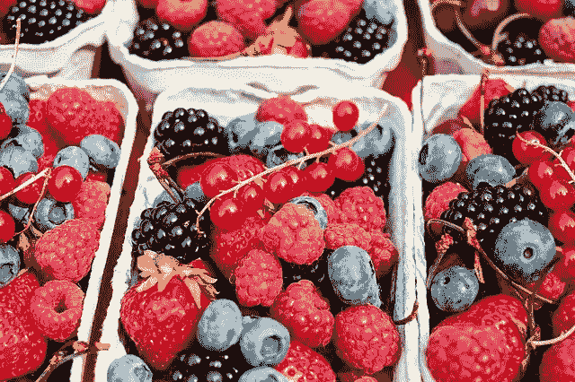

# 深度学习的成果:卷积神经网络如何支持机器人收割和产量绘图

> 原文：<https://towardsdatascience.com/the-fruits-of-deep-learning-how-convolutional-neural-networks-support-robotic-harvesting-and-yield-35e2d383e2d8?source=collection_archive---------10----------------------->

Delicious deep learning

准确高效的水果检测对于机器人收获和产量制图至关重要。

不管机器人的抓取系统有多复杂，它们只能抓取视觉系统能探测到的水果。此外，水果检测有助于生成产量图，跟踪作物生产的空间可变产量，并作为精准农业的决策工具。

许多因素使水果检测成为一项具有挑战性的任务:水果出现在不同照明的场景中，可能被其他物体遮挡，有时很难从背景中分辨出来。

理想的水果检测系统是准确的，可以在容易获得的数据集上进行训练，实时生成预测，适应不同类型的水果，并使用不同的模式(如彩色图像和红外图像)日夜工作。

在过去的几年里，深度学习方法在解决这些需求方面取得了长足的进步。这篇文章强调了水果检测中的一些挑战和最近的里程碑。

计算机视觉任务的第一个挑战是获取相机图像或视频帧形式的原始数据。在农业领域，经常通过使用无人机和机器人来收集数据。

水果检测可以表述为一个图像分割问题。为了使计算机视觉系统从可用的原始数据中学习，需要将作为水果一部分的像素与代表背景的像素区分开。

单独注释水果像素是劳动密集型的。幸运的是，深度学习系统不需要像素信息，而是可以从边界框注释中学习。

Sa 等人[5]报告称，标记一幅图像中的水果像素需要将近 100 秒，执行边界框注释需要大约 10 秒。换句话说，给定相同的资源，使用边界框将产生十倍大的注释数据集。

合成生成的数据集提供了人类注释的潜在替代方案。Rahnemoonfar 和 Sheppard [3]实验了一个相对简单的过程，包括用绿色和棕色的圆圈填充空白图像，模糊图像，并在随机位置绘制随机大小的圆圈。Barth 等人[2]使用一个复杂的过程，为 42 个不同的植物模型综合创建了 10，500 幅图像，这些模型具有随机的植物参数。

在许多情况下，深度视觉系统受益于迁移学习。现有的卷积神经网络(CNN)已经在数百万张图像上进行训练，并由领先的研究人员多年来进行优化，可以针对特定领域的任务进行微调，而不是从零开始每个项目。

特别是，许多针对水果检测问题的深度学习解决方案都是基于一个非常成功的对象检测网络，名为 Faster R-CNN[4]。这个神经网络分两步训练:第一步，使用由 120 万个例子组成的数据集 ImageNet 训练更快的 R-CNN 作为图像分类器。然后，使用另一个名为 PASCAL VOC 的数据集对网络进行微调，以进行对象检测。

快速 R-CNN 中的区域提议模块生成一组可能包含感兴趣对象的候选边界框。用作者的话说，这个模块告诉网络“往哪里看”。对于每个建议的盒子，区域分类步骤然后计算该盒子可能属于的类的概率分布。

存在的更快的 R-CNN 的变体在用于为网络的区域提议部分提取图像特征的卷积层的集合上不同。具有 13 个卷积层的 VGG-16 变体更深且计算更密集，而 ZF 变体更浅但更快。

在深度神经网络出现之前，计算机视觉模型中的特征是针对特定任务和收集数据的特定条件人工设计的。深度学习模型会自动学习这些特征，从而节省大量的开发时间。

Sa 等人关于 DeepFruits 系统的论文的发表[5]标志着水果检测的深度学习方法的发展中的一个重要里程碑。DeepFruits 建立在更快的 R-CNN 上，可以检测温室中拍摄的图像中的甜椒和岩瓜。该系统可以在几个小时内完成训练，在商用硬件上运行，每幅图像的检测时间约为 400 毫秒。

作者使用了更快的 R-CNN 的 VGG-16 变体，并表明第一层中的过滤器专门处理低级特征，例如与红色和绿色糖果纸相对应的红色和绿色。具有强激活的较高级别层中的区域通常对应于属于水果的图像区域。

当交集超过联合分数大于 0.4 时，包含水果的区域被认为被检测到。使用这个阈值，作者报告了甜椒检测任务的 F1 分数在 0.8 和 0.84 之间。性能最好的方法是使用一种称为“后期融合”的评分方法，将来自 RGB 和近红外图像的单独训练模型的建议结合起来

有趣的是，当更快的 R-CNN 组件在仅仅 20 张训练图像上进行微调时，DeepFruit 达到了令人尊敬的 0.8 的 F1 分数。应该注意的是，实验中使用的数据集非常小。每个分类器在大约 100 幅图像上进行训练，并在几十幅图像上进行测试。

自发表以来，许多新论文都建立在 DeepFruits 的基础上，以解决类似的更具挑战性的问题。

一个显著的例子是 Bargoti & Underwood 发表的关于果园水果检测的论文[1]。研究人员在白天使用机器人车辆捕捉三种水果类型的高分辨率整树图像:苹果、杏仁和芒果。该数据集总共包含 2000 多幅训练图像和近 500 幅测试图像。

作者强调，由于每个水果的高像素计数和每个图像的低水果计数，增加了难度。例如，杏树可以结 1，000-10，000 颗杏仁，而且个头比其他水果品种小。

DeepFruits 和 Bargoti & Underwood 论文中描述的系统都使用更快的 R-CNN，并将水果检测视为一组二元问题:为每种水果类型训练一个检测器。另一个共性是非最大抑制(NMS)的应用，这是一种用于处理重叠区域的程序。NMS 消除了与高置信度候选项强烈重叠的低置信度区域，如通过联合分数的交集所测量的。

Bargoti & Underwood 试验了不同的数据增强技术，发现通过翻转和缩放可用图像可以实现性能的最大提升。

VGG-16 需要 2.5 GB 的 GPU 内存来存储 25 万像素的图像。为了克服这个瓶颈，作者采用了一种他们称为“平铺式更快 R-CNN”的方法:使用在图像上滑动的适当大小的窗口进行检测。为了确保水果不会在图块之间分开，两个图块之间的重叠大于最大水果尺寸。然后，将 NMS 应用于所有图块的组合输出。

使用这种设置，更快的 R-CNN 的 VGG 变体优于更浅的 ZF 变体，并且苹果和芒果的 F1 得分超过 0.9。对于较小尺寸和经常出现的杏仁，水果检测结果据报道接近 0.78。有趣的是，对于只有五幅图像的苹果，检测性能达到 0.6，而对于训练图像的最后一倍，检测性能仅提高了 0.01。

最后，作者指出，更快的 R-CNN 的正确选择取决于手头的任务。例如，计算效率对于机器人收割来说比产量绘图更重要，产量绘图可以离线进行。

DeepFruits 和相关系统取得的有希望的结果标志着农业技术的令人兴奋的发展。让我们希望深度视觉系统将为普遍获得负担得起的、有营养的和美味的食物的目标做出重要贡献。

水果计数是一个更高级的任务，它建立在水果检测的基础上，并需要跟踪在以前的帧中已经看到的水果，这是一个可能在将来的文章中讨论的主题。

# 感谢您的阅读！如果你喜欢这篇文章，请点击“鼓掌”按钮，关注我并查看[aisummary.com](http://aisummary.com)以获得更多关于令人兴奋的机器学习应用的信息。

# 参考

[1]s .巴尔戈蒂和 j .安德伍德，2017 年 5 月。果园深度水果检测。在*机器人与自动化(ICRA)，2017 IEEE 国际会议上*(第 3626–3633 页)。IEEE。

[2]r . Barth，IJsselmuiden，j . Hemming，j .和 e . j . Van Henten，2018 年。农业语义分割的数据合成方法:辣椒数据集。*农业中的计算机和电子*， *144* ，第 284–296 页。

[3] Rahnemoonfar，m .和 Sheppard，c .，2017 年。深度计数:基于深度模拟学习的水果计数。*传感器*、 *17* (4)，第 905 页。

[4]任，s .，何，k .，吉希克，r .和孙，j .，2015 年。更快的 r-cnn:用区域建议网络实现实时目标检测。在*神经信息处理系统的进展*(第 91–99 页)。

[5] Sa，I .，Ge，z .，Dayoub，f .，Upcroft，b .，Perez，t .和麦克库尔，c .，2016 年。Deepfruits:一个使用深度神经网络的水果检测系统。*传感器*、 *16* (8)，第 1222 页。