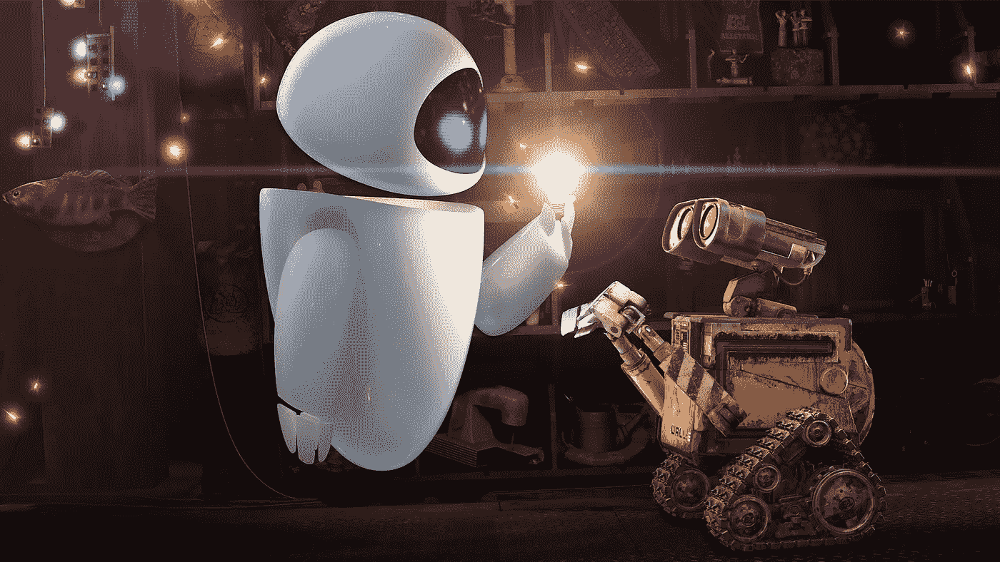
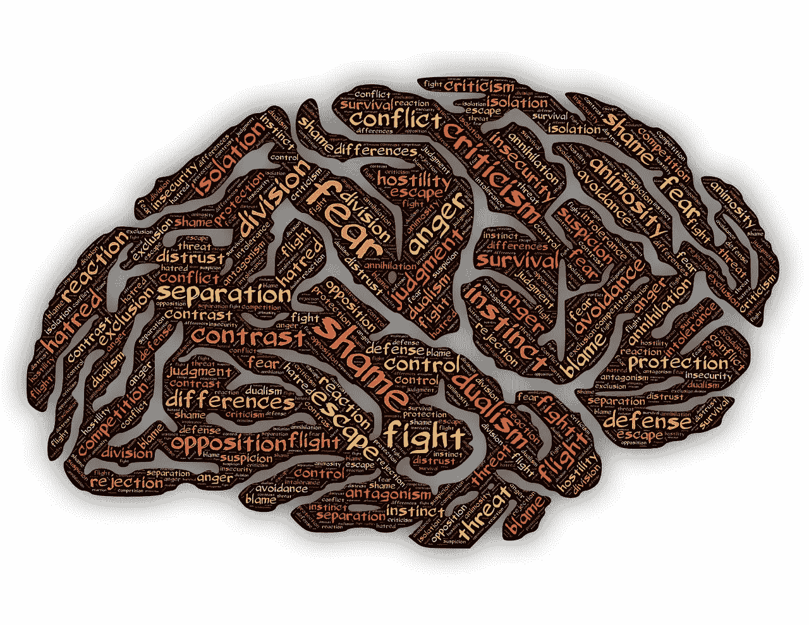

# 人工智能的未来:重新定义我们如何想象

> 原文：<https://towardsdatascience.com/the-future-of-ai-redefining-how-we-imagine-596d5747da2e?source=collection_archive---------7----------------------->

*原文贴在* [*FICO 博客*](http://www.fico.com/en/blogs/analytics-optimization/the-future-of-ai-redefining-how-we-imagine)

展望未来 20 年，我认为我们将远远超越人工智能迄今带来的生产力提升。随着人工智能的出现，我们将看到我们个人生活以及整个社会的复兴。

# 卫生保健

今天，我们的设备能够监测我们走的步数、心跳速率以及汗水含量。所有这些丰富的信息使得一个由医生、工程师和分析师组成的团队能够监测我们的健康状况，并保持我们的最佳表现。同样，随着基因组测序和神经图谱方面的创新通过 FDA 试验，我们将很快看到个性化医疗领域的巨大飞跃。人工智能将帮助我们了解个体的生理需求，以便提出定制的处方，提高我们的整体健康标准。

# 认知能力

人们热衷于提高认知。谁不想更好地记住名字和面孔，更快地理解困难的抽象概念，更好地“发现联系”呢？谁会严重反对能够在更深层次上欣赏音乐呢？

[最佳认知功能](http://www.nickbostrom.com/posthuman.pdf)的价值是如此明显，以至于没有必要详细阐述这一点。今天，我们通过艺术、电影、音乐、博客和各种社交媒体应用来表达自己。在图像识别领域，AI 已经可以通过观察远远超过 RGB 的东西，比我们“看”得更好。虚拟现实让我们感觉自己仿佛被传送到了另一个世界。为了让我们更好地体验我们周围的世界，数据可视化和降维算法的新习惯用法一直在不断产生。

我们一直在努力增强我们的五感，以超越人类的极限。10 年后，这些创新加上物联网设备将成为我们的延伸，帮助我们更深刻地体验我们的周围环境。

# 情商

正如我们增强了我们的五种认知感官一样，我们也增强了表达自己和理解周围人的能力。

很多时候，我们甚至不知道自己想要什么。我们努力以一种特定的方式与周围的人联系，或者消费一种特定的产品，只是为了能感受到一种无法描述的独特情感。我们感受到的不仅仅是快乐、悲伤、愤怒、焦虑或恐惧。我们的情绪是上述所有因素的复杂组合。

随着神经绘图的创新，我们将更好地了解我们作为人类是谁，并更好地了解我们可以达到的无数种情绪状态。随着我们对脑电波进行无监督学习，并帮助找到提高情商的创新方法，我们复杂的情绪模式将得到更好的理解。这包括理解我们自己的情绪和对我们周围的人更加敏感。

或许我们可以解开从未体验过的新情绪。在合适的人手里，人工智能可以作为我们的延伸，帮助我们与生活中我们重视的人建立有意义的联系。

# 经验和想象力

人工智能对我们的经验和想象力的影响将来自更好的认知能力和情商的聚合。人工智能的最新创新可能会帮助我们解锁新的认知体验和情绪状态。

让我们想象一下，我们今天的体验模式是在空间 x 中呈现的。10 年后，让我们说，体验模式是在空间 Y 中呈现的。空间 Y 将比空间 x 大得多。这个 Y 的未来空间可能会接触到除了我们传统的快乐、悲伤和疯狂之外的新类型的情感。这个新的 Y 空间甚至可以让我们更准确地理解反映我们想要表达的抽象思想。

这个新的 Y 空间实际上可以打开一个新的可能性世界，它超出了我们目前的想象。未来的人们将以比我们今天更丰富的程度来思考、感受和体验这个世界。

# 沟通

10 年前，我们的大部分交流仅限于电话和电子邮件。今天，我们可以参加视频会议，虚拟现实和社交媒体上的各种应用程序。随着我们认知能力和情商的提高，我们可以通过分辨率更高、抽象程度更低的习语来表达自己。

我们已经有佛罗里达大学的学生实现了只用意念控制无人机。我们甚至可以使用振动游戏机，利用我们的触觉使马里奥赛车游戏更加逼真。10 年后，我们相互交流的方式将比今天更深入，更具表现力。如果我们有足够的希望，我们甚至可能瞥见*《星球大战》*的全息图和*《x 战警》*的心灵感应通信。

今天的虚拟现实只会限制我们的视觉和听觉。在未来，虚拟现实可能真的允许我们去闻、尝和触摸我们的虚拟环境。除了访问我们的 5 种感官，我们对某些情况的情绪反应可能会通过人工智能的力量进行微调和优化。这可能意味着分享我们的主要角色对超自然活动的恐惧，感受 T2 艾玛的心碎，或者对口袋妖怪的冒险感到兴奋。当我们探索智能虚拟现实控制台的戏剧艺术时，所有这些都是可能的。

# 信息安全

人工智能允许我们以更高速度挖掘更多的非结构化数据，以产生有价值的洞察力。然而，这些非常敏感的数据落入坏人之手的风险也会增加。

今天，网络安全是每个人心中的一个主要问题。事实上，2017 年是[指纹被黑](http://www.huffingtonpost.ca/kevin-deveau/2017-cyber-security_b_14574456.html)的一年。在人工智能的帮助下，信息技术将变得更加复杂，以保护我们生活中珍惜的东西。

这是人类的天性，想要超越我们的极限，变得更加强大。每个人都希望健康长寿，体验更生动，感受更深刻。技术只是实现这一目标的手段。