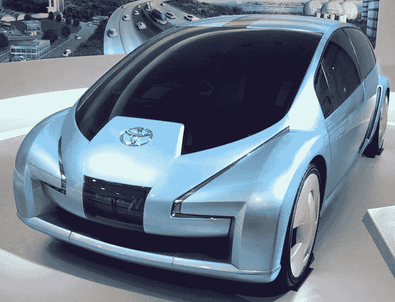
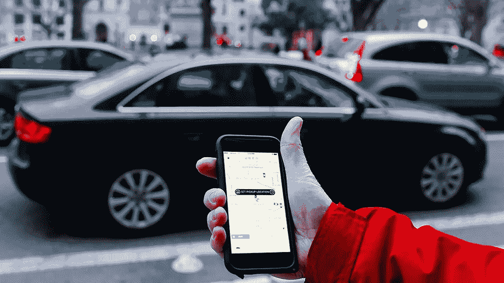

# 汽车工业技术的未来

> 原文：<https://towardsdatascience.com/the-future-of-technology-in-the-automotive-industry-11081c8a1999?source=collection_archive---------1----------------------->

就像手机现在能做的不仅仅是打电话，汽车能做的不仅仅是开车和停车。近年来，汽车行业与主要技术公司携手合作，以提供最先进、最安全和最舒适的汽车。汽车正在成为大型智能设备，具有先进的紧急制动能力、自动驾驶的地图技术、更好的燃油效率以及作为一种运输形式的汽车服务。

在安全方面，汽车正在改善司机和周围其他车辆的生活，减少从 A 点到 B 点的麻烦，并在整个过程中娱乐我们，这样的方式并不缺乏。在未来几年，汽车行业有望取得更大的进步，让我们离更加互联和数字化的环境更近一步。应用程序 Blinker 就是这样一项技术进步，它将控制权还给消费者，让他们可以在智能手机上购买、出售和融资汽车。

这里有四项最具突破性的技术，你可以期待在不久的将来出现在汽车行业。

**1)更省油的游乐设施**

特斯拉处于[节能运动](https://www.mckinsey.com/industries/automotive-and-assembly/our-insights/what-a-teardown-of-the-latest-electric-vehicles-reveals-about-the-future-of-mass-market-evs)的前沿，发布了一系列电动和混合动力汽车，一次充电可以行驶数百英里。2016 年，全球售出了超过 200 万辆电动汽车，随着更多汽车制造商将电动汽车技术应用到他们的产品中，这一数字预计将在不久的将来上升。大众和通用汽车等公司最近向他们的车队推出了电动汽车，而沃尔沃表示，到 2019 年，他们生产的所有发动机都将配备电动马达。

电动汽车也变得越来越实惠，现代、起亚和丰田等公司推出了 3 万美元以下的混合动力汽车，这表明投资燃油效率可能很快会在全球范围内被广泛采用。预计到 2030 年，美国 20%至 25%的汽车销售将是电动汽车，而这一数字在中国预计将达到 35%。

**2)预测车辆技术**

随着预测能力在汽车中变得越来越普遍，个性化的驾驶体验，人工智能(AI)和机器学习(ML) [在汽车行业的未来具有重要作用](https://www.pddnet.com/blog/2016/09/three-ways-predictive-maintenance-will-make-connected-cars-data-goldmine)。越来越多的制造商正在应用使用数据来自动设置车辆过程的算法，包括汽车的信息娱乐系统及其应用程序偏好。车辆正在成为物联网设备，可以连接到智能手机并接受语音命令，改变用户界面。

预测车辆技术也可以以汽车内传感器的形式使用，通知车主车辆是否需要机械师维修。根据您汽车的里程和状况，该技术将能够评估其性能，实时安排预约，并通知用户与因公司召回而发生故障的汽车相关的任何安全隐患。

**3)自动驾驶技术**

[自动驾驶技术](https://www.theverge.com/2018/1/30/16950726/state-of-autonomous-car-self-driving-ces-detroit-2018)已经取得了很大进展，尽管一些公司已经在开放道路上测试他们的自动驾驶功能，但我们距离广泛采用这些汽车还有很长的路要走。许多汽车已经具备了驾驶辅助技术形式的半自动驾驶能力。其中包括自动制动传感器、高速公路车道传感器、监控盲点的地图技术、汽车前后的摄像头、自适应巡航控制和自动泊车功能。

谷歌最近发布了自动驾驶 pod Waymo，而 Local Motors 也发布了一款全自动驾驶汽车。福特希望到 2021 年能有自动驾驶汽车上路。

**4)汽车即服务(CaaS)**

汽车即服务(CaaS)是指[即将推出的汽车租赁服务](https://www.computerworld.com/article/3004807/emerging-technology/get-ready-for-car-as-a-service-caas.html)，它允许城市司机参与拼车服务。智能设备所有者可以通过一个应用程序叫一辆无人驾驶技术的汽车，该应用程序会根据他们的运输或送货需求来接他们。这项技术的伟大之处在于，不需要驾照就可以进入其中一辆车，充当无人驾驶优步。

IHS Automotive 预测，无人驾驶 CaaS 即将出现，预计将在 2025 年前推出。这种技术有助于降低移动服务成本，同时也为人类司机提供了更安全的替代方案。

**底线…**

科技行业的一些最伟大的头脑已经与汽车公司联手，以改善我们的车辆运行方式。随着越来越多的公司设计电动汽车，电动汽车技术的兴起有助于在不破产的情况下减少碳排放。

大数据和人工智能在车辆定制方面也发挥着重要作用，通知车主他们的车辆何时需要维护。此外，自动驾驶汽车的兴起和 CaaS 作为移动服务的潜力将极大地节省消费者，同时也增加了他们的安全性。