# Fitbit 的游戏化

> 原文：<https://towardsdatascience.com/the-gamification-of-fitbit-how-an-api-provided-the-next-level-of-training-eaf7b267af00?source=collection_archive---------17----------------------->

## API 如何提供下一层次的培训

> 任何人都可以在精品店寻找时尚，在博物馆寻找历史。富有创造力的探险家在五金店寻找历史，在机场寻找时尚”——罗伯特·威德

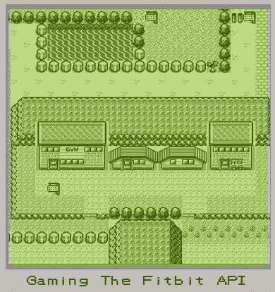

# 项目灵感

你可能听说过这个词，也可能没有，但你很可能经历过。

`Gamification`是游戏设计元素和游戏原则在非游戏环境中的应用。这个想法是，如果你使用游戏的元素，比如将规则和奖励链接到一个反馈系统中，你可以使(几乎)任何活动变得激励和有趣。

`Gamification`是**电子学习**背后的概念。我记得在小学时，所有的学生都想在电脑课上玩俄勒冈小径 T21。我还记得另一个游戏，你必须在东西落地之前解决数学问题。好吧，也许这不是对`gamification`最激动人心的介绍，但我仍然记得。

在我职业生涯的某个时候，我厌倦了使用`nano`，决定尝试学习`Vim`。

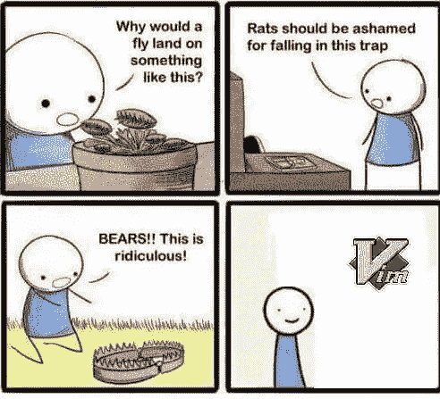

就在那时，我发现了两个非常有趣的`gamification`的例子:

*   `[Vim Adventures](https://vim-adventures.com/)`有点像`Zelda`中的`Gameboy`，你必须在环境中移动并解开谜语——除了用`Vim`命令！你可以在这里看它在 Twitch 上播放。


*   `[shortcutFoo](https://www.shortcutfoo.com/)`教你`Vim`、`Emacs`、`Command Line`、`Regex`、*等快捷键。*通过**间歇训练**，本质上是间隔重复。这有助于你更有效地记忆快捷方式。


今天，我喜欢在像 [DuoLingo](https://www.google.com/url?sa=t&rct=j&q=&esrc=s&source=web&cd=1&cad=rja&uact=8&ved=2ahUKEwiQm7ib677eAhUovlkKHRr-BygQFjAAegQIAhAC&url=https%3A%2F%2Fwww.duolingo.com%2F&usg=AOvVaw0GVHP2wYuntJMUTG1EDY5y) 和 [DataCamp](https://www.google.com/url?sa=t&rct=j&q=&esrc=s&source=web&cd=1&cad=rja&uact=8&ved=2ahUKEwiQm7ib677eAhUovlkKHRr-BygQFjAAegQIAhAC&url=https%3A%2F%2Fwww.duolingo.com%2F&usg=AOvVaw0GVHP2wYuntJMUTG1EDY5y) 这样的平台上进行电子教学。

我最近也开始参加一个 Kaggle 竞赛，“PUBG 完成位置预测”。Kaggle 是谷歌为数据科学爱好者开设的一个场所，他们可以使用机器学习来解决预测分析问题，以获得现金和影响力。类似象棋还有所谓的 **Kaggle 特级大师**。

# 探索

我们的实验室研究围产期对心理健康结果的早期逆境的生物嵌入的影响。我们将遗传学、表观遗传学和流行病学方法结合起来，以确定哪些孕妇的后代可能存在不良精神健康后果的潜在风险。

> 我的主管向我提出挑战；从 200 个 Fitbits 获取生物特征数据的可行性有多大？

所以我给自己买了一个 Fitbit Charge2 健身追踪器，然后去了健身房！

在某个时刻，我想我们都意识到这个项目将是一个大工程。也许`R`并不真正打算从 API 服务中进行大规模实时数据管理。这对于静态文件或者静态端点来说是很棒的，但是如果你和多个参与者一起工作，像 [Fitabase](https://www.fitabase.com/) 这样的专用解决方案可能是最好的——或者他们是这么宣称的。

尽管如此，我还是想在`R`尝试一些很酷的新事物，比如用`blogdown`制作个人网站，用`Rokemon`使用`gganimate`，用`httr`访问 fitbit API，以及用一些自定义 CSS/HTML 添加背景图片。有可能有更好的方法来缩短我的学习曲线吗——我认为没有。

**以下是我对**`**R**`**`**gamification**`**的网络学习尝试。****

**我使用了`[blogdown](https://bookdown.org/yihui/blogdown/)`包，允许我以 R Markdown 文档的形式写博客，将一切编织成一个漂亮整洁的静态网站，我可以在网上推送。这是一个学习 pandoc、Hugo、隐藏在服务器端代码下的 CSS/HTML 的好机会。我决定继续使用[Hugo](https://themes.gohugo.io/academic/)的学术主题，从 Fitbit API 中获取尽可能多的数据，对其进行清理，然后进行一些探索性的数据分析。在这个过程中，我生成了一些很酷的动画精灵，并使用视频游戏启发的可视化效果。**

**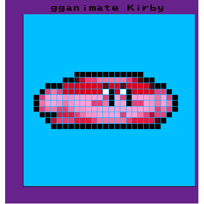**

# **设置 Fitbit 开发人员帐户**

**Fitbit 使用[**OAuth 2.0**](https://dev.fitbit.com/build/reference/web-api/oauth2/)**Access**令牌向 Fitbit API 发出 HTTP 请求。您需要设置一个帐户来使用 API，并在`R`中包含您的令牌。我不会去阅读 FITBIT 开发帮助部分，而是让读者在这里找到更好更简洁的说明。**

**现在你有一个帐户，我们准备在`R`做事情。**

**设置您的令牌:**

```
# You Found A Secret Area!
token = "yourToken"
```

# **使用`fitbitr`包**

**我以前从未提出过`HTTP`请求，尽管这个过程在这里[有正式记录](https://moldach.github.io/fitbit-project/(https://dev.fitbit.com/build/reference/web-api/oauth2/))，但它可能会让人不知所措。因此，我最初求助于使用一个名为`fitbitr`的包来访问 R API。**

**不幸的是，这将限制我只能访问一些基本的用户信息、`heart rate`和`step count`数据。**

# **获取基本用户信息**

**这个包中的第一个函数向`Get Profile` [资源 URL](https://dev.fitbit.com/build/reference/web-api/user/#get-profile) 发送一个`GET`请求。**

```
# Extracting Resources# Get userInfo
user_info <- fitbitr::getUserInfo(token)# Hailing a Chocobo!# What is my stride length in meters?
strideLengthWalking <- user_info$strideLengthWalking
```

**我的步幅是 68.5。**

***步幅是从脚跟到脚跟测量的，它决定了你每走一步走多远。平均来说，男人走路的步幅是 2.5 英尺，也就是 30 英寸，而女人的平均步幅是 2.2 英尺，也就是 26.4 英寸，根据这个* [*报道*](https://livehealthy.chron.com/average-walking-stride-length-7494.html) *。***

```
# Hitting 80 MPH# What is my running stride length
strideLengthRunning <- user_info$strideLengthRunning
```

**我跑步的步幅是 105.5。**

***默认情况下，Fitbit 使用您的* `*sex*` *和* `*height*` *来测量您的步幅，这可能会不准确。***

```
# Looking for the fourth chaos emerald # What is my average daily steps?
averageDailySteps <- user_info$averageDailySteps
```

**我每天的平均步数是 14214 步。**

**考虑到每天推荐的步数是 10，000，我认为这是可以接受的。也就是说，总有改进的空间。**

# **使用`fitbitr`包获取心率和脚步**

**我要为一个非常初步的 EDA 获取一周的数据。**

```
# Smashing buttonsdays <- c("Sunday", "Monday", "Tuesday", "Wednesday", "Thursday", "Friday", "Saturday")monday_heart <- getTimeSeries(token, type = "heart", activityDetail = "1min", date = "2018-08-20", startTime = "00:00", endTime = "23:59")
monday_heart %<>% mutate(date = "2018-08-20")
monday_steps <- getTimeSeries(token, type = "steps", activityDetail = "1min", date = "2018-08-20")
monday_steps %<>% mutate(date = "2018-08-20")
monday <- monday_heart %>% full_join(monday_steps)
monday %<>% mutate(week_date = "Monday")
monday %<>% mutate(day_of_week = "1")tuesday_heart <- getTimeSeries(token, type = "heart", activityDetail = "1min", date = "2018-08-21")
tuesday_heart %<>% mutate(date = "2018-08-21")
tuesday_steps <- getTimeSeries(token, type = "steps", activityDetail = "1min", date = "2018-08-21")
tuesday_steps %<>% mutate(date = "2018-08-21")
tuesday <- tuesday_heart %>% full_join(tuesday_steps)
tuesday %<>% mutate(week_date = "Tuesday")
tuesday %<>% mutate(day_of_week = "2")wednesday_heart <- getTimeSeries(token, type = "heart", activityDetail = "1min", date = "2018-08-22")
wednesday_heart %<>% mutate(date = "2018-08-22")
wednesday_steps <- getTimeSeries(token, type = "steps", activityDetail = "1min", date = "2018-08-22")
wednesday_steps %<>% mutate(date = "2018-08-22")
wednesday <- wednesday_heart %>% full_join(wednesday_steps)
wednesday %<>% mutate(week_date = "Wednesday")
wednesday %<>% mutate(day_of_week = "3")thursday_heart <- getTimeSeries(token, type = "heart", activityDetail = "1min", date = "2018-08-23")
thursday_heart %<>% mutate(date = "2018-08-23")
thursday_steps <- getTimeSeries(token, type = "steps", activityDetail = "1min", date = "2018-08-23")
thursday_steps %<>% mutate(date = "2018-08-23")
thursday <- thursday_heart %>% full_join(thursday_steps)
thursday %<>% mutate(week_date = "Thursday")
thursday %<>% mutate(day_of_week = "4")friday_heart <- getTimeSeries(token, type = "heart", activityDetail = "1min", date = "2018-08-24")
friday_heart %<>% mutate(date = "2018-08-24")
friday_steps <- getTimeSeries(token, type = "steps", activityDetail = "1min", date = "2018-08-24")
friday_steps %<>% mutate(date = "2018-08-24")
friday <- friday_heart %>% full_join(friday_steps)
friday %<>% mutate(week_date = "Friday")
friday %<>% mutate(day_of_week = "5")saturday_heart <- getTimeSeries(token, type = "heart", activityDetail = "1min", date = "2018-08-24")
saturday_heart %<>% mutate(date = "2018-08-24")
saturday_steps <- getTimeSeries(token, type = "steps", activityDetail = "1min", date = "2018-08-24")
saturday_steps %<>% mutate(date = "2018-08-24")
saturday <- saturday_heart %>% full_join(saturday_steps)
saturday %<>% mutate(week_date = "Saturday")
saturday %<>% mutate(day_of_week = "6")week <- monday %>% bind_rows(tuesday) %>% bind_rows(wednesday) %>% bind_rows(thursday) %>% bind_rows(friday) %>% bind_rows(saturday)

week$date <- as.Date(week$date)
```

# **汇总统计数据**

```
# Opening pod bay doorsweek %>% 
        group_by(type) %>% 
                summarise(
                        total = sum(value),
                        minimum = min(value),
                        mean = mean(value),
                        median = median(value),
                        maximum = max(value),
                        max_time = max(time)
                        ) %>%
        knitr::kable(digits = 3) %>% 
        kable_styling(full_width = F)
```

****

# **探索性数据分析**

**因为这是一个关于`gamification`的帖子，我决定用我的探索性数据可视化做一些有趣的事情。我想使用`Rokemon`包，它允许我将`ggplot2`(和`ggplot2`扩展)的主题设置为`Game Boy`和`Game Boy Advance`主题！方便的时候，我会用`cowplot`组合剧情。**

**我们来快速看一下`heart rate`和`step count`的关系和分布。**

```
# Doing the thing...g <- week %>% 
        spread(type, value) %>% 
        rename(hear_rate = "heart rate") %>% 
        na.omit() %>% 
        ggplot(aes(steps, hear_rate)) + geom_point() + geom_smooth(method="lm", se=F, colour = "#DE7243") gb <- g + theme_gameboy()
gba <- g + theme_gba()plot_grid(gb, gba, labels = c("", ""), align = "h")
```

****

**或者，我们可以通过`ggExtra`包中的`ggMarginal()`函数将边际密度图添加到散点图中，从而更好地查看数据。**

**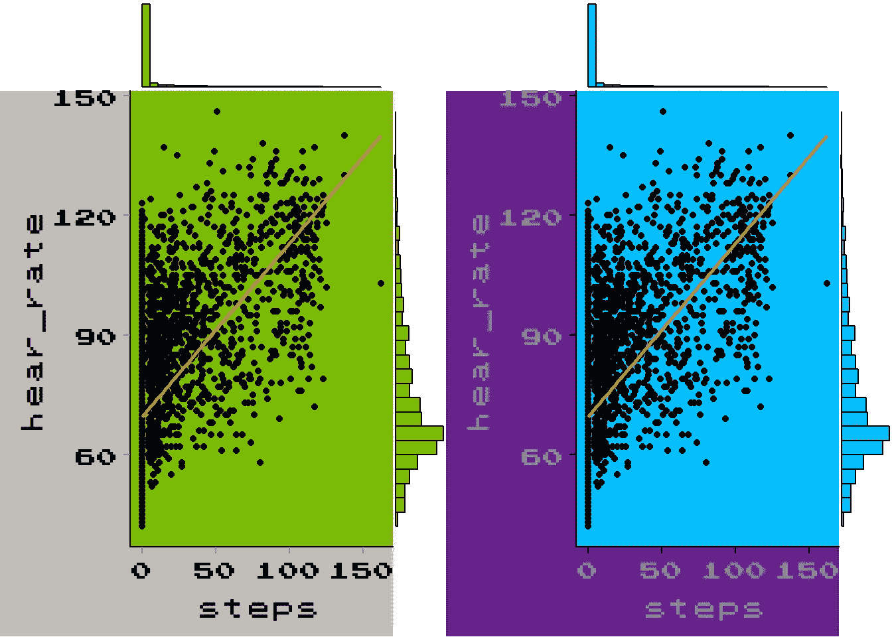**

# **每周趋势**

**让我们快速看一下连续变量的分布，以获得比平均值和中位数更好的想法。**

```
# Loading..... Wait, what else were you expecting?annotations_steps <- data_frame(
        x = c(45, 100, 165),
        y = c(0.01, 0.01, 0.01),
        label = c('walking pace', 'brisk walking pace', 'running pace'),
        type = c('steps', 'steps', 'steps')
)g <- week %>% 
  ggplot(aes(value)) + 
  geom_density(fill = "#DE7243") +
  geom_text(data = annotations_steps, aes(x = x, y = y, label = label), angle = -30, hjust = 1) +
  facet_grid(.~type, scales = 'free_x') + 
  labs(title = 'Heart Rate and Steps-per-minute over two months',
       subtitle = 'Data gathered from Fitbit Charge2')g + theme_gameboy()
g + theme_gba()
```

******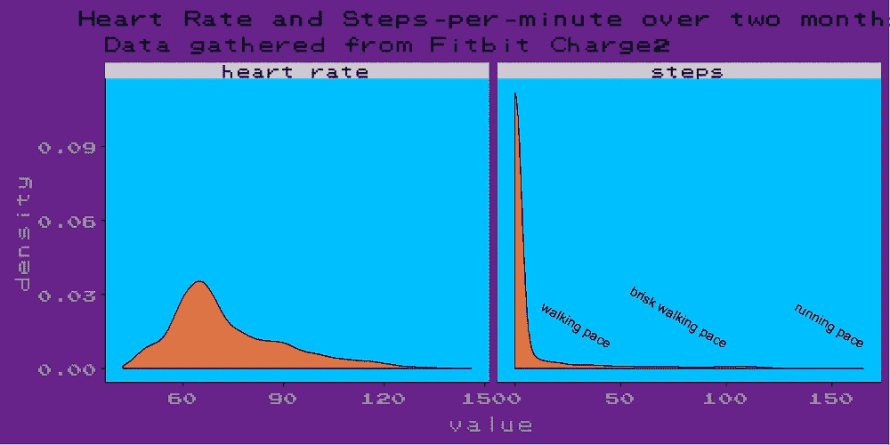**

**`Heart rate`有点右偏，可能是睡眠和久坐工作的原因。同样，对于`step count`你可以看到，当我滑板上班时，在`brisk walking pace`下面只有一个小凸起。**

# **锻炼模式**

**这个星期我没有健身，所以我想我至少应该在上班的路上看看。下图显示蓝色为`heart rate/min`，橙色为`steps/min`的编号。**

```
# You are carrying too much to be able to runbetween_six_nine <- function(time) time > 7*60*60 & time < 10*60*60is_weekday <- function(day_of_week) day_of_week %in% 1:6week$week_date_f <- factor(week$week_date, levels=c("Monday","Tuesday","Wednesday", "Thursday", "Friday", "Saturday"))g <- week %>% 
        filter(between_six_nine(time) & is_weekday(day_of_week)) %>% 
        spread(type, value) %>% 
        ggplot(aes(x = time)) +
        geom_bar(aes(y = steps), color = '#DE7243', alpha = 0.3, stat = 'identity') + 
        geom_line(aes(y = `heart rate`), color = '#E3F24D', size = 0.8) + 
        facet_grid(~week_date_f) +
        scale_x_continuous(breaks=c(27000, 30000, 33000, 36000), labels=c("7am", "8am", "9am", "10am"))g + theme_gameboy()
g + theme_gba()
```

********

**自从我每天早上滑滑板去上班后，我的活动整个星期都差不多一样。**

# **最活跃时间**

```
# 60% of the time, it loads ALL the timestep_counts <- week %>% 
  filter(type == 'steps') %>% 
  group_by(day_of_week) %>% 
  summarise(
    type = last(type), 
    avg_num_steps = sprintf('avg num steps: %3.0f', sum(value)/52)
  )g <- week %>%
        ggplot(aes(x= value, y = fct_rev(factor(day_of_week)))) +
        geom_density_ridges(scale = 2.5, fill = "#DE7243") +
        geom_text(data = step_counts, nudge_y = 0.15, hjust = 0, 
            aes(x = 85, y = fct_rev(factor(day_of_week)), label = avg_num_steps)) +
        scale_y_discrete(breaks=1:6, labels = c("Monday", "Tuesday", "Wednesday", "Thursday", "Friday", "Saturday")) +
        facet_grid(.~type, scales = "free") +
        labs(x = '', y = "Day of the Week") g + theme_gameboy()
g + theme_gba()
```

********

**每分钟的步数分布相当稳定，因为我说过我没有锻炼；这可能反映了我拖着脚步去喝茶。**

**看起来周一是我心跳加速最多的一天，双峰高峰可能是我四处寻找出租物业的时候。**

# **用`httr`包直接访问 Fitbit API**

**最终，我找到了一个由 [obrl-soil](https://github.com/obrl-soil) 撰写的优秀的[教程](https://obrl-soil.github.io/fitbit-api-r/)，它向我介绍了`httr`包，并给了我阅读 [Fitbit DEV web API 参考](https://dev.fitbit.com/build/reference/web-api/)所需的信心。现在我能够访问更多的数据来源。**

# **有哪些数据可用？**

**Fitbit API 提供了哪些数据的简要概述:**

```
# Your Boko Club is badly damaged# make a kable table for data you can access from Fitbit API
dt01 <- data.frame(Scope = c("activity",
                             "heartrate",
                             "location",
                             "nutrition",
                             "profile",
                             "settings",
                             "sleep",
                             "social",
                             "weight"),
                   Description = c("The activity scope includes activity data and exercise log related features, such as steps, distance, calories burned, and active minutes",
                                   "The heartrate scope includes the continuous heart rate data and related analysis",
                                   "The location scope includes the GPS and other location data",
                                   "The nutrition scope includes calorie consumption and nutrition related features, such as food/water logging, goals, and plans",
                                   "The profile scope is the basic user information",
                                   "The settings scope includes user account and device settings, such as alarms",
                                   "The sleep scope includes sleep logs and related sleep analysis",
                                   "The social scope includes friend-related features, such as friend list, invitations, and leaderboard",
                                   "The weight scope includes weight and related information, such as body mass index, body fat percentage, and goals")
)dt01 %>%
  kable("html") %>%
  kable_styling(full_width = F) %>%
  column_spec(1, bold = T, border_right = T) %>%
  column_spec(2, width = "30em", background = "#E3F24D")
```

**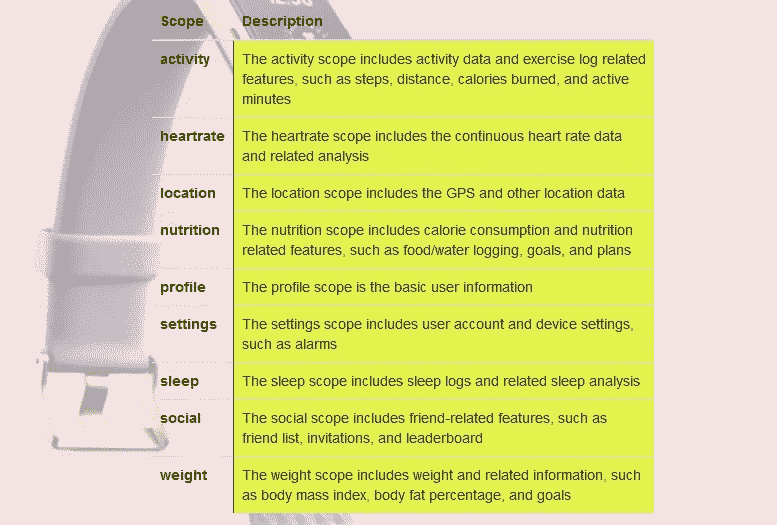**

**测量单位是什么？**

```
# Loading Cutscenes You Can't Skip# make a Kable table or measurement information
dt03 <- data.frame(unitType = c("duration",
                                "distance",
                                "elevation",
                                "height",
                                "weight",
                                "body measurements",
                                "liquids",
                                "blood glucose"),
                   unit = c("milliseconds",
                            "kilometers",
                            "meters",
                            "centimeters",
                            "kilograms",
                            "centimeters",
                            "milliliters",
                            "millimoles per liter"))
dt03 %>%
  kable("html") %>%
  kable_styling(full_width = F) %>%
  column_spec(1, bold = T, border_right = T) %>%
  column_spec(2, width = "30em", background = "#E3F24D")
```

****

**定义一个将`json`列表转换成数据帧的函数。**

```
# Inserting last-minute subroutines into program...# json-as-list to dataframe (for simple cases without nesting!)
jsonlist_to_df <- function(data = NULL) {
    purrr::transpose(data) %>%
    purrr::map(., unlist) %>%
    as_tibble(., stringsAsFactors = FALSE)
}
```

# **调查我的 10 公里跑**

**`GET`请求检索我的 10km 跑步的每分钟心率数据。**

```
# Preparing for the mini-bossget_workout <- function(date = NULL, start_time = NULL, end_time = NULL, 
                         token = Sys.getenv('FITB_AUTH')) {
GET(url =
        paste0('https://api.fitbit.com/1/user/-/activities/heart/date/',
        date, '/1d/1min/time/', start_time, '/', end_time, '.json'), 
        add_headers(Authorization = paste0("Bearer ", token)))
}# Get the workout for my 10Km run 
got_workout <- get_workout(date = '2018-10-21', start_time = '09:29', end_time = '10:24')workout <- content(got_workout)# summaryworkout[['activities-heart']][[1]][['heartRateZones']] <- jsonlist_to_df(workout[['activities-heart']][[1]][['heartRateZones']])# the dataset
workout[['activities-heart-intraday']][['dataset']] <- jsonlist_to_df(workout[['activities-heart-intraday']][['dataset']])# format the time 
workout$`activities-heart-intraday`$dataset$time <- as.POSIXlt(workout$`activities-heart-intraday`$dataset$time, format = '%H:%M:%S')
lubridate::date(workout$`activities-heart-intraday`$dataset$time) <- '2018-10-21'# find time zone
# grep("Canada", OlsonNames(), value=TRUE)
lubridate::tz(workout$`activities-heart-intraday`$dataset$time) <- 'Canada/Eastern'
```

**让我们来看看我的 10 公里跑的总结:**

```
# Farming Hell Cowsworkout$`activities-heart`[[1]]$heartRateZones %>% kable() %>% kable_styling(full_width = F)
```

**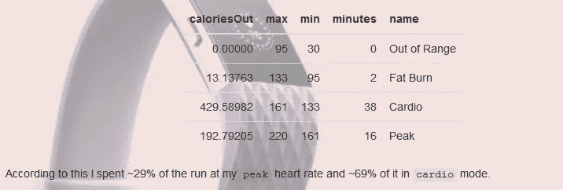**

**[obrl-soil](https://obrl-soil.github.io/fitbit-api-r/) 使用的是`MyZone Efforts Points`[【MEPS】](https://myzone.org/the-zones/)，它是以每分钟最大心率的百分比计算的。它衡量的是投入的努力——分数越多越好。另一个`gamification`的例子。**

```
# Looting a chestmeps_max <- function(age = NULL) { 207 - (0.7 * age) }
```

**我的是 186。**

**现在，我们创建一个包含 4 个心率范围的表格，显示下限和上限，并使用上面的`mutate()`函数计算我的最大心率(包含下限和上限)。**

```
# Taking the hobbits to Isengardmy_MEPS <- tribble(~MEPS, ~hr_range, ~hr_lo, ~hr_hi, 
                       1,  '50-59%',   0.50,   0.59,
                       2,  '60-69%',   0.60,   0.69,
                       3,  '70-79%',   0.70,   0.79,
                       4,    '>=80',   0.80,   1.00) %>%
  mutate(my_hr_low = floor(meps_max(30) * hr_lo),
         my_hr_hi  = ceiling(meps_max(30) * hr_hi))
my_MEPS## # A tibble: 4 x 6
##    MEPS hr_range hr_lo hr_hi my_hr_low my_hr_hi
##   <dbl> <chr>    <dbl> <dbl>     <dbl>    <dbl>
## 1     1 50-59%     0.5  0.59        93      110
## 2     2 60-69%     0.6  0.69       111      129
## 3     3 70-79%     0.7  0.79       130      147
## 4     4 >=80       0.8  1          148      186
```

**有了现在定义的方程，让我们来计算我的总 MEPS:**

```
# Checkpoint!mep <- mutate(workout$`activities-heart-intraday`$dataset,
       meps = case_when(value >= 146 ~ 4,
                        value >= 128 ~ 3,
                        value >= 109 ~ 2,
                        value >= 91  ~ 1,
                        TRUE ~ 0)) %>%
  summarise("Total MEPS" = sum(meps))
```

**哇是 216！**

**我不知道这到底是什么意思，但显然在 42 分钟的锻炼中最大可能的 MEPS 是 168，因为我在 54:35 跑完了 10 公里，我想这很好？**

**我想在我的下一次 10 公里跑中坚持 50 分钟，但我不确定我是否应该争取更高的`peak`心率分钟数——我想我需要对此进行研究。**

# **一晚每分钟的睡眠数据**

**让我们检查一下我昨晚的睡眠模式。**

```
# Resting at Campfireget_sleep <- function(startDate = NULL, endDate = NULL, token = Sys.getenv('FITB_AUTH')){
        GET(url = paste0('https://api.fitbit.com/1.2/user/-/sleep/date/', startDate, "/", endDate, '.json'),
        add_headers(Authorization = paste0("Bearer ", token)))
}# make sure that there is data for those days otherwise it tosses an errorgot_sleep <- get_sleep(startDate = "2018-08-21", endDate = "2018-08-22")
sleep <- content(got_sleep)dateRange <- seq(as.Date("2018-08-21"), as.Date("2018-08-22"), "days")sleep_pattern <- NULL
for(j in 1:length(dateRange)){
        sleep[['sleep']][[j]][['levels']][['data']] <- jsonlist_to_df(sleep[['sleep']][[j]][['levels']][['data']])
        tmp <- sleep$sleep[[j]]$levels$`data`
sleep_pattern <- bind_rows(sleep_pattern, tmp)
}
```

**好了，现在数据管理完成了，让我们来看看我的睡眠模式。**

```
# Now entering... The Twilight Zoneg <- sleep_pattern %>% group_by(level, seconds) %>% 
        summarise() %>% 
        summarise(seconds = sum(seconds)) %>%
        mutate(percentage = seconds/sum(seconds)) %>% 
                ggplot(aes(x = "", y = percentage, fill = c("S", "A", "R"))) +
                        geom_bar(width = 1, stat = "identity") +
                        theme(axis.text.y = element_blank(),
                              axis.text.x = element_blank(), axis.line = element_blank(), plot.caption = element_text(size = 5), plot.title = element_blank()) +
                        labs(fill = "class", x = NULL, y = NULL, title = "Sleep stages", caption = "A = Awake; R = Restless; S = Asleep") +
                        coord_polar(theta = "y", start = 0) +
        scale_fill_manual(values = c("#FF3F3F", "#2BD1FC", "#BA90A6"))g + theme_gameboy()
g + theme_gba()
```

******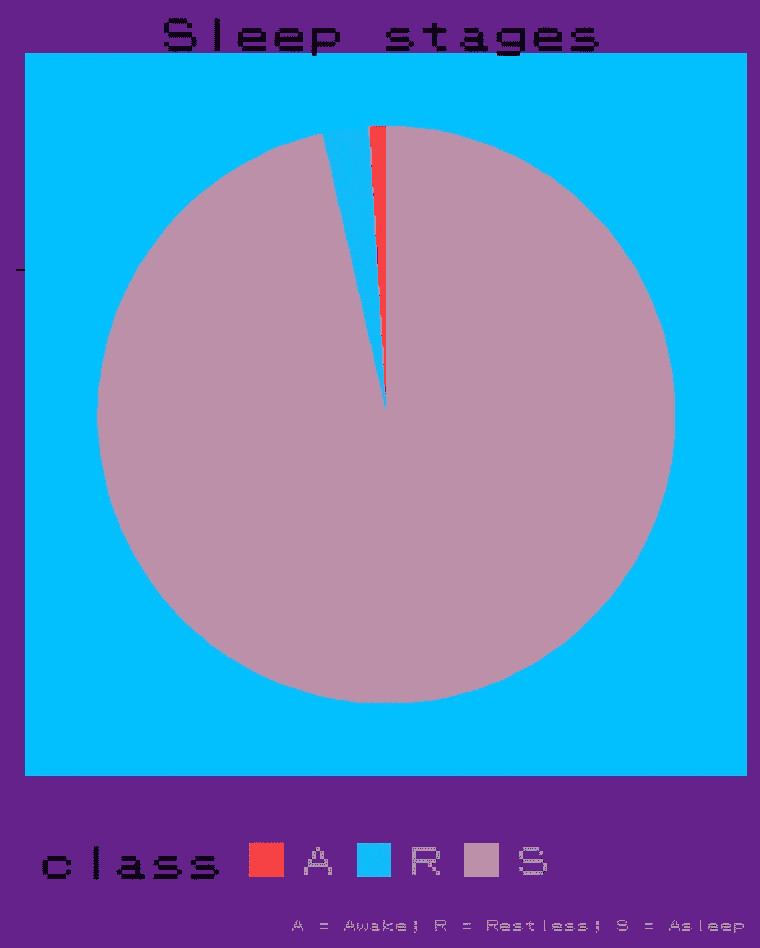**

**饼图可能不是显示这些数据的最佳方式。让我们用一个箱线图来形象化这个分布。**

```
# Entering Cheat Codes!g <- ggplot(sleep_pattern, aes(y=log10(seconds), x=level)) + 
        geom_boxplot(color="#031300", fill='#152403') +
        labs(x = "", title = 'Sleep patterns over a month',
       subtitle = 'Data gathered from Fitbit Charge2') +
        theme(legend.position = "none") g + theme_gameboy()
g + theme_gba()
```

**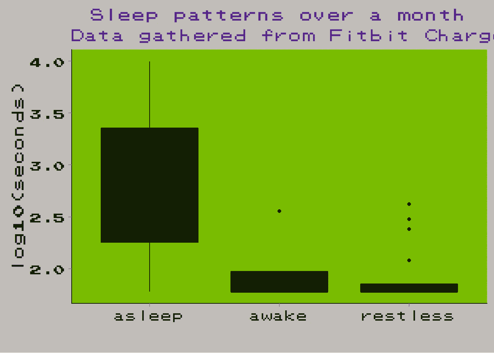****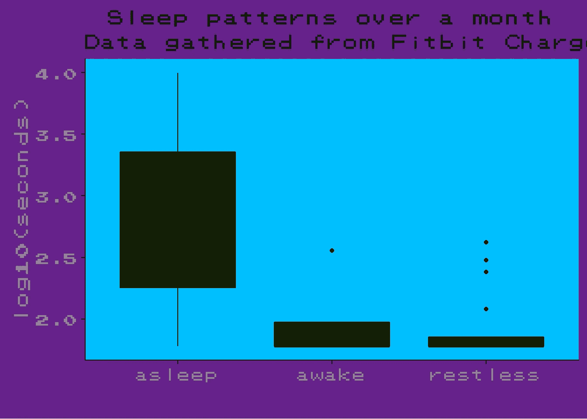**

**一个更好的可视化分布的方法是使用覆盖原始数据点的小提琴图。**

```
# Neglecting Sleep... g <- ggplot(sleep_pattern, aes(y=log10(seconds), x=level)) + 
        geom_violin(color="#031300", fill='#152403') +
        geom_point() +
        labs(x = "", title = 'Sleep patterns over a month',
       subtitle = 'Data gathered from Fitbit Charge2') +
        theme(legend.position = "none")g + theme_gameboy()
g + theme_gba()
```

**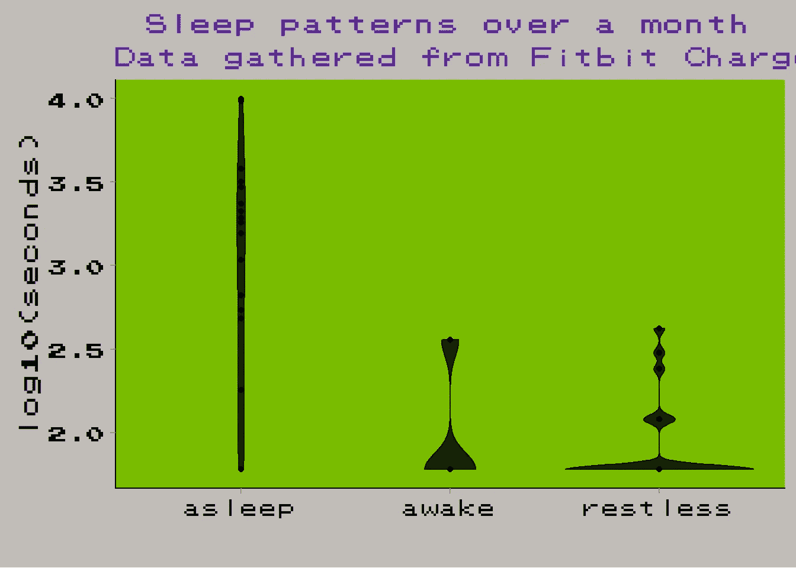****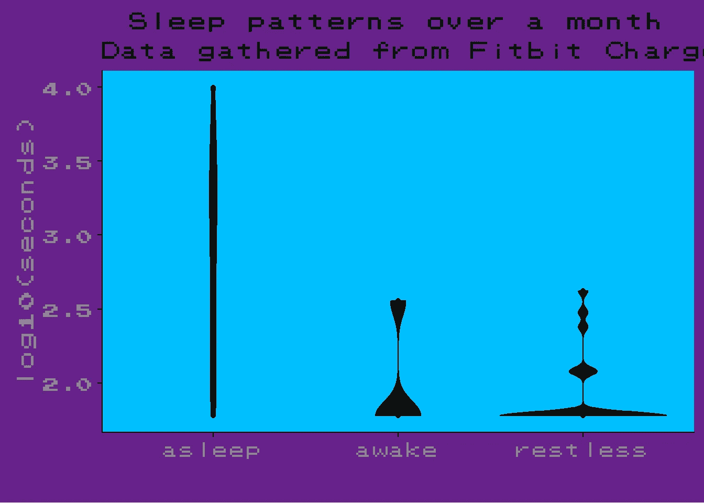**

# **获取 3 个月的日常活动模式**

**您可以从 Fitbit [活动和练习日志](https://dev.fitbit.com/build/reference/web-api/activity/)中为不同的时间段执行 API 请求，但是因为我只有几个月的时间，所以我将使用`3m`时间段。**

**我还需要剔除未来的任何一天，否则它们会在数字中显示为`0`卡路里。做`EDA`的时候最好使用`Sys.Date()`功能而不是硬编码日期，做一个闪亮的 app，或者[参数化一个](https://resources.rstudio.com/rstudio-connect-2/parameterized-r-markdown-reports-with-rstudio-connect-aron-atkins) `[RMarkdown](https://resources.rstudio.com/rstudio-connect-2/parameterized-r-markdown-reports-with-rstudio-connect-aron-atkins)` [文件](https://resources.rstudio.com/rstudio-connect-2/parameterized-r-markdown-reports-with-rstudio-connect-aron-atkins)。这样你就可以探索不同的时间段，而不会出现任何问题。**

**我不记得我是什么时候开始戴 Fitbit 的，但我们可以通过下面的代码来解决这个问题:**

```
# ULTIMATE IS READY!# Query how many days since you've had fitbit for
inception <- user_info$memberSince
```

**我从 2018 年 8 月 20 日开始使用 Fitbit。**

**让我们收集 2018 年 9 月 20 日至 11 月 6 日的数据。**

```
# Catching them all!### Calories
get_calories <- function(baseDate = NULL, period = NULL, token = Sys.getenv('FITB_AUTH')){
        GET(url = paste0('https://api.fitbit.com/1/user/-/activities/calories/date/', baseDate, "/", period, '.json'),
        add_headers(Authorization = paste0("Bearer ", token)))
}

got_calories <- get_calories(baseDate = "2018-11-20", period = "3m")
calories <- content(got_calories)
# turn into df
calories[['activities-calories']] <- jsonlist_to_df(calories[['activities-calories']])
# assign easy object and rename
calories <- calories[['activities-calories']]
colnames(calories) <- c("dateTime", "calories")### STEPS
get_steps <- function(baseDate = NULL, period = NULL, token = Sys.getenv('FITB_AUTH')){
        GET(url = paste0('https://api.fitbit.com/1/user/-/activities/steps/date/', baseDate, "/", period, '.json'),
        add_headers(Authorization = paste0("Bearer ", token)))
}

got_steps <- get_steps(baseDate = "2018-11-20", period = "3m")
steps <- content(got_steps)
# turn into df
steps[['activities-steps']] <- jsonlist_to_df(steps[['activities-steps']])
# assign easy object and rename
steps <- steps[['activities-steps']]
colnames(steps) <- c("dateTime", "steps")### DISTANCE
get_distance <- function(baseDate = NULL, period = NULL, token = Sys.getenv('FITB_AUTH')){
        GET(url = paste0('https://api.fitbit.com/1/user/-/activities/distance/date/', baseDate, "/", period, '.json'),
        add_headers(Authorization = paste0("Bearer ", token)))
}

got_distance <- get_distance(baseDate = "2018-11-20", period = "3m")
distance <- content(got_distance)
# turn into df
distance[['activities-distance']] <- jsonlist_to_df(distance[['activities-distance']])
# assign easy object and rename
distance <- distance[['activities-distance']]
colnames(distance) <- c("dateTime", "distance")### FLOORS
get_floors <- function(baseDate = NULL, period = NULL, token = Sys.getenv('FITB_AUTH')){
        GET(url = paste0('https://api.fitbit.com/1/user/-/activities/floors/date/', baseDate, "/", period, '.json'),
        add_headers(Authorization = paste0("Bearer ", token)))
}

got_floors <- get_floors(baseDate = "2018-11-20", period = "3m")
floors <- content(got_floors)
# turn into df
floors[['activities-floors']] <- jsonlist_to_df(floors[['activities-floors']])
# assign easy object and rename
floors <- floors[['activities-floors']]
colnames(floors) <- c("dateTime", "floors")### ELEVATION
get_elevation <- function(baseDate = NULL, period = NULL, token = Sys.getenv('FITB_AUTH')){
        GET(url = paste0('https://api.fitbit.com/1/user/-/activities/elevation/date/', baseDate, "/", period, '.json'),
        add_headers(Authorization = paste0("Bearer ", token)))
}

got_elevation <- get_elevation(baseDate = "2018-11-20", period = "3m")
elevation <- content(got_elevation)
# turn into df
elevation[['activities-elevation']] <- jsonlist_to_df(elevation[['activities-elevation']])
# assign easy object and rename
elevation <- elevation[['activities-elevation']]
colnames(elevation) <- c("dateTime", "elevation")### minutesSedentary
get_minutesSedentary <- function(baseDate = NULL, period = NULL, token = Sys.getenv('FITB_AUTH')){
        GET(url = paste0('https://api.fitbit.com/1/user/-/activities/minutesSedentary/date/', baseDate, "/", period, '.json'),
        add_headers(Authorization = paste0("Bearer ", token)))
}

got_minutesSedentary <- get_minutesSedentary(baseDate = "2018-11-20", period = "3m")
minutesSedentary <- content(got_minutesSedentary)
# turn into df
minutesSedentary[['activities-minutesSedentary']] <- jsonlist_to_df(minutesSedentary[['activities-minutesSedentary']])
# assign easy object and rename
minutesSedentary <- minutesSedentary[['activities-minutesSedentary']]
colnames(minutesSedentary) <- c("dateTime", "minutesSedentary")### minutesLightlyActive
get_minutesLightlyActive <- function(baseDate = NULL, period = NULL, token = Sys.getenv('FITB_AUTH')){
        GET(url = paste0('https://api.fitbit.com/1/user/-/activities/minutesLightlyActive/date/', baseDate, "/", period, '.json'),
        add_headers(Authorization = paste0("Bearer ", token)))
}

got_minutesLightlyActive <- get_minutesLightlyActive(baseDate = "2018-11-20", period = "3m")
minutesLightlyActive <- content(got_minutesLightlyActive)
# turn into df
minutesLightlyActive[['activities-minutesLightlyActive']] <- jsonlist_to_df(minutesLightlyActive[['activities-minutesLightlyActive']])
# assign easy object and rename
minutesLightlyActive <- minutesLightlyActive[['activities-minutesLightlyActive']]
colnames(minutesLightlyActive) <- c("dateTime", "minutesLightlyActive")### minutesFairlyActive
get_minutesFairlyActive <- function(baseDate = NULL, period = NULL, token = Sys.getenv('FITB_AUTH')){
        GET(url = paste0('https://api.fitbit.com/1/user/-/activities/minutesFairlyActive/date/', baseDate, "/", period, '.json'),
        add_headers(Authorization = paste0("Bearer ", token)))
}

got_minutesFairlyActive <- get_minutesFairlyActive(baseDate = "2018-11-20", period = "3m")
minutesFairlyActive <- content(got_minutesFairlyActive)
# turn into df
minutesFairlyActive[['activities-minutesFairlyActive']] <- jsonlist_to_df(minutesFairlyActive[['activities-minutesFairlyActive']])
# assign easy object and rename
minutesFairlyActive <- minutesFairlyActive[['activities-minutesFairlyActive']]
colnames(minutesFairlyActive) <- c("dateTime", "minutesFairlyActive")### minutesVeryActive
get_minutesVeryActive <- function(baseDate = NULL, period = NULL, token = Sys.getenv('FITB_AUTH')){
        GET(url = paste0('https://api.fitbit.com/1/user/-/activities/minutesVeryActive/date/', baseDate, "/", period, '.json'),
        add_headers(Authorization = paste0("Bearer ", token)))
}

got_minutesVeryActive <- get_minutesVeryActive(baseDate = "2018-11-20", period = "3m")
minutesVeryActive <- content(got_minutesVeryActive)
# turn into df
minutesVeryActive[['activities-minutesVeryActive']] <- jsonlist_to_df(minutesVeryActive[['activities-minutesVeryActive']])
# assign easy object and rename
minutesVeryActive <- minutesVeryActive[['activities-minutesVeryActive']]
colnames(minutesVeryActive) <- c("dateTime", "minutesVeryActive")### activityCalories
get_activityCalories <- function(baseDate = NULL, period = NULL, token = Sys.getenv('FITB_AUTH')){
        GET(url = paste0('https://api.fitbit.com/1/user/-/activities/activityCalories/date/', baseDate, "/", period, '.json'),
        add_headers(Authorization = paste0("Bearer ", token)))
}

got_activityCalories <- get_activityCalories(baseDate = "2018-11-20", period = "3m")
activityCalories <- content(got_activityCalories)
# turn into df
activityCalories[['activities-activityCalories']] <- jsonlist_to_df(activityCalories[['activities-activityCalories']])
# assign easy object and rename
activityCalories <- activityCalories[['activities-activityCalories']]
colnames(activityCalories) <- c("dateTime", "activityCalories")##### Join multiple dataframes with purrr::reduce and dplyr::left_join
activity_df <- list(calories, steps, distance, floors, elevation, activityCalories, minutesSedentary, minutesLightlyActive, minutesFairlyActive, minutesVeryActive) %>% 
        purrr::reduce(left_join, by = "dateTime")# Add the dateTime to this dataframe
activity_df$dateTime <- as.Date(activity_df$dateTime)names <- c(2:ncol(activity_df))
activity_df[,names] <- lapply(activity_df[,names], as.numeric)# trim off any days that haven't happened yet
activity_df %<>% filter(dateTime <= "2018-11-06")
```

# **获取最近的活动类型**

```
# We're giving it all she's got!

get_frequentActivities <- function(baseDate = NULL, period = NULL, token = Sys.getenv('FITB_AUTH')){
    GET(url = paste0('https://api.fitbit.com/1/user/-/activities/recent.json'),
        add_headers(Authorization = paste0("Bearer ", token)))
}

got_frequentActivities <- get_frequentActivities(baseDate = "2018-11-20", period = "3m")
frequentActivities <- content(got_frequentActivities)# This is a list object let's look at how many frequent activities are logged
length(frequentActivities)
## [1] 5# Take a look at the object with str()
str(frequentActivities)## List of 5
##  $ :List of 6
##   ..$ activityId : int 2131
##   ..$ calories   : int 0
##   ..$ description: chr ""
##   ..$ distance   : int 0
##   ..$ duration   : int 3038000
##   ..$ name       : chr "Weights"
##  $ :List of 6
##   ..$ activityId : int 90009
##   ..$ calories   : int 0
##   ..$ description: chr "Running - 5 mph (12 min/mile)"
##   ..$ distance   : int 0
##   ..$ duration   : int 1767000
##   ..$ name       : chr "Run"
##  $ :List of 6
##   ..$ activityId : int 90013
##   ..$ calories   : int 0
##   ..$ description: chr "Walking less than 2 mph, strolling very slowly"
##   ..$ distance   : int 0
##   ..$ duration   : int 2407000
##   ..$ name       : chr "Walk"
##  $ :List of 6
##   ..$ activityId : int 90001
##   ..$ calories   : int 0
##   ..$ description: chr "Very Leisurely - Less than 10 mph"
##   ..$ distance   : int 0
##   ..$ duration   : int 4236000
##   ..$ name       : chr "Bike"
##  $ :List of 6
##   ..$ activityId : int 15000
##   ..$ calories   : int 0
##   ..$ description: chr ""
##   ..$ distance   : int 0
##   ..$ duration   : int 1229000
##   ..$ name       : chr "Sport"
```

**我从来不认为自己是达尔文或梭罗，但显然，就花费的时间而言，慢慢散步是我最喜欢的活动。**

**你可以看到我的 Fitbit 也记录了`Weights`、`Sports`和`Biking`的时间，这可能是我手动记录我的活动时记录的。Fitbit 有可能会在我玩滑板的时候注册`Biking`。**

# **活动相关图**

**以前我总是使用`corrplot`包来创建一个相关图；然而，它不能很好地与`ggplot`配合，这意味着你不能轻易地添加`Game Boy`主题。尽管如此，我还是给了它一个复古的调色板，做了一些小小的调整。**

**由于我从最初的`gameboy`中想到了两种颜色，并且知道它们的`hex`代码，我能够从这个网站中[生成一个调色板。](https://meyerweb.com/eric/tools/color-blend/#CADCA0:0F380E:10:hex)**

```
# Aligning Covariance Matrices # drop dateTime
corr_df <- activity_df[,2:11]# Correlation matrix
corr <- cor(na.omit(corr_df))
corrplot(corr, type = "upper", bg = "#9BBB0E", tl.col = "#565656", col = c("#CADCA0", "#B9CD93", "#A8BE85", "#97AF78", "#86A06B", "#75915E", "#648350", "#537443", "#426536", "#315629", "#20471B", "#0F380E"))
```

****

**在相关图中，每个圆圈的颜色表示相关性的大小，圆圈的大小表示相关性的显著性。**

**在搜索了一会儿`ggplot2`扩展之后，我能够使用`ggcorrplot`，这允许我再次使用`gameboy`主题！**

```
# Generating textures...ggcorrplot(corr, hc.order = TRUE, 
           type = "lower", 
           lab = TRUE, 
           lab_size = 2,
           tl.cex = 8,
           show.legend = FALSE,
           colors = c( "#306230", "#306230", "#0F380F" ), 
           title="Correlogram",
           ggtheme=theme_gameboy)
```

**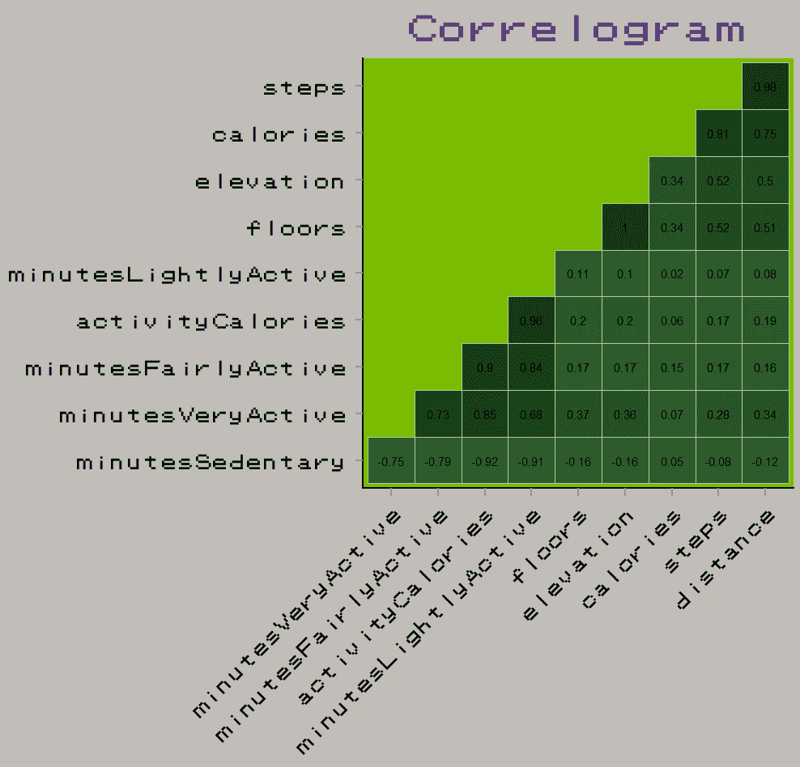**

```
# Game Over. Loading previous save

ggcorrplot(corr, hc.order = TRUE, 
           type = "lower", 
           lab = TRUE, 
           lab_size = 2,
           tl.cex = 8,
           show.legend = FALSE,
           colors = c( "#3B7AAD", "#56B1F7", "#1D3E5D" ), 
           title="Correlogram",
           ggtheme=theme_gba)
```

**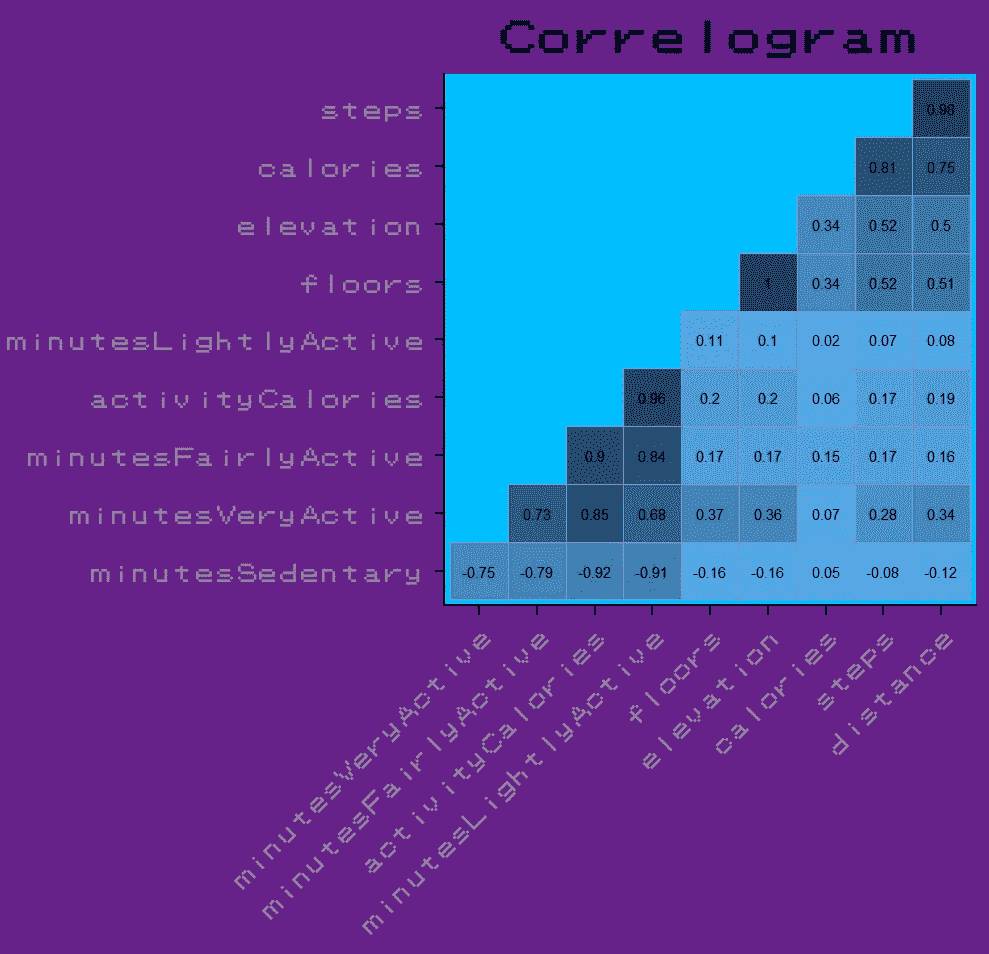**

# **探索活动**

```
# Link saying "hyahhh!"

# Static
g <- activity_df %>% 
        ggplot(aes(x=dateTime, y=calories)) + 
        geom_line(colour = "black") +
        geom_point(shape = 21, colour = "black", aes(fill = calories), size = 5, stroke = 1) +
        xlab("") +
        ylab("Calorie Expenditure")

g + theme_gameboy() + theme(legend.position = "none")
g + theme_gba() + theme(legend.position = "none")
```

**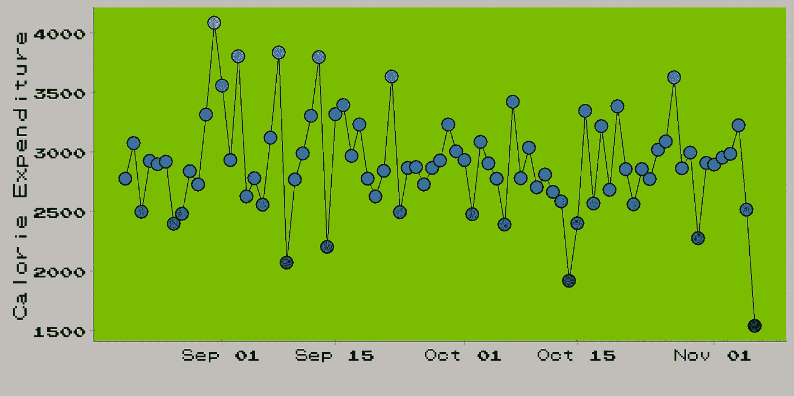****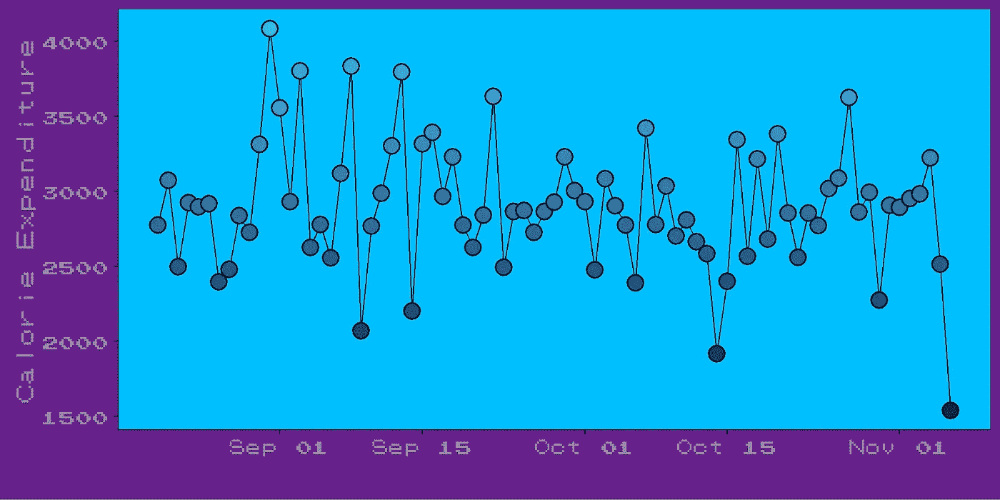**

```
# Panick! at the Discord...

# gganimate
g <- activity_df %>% 
        ggplot(aes(x=dateTime, y=calories)) + 
        geom_line(colour = "black") +
        geom_point(shape = 21, colour = "black", aes(fill = calories), size = 5, stroke = 1) +
        transition_time(dateTime) +
        shadow_mark() +
        ease_aes('linear') +
        xlab("") +
        ylab("Calorie Expenditure") 

g + theme_gba() + theme(legend.position = "none")
```

**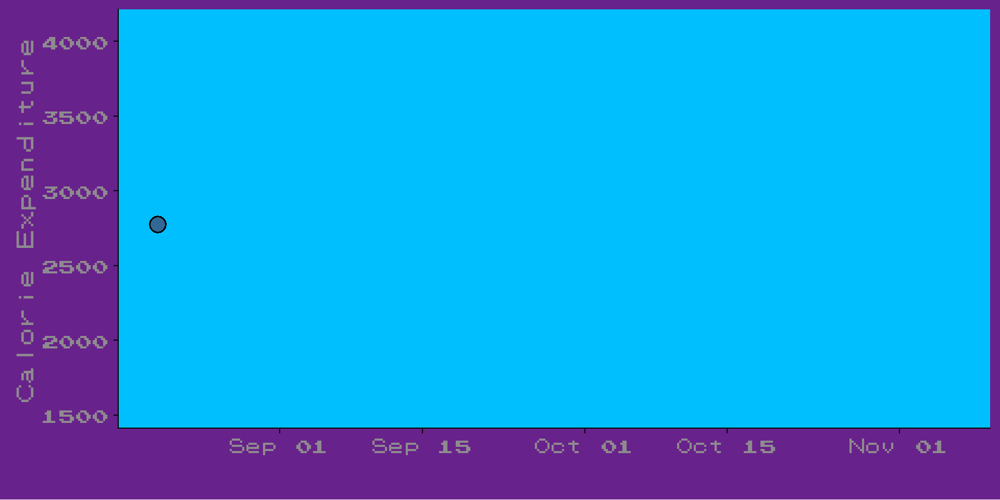**

**距离是由你的步数和你估计的步幅(你输入的身高)决定的。**

**我还制作了`Distance`、`Steps`、`Elevation`和`Floors`的剧情，但是你必须[查看这个页面才能看到它们](https://moldach.github.io/fitbit-project/)。**

# **结束语**

**尽管 Fitbit 为单个用户提供了一个很好的仪表板，但它是不可扩展的。通过直接访问数据，人们可以向 200 个甚至更多的人提问。如果有人愿意，他们甚至可以构建一个带有定制可视化效果的奇特`Shiny`仪表盘。**

**如果您有任何问题或意见，您可以随时通过 LinkedIn 联系我。在那之前，下一篇文章再见！**

```
# Wubba Lubba Dub Dub

# https://www.spriters-resource.com/game_boy_advance/kirbynim/sheet/15585/
sprite_sheet <- png::readPNG("kirby.png")

Nframes       <- 11      # number of frames to extract
width         <- 29      # width of a frame
sprite_frames <- list()  # storage for the extracted frames

# Not equal sized frames in the sprite sheet. Need to compensate for each frame
offset <- c(0, -4, -6, -7, -10, -16, -22, -26, -28, -29, -30)

# Manually extract each frame
for (i in seq(Nframes)) {
  sprite_frames[[i]] <- sprite_sheet[120:148, (width*(i-1)) + (1:width) + offset[i], 1:3]
}

# Function to convert a sprite frame to a data.frame
# and remove any background pixels i.e. #00DBFF
sprite_frame_to_df <- function(frame) {
  plot_df <- data_frame(
    fill  = as.vector(as.raster(frame)),
    x = rep(1:width, width),
    y = rep(width:1, each=width)
  ) %>%
    filter(fill != '#00DBFF')
}

sprite_dfs <- sprite_frames %>%
  map(sprite_frame_to_df) %>%
  imap(~mutate(.x, idx=.y))

fill_manual_values <- unique(sprite_dfs[[1]]$fill)
fill_manual_values <- setNames(fill_manual_values, fill_manual_values)

mega_df <- dplyr::bind_rows(sprite_dfs)

p <- ggplot(mega_df, aes(x, y, fill=fill)) +
  geom_tile(width=0.9, height=0.9) +
  coord_equal(xlim=c(1, width), ylim=c(1, width)) +
  scale_fill_manual(values = fill_manual_values) +
  theme_gba() +
        xlab("") +
        ylab("") +
  theme(legend.position = 'none', axis.text=element_blank(), axis.ticks = element_blank())

panim <- p +
  transition_manual(idx, seq_along(sprite_frames)) +
  labs(title = "gganimate Kirby")

gganimate::animate(panim, fps=30, width=400, height=400)
```

**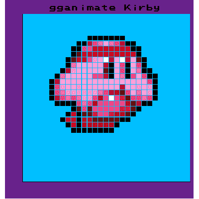**