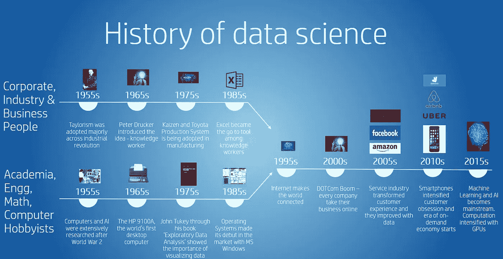

# 数据科学的历史

> 原文：<https://towardsdatascience.com/the-history-of-data-science-dfe789499d50?source=collection_archive---------5----------------------->

> 本文中的所有观点都是个人观点，并不属于我现在(或过去)所代表的任何组织的****。****

**每当我遇到流行的东西，我通常会回顾历史，看看它是如何演变的。通过回顾历史，它帮助我揭开趋势的神秘面纱，并进行逻辑思考。我对数据科学做了同样的研究，以了解历史上哪些事件直接/间接影响了它在当今商业世界的普及。**

****

**Photo by [Daniel Tong](https://unsplash.com/@danieltong?utm_source=medium&utm_medium=referral) on [Unsplash](https://unsplash.com?utm_source=medium&utm_medium=referral)**

**我试图总结历史进程中的不同事件，以及它们如何直接/间接影响我们今天拥有的数据科学。**

**下面的图片提供了我将详细阐述的事件的时间表。**

****

**Image by Author | Created in PowerPoint**

**大体上来说，有来自两个思想流派的人——一方是工业、商业和公司，另一方是工程师、计算机爱好者和学术界。**

**1955 年，在第二次工业革命的中期，泰勒制或科学管理在工业中被广泛采用。通过他的理论，Taylor 证明了如果对流程工作流进行分析，并从流程中涉及的所有变量中收集数据，我们可以随着时间的推移进行改进，以实现经济效益。大约在同一时间，计算机和人工智能在第二次世界大战后被大量研究，因为它们在减少战争中发挥了至关重要的作用；感谢艾伦·图灵和他的电脑破解了英格玛。**

**1965 年，惠普开发了世界上第一台台式电脑，在企业方面，彼得·德鲁克引入了“知识管理”的概念。德鲁克的理论提到，以思考为生的人——会计师、顾问和科学家是任何组织最重要的资源。**

**75s 是学术界认识到数据分析、探索和可视化的重要性的时候，这要归功于统计学家 John Tukey 和他的书《探索性数据分析》。而在工业方面，丰田生产系统采用了建立在泰勒主义原则基础上的改善原则，产生了持续的质量改进，并在整个制造领域获得了很大的影响力。**

**在过去十年个人电脑突飞猛进之后，操作系统于 1985 年首次亮相。这也是公司人员第一次开始使用像 Excel 和 Word 这样的软件。在这十年中，一些传统企业开始数字化。**

**互联网诞生于 1995 年，它是影响我们今天的数据科学的关键发明。互联网是这样一个游戏规则的改变者，以至于企业和计算机人员开始一起工作——比以往任何时候都更加紧密。**

**新千年伊始，网络公司开始在互联网上激增。从花店到餐馆，几乎每一种商业类型都有在线服务，这就像一场淘金热。这些公司中的许多也很快上市，估值飙升，导致网络泡沫迅速破裂。**

**到 2005 年，随着互联网的十年，情况已经稳定下来，像亚马逊和网飞这样在网络恐慌中幸存下来的公司开始专注于扩大他们的用户群。谷歌和脸书在这十年间也进入了这个市场。由于所有这些企业都是完全数字化的，他们也能够收集数据并调整他们的服务，以“完全”满足客户的需求。杰夫·贝索斯称之为“顾客痴迷”。**

**在接下来的五年里，随着智能手机的引入,“客户至上”的概念只会越来越强烈。企业能够无缝跟踪特定服务的目标客户。台式机让每家每户都有了一个数字设备，而智能手机则让通过数字足迹追踪每个人成为可能。这进一步为优步、Airbnb、Deliveroo 等按需公司铺平了道路。在“数字”市场中满足消费者的需求。这些公司还通过智能手机应用服务收集了大量数据，以更好地了解客户，并为他/她提供最好的服务。**

**到 2015 年，数字设备产生了如此多的数据，以至于需要进行大规模数据分析。到目前为止，机器学习算法已经有了很大的发展，GPU 处理使人工智能变得可行。**

**因此，我们今天拥有的数据科学不是凭空产生的，而是像任何其他持久的事物一样——进化而来的。正如您可能观察到的，数据科学或“从数据中学习”并不是什么“新”东西，它已经存在了几十年，只是形式不同而已。弗里德里希·泰勒的科学管理理论为这一想法埋下了伏笔。如今，当公司追踪他们的客户或员工以改善他们的服务时，一些人将此归因于“数字泰勒主义”。阅读下面的文章，进一步了解—**

** [## 数字泰勒主义

### 弗雷德里克·泰勒是 20 世纪初最有影响力的管理大师。他的“科学原理…

www.economist.com](https://www.economist.com/business/2015/09/10/digital-taylorism) 

总之，几十年来，只有术语发生了变化(或将发生变化),但通过数据进行改进的方法将会盛行。因此，现在不是担心数据科学接管的时候，而是拥抱它的时候，因为它将触及我们生活的方方面面，并将影响我们未来做出的每个决定。** 

***原载于 2018 年 3 月 31 日*[*【http://ramthilakceo.com】*](http://ramthilakceo.com/2018/03/the-history-of-data-science.html)*。***