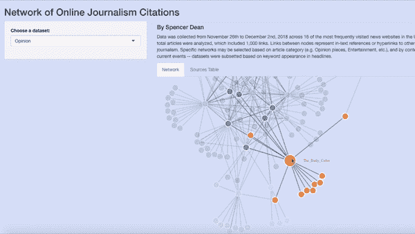
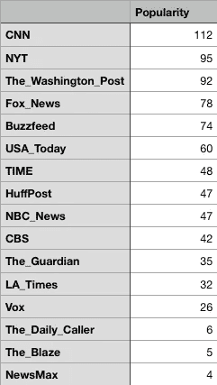
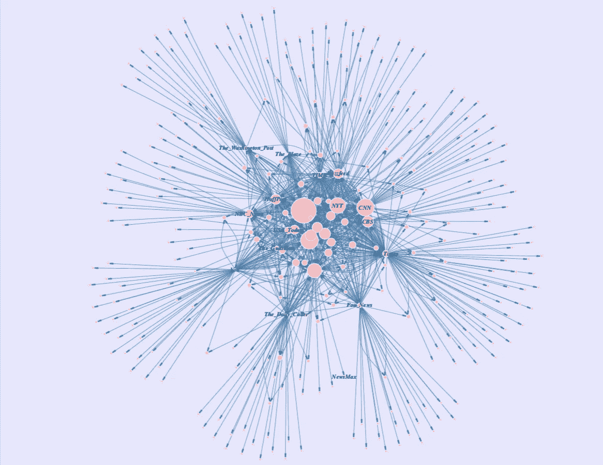
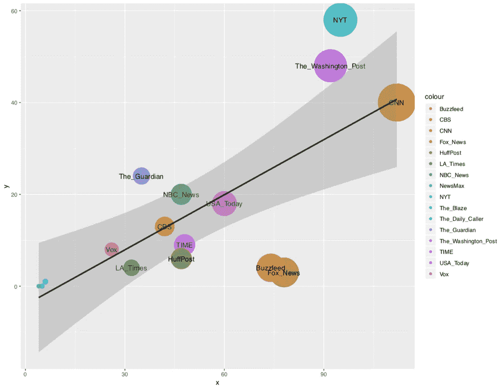
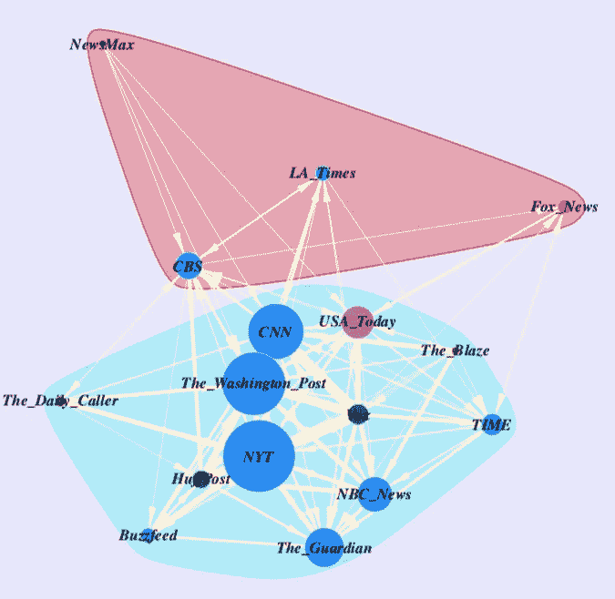
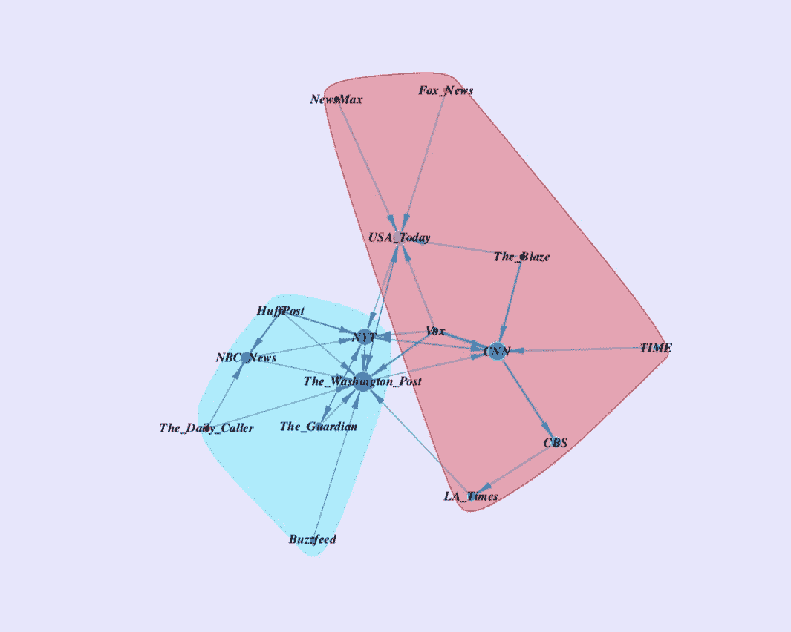

# 福克斯新闻频道与世隔绝的巢穴

> 原文：<https://towardsdatascience.com/the-isolated-den-of-fox-news-f31126e605cd?source=collection_archive---------14----------------------->

## 绘制在线新闻出口引用网络

Interactive visualization of citation networks ([https://srdean.shinyapps.io/Final/](https://srdean.shinyapps.io/7718ed78939642e19c29216b537c689f/))

kraine 说俄罗斯向其海军舰艇开火，扣押了它们……通用汽车公司关闭了工厂，并因销售缓慢而削减了数千个工作岗位……中国科学家声称第一个基因编辑婴儿……

这是 2018 年 11 月最后一周互联网头版的几个头条新闻。以 T2 最受欢迎的新闻网站中的 16 个为重点，我在这一周的时间里从 480 篇文章中收集了数据(美国新闻、世界新闻、政治、观点、商业和娱乐各 5 篇)。

Fig. 1: Sources & popularity (millions of unique monthly visitors)

对于每篇文章，我都记录了链接到其他在线新闻网站的时间。链接可以是超链接，也可以是文本引用和引文*。换句话说，每当有信息从一个来源流向另一个来源时，我的目标就是捕捉它。

**这种边缘结构在一些与* [*谷歌的 PageRank*](https://web.archive.org/web/20111104131332/https://www.google.com/competition/howgooglesearchworks.html) *相同的假设下运行，即假设从其他网站接收更多链接的网站可能更重要。*

由于我的数据集的强大性质，我决定创建一个交互式应用程序，允许用户将网络划分到某些类别中。这里有:[https://srdean.shinyapps.io/Final/](https://srdean.shinyapps.io/Final/)。

下面的完整网络代表了我的数据库中引用的 312 个独特的经销店，加上代表 NewsMax 和 Blaze 的两个点，它们是唯一没有出现在另一个来源的引用列表中的原始来源。分数是根据“度内中心性”来确定的(即被更多文章链接的网站看起来更大)。

Fig. 2: Complete network with the original 16 sources labeled and points sized according to in-degree centrality.

您会注意到网络中几个最大的点是未标记的。引用次数最多的两个来源是美联社和路透社。**这两家都没有出现在我最常去的美国新闻机构列表中，因此没有包括在最初的分析中。

***123 篇文章(约占数据库总数的四分之一)链接到美联社，60 篇链接到路透社*

然而，除了这两个来源，引用的数量似乎与受欢迎程度相关。例如，CNN 和《纽约时报》( NYT)在网络中显得相对较大，并且具有两个最高的受欢迎度得分。我研究了这种关系，发现在引用次数和受欢迎程度之间存在显著的正相关(t < .01)。

Fig. 3: Correlation between popularity (x-axis) and number of incoming citations (y-axis)

不过，值得注意的是，福克斯新闻频道并不完全符合这条回归线。尽管《福克斯新闻频道》以每月 7800 万的访问量排名第四，但在 480 个故事的数据库中，它只被三个故事引用。这是 16 个来源中排名第四低的，甚至排在 Vox 之后，Vox 的受欢迎程度大约是它的三分之一，但引用次数是它的两倍多。如果更保守的新闻媒体被纳入分析，这些结果可能会有所不同。然而，自由派人士被选中仅仅是因为他们的受欢迎程度更高。

这些结果支持了皮尤研究中心的一项研究的发现，该研究指出，自由主义者总是说出一系列主要新闻来源(CNN、NYT、NBC 和 NPR ),而保守派则更倾向于一个，福克斯新闻频道。因此，看起来有许多受欢迎的倾向自由派的新闻媒体，主要是一个受欢迎的倾向右翼的消息来源。

我创建的下一个网络只包含原始列表中源之间的边(图 1)。使用 igraph R 的 cluster_walktrap 算法，我识别并突出显示了这个网络中的社区。这个函数试图在一个图中寻找密集连接的子图。结果如图 4 所示，根据政治偏见***(由[各方](https://www.allsides.com/media-bias/media-bias-ratings)评级)进行评分。com)。

** * *深红代表更保守的偏见，洋红色代表唯一的中间派来源《今日美国》，深蓝显示更重的自由派偏见。*

Fig. 4: A network of hyperlinks and in-text citations from and to online news sources. Points are sized according to number of incoming citations and colored according to political leaning ([Allsides](https://www.allsides.com/media-bias/media-bias-ratings).com)

这个网络开始描绘福克斯新闻频道的局外人身份。在两个社区中，Fox 显然占据了不太重要的一个，并且由于很少的链接，看起来相对较小。更大的社区显然是非常忧郁的，但是从这一观察中得到的见解是有限的，因为事实上网络中的大多数来源只是更加自由。

在接下来的分析中，我将重点放在网络如何根据文章类别而变化。图 4 展示了我为政治专栏文章构建的六个网络之一。使用 cluster_walktrap 函数再次定义了社区。

Fig. 4: Network for articles in Politics sections

单独部分的群落形成非常不规则；然而，我能够从我的结果中得出一些结论。最常见的“邻居”——在同一社区中发现的来源——是 NYT 和华盛顿邮报，在六个社区中的五个社区中一起出现。根据 Allsides 评级，任何时候一个来源作为另一个来源(至少六分之四)的邻居出现在大多数网络中，他们都属于政治光谱的同一侧。福克斯新闻从未出现在 Buzzfeed、赫芬顿邮报、华盛顿邮报、NYT、NBC 或卫报的社区中。

在社会学和社会心理学中，隐含的和确认的偏见被很好地观察到，并且[彻底地讨论了这些现象](https://www.psychologytoday.com/us/blog/contemporary-psychoanalysis-in-action/201612/fake-news-why-we-fall-it)。第一个定义了我们将人分组的自然趋势，并形成了基于“我们与他们”的信任和不信任的概念。后者，确认偏差，指的是我们倾向于寻找确认我们已经知道或相信的信息。

大规模研究发现，这些偏见深深渗透到我们的媒体消费中，导致了政治两极分化。[皮尤研究中心(Pew Research Center)描述说](http://www.journalism.org/2014/10/21/political-polarization-media-habits/)，“当涉及到获取关于政治和政府的新闻时，自由派和保守派居住在不同的世界。他们求助和信任的新闻来源几乎没有重叠。”

我认为，关于这些偏见如何在新闻的实际来源中表现出来的概念还没有得到很好的探索。对于这个研究项目，我试图确定新闻网站引用的网络特征。一路走来，我的目标是回答新闻来源是否像它们的消费者一样“存在于不同的世界”的问题，以及确定哪些网站在网络信息传播中发挥着最大的作用。

这个项目的网络分析得出的发现表明，在某些调节信息流动的网络新闻来源之间存在着密切的联系。某个特定渠道在这个网络中的受欢迎程度可以简单地通过网站在读者中的受欢迎程度来预测，但似乎存在关于该渠道的政治偏见的警告。虽然还需要更多的研究来支持这一观察，但似乎来源更有可能引用和被分享他们政治观点的网站所引用。