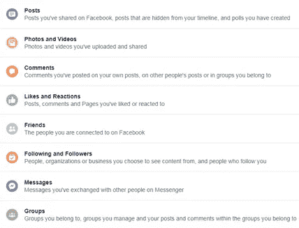
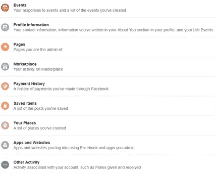
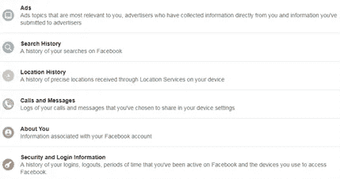
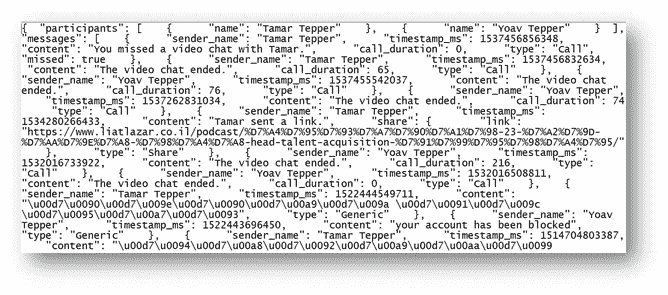
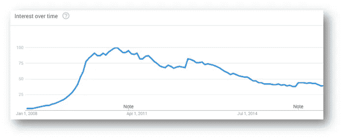
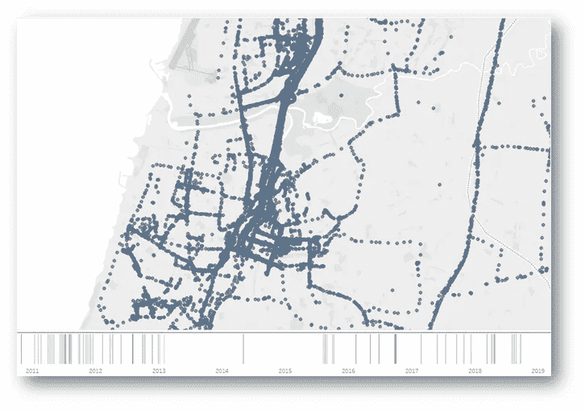
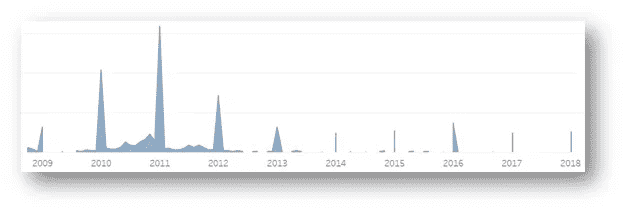
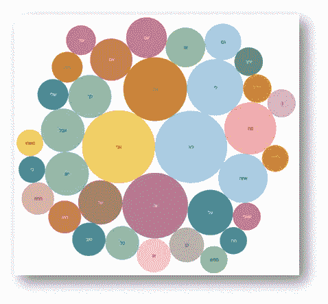
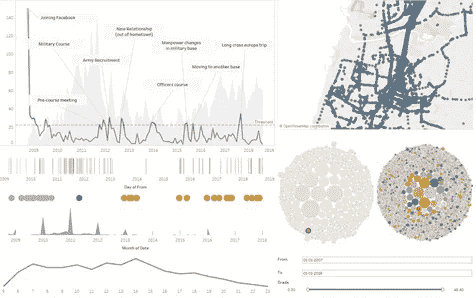

# 墙后的生活——扎克伯格仓库之旅

> 原文：<https://towardsdatascience.com/the-life-behind-the-wall-b00af694c3c5?source=collection_archive---------16----------------------->

# **开场白**

2018 年 3 月，剑桥分析(2013–2018)丑闻曝光于大众。大约 5000 万脸书用户的信息被“泄露”给了分析公司“剑桥分析”，据称该公司将这些信息用于选举宣传目的。仅仅两个月后，我的电子邮件就被各种网站的消息淹没了，这些消息都是关于根据 GDPR(一般数据保护条例——欧盟关于个人对自己信息的权利的条例)更新隐私政策的，该条例允许人们访问关于他的所有存储信息。

GDPR emails

由于这些事件，我想准确地找出我的个人资料中保留了哪些信息，以及这些信息如何讲述我的故事。

# **数据**

我打开我的脸书账户，在“设置”选项卡上点击了个位数，我的桌面上已经有了一个令人印象深刻的目录树，里面充满了关于我的数字自我的有趣信息。

Data downloaded from Facebook

这些数据包括(摘自脸书网页):

Data Stored on Facebook

第一眼，我看到了一个只有一行字的文件，说明我被描述为“开始他的成年生活”。在另一个文件中，我看到了所有符合我兴趣的广告关键词的列表(它们相当准确)。不管怎样，我已经知道我会找到一些有趣的信息。

现在，我正式兴奋了。

# 艰苦的工作

第一步是手动检查数据，总共大约 1200 个文件，其中只有 47 个实际上需要字段映射(如果您想知道为什么只有 47 个需要映射，那是因为有 1150 个相同格式的文件。每个文件代表我曾经与之聊天的不同的人/群体)。

有了编程语言“Python”和数据分析软件“Tableau”，我开始处理所有的信息。花了几个小时编写代码，以统一的方式将所有不同的信息标准化(处理希伯来语、从大量文本中提取姓名模式、按主题对信息进行分组、创建汇总表等)。).对于那些不熟悉这些任务的人，我不得不这样说:

Raw Data

变成这样:

(Coherent information)

现在所有的信息都在它正确的位置上，我们都准备好了一些乐趣！

# **吊儿郎当**

## **概述**

作为已经广泛使用脸书超过 10 年的自豪的 Y 一代代表，很容易猜测(正确地)脸书在我的个人资料中保留了相当多的信息(忽略媒体，有 21mb 关于我的数据，这是相当多的)。但是这些信息说明了我什么呢？

首先，我想随着时间的推移检查我在社交网络上的活跃程度，所以我创建了一个顺序评级机制，衡量我每年的活跃程度，考虑了这些年来我发起的喜欢、聊天天数、回复和帖子的数量。

*The extent of my activity in Facebook over years*

对于那些想知道的人来说——2011 年活动增加的一个可能的解释是，这期间有多少空闲时间，因为我刚刚高中毕业，在被招募入伍之前有一个长假。此外，2010-2011 年是脸书在以色列最好的几年，这一事实得到了以色列“脸书”一词的谷歌搜索趋势的支持。：

*Amount of the search term “פייסבוק” (“Facebook” in Hebrew) on google `over the years in Israel*

无论如何，我可以说，在过去的十年里，我在社交网络中相当活跃，因此，我将允许我自己将高可靠性归因于我的脸书数据的长期统计。

## **告诉我你的朋友是谁，我就告诉你你是谁**

今天，我的脸书账户有大约 1500 个朋友。快速计算会得出，在过去的十年里，我平均增加了 12 个(5 个？)每个月的朋友。为了集中精力探索，我决定(几乎是任意地)将数字 23 设定为一个阈值，定义为“高度社会化的月份”在我增加 23 个或更多朋友的每个月，我都试图根据那个月发生的重大事件来描述这一现象(这是我记忆所及)，但我也试图观察我每月在脸书的活动与我的“朋友趋势”之间是否存在关联

*Monthly friend-trend over the past 10 years. the green color indicates a section above the threshold; the gray graph in the background represents my monthly activity on Facebook (according to the same ordinal rating I presented before). The sharp-eyed people will notice sections where there is considerable congruence between the trends of the two graphs.*

很高兴看到过去几年里我在哪里结识了大多数脸书朋友。但是，还有什么更重要的吗？如果脸书只能根据朋友的趋势和与他们的联系来描述我生活中的里程碑呢？例如，他们可以用有趣的视频和恼人的音乐向我展示这些信息(就像他们经常做的那样)？或者，例如，脸书会给所有 18-21 岁(以色列的军事年龄)有相似朋友趋势的用户绘制地图，并找到最有可能拥有相同军事背景的人群？那更好。但是你明白我的意思；可能性无穷无尽。

## 一年级朋友

我不会轻易放弃对脸书的“喜欢”。我只“喜欢”我真正喜欢的东西。说到爱情，脸书的“爱情”反应也是一种罕见的商品。更具体地说，我认为“爱”的反应比“喜欢”的反应更有价值五倍，而一个评论比两个“喜欢”更有价值，我在聊天中与某人交谈的不同次数就其价值而言等于一次评论互动。当然，那只是我看待事物的方式，但是嘿！似乎我已经不知不觉地创建了一个评级模型来衡量我对脸书朋友的感情！

于是，我用上面提到的评分方法进行了一次测试(免责声明——不同于“喜欢”的回复在 2016 年才开始使用)。在清除了一些来自低分数用户的干扰后，我有了合理数量的数据来分析，因此我自动编辑了一个可以被定义为“脸书密友”的人的列表这甚至没有看我的内容。(回复模式、聊天中的关键词、标签评论数量等。).这意味着我可以只根据我上面提到的互动的存在来绘制我的数字社交朋友群。

*Top friends according to my rating system, arranged in bubbles. The size of the circle as the size of the score; the color of the circle according to the score (from darker to brighter)*

更有趣的是，我可以看到这些年来我的(数字)社交朋友群的变化。

*Same as the graph above, per year 2009–2018 (Yes, it looks like an image from a Biology book.)*

当我为这些信息在多大程度上正确地讲述了我的生活故事而激动时，我不禁想到如何将它带入下一个明显的阶段，关系。

作为概念的证明，我还检查了我过去的成人关系的社交互动量:

*For privacy reasons, you will not see names/dates/numbers here. different colors indicate different relationships on a timeline, and the number of points is the number of times the interaction score has exceeded a certain threshold.*

事实上，上面提供的信息与实际关系相符。这意味着绘制出“重要关系”及其持续时间是非常可行的。如果我考虑额外的参数，如性别、年龄、关键词、信息发送/接收比率、标签、取消喜欢电影《星际穿越》(must)的个人资料等(发挥创意，脸书有各种数据)，这样的脸书算法不仅可以为我提供潜在的伴侣，还可以估计性取向，预测恋爱成功的可能性，事实上，它们可以做任何事情...想想看，没有什么可以阻止脸书成为最好的约会平台(事实证明，我是[指出明显的](https://www.businessinsider.com/facebook-launches-facebook-dating-in-colombia-2018-9))。

## **外景，外景，外景**

不幸的是，这些年来我不允许脸书访问我的设备位置，所以脸书的数据库里没有这些信息。但为了不破坏我们有趣的旅程，我去了谷歌时间线(为那些不知道的人，[这里是](https://www.google.com/maps/timeline)你在地图上的生活)并下载了这些年来从我的设备中收集的所有信息。

我做的下一件事是在脸书上绘制我曾经回应过的所有脸书事件，将它们钉在时间轴上，并将这些信息与我的谷歌位置历史相关联。这是它的样子:

*Timeline bars = Events marked as ‘going’. Points on the map = Location from these very same dates*

*Specific example — my route on the day G&R performed in Tel Aviv — Welcome to the jungle baby!*

如果你相信我对每一个事件做出反应的到达状态，那么就很容易在地图上确定事件的位置，反之亦然——很容易确定我是否出现在事件现场。那又怎样？嗯，也许脸书会根据我过去的行为向我提供我可能感兴趣的活动，或者脸书会与谷歌合作，标出哪些年龄组在什么时间、什么地点，这样他们就可以向这样那样的企业出售这些信息。再说一次——这只是取决于脸书想要获得多大的创造力。

## **其他一些东西**

还有许多其他的发现，但是在这个阶段，我觉得这个问题已经被讨论完了，因此，我不会对以下数据类型进行更多的快速截图:

Major activity hours on Facebook (there is nothing like a coffee break at 14:00)

Posts on my wall by months (It’s highly visual that my friends remember my birthday in January every year)

*The most common words I make use of — mainly Hebrew pronouns, unsurprisingly. Imagine taking all my chat history and feed some machine learning algorithm with it (Did someone say Black Mirror S02E01?)*

不幸的是，我不能给你提供对我的搜索历史的有趣分析，因为我时不时会清除它，但是聪明的读者可以想象他可能会在自己的搜索历史中找到什么宝藏。

# 收场白

依我拙见，用户世界大致分为三类:冷漠型、焦虑型和放任型。

第一组——如果你已经读到这里，做得很好。

第二组——我希望至少现在你已经阅读了这篇评论，你会确切地知道什么样的信息存储在脸书数据库的某个深处。出于您的考虑，在任何符合 GDPR 法规的组织中，您都可以要求删除您的个人信息([直至若干例外](https://ec.europa.eu/info/law/law-topic/data-protection/reform/rules-business-and-organisations/dealing-citizens/do-we-always-have-delete-personal-data-if-person-asks_en))。

第三组——你只是被邀请为它所拥有的丰富信息和机会感到兴奋，但也尝试和思考如何利用它来更好地造福用户。如果我们已经生活在一个每平方厘米都有广告的现实中，而我们很少与陌生人面对面交谈，难道我们不希望得到与我们需求最相关的广告吗？我们不是更喜欢最有希望的比赛吗？

强调存储在我们每个人身上的信息在目的、容量和意义上都是非常不同的，这一点非常重要。有许多因素会影响数据的完整性，其中最主要的是我们在互联网上的不同行为模式，我们在社交网络上活跃的时间，以及我们授予我们的应用程序的权限。此外，多年来，脸书不能被视为单一一致的信息来源。重要的是要考虑 Instagram、WhatsApp 和 Twitter 等其他应用程序多年来的觉醒，以及它们影响我们行为的方式。

我并不假装对社交网络/统计模型/行为科学有什么深刻的了解。这里介绍的所有研究完全基于我的直觉和个人观点，并不依赖于许多比我更好的人可能已经完成的先前研究，但我确实希望我已经实现了让这些信息可访问并说明其可能用途的目标。

由 Yoav Tepper 撰写，又名:

“开始他的成年生活”

与关于音乐、技术、艺术和度假主题的广告互动

拥有独特的指纹:

