# 数据分析的多种未来

> 原文：<https://towardsdatascience.com/the-many-futures-of-data-analysis-951bb2932943?source=collection_archive---------4----------------------->

## 有导游的短途旅行

最近——作为我典型的书呆子饮食的一部分，包括演讲、会议讨论、学术论文等等。—我遇到了围绕一个共同主题的异常强大的资源继承:**数据分析理论&实践**的未来(&过去&现在)。我在这里收集了它们和一些笔记&评论，供我自己参考&其他可能感兴趣的人。

大致按从最宽泛和一般到更具体的顺序排列:

## 皇家统计学会小组讨论-数据科学与统计:不同的世界？

从 2015 年年中开始，这个话题在我的播放列表上已经有一段时间了，但我一直在回避它，因为它是一个老生常谈的话题，几乎没有突破或洞察力的潜力。对我来说不幸的是，我没有意识到整个小组会有多聪明&智力上的多样性，也没有意识到它会是我见过的最好、最令人愉快的小组之一。

参与者:

*   **克里斯·维金斯**(纽约时报首席数据科学家)
*   **戴维·汉德**(帝国理工学院数学名誉教授)
*   弗朗辛·贝内特(乳齿象-C 创始人)
*   **Patrick Wolfe**(UCL 统计学教授/UCL 大数据研究所执行董事 **)**
*   邹斌·格拉马尼(剑桥大学机器学习教授)
*   **主席:Martin Goodson**(skim links 数据科学副总裁)
*   **讨论者:约翰·普林格**(英国国家统计学家)

一些注意事项:

*   行业对数据科学家的需求巨大，公司知道他们需要数据科学家，但不确定数据科学家是什么，也不知道如何聘用数据科学家(在技能组合等方面没有真正的共识)
*   数据科学硕士项目通常很少甚至没有统计数据，以大数据框架为中心。当学生毕业时，他们可能会感到震惊&发现行业已经从他们接受培训的热门大数据框架转向下一个大事件。
*   数据科学是一组“痛点”——克里斯·维金斯，首席数据科学家 NYT。(*喜欢这个)*
*   *人不要数据；他们想要答案*-**-**戴维·汉德。数据和信息不是一回事。
*   所有数据集都有问题，大数据集潜在的问题更大。是一个吸引人的幻想。
*   *‘大数据不代表小数据的终结，我可以用数学证明。“我可以将任何大数据集分割成许多小数据集:小数据比大数据多，”-* 戴维·汉德。
*   数据科学家“比任何程序员都更擅长统计，比任何统计学家都更擅长编程”:在行业中，这种广度往往比深度更好，加上沟通技巧，才能真正实现事情。
*   统计学家必须承认并帮助构建范式转变，在这种转变中，我们学到的一切都适用于稀有、少量、昂贵且有意设计/收集的数据，但今天并非如此。不能只告诉每个人他们做错了。
*   在行业中，数据科学是大量的收集、处理、清理、操纵数据，少量有趣的统计和机器学习，然后是大量的幻灯片和向高管解释——所以我们不要高估我们在这个管道中的作用(作为学者等)。要么让所有其他部分都是特别的，要么开始思考&为整个管道的理论和方法做出贡献，那里有许多有趣的研究挑战。
*   如果统计学发展得不够快，其他学科也渴望进入这个领域。
*   跨学科是关键
*   统计学家是受过专业训练的怀疑论者，因为他们从根本上来说是保守的，通常是孤立的/不可接近的。不能一直是一个唱反调的社区，否则“实干家”会介入提供解决方案，这可能会不那么严格。
*   程序员/黑客/制造者为了解决感兴趣的问题而修修补补，而受过传统训练的统计学家却迂腐地根据推论对一个未被观察到的群体说什么和不说什么，这之间存在着某种文化冲突。
*   从统计学家的角度来看机器学习:欺骗人们学习统计数据的好方法。
*   我们是否认为统计学是数学、科学或工程的一部分，这涉及到许多历史偶然事件。数学:目标是做出严谨的陈述，科学:理解事物并做出推论，工程:构建材料——“任务完成”的定义在每一个领域都有很大的不同。
*   在美国，统计学与数学联系在一起是一个历史意外，因此约翰·图基、利奥·布雷曼的“异端传统”:告诫统计学不应该完全是关于严谨性，而是数据的首要性。
*   从智力上来说，你今天读到的许多关于数据科学的内容很像 John Tukey 在 1962 年写的《数据分析的未来》，或者 Bill Cleveland 在 2001 年写的，或者 Leo Breiman 在各种劝诫中写的，要花更多的时间在数据和计算上。
*   难怪图基发明了 FFT &单词“比特”，思想开放总是成功统计学家的标志。
*   统计学的基础:理解和推理不确定性的框架，理解和推理可变性的框架——这些有时会在技术细节的教学或手工计算中丢失。
*   我们需要有冒险精神和勇气的人，他们会冲进去，开发机器学习产品，其中一些会是灾难性的。也需要保守谨慎的人指出灾难发生的原因。重要的是保持统计数据，如果不是声誉，那么关键的能力。
*   方法专家和领域应用专家之间，以及数据科学家和企业之间的沟通经常面临挑战。必须能够与决策者沟通，与知道数据在哪里以及为什么隐藏数据的人交朋友，等等。
*   统计学有很强的历史传统，与来自不同学科(如自然科学)的人合作&用仔细的思考重新定义他们的问题&一种跨越许多问题的思考类型，用数据解决他们的问题，如实验设计。数据科学知识传统的祖先(Tukey，Breiman)花费大量时间进行咨询，他们来自高等数学教会，来到沙漠中行走，与具有真实问题和真实数据的真实人员一起工作，围绕探索性数据分析、数据可视化、CART、随机森林等进行思考，这并非偶然。
*   180 年前，当几个世纪的传统被新的数据分析方法颠覆时，皇家统计学会的四位创始人之一查尔斯·巴贝奇厌倦了充满错误的人工计算，因此必须发明某种机器来改进它。还有第一位女性成员，弗洛伦斯·尼特恩加尔，她不在学术的密室里，而是带着对人们关心的问题的深刻见解面对世界。

## 爱德华·塔夫特:数据分析的未来

 [## 主题会议:爱德华·塔夫特博士-数据分析的未来

### 数据分析寻求从经验中学习。更好的推论需要更好的思维和更好的工具。实用…

channel9.msdn.com](https://channel9.msdn.com/Events/Machine-Learning-and-Data-Sciences-Conference/Data-Science-Summit-2016/MSDSS11) 

对图基【1962 年的开创性论文(被广泛认为奠定了“数据科学”大厦的第一块砖)的另一个致敬/暗示，这位现代数据可视化教父的演讲实际上不是我上面提到的最近作物的一部分，但仍然属于这里。我实际上用这个演讲框定了一个[以前的中片段](https://medium.com/@dnlmc/wtf-now-pt-2-whither-data-science-8632534aa750)，它在这里也很相关。

下面是这个 [twitter 帖子](https://twitter.com/dnlmc/status/812798774326267904) &中的一些亮点。

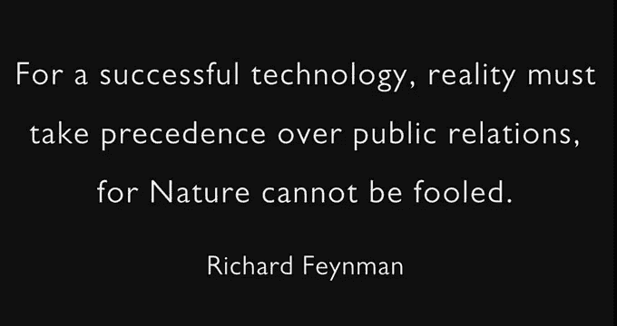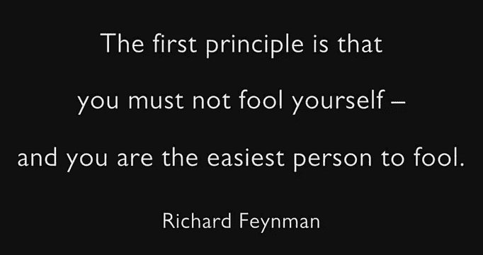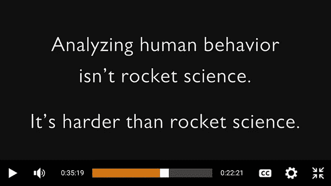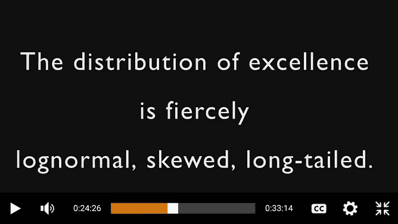

## 罗杰·彭:数据分析的过去与未来

那个熟悉的标题又来了，这次借用的是约翰霍普金斯大学的罗杰·彭，以及大名鼎鼎的 [Coursera 数据科学专业](https://www.coursera.org/specializations/jhu-data-science)&[*不那么标准差*](https://soundcloud.com/nssd-podcast) 播客。

在这里，Roger 提出了一个有见地且具有启发性的案例，即对于什么是“好的”数据分析，我们仍然没有太多的理论或通用标准。利用与其他学科中设计模式的类比，音乐理论和数据可视化的经验方法，他主张发展数据分析的“美学”,并提供了一些建议。

(注意，罗杰和帕特里克·沃尔夫——来自上面的 RSS 小组——分享音乐背景，加入了分析师的稀薄领域，其中还包括[吉杰伦泽](https://twitter.com/dnlmc/status/838097956708438022)，内特·西尔弗&……嗯……[我](https://medium.com/@dnlmc/the-logistic-map-the-onset-of-chaos-sonified-46fd73e25965)？)

下面是幻灯片摘录。

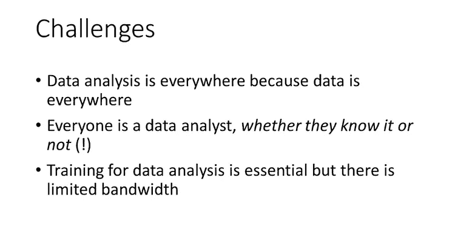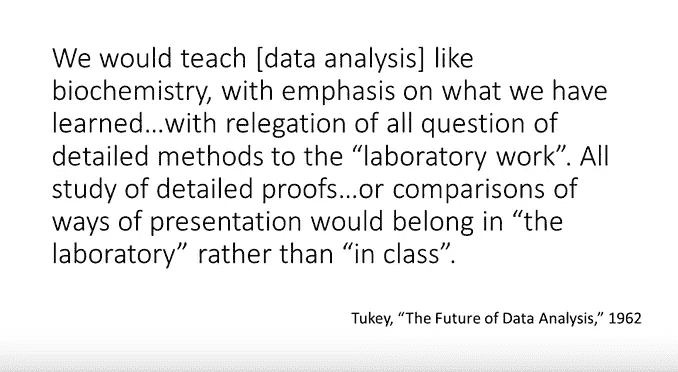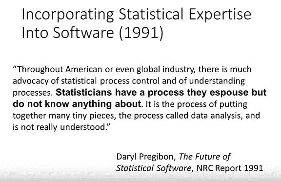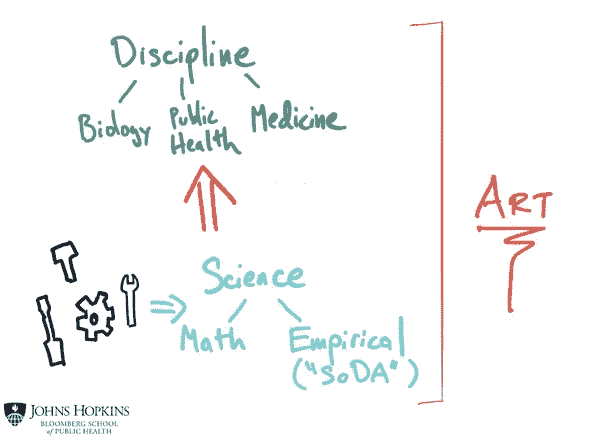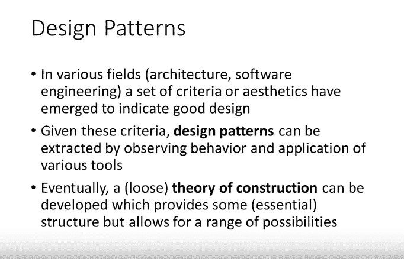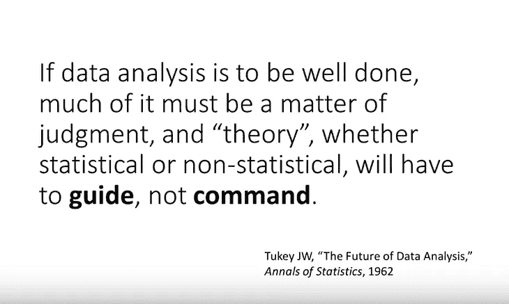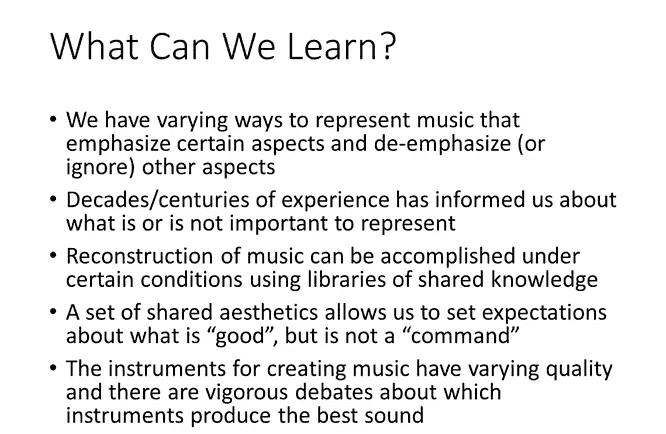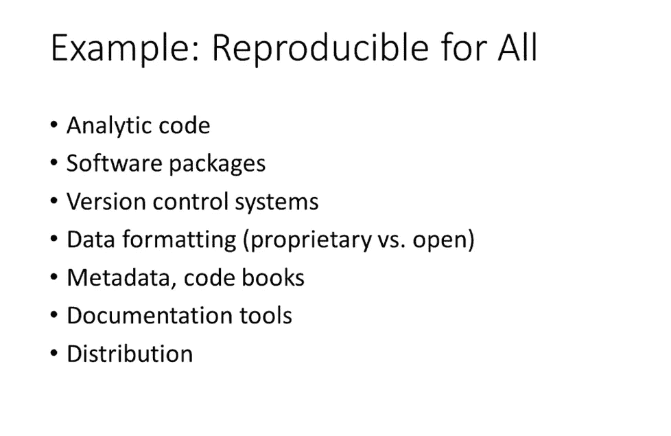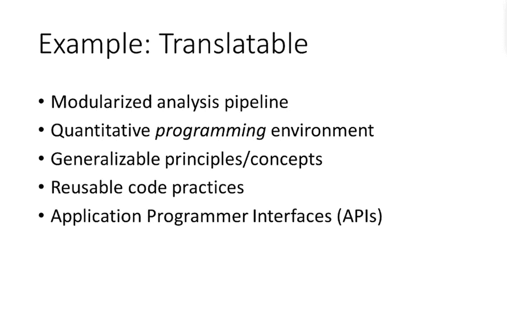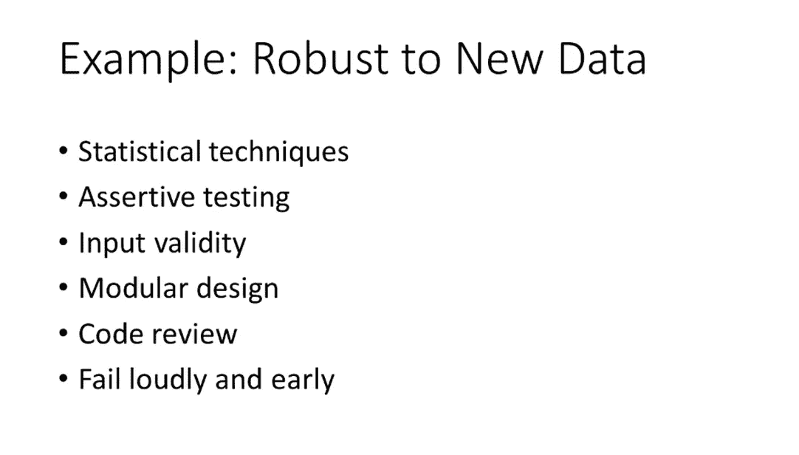

## 理论统计学是应用统计学的理论:如何思考我们所做的事情

正如我[叽叽喳喳](https://twitter.com/dnlmc/status/865002238464319488):

> 赫尔曼教授再次证明了自己是个十足的疯子
> 
> (一个完全聪明、深刻的疯子)
> 
> 真正的快乐是看着他在一个会议上发表演讲，人们带着钦佩之情“做工作”，关心棘手的理论和历史，并鼓励我们做出贡献

这与 Roger 的演讲非常吻合，因为 Andy 在 2017 年的 [#RstatsNYC](http://www.rstats.nyc/2017) 大会上明确阐述了现实世界数据分析实用理论的实证发展(同时参考了 Hadley Wickham 的 [Tidyverse](http://tidyverse.org/) 贡献作为范例)。在老式的盖尔曼时尚中，他以一种看似自由联想的方式即兴表演(没有幻灯片！)直到汇聚成尖锐、清晰、典型的卓越见解的几个时刻之一。

观看(再看)imo 绝对是一种享受。

## fried erike Schür——谦逊的数据科学家:数据科学的本质和意外

Fast Forward Labs 的 fried erike Schür 在#RstatsNYC 发表的另一篇(也很精彩)文章中，再次深思熟虑地挖掘了一些经典理论文本(这一次是来自我们的计算机科学同胞)，以获得对应用数据科学的现代见解。

弗里德里克的论点，正如我最初在推特上实时看到的:

我听从了她的建议，立即将上述内容添加到我的周末阅读清单中，并在推特上发布了一些摘录供日后参考。

很高兴[后来找到她的谈话](https://twitter.com/dnlmc/status/866126715298435072)意识到它非常值得推荐。一些注意事项:

> 尽管围绕神经网络和其他闪亮的工具大肆宣传…

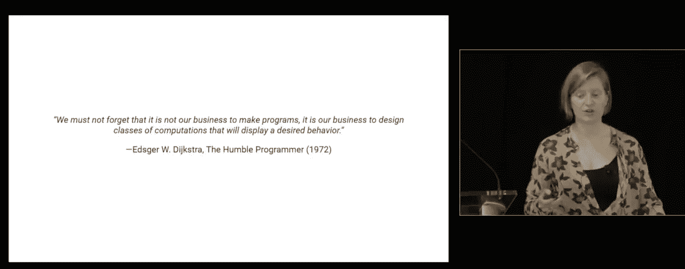

(cf. ‘People don’t want data; they want answers’,from RSS panel above)

> 或者:“找到好的和有效的解决方案，只要问题需要就可以”

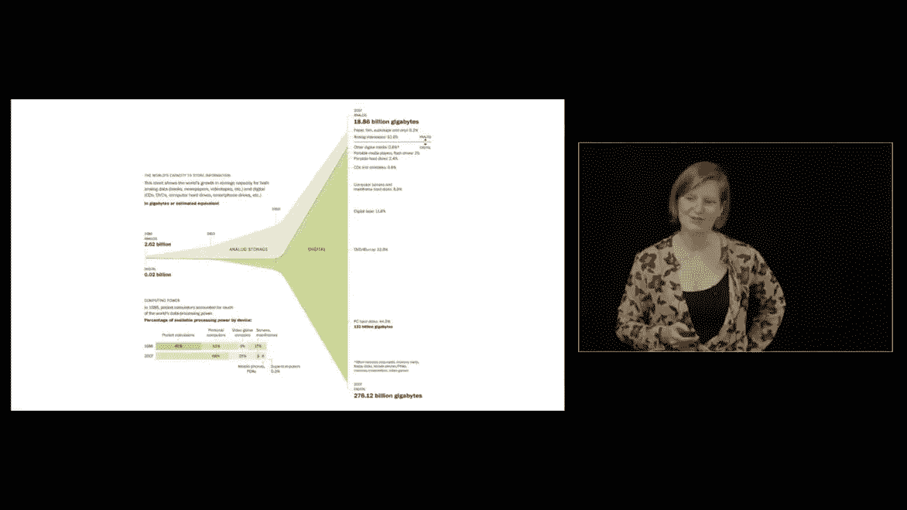

left: Edsger W. Dijsktra — The Humble Programmer

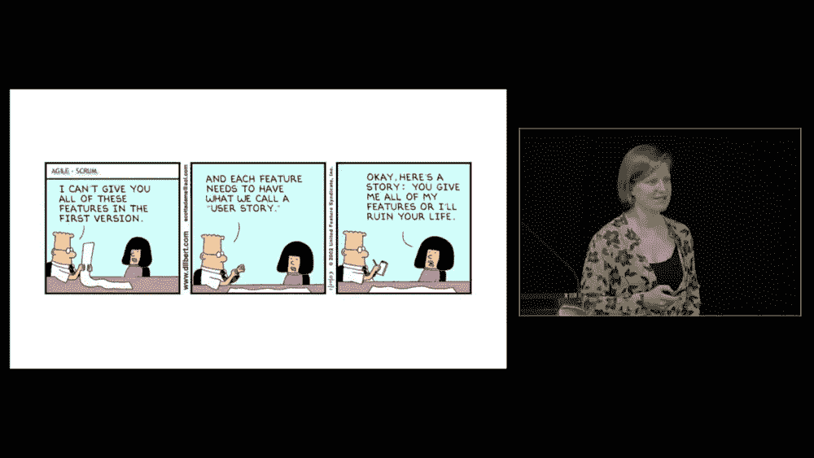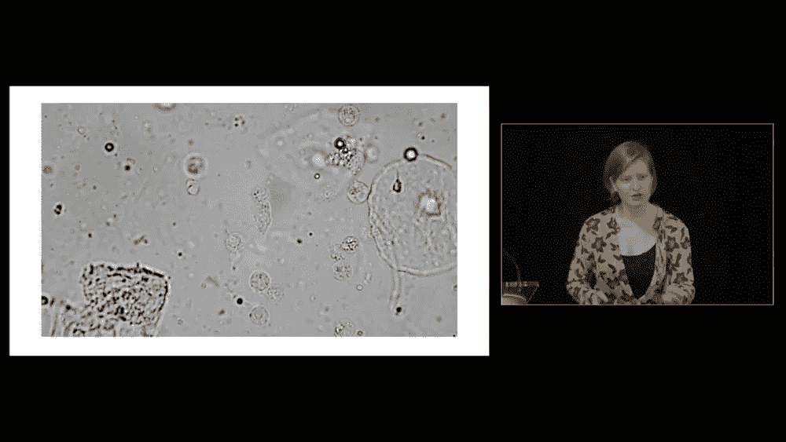

> 敏捷开发方法并不总是适合数据科学，因为我们是真正的科学家，我们的工作是了解世界，…管理不确定性

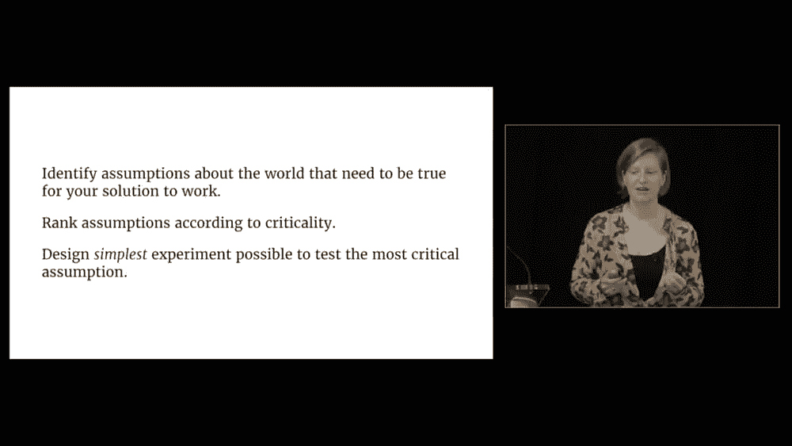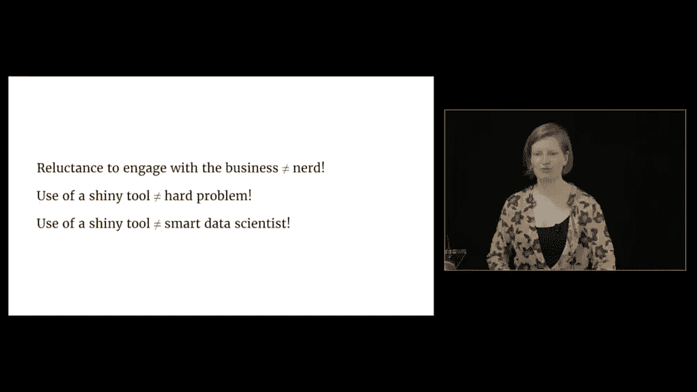

> 为什么我们到处都能看到这么多深度学习的方法？…我认为是因为招聘的激励机制被搞乱了，如果有人想帮忙解决，请说吧。

再一次，我非常喜欢这部电影&大概总共看了 4 遍。

## 阿曼达·考克斯-不知道的空间

继续超级聪明和有趣的主题(&实际上是加大赌注):NYT 结果的编辑 Amanda Cox 在 Vis 2017 年的主题演讲中谈到了沟通和为不确定性留出空间。(正如我在之前[说过](https://twitter.com/dnlmc/status/797281250897760256) [，我不认为结果是不确定的*2016 年*……&那些选举之夜颤抖的速度表指针客观上是可怕的。但仍然是一个伟大的演讲。)](https://medium.com/@dnlmc/wtf-now-pt-2-whither-data-science-8632534aa750)

值得注意的亮点:

> 报纸应该分为四个部分:
> 
> 1.真相
> 2。概率
> 3。可能性
> 4。谎言
> 
> …。第一部分会很短

-显然是托马斯·杰斐逊

*   *知道* vs *感觉*不确定
*   概率陈述的主观解释的广泛范围
*   通过文字与数字/图形交流不确定性:

> 对于文字，我们没有太多的工具来严谨地对待不确定性……想要保持真实，但仍然说某事之间的平衡是一种内在的紧张

还有其他一些，但这些对我影响最大。作为参考，以下是上面提到的一些重要文本的链接:

*   [约翰·图基——数据分析的未来](https://projecteuclid.org/euclid.aoms/1177704711)【1962】
*   [利奥·布雷曼-统计建模:两种文化](https://projecteuclid.org/euclid.ss/1009213726)【2001】
*   [威廉·克利夫兰-数据科学:扩大统计领域技术领域的行动计划](http://onlinelibrary.wiley.com/doi/10.1002/sam.11239/abstract)【2001】
*   [大卫·多诺霍——数据科学 50 年](http://courses.csail.mit.edu/18.337/2015/docs/50YearsDataScience.pdf)【2015，pdf】
*   埃德格·w·迪杰斯克拉——谦逊的程序员
*   唐·克努特——作为艺术的计算机编程
*   [小佛瑞德·P·布鲁克斯——没有银弹——本质&软件工程中的意外](http://worrydream.com/refs/Brooks-NoSilverBullet.pdf)【1986，pdf】

一个在路上:

——
在推特上关注:[@ dnlmc](https://www.twitter.com/dnlmc)
LinkedIn:[linkedin.com/in/dnlmc](http://www.linkedin.com/in/dnlmc)
Github:[https://github.com/dnlmc](https://github.com/dnlmc)