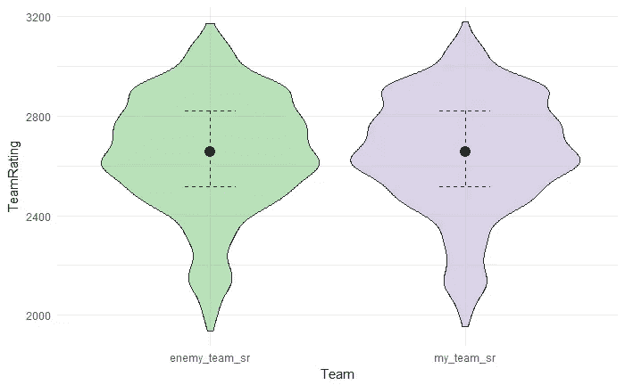
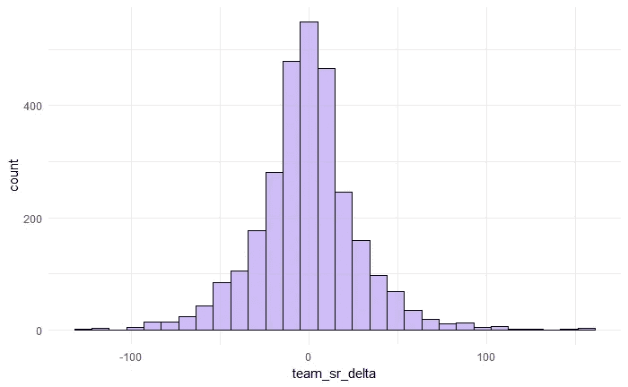
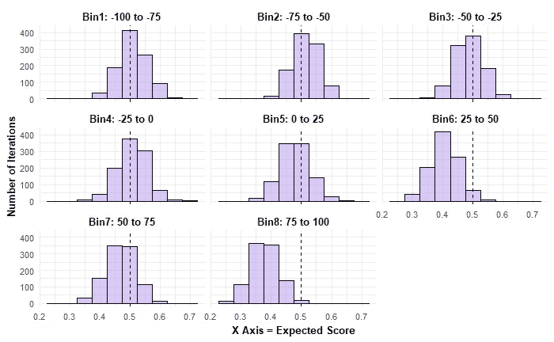
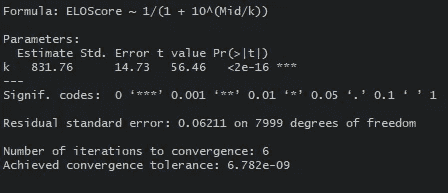
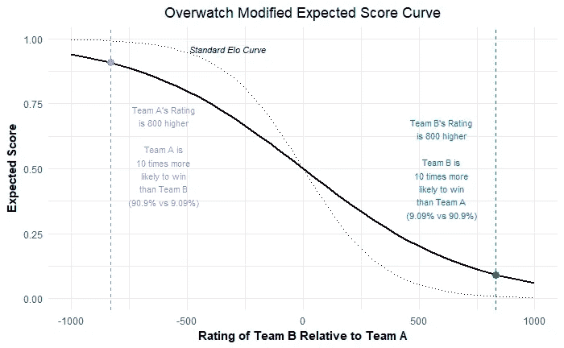
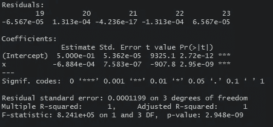
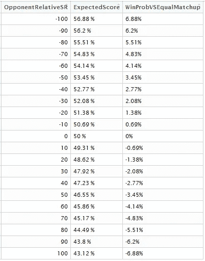

# 你的竞争性监视比赛背后的数学

> 原文：<https://towardsdatascience.com/the-math-behind-your-competitive-overwatch-match-a5184fc5a50f?source=collection_archive---------4----------------------->

## 使用真实世界的数据来判断暴雪是如何将流行的 Elo 评分系统应用到《守望先锋》中的。


Photo by [Mateo Vrbs](https://unsplash.com/@mateovrb?utm_source=unsplash&utm_medium=referral&utm_content=creditCopyText) on [Unsplash](https://unsplash.com/s/photos/gaming?utm_source=unsplash&utm_medium=referral&utm_content=creditCopyText)

任何一个玩过《守望先锋》竞技游戏模式的人都遇到过许多令人沮丧的事情:“职业”寡妇和神怪，数不清的半藏主，以及偶尔让你质疑暴雪是否在积极惩罚你在另一个生命中一定做过的可怕事情的配对。对于前两个问题，我无能为力——但如果你曾想知道，“这种疯狂的相亲真的有方法吗？”，那么这篇文章就送给你了。

“competitive”——或通常所说的“Comp”——似乎在使用流行的 [Elo 评级系统](https://en.wikipedia.org/wiki/Elo_rating_system)的修改版，用于配对和排名目的。Elo 系统最广为人知的可能是它在职业象棋中的应用(它是由匈牙利裔美国物理学家 Arpad Elo 开发的)，但它后来被应用于许多其他运动、竞技视频游戏(例如 PUBG)，甚至可以用来确定动物社会群体中雄性的[统治等级](http://dx.doi.org/10.1016/j.anbehav.2011.07.016)。

在本文中，我将讨论 Elo 评级系统及其匹配背后的数学原理。在此基础上，我将使用来自数千个竞技守望游戏的数据来确定配对等式是否以及如何在游戏中被修改。

# **Elo 评级系统**

在 Elo 系统中，竞争者被分配一个数字等级。当两个玩家进行比赛时，数值等级较高的玩家有望获胜。玩家的**预期得分**可以使用两个玩家的评分之间的差异来计算，对于我们的目的来说，这可以被认为是获胜的可能性。

一局游戏结束后，每位玩家的评分都会根据结果进行调整。胜利者将从失败者那里获得分数，平局时没有分数交换。

由于 Elo 系统下的评分调整是基于比赛的结果，所以球员在比赛中的实际表现在某种程度上是无关紧要的。考虑到两个玩家的相对排名，影响积分交换的唯一因素是开始条件和结果。*因此，Elo 系统并不直接衡量玩家的技能，而是根据他们的胜、负、平以及对手的相对技能来推断玩家的技能。*

如前所述，预期得分使用玩家的相对排名来量化玩家战胜对手的可能性。在 Elo 系统中，如果玩家 A 的排名为 **R_a** ，玩家 B 的排名为 **R_b** ，那么我们可以计算玩家 A 在与玩家 B 的比赛中的期望得分( ***E_a*** )如下:


Expected score for Player A when matched up against Player B in the Elo ranking system

绘制时看起来是这样的:


When the ratings of the two players are equal, the expected score for Player A is 50%. When a player has a 400 point rating advantage over the other player, their expected score is 10 times larger than the other player’s.

正如我们将在本文后面看到的，绝大多数的竞争监视比赛都是由评分差小于 100 的队伍组成的。如果我们放大该范围的 Elo 预期得分曲线，我们会看到这里的曲线*看起来*呈线性:


In the range where most Competitive Overwatch matches are played (+/-100 SR) the Expected Score curve is nearly linear.

结果是，曲线*在该范围内近似为线性的*，并且用简单的线性回归来拟合曲线的该部分给出了调整后的 R 平方值 0.999，其对于截距和斜率系数具有高度显著性。这使我们能够估计(非常接近)玩家 A 的预期分数(获胜的可能性)如何增加或减少，因为他们比对手多了一个额外的评分点——或者他们的对手比他们多了一个额外的评分点！根据拟合度:玩家 A 相对于对手的每一个评分点，其获胜的可能性增加 0.14%，而对手每一个评分点，玩家 A 获胜的可能性减少 0.14%。*请记住，这只适用于+/- 100 个评级点的范围，这里的曲线基本上是线性的。*

> 如果 Overwatch 使用与 Elo 系统完全相同的参数，拥有 50 分评分优势的团队比没有评分优势的团队获胜的可能性高 7%(从 50%到 57%)。相反，一个有 50 分劣势的团队获胜的可能性比没有差异的团队低 7%(从 50%到 43%)。因此，在 A 队比 B 队有 50 分的评分优势的比赛中，A 队实际上比 B 队赢的可能性高 14%(A 队 57%，B 队 43%)。

# **Elo 在看守中的预期得分**

非常广泛地说，这就是 Overwatch 的竞技游戏模式的功能:

*   玩家玩一轮定位比赛，之后他们被分配一个从 0 到 5000 的数字等级——这是玩家的 **SR** 或技能等级。一个拥有较高 **SR** 的玩家在与一个拥有较低**SR**的玩家对决时会赢
*   两个合适的队组成后，排名赛开始。匹配系统将六个排名相似的玩家组成团队，并根据每个团队中玩家的平均 **SR** 来确定哪些团队应该配对。 ***大概是系统试图根据计算出的期望得分，使两队比赛尽可能的公平。***
*   游戏结束后，系统会根据玩家是赢是输分别调高或调低他们的 **SR** ，在平局的情况下没有变化。

因此，事情看起来非常类似于我们上面讨论的 Elo 系统。

## 挖掘游戏数据

为了确定 Overwatch 的竞争模式是使用标准的 Elo 公式计算预期得分还是一个修改版本，我将计算不同等级差异大小的实验预期得分。这就相当于问这样一个问题— *“当一个团队拥有 50 分的评分优势时，他们赢的几率有多大？25 分的评分优势呢？”*等等。然后，我将这些点拟合到下面的等式中，以确定**k’**的值(在标准 Elo 公式中为 400)。


在意识到自己收集足够数量的游戏数据需要太长的时间(通常比赛持续 10-30 分钟)后，我偶然发现了 Myles O'Niell 的这个令人难以置信的数据集，其中包含 3000 多场比赛的数据。

记住 Elo 公式，数据集中感兴趣的列是:

*   **my_team_sr :** 团队的平均评分
*   **敌方团队 sr :** 敌方团队的平均等级
*   **team_sr_delta :** 两队评分之差【敌方 _ 团队 _sr -我的 _ 团队 _sr】
*   结果:比赛的结果

## **一些快速的数据探索**

查看平均团队评分的分布(见下图)，我们看到 **my_team_sr** 和 **enemy_team_sr** 的中值、IQR 和分布形状几乎相同。此外，他们的范围从 1900 到 3100，这给了我们一个典型的[竞技看守玩家](https://overwatchtracker.com/insights/skillrating?platform=pc)的良好代表。*请注意，如果在极端较低或较高的排名中有不同的行为，我们将无法看到。因此，我们必须记住我们的发现所适用的玩家群体。*



This violin chart shows almost identical distributions for both teams across the recorded games (the width of the blob corresponds to the density of data points at that value). The median (dot) and IQR (dotted line) are also nearly identical.

下面，我们看到每场比赛中各队评分之间的差异呈正态分布。我们还看到，绝大多数比赛都发生在平均得分相差在 100 SR 以内的队伍之间。



Distribution of rating difference between teams. Looks pretty normal.


Summary statistics for team_sr_delta

> 这种分布是非常轻微的负偏差，正如负中位数和均值所证明的那样。


Breakdown of match results

> 此外，游戏的结果似乎并不特别偏向于输赢。

## **确定不同 SR 增量下的预期得分**

下一步是了解当两个团队之间的评分发生变化时，预期得分是如何变化的。回想一下，预期得分的公式是:

***预期得分*** *=中奖概率+ 1/2(抽奖概率)*

所以我们需要知道当对手的评分增加或减少(相对于他们的)时，团队获胜的可能性有多大，平局的可能性有多大。我选择通过模拟从数据集中随机选择游戏，并根据玩的、赢的和抽的游戏的数量来计算概率。

## **模拟**

由于 team_sr_delta 的分布是正态的，这意味着我们将有一个非常大的游戏组，其中两个团队的收视率非常接近，而收视率相差较远的游戏则少得多。所以当我发现游戏的胜率在 0 到 25 之间时，我可以很有信心。然而，如果我看的是 SR deltas 在 75 到 100 之间的游戏，由于样本量较小和数据中的噪声，胜率更容易出现错误。

为了克服这一点，我基于 SR 增量将每个游戏分箱，并创建了一个模拟，该模拟将对每个箱中的游戏进行非常简单的过采样和欠采样。模拟从每个箱子中随机选择 100 个游戏——替换，因为有些箱子很小。然后，它会计算赢和平的游戏数，并计算预期分数。它这样做了 1000 次。你可以在下面找到模拟循环的 R 代码(如果你喜欢这类东西的话)。

```
simOutput <- data.frame( matrix( ncol = 5, nrow = 0))

         colnames(simOutput) <- c( "Bucket", "GamesWon",
                                   "GamesDraw", "GamesPlayed", "SimRun")

         *# because I'm too lazy to do the math required for output rows*
         row <- 1

         *# loop through iterations of simulation* 
         for(i in 1:1000)
         {

              *# loop through each bucket for this iteration*
              for(j in 1:8)
              {
                *# sample the games with replacement for bucket j*
                simData <- data %>% filter(sr_delta_bucket == j) %>% sample_n(100, replace = T) 

                *# determine how many games were won, drawn and played for that bucket*
                simOutput[row, "Bucket"] <- j
                simOutput[row, "GamesWon"] <- sum(simData$win_count)
                simOutput[row, "GamesDraw"] <- sum(simData$draw_count)
                simOutput[row, "GamesPlayed"] <- nrow(simData)
                simOutput[row, "SimRun"] <-i

                row <- row+1
              }

              *# for my own sanity*
              if(i %in% seq(0,1000,100)){print( i)}
         }

          *# Numerator for expected score*
          simOutput$WonHalfDraw <- simOutput$GamesWon + ( simOutput$GamesDraw / 2)

        * # Calculate expected score*
          simOutput$ELOScore <- round( simOutput$WonHalfDraw / simOutput$GamesPlayed , 4)
```

运行模拟后，我按 bin 汇总，这样我就可以很好地了解 bin 的预期得分分布。

```
*# now determine the probabilities of winning at each bucket*
       simResults <-   
          simOutput %>%
               group_by(Bucket) %>%
               summarise(
                    TotalGamesWon = sum(GamesWon),
                    AvgGamesWon = round( mean(GamesWon), 2),
                    SDGamesWon = round( sd(GamesWon), 2),
                    TotalGamesDraw = sum(GamesDraw),
                    AvgGamesDraw = round( mean(GamesDraw), 2),
                    SDGamesDraw = round( sd(GamesDraw), 2),
                    TotalGamesPlayed = sum(GamesPlayed),
                    WinProb = round( (TotalGamesWon / TotalGamesPlayed) * 100, 2),
                    DrawProb = round( (TotalGamesDraw / TotalGamesPlayed) * 100, 2),
                    TotalELOScore = WinProb + (DrawProb / 2),
                    ELOScoreSD = round( sd(ELOScore) * 100, 2)
                    )
```

现在他们已经被团队之间的 SR delta 分类了，我们可以看看基于 bin 的模拟的预期分数的分布(如下所示)。我们可以看到，在左上方敌队的评分劣势在-100 到-75 之间的地方，“我的队”比敌队的评分优势在 75 到 100 之间(右下方)的时候有更高的期望得分(获胜概率)。我在 0.5 处添加了一条虚线，以便更容易比较各个区间。



Distribution of Expected Score by Bin from Super Magical Overwatch Simulator 1000

我们还看到每个箱中的分布近似正态，这意味着我们可以做回归和置信区间之类的事情，而不必太担心违反基本假设。**我们现在准备将模拟数据与 Elo 预期得分公式进行比较！**

## 拟合方程

使用模拟生成的数据，我们现在可以将以下等式拟合到我们的真实世界竞争监视数据中。


*标准 Elo 期望得分方程，陡度= 400*


*我将用来确定陡度的方程*

为了根据分箱的模拟数据进行实际拟合，我将分母中的 ***团队 SR Delta*** 设置为每个箱的中点(即，箱 1: -100 到-75 的中点为-87.5)。使用非线性最小二乘法，我使用以下代码拟合 R 中的方程(*)注意，k = 200 起始参数是任意的，我尝试了从 100 到 1000 的许多不同起始值，它们都给出了相同的结果！*):

```
*# fit to Elo equation to determine 'steepness' parameter*
logFit <-nls( ELOScore ~   1 / (1 + 10^(Mid/k)), start = list(k = 200)  , data = simOutput)
```



我们的值是 **831.8** 而不是 **400** ！但是我们对这一估计有多大把握呢？使用 R 函数 confint()，我们可以确定该系数的 95%置信区间，它分别给出了 **803.8** 和 **861.7** 的下限和上限。因此，我们可以*非常自信地*说，监视是*而不是*使用传统 Elo 公式中使用的值 400，而是使用更接近 800 的值！

那么，这改变了什么呢？

前面我们看到，使用标准的 Elo 公式，比对手有 400 点评分优势的玩家获胜的可能性是对手的 10 倍(或者预期得分比对手大 10 倍)。这是在等式中明确将值 400 作为比例因子的结果。我们的实验数据显示，真实值可能更接近 800，这意味着你必须比你的对手有 800 的评分优势，才能比他们多 10 倍的胜算。这样的效果是一个更平，更平滑的曲线。



此外，回想一下，大多数比赛的团队之间的 SR 差异小于 100，在这个范围内，曲线可以非常接近线性拟合。



每超过对手一个评分点，玩家 A 获胜的可能性增加 0.069%，而对手每超过一个评分点，玩家 A 获胜的可能性减少 0.069%。不是那么巧合，这是使用标准 Elo 曲线(*的变化率的一半，你觉得这是为什么？*)。

最后，我创建了一个表格，在给定对方球队的相对 SR 的情况下，计算你的球队的预期得分，以及如果比赛在两个得分相等的球队之间进行，你的获胜概率的差异。



gg ez。

## **最终想法**

我发现了这个问题，并打算继续撰写另一篇文章，研究 Overwatch 的赛后评级调整与标准 Elo 评级调整的对比。请随时留下任何意见或反馈，感谢您的阅读！

*在 Medium 或* [*LinkedIn*](https://www.linkedin.com/in/lance-mcdiffett/) *上关注我，看看我未来的棋子！*

## **参考文献**

何塞·莱瓦[*https://quantdare.com/elo-system/*](https://quantdare.com/elo-system/)关于 Elo 系统的精彩报道

维基百科上的词条 Elo 系统与逻辑功能[*https://en.wikipedia.org/wiki/Elo_rating_system*](https://en.wikipedia.org/wiki/Elo_rating_system)*[*https://en.wikipedia.org/wiki/Logistic_function*](https://en.wikipedia.org/wiki/Logistic_function)*

*守望论坛[](https://us.battle.net/forums/en/overwatch/topic/20758885930)*上守望撮合排名系统的荒唐深度演练**