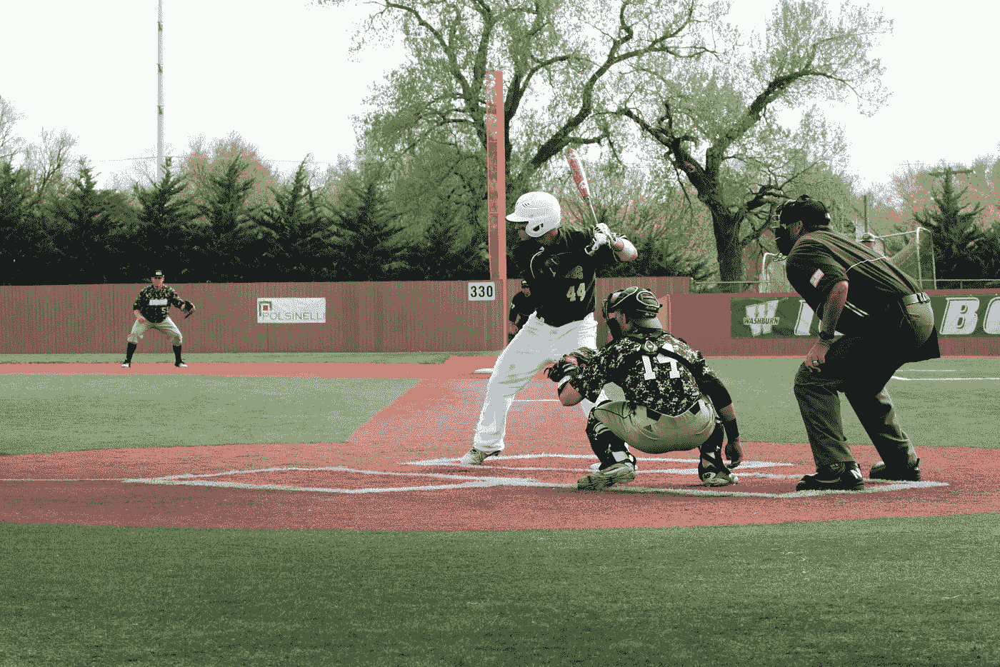
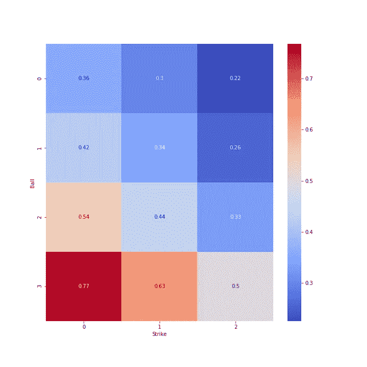
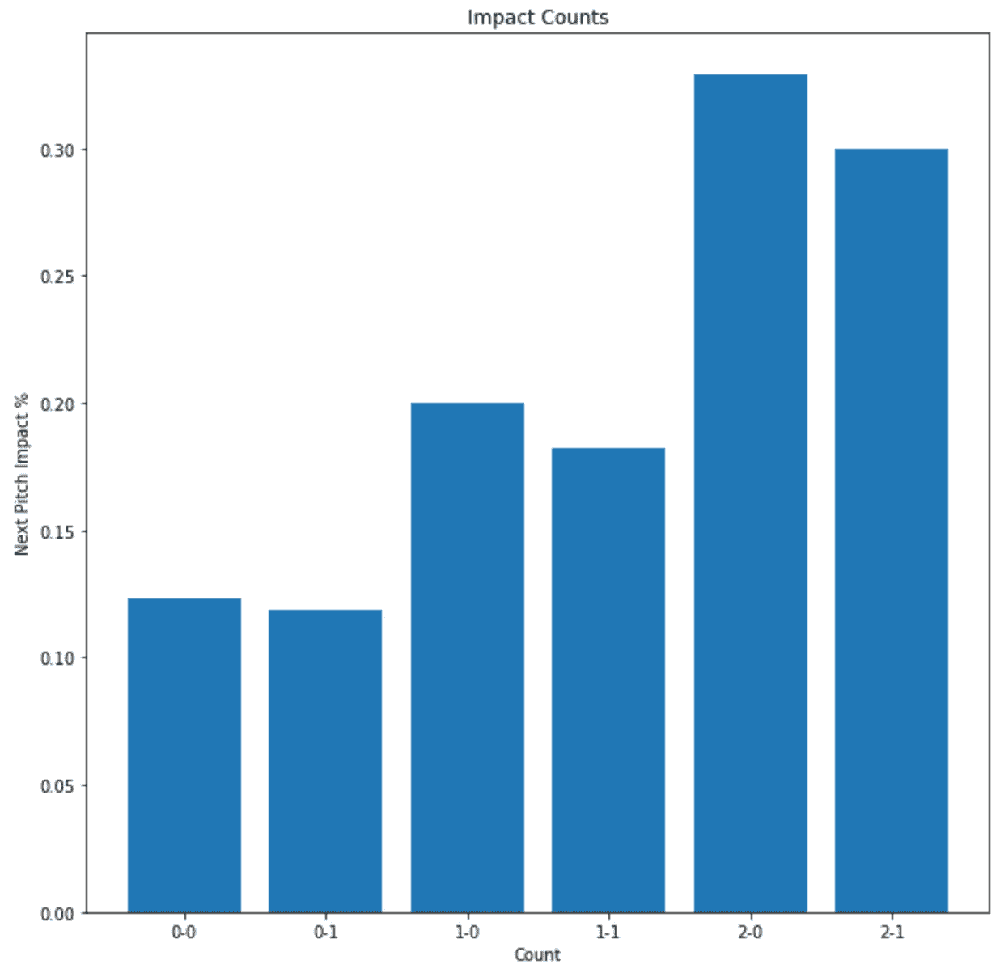
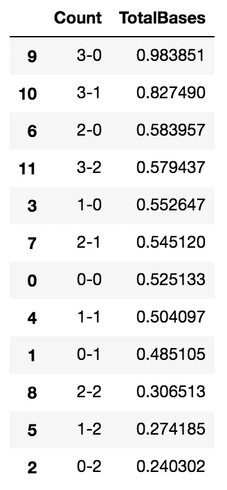
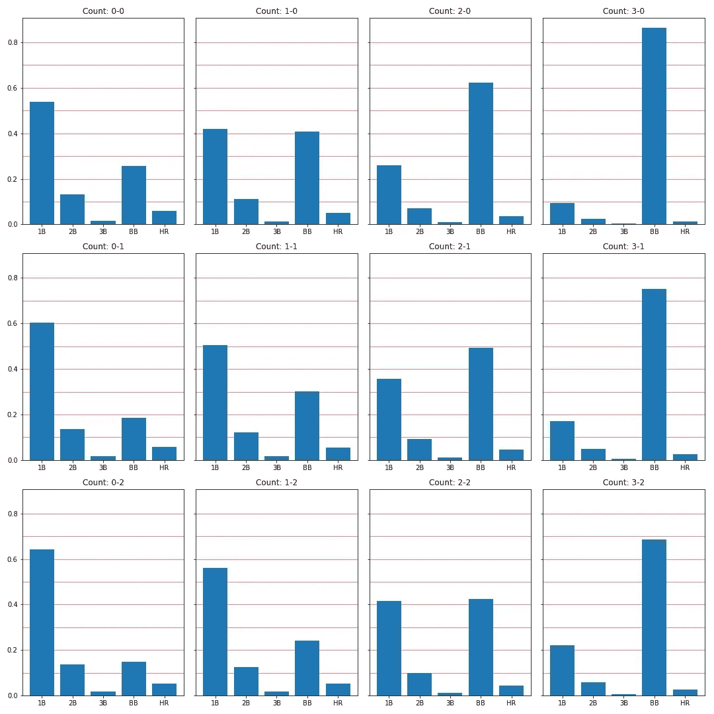
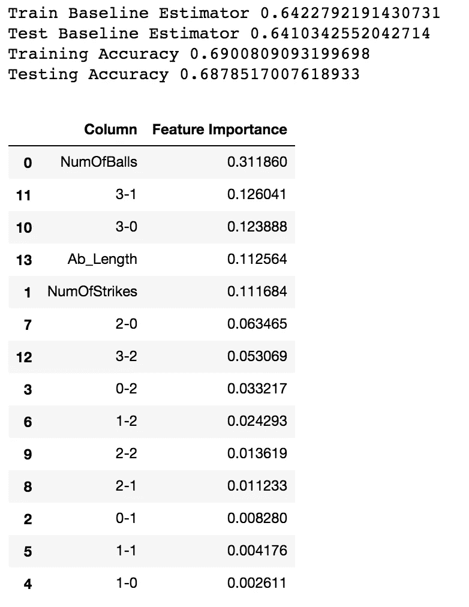

# 数学家与裁判争论指南

> 原文：<https://towardsdatascience.com/the-mathematicians-guide-to-arguing-with-an-umpire-bbf1dd30812b?source=collection_archive---------8----------------------->

在一次击球中，数学上最重要的计数是什么？

这是一种令人作呕的感觉。早上举重，团队练习，自己击球，然后当你步入禁区，跑垒员在二垒和三垒上，一人出局时，接球手后面的 35 岁盲人决定，一个几乎在另一个击球手禁区内，距离污垢 2 英寸的投球一定抓住了板的一部分。他发出的咕噜声让你应该从 1-1 数到 0-2，这种声音会带走你灵魂的一部分。

不管你是亲身经历过，还是曾经是那个对着电视声嘶力竭大喊“这个傻逼在看什么？!"每个人都知道一个球或一击可以完全改变击球的结果。对于有经验的棒球迷来说，“哦，这只是一次罢工”甚至没有触及表面。从 1 比 0 的比分变成 0 比 1 的比分正好让投手在击球时占了优势。从 2 比 1 变成 1 比 2 只是让你从舒适地寻找你喜欢的球场扩大到两倍。

但对你来说，一次推销的实际影响是什么？裁判的误判真的缩短了你的击球时间吗？接受一次推销让自己在盒子里感觉舒服是个聪明的主意吗？自动采用 3-0 的间距是一个聪明的想法吗？我已经收集了几十万个二级棒球和垒球比赛的球棒，以便更好地理解一个球棒成功或失败的计数。

> 预告片:在真正的 sabermetrics 时尚中，我们将专注于上垒，而不仅仅是安打。然而，我们不打算统计一些上垒的方式(被投球击中，捕手干扰)，因为它们对分析什么影响击球没有帮助。我也不包括 sac 短打，因为它们通常由教练决定，而不是由击球手或投手决定。

求解答的问题:
**1。每次计数的基本概率是多少？**
**2。什么因素对你能否上垒影响最大？
3。不同计数的段塞流百分比差异大吗？
4。最后击球数是多少重要吗？还是导致最终计数的计数顺序对最终结果产生了影响？**

我分析的所有数据准备和代码可以在[https://github.com/anchorP34/PlayByPlay-Reports](https://github.com/anchorP34/PlayByPlay-Reports)找到

# 1.每次计数的基本概率是多少？

开始击球时，你可以有 12 种不同的计数。因为你可以在一场比赛中有多次失误，所以我们要看在一场比赛中经历过那次失误的人的上垒率。下面是一张热图，显示了击球手在击球时的平均上垒率(OBP ):

Matrix with ball count vertically and Strike count horizontally. There are three different sections to focus on: the dark blue, the light blue / white, and the orange and red.

正如大多数棒球迷所期待的那样，你上垒的最好机会是在 3 比 0 的时候，因为你最有可能保送，也最有可能三振出局。根据同样的逻辑，你最差的得分是 0-2，因为投手有更多的机会三振你，而且不用担心保送击球手。

对于大多数教练来说，2-0 和 3-1 的投球被认为是相同的击球心态，因为打者是在“打者计数”中。然而，这些数字可能会有所不同。在 3 比 1 的情况下，最糟糕的情况是 3 比 2，你仍然有大约 50%的机会上垒。在 2 比 0 的情况下，最糟糕的情况是 2 比 2，有 33%的机会上垒。2-0 的投球应该更加集中，因为在接下来的时间里，你被击中的可能性要大得多。

# **2。什么因素对你能否上垒影响最大？**

在第一个问题的基础上，确定一个击球手投球的权重也可以从热图中看出，但计算是在分析的基础上进行的。因为有三个球或两个好球的计数不能被强调，因为任何一个方向的增加都将是保送或三振出局，我们可以专注于击球时的中间计数。我们正在计算*下一次投球影响%* ，方法是查看如果你在下一次投球中得到一个球，OBP 增加的量加上如果你在下一次投球中得到一个好球，OBP 减少的量。我们使用每一个的绝对值，因为一些计数会因为球是正的而打击是负的而被抵消。

Bar chart that shows the total change in OBP on the next pitch

从图表中，我们可以看到在计数早期的投球(0-0 和 0-1)对一个击球手没有很大的影响。如果你是那种喜欢在击球时投出第一球以获得对投手更好感觉的击球手，那么它几乎不会产生与在计数中稍后投出一球相同的影响。这确实违背了我正常的意识形态，因为我认为从 0-1 开始比从 1-0 开始要糟糕得多。

# **3。不同计数的段塞流百分比差异大吗？**

当然，上垒率是一个击球手成功的很大一部分，但是我们也想看看来自不同计数的力量。一垒安打和一次保送是成功的，但是双打、三垒安打和全垒打更受欢迎，最终会带来更多的得分来帮助球队获胜。我想从两个角度来看这个问题:击球的百分比和每次击球成功的频率。

总击球数栏涉及正常击球百分比计算(总击球数除以 at 击球数。比如全垒打= 4，三垒= 3，二垒= 2，保送和一垒= 1。其他都是 0。)

这些结果与基本百分比热图极其相似。接近 3–0 的计数具有较好的段塞百分比，而接近 0–2 的计数具有较差的段塞百分比。

我认为有趣的是，12 个计数中只有 8 个在. 500 的击球率附近徘徊。因此，除非你在数量上遥遥领先或落后，否则所有人的权力数字都差不多。在权力方面，2-1 计数与 0-1 计数没有太大区别。

为了观察这些幂数值的频率，我们可以看看这个柱状图:

The frequency of successful results in each count

从左往右看，1Bs 和 BBs 是反比关系。你走的越右，你走的机会就越大，得到一个单人间的机会就越小。

同样令我惊讶的是，双打在 0 球和 1 球计数中比在 2 球和 3 球计数中更频繁。在 0 球和 1 球计数中，双打至少占所有成功结果的 10%,而在 2 球和 3 球计数中，只有 2-2 球计数至少占所有成功结果的 10%。这很令人惊讶，因为我总是认为 2-0 和 2-1 比 0-1 或 1-1 更有机会成为伟大的击球手。

# **4。最后击球数是多少重要吗？还是导致最终计数的计数顺序对最终结果产生了影响？**

改变简单的统计分析如平均值的速度，让我们看看机器学习，看看我们是否可以预测一个 at 球棒是否会成功。看看 at 球棒经历的计数，at 球棒的投球数，最后一击和计数中的球数足以预测某人是否会上垒。

> 我尝试使用 3 种不同的方法来确定模型中使用的变量。
> a)使用最终击球计数来预测最终结果
> b)仅使用击球时经历的不同计数
> c)使用最终结果中的两个列子集

The final model. Feature importance is the usage the variable was used in predicting the final output.

我决定使用准确性来确定我的算法的有效性，并使用 64%的基线分数，因为上垒的概率是 36%。如果你假设一切都是一个输出，你将有 64%的时间是正确的，因此确定是否真的有一些有效的机器学习。

当将只关注 at 球棒的最终击球次数的模型与 at 球棒的不同击球次数进行比较时，预测结果几乎没有差异。这两个模型在预测击球手是否会上垒方面的正确率为 68.8%，这意味着无论你是以 0-2 开始，以 3-2 结束，还是以 3-0 开始。以 3 比 2 结束比赛，3 比 2 的比分才是最重要的。这有助于向打者表达，你的击球手在每次投球后都会更新，你总是可以让击球手在更好的情况下上垒。

最终的模型(模型 c)最终比其他模型做得稍好，达到 69%的准确率。从最终模型的特征重要性来看，at 球棒最终计数中的球数对 at 球棒的结果影响最大，而 at 早期的计数对确定结果几乎没有影响。

# 那么，我应该如何与裁判争论谁破坏了我的击球？

1.  如果是在击球初期，咬你的舌头。从数字来看，击球初期的计数不会对你是否能上垒有很大的影响。不值得为任何事情和裁判争论，让他心情不好。
2.  当你数到 1-0、2-0 或 2-1 时，这些投球对你击球的结果有很大的影响。由于裁判更有可能在 2-0 的计数中判定任何接近的击球，我绝对会告诉裁判“伙计，这 2-0 的投球在我的击球中占了 36%的重量。不要让他自动出局来继续击球。”
3.  不要因为“权力数字”而与裁判争论 3-1 和 2-0 的计数。在这种情况下，你更有可能获得保送，而不是额外的安打，所以你在 2-1 的计数中争论你的大时间 pop 真的可以离开窗户。

然而，在击球时知道才算数，最后一击和球才算数，而击球的总长度不足以决定你击球的成功结果。有更多的变数，将需要被包括在内，以确定一个在蝙蝠的输出，这应该使任何击球手有信心，他们有最终的权力来决定他们在蝙蝠的结果。