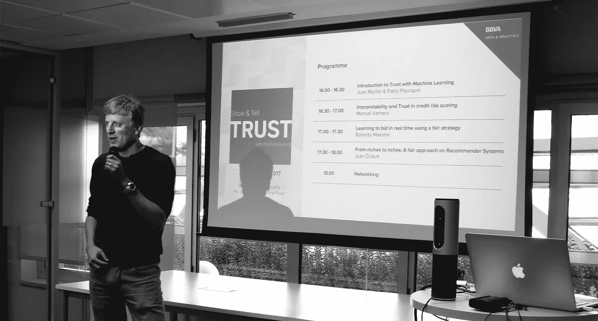
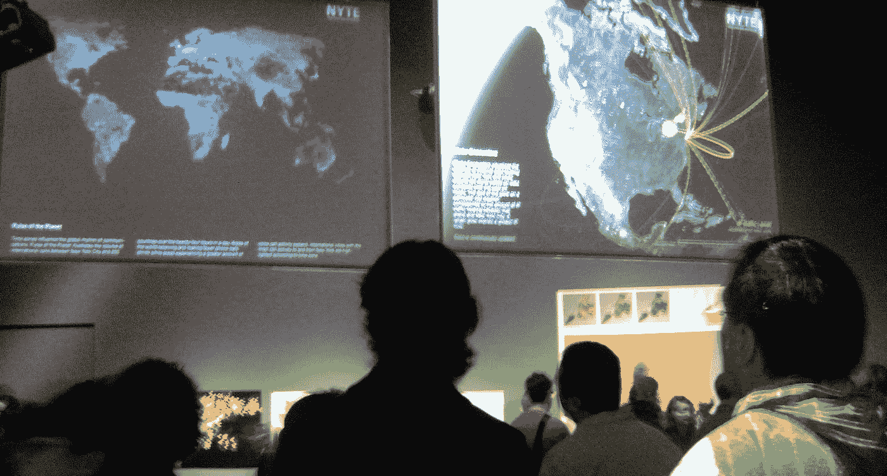
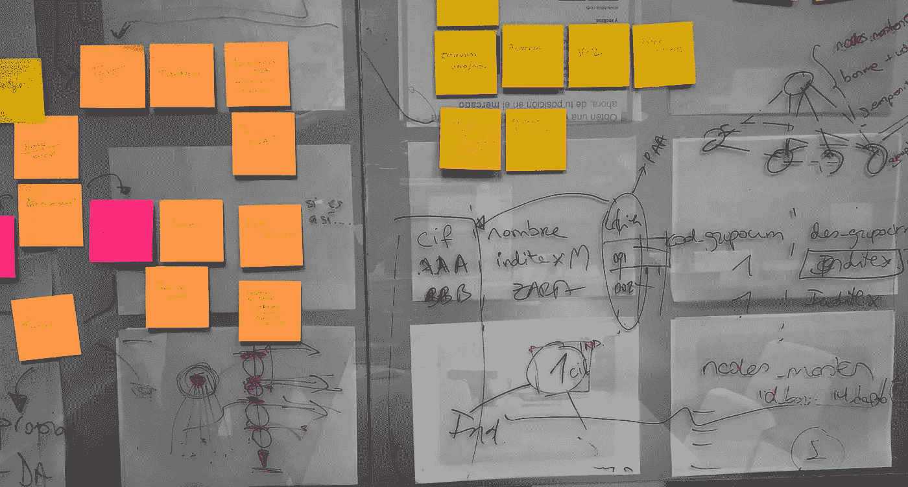
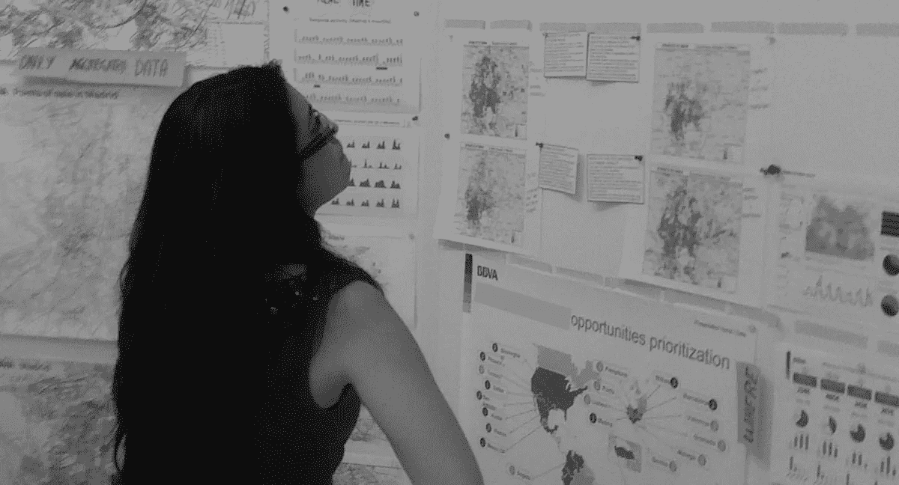
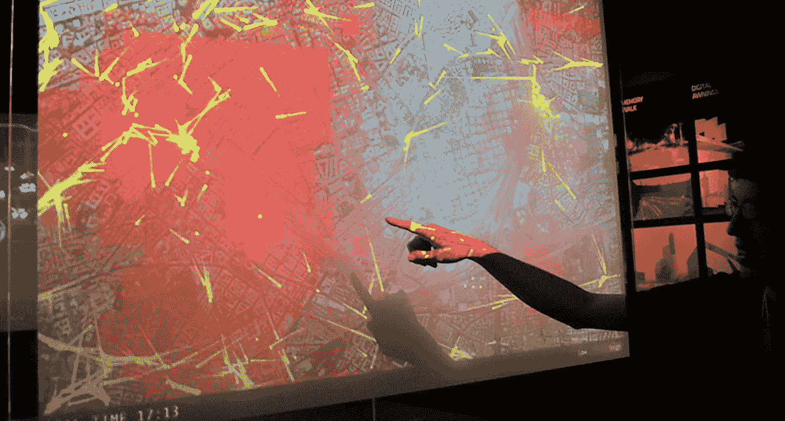
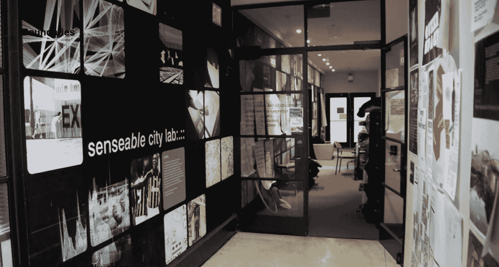

# 数据科学的创新思维

> 原文：<https://towardsdatascience.com/the-mindset-for-innovation-with-data-science-fc51605a4867?source=collection_archive---------3----------------------->

## 培育健康创新的数据科学功能的原则

Photo by Israel Viadest

随着组织转向数字化转型战略，他们也越来越多地围绕数据科学实践组建团队。目前，许多首席信息官、首席数据官和其他首席数据科学家面临的主要挑战在于，如何准确定位数据科学职能，以满足组织改进当前和未来活动的需求。这意味着嵌入数据科学团队以全面参与业务，并调整公司的运营骨干(例如，技术、流程、基础架构、文化、法律)。

数据科学没有正式的描述。其“用数据理解和分析实际现象”的使命，从业界到学术界可以有很大的不同。凭借在这两个领域的经验，我对数据科学的定义偏向于数学、编程和通信技能的结合，以及科学方法在特定知识领域的应用。我喜欢将实践总结为四个不同的战略领域:

*   **数据集**通常涵盖数据治理、战略数据源和基础设施。
*   **技能组合**是关于衡量分析就绪性、管理人才、传播循证文化(例如创建共享语言)、应用数据科学流程以及设计数据科学团队的组织框架。
*   **工具集**涵盖了合适的数据科学工具的选择以及最佳实践在整个组织中的应用。
*   一种**思维方式**集合了支持数据科学功能精神的生动原则，以在数字化转型的源头提供价值和创新。

我相信**心态**是将对数据集、技能和工具集的投资转化为经济和文化影响的推动力。我来试着介绍一下为什么和怎么做。

10 多年来，我有幸与梦之队合作，将数据科学带入他们领域的前沿。在[麻省理工学院可感知城市实验室](http://senseable.mit.edu/)(麻省理工学院)，我们在分析人类活动的数字痕迹以促进城市创新的技术方面处于领先地位， [Bestiario](http://bestiario.org/) 开发了独特的环境，使数据操作和可视化民主化， [BBVA 数据&分析](https://www.bbvadata.com/) (D & A)从金融数据中获取知识以转变银行业(例如风险建模、客户咨询、流程自动化)。我认为这些机构在人才、开放式挑战和获取大量数据方面堪称典范。每个都有不同的结构、融资机制和功能，但都有一个共同的使命，那就是引领其赞助商或客户的数字战略。

我在麻省理工学院、Bestiario 和 D&A 持续体验到的是一种独特的能力，能够交付切实的成果，以不同的方式思考，打破现状。我经历了一种因复杂性和不可预测性而形成的思维定势，这种思维定势是由设定背景、激励人们而非管理他们的领导层形成的。

根据我的观察和学习，我制定了一套原则，作为如何培养数据科学创新思维的蓝图。这些原则没有按重要性排序，而是旨在相互补充。我看重:

> **1。文化**胜过技术
> 
> **2。多才多艺**
> 
> **3。双重性**超过破坏性
> 
> **4。短跑故事**
> 
> **5。道德高于利润**

虽然右边的项目有价值，但我更看重左边的项目。当然，这些原则会有不同程度的潮起潮落，不应该被认为是普遍规律。

# **1。文化胜于技术**

在麻省理工学院精神的核心，D&A 和 Bestiario 承诺永远学习，寻求同行的认可，并帮助他人做同样的事情。例如，D&A 团队的很大一部分人在工作时间之外致力于教学。这种文化为实践社区之间的知识获取和知识共享提供了投资回报，也为增加承诺、凝聚力、奉献和激励水平的联系、合作和品牌化提供了投资回报。换句话说，数据科学存在于技术之外。

在一个技术推动、“技术先知”和媒体回音室的世界里，人们很容易陷入技术陷阱，因为它迫切需要不断探索只会导致分心和短期美容效果的新工具。与[其他创意团队](https://medium.com/@rhysys/no-dickheads-a-guide-to-building-happy-healthy-and-creative-teams-7e9b049fc57d)类似，吸引或留住数据科学人才的不是技术。驱动人们的是一种开放和健康的文化，这种文化确保人们在工作中感到充实、挑战和支持。

# **2。多才多艺**

我在麻省理工学院的经历最让我着迷的是，它的研究活动不局限于单一领域的方法论。它的特点是一种“全方位”的方法——受麻省理工学院媒体实验室的启发——说设计师、工程师、物理学家、生物学家、社会科学家甚至艺术家的语言。类似地，Bestiario 的首席执行官 Jose Aguirre 为工程师开发科学肌肉和像设计师一样思考提供了背景。

数据科学包含一系列不同的学科，并不是孤立存在的。为了与他人合作，专家需要学习他们专业领域之外的知识。一些组织可能会陷入这样的陷阱，即从事数据科学需要专业的博士学位，或者这是一门工程学科。事实上，这种实践要求对理解其他学科的语言有一种发达的好奇心，并对协作学习有强烈的兴趣。“博学者”或“[广义专家](https://www.fs.blog/2017/11/generalized-specialist/)”的这些特征，让科学团队能够与企业中来自产品管理、设计、营销、法律、沟通、工程、财务等不同岗位的人打交道。最近，行业中出现了“产品科学家”或“人工智能设计师”等新的混合名称，突显了将不同学科与科学方法联系起来的必要性。与此同时，来自跨学科领域的观点，如[科学技术研究](https://en.wikipedia.org/wiki/Science,_technology_and_society) (STS)关于算法责任、数据偏差或“厚数据”的观点，正在成为数据科学核心主题的一部分。

通才专家带来了跨学科知识的优势，这有助于培养创造力和对社会、组织或企业需求的更深刻理解。一个综合专家团队比一个专家团队能为深层、复杂和非常规领域带来更好的整体视角。

# **3。**双重性超过破坏性

在定位他们的数据科学职能时，一些组织将实践的新颖性与他们的创新议程联系起来。他们期待用颠覆性的概念创造新的价值。不幸的是，这种主动的方法经常导致与组织现实的某种程度的脱节，团队探索一些可能不是实际问题的东西，或者调查错误的问题。因此，这种勘探模式的可测量影响可能只是残余的。这是麻省理工学院赞助模式或雇佣外部顾问做法的一个潜在缺点。

一个组织的强大取决于其团队相互协作的能力。因此，其他组织依靠部门的协同定位来确定正确的问题，并对问题进行优先排序。这些团队通常专注于将数据科学应用于当前的优化需求。如果执行得当，交付的价值将产生足够的影响，加速数据科学成为组织核心业务的一部分。然而，埋头苦干的数据科学团队并没有完全让组织受益。忙于小的改进、短期的要求、会议和报告，人的大脑和创造力没有用来质疑现状和思考替代机会。

在数据科学和其他领域，在创新和优化之间平衡战略[需要权衡。D & A 的一个主要成功因素是它成长为一个](https://www.digitaltonto.com/2017/we-too-often-ignore-the-tradeoff-between-innovation-and-optimization/)[的双手并用的组织](http://blog.strategyzer.com/posts/2016/12/19/innovation-is-dead-long-live-innovation)。一方面，我们有一个为 BBVA 作为一个全球金融机构创造效率和增量变化的战略。除了展示数据科学的短期价值，这些项目还为团队掌握金融行业的真实问题提供了最佳背景。另一方面，我们也相信，想要在 21 世纪蓬勃发展的公司需要使用数据科学来探索他们未来的竞争优势。这条工作线是关于价值创造和推动创新议程的边界。与麻省理工学院或 Bestiario 类似，任务是帮助一个组织“跳出框框”思考和执行，远离日常干扰和干扰。这些探索是反思获得的知识、培养怀疑和阐明下一步行动的难得机会。

Photo by [BBVA](https://www.bbvadata.com/recsys-debate-widen-world-find-new-ones/)

# **4。冲刺的故事**

在早期阶段，项目需要得到领导层的认可，以安抚反对变革的人，并对抗不切实际的期望。在麻省理工学院，我们雇佣了可感知城市实验室主任卡洛·拉蒂所说的“城市演示”来将想法转化为实验和愿景。这些演示并不展示任何结果，而是为即将到来的探索做准备。他们讲述了一个真实的故事，关于赞助商和人们采取批判性方法的“可能结果”。

我记得 [WikiCity Rome](http://senseable.mit.edu/wikicity/rome/) 是一个城市演示，特别影响了新兴“智能城市”行业的想象。该团队制作了一个公开放映的动画地图，实时覆盖了城市中不同类型的移动性(行人、出租车、公共交通工具)。这个项目完成于 2007 年，是首批城市实验之一，现场观众可以体验数字信息的反馈循环机制。

Photo by [MIT SENSEable City Lab](http://senseable.mit.edu/realtimerome/)

在那个阶段，演示不需要构建业务案例；它的故事似乎得到了足够的赞助商的支持，以获得资源来探索更多的概念并报告我们的发现。同样，在 D&A，我们开发数据故事，我们[设计小说](https://www.bbvadata.com/designing-visions-busy-organizations-part-ii/)以一种有趣的方式解释我们分析能力的应用和含义。这些内容以可视化、视频或黑客广告的形式分享，有助于传播既严谨又思辨的见解。这些故事让赞助商或客户对潜在的未来以及他们的组织将如何利用创新来应对有了更清晰的观点。不足为奇的是，Bestiario 也有能力通过展品构建关于复杂系统的故事，并有能力提供企业数据驱动的解决方案。

随着敏捷或类似方法的广泛应用，许多公司正在成为伟大的短跑运动员。但是创新需要时间和耐心。故事是一种随着时间的推移建立持续关注的方式，也是一种为团队开发“耐心资本”的方式，以便在季度报告之外执行。虚构、可视化、演示或其他类型的故事使数据科学团队能够暂停、质疑并更多地关注学习和愿景，而不是冲刺规划。叙事提供了一个机会，通过互动和系统动力学来深思熟虑地考虑业务，以及分析能力的发展如何影响一个组织。他们生成的材料也作为跨学科和组织外部共享知识的连接器。他们传播开放、积极和创新的精神。

Photo by [nataliahelo](https://twitter.com/nataliahelo/status/981898342291656705)

# **5。道德高于利润**

当我在无处不在的计算和人机交互的十字路口完成我的博士学位时，一个研究团队会因为他们研究的质量和大胆而一再脱颖而出。斯坦福大学的说服性技术实验室过去一直在设计——现在仍然在设计——数字技术来改变人们的信念和行为。它的研究通常是针对想戒烟的人或需要坚持特定饮食的人。毕业后，一些实验室的学生很自然地搬到了谷歌和脸书的隔壁校园。在那里，他们将他们的习惯形成算法应用于注意力经济，这是一种利用人类心理学尽可能长时间和频繁地保持社交媒体用户活跃的业务。这个故事中的问题不是说服技术的发展，而是缺乏关于数据科学的应用如何以道德的方式改变人们行为的指南。

由于数据科学的实践仍处于萌芽阶段，具有广泛的潜力，团队必须发展道德指南针和技术，以预见他们的发现的局限性。他们的领导职责也是帮助理解已开发的分析和算法的社会使命。需要共同努力来确保数据科学的应用考虑到(非预期的)影响。忽视这一点就像命令一个团队像[汤姆·莱勒的歌](https://www.youtube.com/watch?v=QEJ9HrZq7Ro)中描述的*韦纳·冯·布劳恩*一样:

> 一旦火箭升空，谁会在乎它们从哪里落下来？那不是我的部门。”

在麻省理工学院，城市演示提供了一种方式，在我们的概念是否有潜在的利润之前，探索它们是否在文化或社会上可以接受。同样，D&A 在数据科学的社会影响方面也有工作，因为我们建立了负责任的数据使用的内部指导方针，并就机器学习与信任、可解释性和公平性的关系发出了积极的公众声音。我们引领将人类和地球置于利润之上的社会公益倡议，发现我们可以与可能没有从事商业活动的合作伙伴(例如政府、联合国、非营利组织)一起丰富我们的分析能力，还可以吸引顶尖人才。

Photo by [Luca Simeone](http://senseable.mit.edu/sos/)

# **科学领导的心态**

今天的现实是，大多数组织仍然没有衡量创新成功的方法。我相信良好的心态可以帮助科学领导团队弥补这一缺陷，并将数据科学融入他们的核心战略和文化。例如，我所揭示的原则可以作为以下内容的组成部分:

*   [**描绘愿景**](https://medium.com/design-fictions/designing-visions-for-busy-organizations-e6cd4f5cb294) 预测下一步，争取领导层的认同，安抚反对变革的人，对抗不切实际的期望。
*   **用数据科学活动产生的经济影响、变革和创新价值的指标和故事正式传达成功**。
*   **与赞助商、客户或母公司保持密切联系和协调**，确保创新和优化战略之间的平衡。
*   **招聘优秀员工**拥有开放、多元的文化，确保人们在工作中感到充实、挑战和支持。

数据科学部门的人员也需要一个能说他们语言的科学领导。这些年来，我学会了设定我的优先事项，以促进我的团队创新版本:

*   **提供与工艺、好奇心、同理心和功效相关的背景**。
*   **用“为什么”来激励**培养怀疑，激励优秀的人给自己惊喜，并要求团队尽可能多地展示他们开发的能力的应用。
*   **用“为什么不”来授权**在灵活的工作环境中分担责任，走非常规的道路。
*   **不要(太)忙**花时间让你和你的团队远离行动去思考。

这种哲学来自我的职业经历。它的某些部分可以应用于其他学科的其他高绩效团队。我很高兴谈论和分享更多，我也同样有兴趣听到你的想法和故事。如果你想用其他原则或不同风格来培养数据科学的创新思维，请随时发表评论或联系我。

*感谢 Jose Aguirre、Elena Alfaro、Jon Ander Beracoechea、Marco Bressan 和 Carlo Ratti 这些年来一直是鼓舞人心的领导者，感谢 Lisa Gansky 的指导，感谢 Nicolas Nova 和 Neal Lathia 对本文的深刻反馈。*