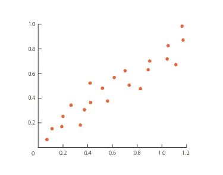
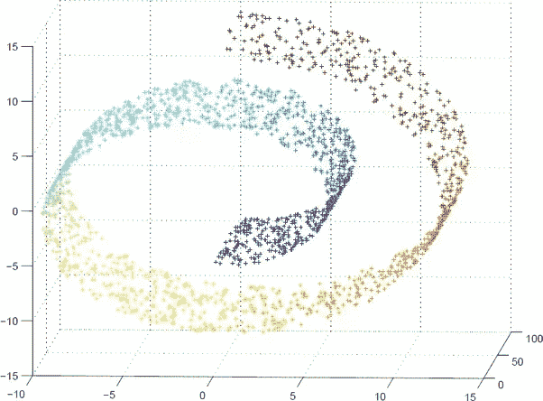

# 建模者反击:对抗对抗性攻击的防御策略(下)

> 原文：<https://towardsdatascience.com/the-modeler-strikes-back-defense-strategies-against-adversarial-attacks-9aae07b93d00?source=collection_archive---------10----------------------->

[这篇文章是一个关于对立例子的系列文章的第二部分，也是最后一部分；第一个用具体的术语框定了对立例子的问题，如果你在没有一个关于这个问题的清晰和缓存的心智模型的情况下进入这个问题，也许应该先读一下

# 对立的例子很少吗？

关于对立例子的最初理论是，它们代表数据分布中异常的低概率点。如果是这种情况，你会期望对对立例子的修改可能会把例子“推”回模型做出可信预测的区域。

然而，Goodfellow 在 2015 年的一篇论文中并没有发现这一点:他们发现，如果他们朝着敌对的方向移动，那么他们可以在给定方向上以更高的失真值获得越来越自信的病理行为，这意味着这与其说是一个敌对的例子，不如说是一个敌对的子空间或区域。

这是令人失望的，因为它限制了防御策略的有效性，防御策略可能试图向所有输入添加随机噪声，以将它们“推”回模型表现合理的区域。

## 题外话:什么是流形？

如果你通读任何最近关于对立例子的论文，你会看到许多关于数据“在流形上”或“不在流形上”的观点的参考和争论。基本上，你可以把它理解为“数据存在的空间区域”。作为一个简化的例子，想一个这样的情节:

理论上，这是一个二维空间。然而，该空间的大部分实际上并不作为数据的宿主，因为它们是特征空间中无效的(或者至少极不可能的)特征组合。在自然图像的例子中，有一些自然的限制:真实世界中的对象往往由共享相同视觉属性的连续像素空间块组成。

更具体地说，单词“流形”倾向于指在输入存在的非常高维度的空间中只有相对小的区域。我们也经常把流形本身称为“高维空间中的低维空间”。这里经常使用的一个例子是高速公路:即使高速公路在 3D 空间中弯曲，在许多情况下，例如告诉你在其上行驶 65 英里的方向，它也可以被表示为一个较低(1D)维的流形，因为，至少对于当前的汽车来说，你实际上不能独立于你的前后方向而改变你在垂直方向上的位置。当你想到不同种类的距离时，这个心智模型也是一个有用的模型。如果你是一个不理解汽车和重力之间关系的外星人，你可能会说地面上的一辆汽车和悬浮在空中 15 英尺的一辆汽车比同一辆汽车更近，并且在公路上还有 40 英尺，因为，从纯欧几里得距离的角度来看，这显然是正确的。然而，如果你对大多数汽车的实际位置进行标准化，并且将问题框定为“相对于所有汽车的分布，哪辆汽车处于更明显不同的位置”，那么悬浮汽车显然符合该标准。

This image gives a good visualization of what manifolds look like in higher dimensions

这个概念主要是作为一个概念占位符，用来讨论一个对立的例子与其余数据之间的不同关系。继续这个比喻:如果我们在寻找一个对立的例子，我们是在寻找高速公路上的另一辆车，还是一辆悬浮在空中 15 英尺的车。在你的脑海中记住这个形象；我们稍后再来讨论。

# 你能通过非常非常好地隐藏你的模型参数来防御吗？

你可能已经注意到——我第一次在这篇文献中注意到的——我们概述的所有对抗性攻击策略都需要详细的模型知识；不仅仅是所使用的架构，而是存在于已训练的生产模型中的实际学习参数。这可能会让你觉得奇怪:在我们的对手对我们的操作设置有全面了解的威胁模式下，我们通常不会期望一个系统(军队、计算机网络)是完全安全的。为什么这是一个合理的威胁模型呢？这种威胁模型会因为简单地采用围绕模型存储的高安全性规范或要求而失效吗？

答案是:这不是真正的威胁模型。或者至少不是直接的。对立例子的一个令人惊讶的(至少对许多人的直觉来说)特性是可转移性。可移植性是指您可以在不同的训练集上训练具有不同结构的模型，只要模型被训练来执行相同的任务，为一个模型生成的对立示例通常会在另一个模型上工作。这是值得注意的，因为这表明这些例子利用了图像空间本身的可概括属性，而不仅仅是一个特定模型的神秘怪癖。此外，当涉及到如何训练他们的“虚拟模型”时，攻击者有多种选择:他们可以拥有自己的带标签的训练集，或者，如果目标模型的决策以任何方式公开可用，他们可以使用目标模型通过选择示例并查询这些示例的模型来为他们自己的训练集生成标签。

通常，攻击者模仿现有模型的最简单方法是训练该模型生成的概率，因为否则你只能得到“哪一个是最可能的类”这种非常低信息的信号。然而，研究人员已经表明，即使你只能获得大大减少的最可能类错误信号，也有可能学习到有用的替代模型(“我们认为这是一只猫”对“猫:0.90，老虎:0.05…”)).这是通过[有选择地查询主模型](https://arxiv.org/abs/1602.02697)来实现的，在主模型中，模型在输出中表现出最高的方差，因为这些区域很可能是存在决策边界的区域。结果，替代模型获得了目标模型的决策边界的更精确的图像。

# 蒸馏能让你的模型不那么过于自信吗？

模型提取是一种技术，它通过训练主模型的“软”概率输出，而不是“硬”(0/1)真实标签，来学习次模型以模仿主模型所学习的内容。在这样做的过程中，次级模型被训练成推动它在输出上产生更均匀的分布，而不是一个非常有把握的值和许多其他变化很小的值。这种对“更软”输出的偏好被证明对[防御](https://www.arxiv-vanity.com/papers/1511.04508/)对抗性攻击的最初变种有一些成功，但被最近的攻击击败，如 Carlini Wagner 攻击。

# 对抗性例子的训练能起到辩护的作用吗？

一个早期建议的对对抗性例子的辩护是直截了当的:也许我们可以通过在我们的训练集中包括对抗性干扰的例子来教我们的模型对对抗性例子是健壮的。这被证明是一种有用的通用正则化形式，但并不是一种真正强大的防御。至少在我所做的阅读中，用对抗训练增强的模型倾向于看到较低的对抗成功率，但主要或仅针对用于进行训练的特定攻击。

到目前为止，我还没有发现任何一种方法显示出对抗性训练对其他攻击提供了有意义的鲁棒性水平；这使得这种方法有点像打地鼠游戏，你需要以攻击者攻击的特定方式进行防御才能有效。

# 对立的例子是可识别的“脱离流形”吗

据我所知，这是目前在这个问题上争论最激烈的领域，也是我认为最有希望的辩护方法。一些论文认为，对立的例子明显远离数据流形——用我们早期的例子来说，悬浮在高速公路上方——这使得生成模型能够检测到输入何时是对立的。其他人反驳说，问题在于决策边界太靠近数据流形，而与该流形的微小差异会将示例推到边界的另一边。

这里值得问的一个问题是:在参数概率模型难以拟合的情况下，我们如何严格定义流形，以及我们如何知道某些东西是否偏离了所述流形？对于复杂的数据集，通常我们能做的最好的事情是建立非线性(通常是深度学习驱动的)生成模型，其工作是学习数据的分布特征。

## 磁铁

在这种情况下，我发现一个特别聪明的防御方法是[磁铁](https://arxiv.org/abs/1705.09064)，它利用自动编码器作为其生成模型的形式。(题外话:不，我没有任何坚实的解释为什么这个名字磁铁，虽然我有一些理论)。

MagNet 背后的基本原理是基于我们对它是自动编码器所做的事情的直观了解:也就是说，学习数据的统计规律，使之有可能从较低信息量的压缩表示中重建输入。从结构上来说，自动编码器的工作原理是获取一个输入，将其映射到一个低维的隐藏单元，然后通过将解码器权重应用于隐藏表示来重建该输出。然后训练该模型，使得输出接近原始输入。

为了更清楚地理解这一点，假设您的输入由两个变量组成，这两个变量是从一个线性协方差结构中生成的，其中添加了一些噪声。如果 autoencoder 框架有足够的数据来进行适当的训练，那么理想情况下，它将能够学会在其自己的权重向量中表示该线性关系的偏差和权重。一旦学习了这些适用于整个数据集的参数，我们就可以用一个值很好地表示这个回归数据，它告诉我们沿着这条低维线要移动多远。您可以考虑这些回归参数的另一种方式是利用统计规律，让您重现已被压缩到更低维度的数据。在这个类比中，偏差和权重向量是由解码器(其捕获关于完整数据分布的信息)学习的权重，并且沿着回归线轴的值表示专门为此示例计算的较小的激活向量。

autoencoder 学习数据的分布级趋势，然后使用这一特性从压缩形式中重建数据，这正是 MagNet 利用的技术。MagNet 的主要直觉是:如果一个例子在数据的主要分布之外，那么如果你通过一个自动编码器运行它，输出将会有一个相对于输入的更高的误差。为了使这个想法具体化，让我们回顾一下这篇文章前面非常简单的例子。

假设我们已经经历了学习形成数据核心的回归线的权重和偏差的过程，并且我们使用它作为我们的“解压”功能。如果我们在(1.0，0.2)处有一个输入，那么它的压缩表示将是 1.0，并且，使用我们从总体数据分布中学习到的参数，自动编码器的输出将可能是 0.65 左右。相对于训练数据，这将代表输入和输出之间的巨大差距。MagNet 的应用前提是，它可以使用这样的自动编码器系统来 1)通过寻找我们提到的缺口来检测对立的示例，以及 2)通过对自动编码器输出(理论上更符合训练数据分布)而不是对立输入的模型进行评分，将对立的示例“推”回流形。

## 像素防御

一个非常类似的模型是 [PixelDefend](https://arxiv.org/abs/1710.10766) ，它不是自动编码器，而是使用一种叫做 PixelCNN 的深度学习生成模型。PixelCNN 模型直接学习输入图像的每个像素的条件概率，以其周围像素的卷积为条件。它被设计成能够直接计算给定输入的可能性，给定模型学习的分布。相比之下，GANs 和 autoencoders 都可以从分布中生成示例，但是没有提供原则性的方法来查询，对于您输入的示例，它在学习模型下的可能性有多大。(术语:在给定特定模型的情况下，给定数据输入的概率是该模型的数据点的可能性)。

这个框架让我们直接问:对于这个(可能是敌对的)样本，如果我们假设它来自与输入数据相同的分布，它有多大的可能性？这个问题给出了一个非常适合进行 p 值测试的公式，并且论文实际上显示了对立例子与干净测试集数据的显著不同的 p 值分布。

但是，对于这两者，有一个隐含的东西，对立的例子*必然*必须是偏离流形的，这与注意到，如果你只是碰巧在某个特定的方向产生对立的例子，它们可能会也可能不会偏离流形是不同的

[对抗性领域](http://Adversarial Spheres is a somewhat controversial paper in that some people thing it’s simplified example — of having the input data distribution be a high dimensional sphere — is too basic to be useful. That criticism aside, the paper makes the general point that, in sufficiently high dimensions, you can actually get a quite low test error by learning a model that implicitly only uses information from a subset of dimensions, so that along other dimensions,)是一篇有些争议的论文，因为有些人认为它的简化例子——输入数据分布是一个高维的领域——太基础了，没有用。撇开这种批评，这篇论文提出了一个总的观点，即在足够高的维度中，通过学习一个隐含地仅使用来自维度子集的信息的模型，你实际上可以获得相当低的测试误差。这意味着，在其他方向上，即使是流形上的例子也会被错误地分类。这一点并不完全是对反面例子的反驳。可能当前攻击所产生的大多数例子确实是不存在的，但是即使你完全解决了这些攻击，在高维空间中，仍然存在一些不可减少的敌对区域。

# 总结与思考

据我所知，在花了 3 周时间阅读文献后，有一些技术在识别给定输入何时具有对抗性方面取得了相当大的成功。也就是说，如果你假设一个完全的白盒攻击(即所有参数都为对手所知)，那么理论上对手也可以使用你的生成模型的知识来创建对抗性的例子。我很想更好地理解的一个领域是，这种数据特征化生成模型的可移植性是否和区分性(或以分类为中心的)模型一样是个问题。如果是这样的话，那么分类模型的相同替代模型弱点也将持续存在于这些生成性对抗感知层中。也就是说，似乎简单地通过使用上面引用的一些可移植性策略来构建替代生成模型要困难得多，例如在现有的基于分类的模型的输出上训练模型。看起来你确实需要一套真正有代表性的训练设备。

话虽如此，我实际上想从流形、扰动、范数和误差率后退一步，问一个更广泛的问题:**为什么这是一个重要的问题？我们真正要防范的威胁是什么？**

<what follows="" is="" more="" loosely="" tied="" musing="" and="" problem-framing="" may="" well="" contain="" obvious="" logical="" gaps="" i="" haven="" found="" yet:="" do="" point="" those="" out="" if="" you="" see="" them=""></what>

这里有几个单独的优先事项需要梳理:

1.  我们希望我们的模型在生产中使用时能够“优雅地失败”:如果模型遇到的输入在某种程度上与训练集中看到的有所不同，那么它不应该对任何类的预测表现出高水平的置信度。这反映了对模型的普遍渴望，即在来自自然世界的大量输入下，模型是“稳定”和“可靠”的。
2.  我们特别关心这样的场景，人类会以同样的方式对给定的输入进行分类，但是模型会改变它的分类。从表面上看，还不清楚为什么这是一个特别值得关注的问题。一种框架简单地说就是接近性:在人类不可分辨的输入和像素空间中接近的输入之间往往有一条线。或者，我们可以把它框定为一个字面上的问题:模型失败实际上只是更关心它们何时会愚弄人类。

但是这个模型本身并不明显是错误的。这个模型对敌对选择的目标有很高的信心，这当然不是最优的。但实际上，当呈现给模型的图像永远不会代表自然界中真正的猫时，模型最好返回“cat ”?这似乎是一个更困难的问题:教导模型，特征空间的很大一部分，通常从未有人居住，对应于类别“猫”。“猫”的对抗性扰动图像不是“真正的”猫，只是人类视觉系统的敏感度与人工视觉的敏感度不同。作为类比，想象我们正在查看由飓风产生的风和天气模式的数据，以及那些没有的数据。如果我们细微地修改一个输入向量，使它看起来不像飓风，而一个人看着它说它看起来像飓风，这并不意味着修改后的向量将代表真正的飓风所产生的结果。在天气数据的背景下，我们不会先验地认为人类是生成从特征到标签的映射的真实来源。

我确实认为，当我们的模型在分布之外运行时，推动它们表现出适当的低置信度是一个非常有效的问题。不过，如果这真的是我们关注的核心，这将表明一个不同的研究方向和重点，也许更多的是以贝叶斯神经网络的方式，建立更自然地表达不确定性。特别是:如果我们的关注是由问题(1)引起的，我们就不应该真的关心我们的分布外的例子在某种欧几里得或视觉意义上是否“接近”；我们只想对这种类型的所有示例强制实施低置信度。

但是，也许以上所有的都是迂腐的暂且不提；这是一个“过于努力”的例子，把问题夸大了。也许，即使这些例子不代表模型的基本错误，从人类的角度来看视觉上接近的对立例子从实践的角度来看是重要的。

在“我们真正关心的是明显的攻击，而不是一种让我们感到不舒服的不稳定”的领域内，我不太清楚为什么有必要有特定的干扰，这是人类的近距离视觉地图。在使用机器学习模型的大多数情况下，大量数据都是在没有人工干预的情况下自动处理的。比方说，如果我要在我的房子顶上安装一个大型噪音过滤器以防止卫星探测，或者过滤我所有的脸书照片以使我无法被识别，没有明显的理由我必须伪装成人类来这样做，除非我真的预计人类会像我一样被抓住。

像数据一样，人类识别输入总量并对其进行评估的能力非常罕见:许多形式的数据都不具备这种能力。因此，在这些情况下，如何得出一个数据足够接近而具有对抗性，并且明显不同的模式并不明显。围绕对立例子的许多对话直接来自于这样一个事实，即在文本和语音等领域，我们正在对人类擅长的任务进行基准测试，在这些领域，人类可以一次轻松地感知大量的数据维度。大多数数据都不具备这种特性。

然而，如果我们真的关注图像，自动驾驶汽车的例子肯定是一个突出的例子:想象有人破坏停车标志，使其不太容易识别，人类司机很难察觉，这似乎是合理的。在这种情况下，人类无法检测到伪造的数据将使他们无法预测模型的不良行为。不过，如果我们真的想象汽车的决策反应时间足够短，那么如果有人可以在停车标志上粘贴一些对人类来说明显不是停车标志的东西，但仍然导致汽车在一瞬间做出悲惨的决定，这对于人类来说太快了，无法直接干预，这也是一个问题。所以，也许这最终会回到“不在分配范围内”的问题上。

看起来很多真正的抱怨并不是这些模型失败了，而是它们失败的方式从人类的角度来看似乎是显而易见的错误。在问题的一个框架中，我们是“典型的思维”,并假设对我们的问题解决模式来说容易的事情对一个陌生的、人工的模式来说应该是容易的。我们被不一定比我们犯更多错误的系统弄得不舒服，但是那些犯不同种类错误的系统。

总而言之:我不确定我们是否真的在坚持我们真正关心的问题——模型在训练分布之外表现出不可预测和过度自信的表现——并想知道对立的例子是否实际上只是那个问题的一个不完美的代理。如果没有真正严谨和清楚地了解我们关心的这个问题的不同方面，以及我们为什么关心它们，我认为我们可能无法提出真正令人满意的解决方案。

# 参考

(即我在写作过程中的某个时候读到的东西，但记不太清楚，无法直接链接引用)

*   [快速梯度步进法](https://arxiv.org/abs/1412.6572)
*   [卡里尼/瓦格纳攻击法](https://www.arxiv-vanity.com/papers/1608.04644/)
*   [向黑盒模型学习](https://arxiv.org/abs/1602.02697)