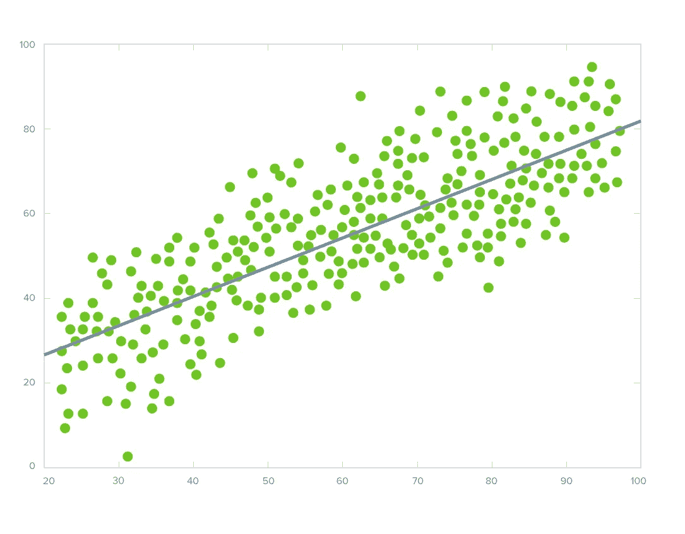
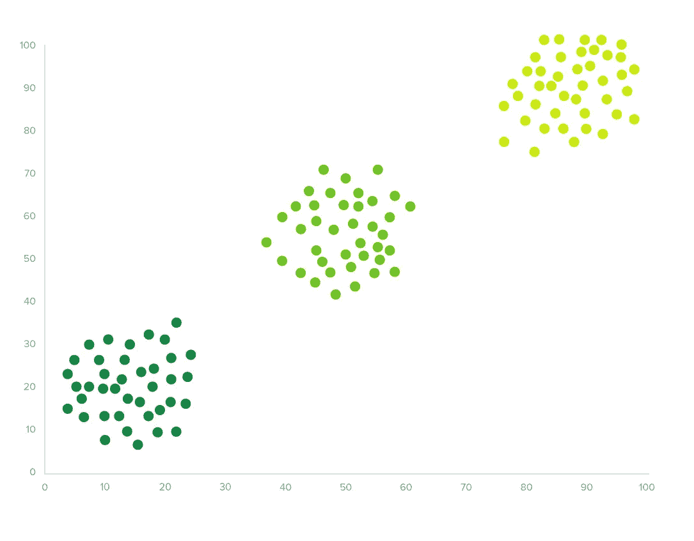

# 现代营销人员机器学习算法指南

> 原文：<https://towardsdatascience.com/the-modern-marketers-guide-to-machine-learning-algorithms-220d0dbffd93?source=collection_archive---------3----------------------->

ost 营销(和销售)团队有着看似简单的目标:识别你的最佳客户，锁定看起来像他们的潜在客户，促进积极的购买体验，并将这些潜在客户带入你的客户社区。这方面的挑战是，公司面临着数据的冲击，不可能经济地将人投入到上述每个目标中。自动化和人工智能可以更快、更好地完成许多商业学习和日常任务。人们永远不可能像机器一样以同样的速度筛选所有的数据，当然也不可能像精心设计的[算法](https://www.khanacademy.org/computing/computer-science/algorithms/intro-to-algorithms/v/what-are-algorithms)那样精确。

如今，每个企业都在从事数据业务，为了做出更好的决策，领导者需要机器学习和分析来在数据中找到可操作的模式。但是首先，清楚地定义他们试图解决的问题是很重要的。例如，如果你的公司正在努力解决客户流失的问题，你可能想利用算法来找出减少客户流失的方法。在这种情况下，你需要了解*什么时候*有人可能会流失，这样你就可以提出报价来降低风险。另一个问题可能是*为什么*有人搅拌，但这是一个完全不同的问题，需要不同的算法来解决。

一旦你将范围缩小到一个初始的营销问题，机器学习算法无疑将非常适合用你的 CRM、营销自动化或数据仓库中的历史前景和客户数据来解决它。开始时，能够与您的数据从业者和/或预测分析供应商说同一种语言会很有帮助。让我们看一看幕后，对营销中使用的关键算法方法有一个基本的了解:

# **分类**

分类建模也被称为类概率估计，是定义你的最佳客户的一个极好的方法。这些算法基本上回答了一个问题，即某样东西是否适合某个群体。例如，“这个细分市场是否有可能对我们的营销提议做出回应？” [Autopilot](https://autopilothq.com/) 是一家领先的营销自动化提供商，它使用带有分类模型的预测分析来衡量其营销渠道绩效，并确定营销资金应该投资或转移到哪里。

为了训练分类模型，您需要将您的历史潜在客户和客户数据分为两组，即已回复和未回复、理想和非理想潜在客户，或者客户和非客户。这个分类器允许算法调整到您的最佳客户的积极属性，以及您的非理想客户的消极属性。最终确定的模型可用于对您现有的数据库以及未来所有新的潜在客户进行“评分”,看他们转变或成为客户的可能性。

# **回归**

另一种可以让你的营销更上一层楼的技术是使用回归建模来预测对你来说重要的信息的具体价值。这种方法与分类有关，它预测*是否*某事会发生，但它不同，因为回归(也称为价值估计)预测*多大程度*某事会发生。这些算法可能会查看群体中的相似个体及其历史使用情况，以便生成一个数字预测，比如说，“产品 X 有多少会被细分市场 a 使用。”

回归建模的一个很好的用例是查看通过交叉销售或追加销售机会，您可以从某个特定客户那里多获得多少收入。领先的在线视频平台 BrightCove 以这种方式使用预测分析来帮助增加其现有客户群的合同价值。此外，采用分层定价的公司可以使用类似的算法来生成每个新潜在客户的估计价值(针对初始销售，或整个生命周期的客户价值)。有了这种认识，他们可能会以不同的方式处理潜在客户，例如将价值较低的潜在客户发送到自助服务选项，以保持效率，这样他们就可以给最有价值的潜在客户白手套待遇。

# **聚类**

最后，聚类模型根据相似性对群体中的个体进行分组。这种算法的一个营销问题可能是，“我们的客户形成自然的细分吗？”这些信息对于初步的领域探索，或者确定应该如何构建客户支持或销售团队特别有用。通过分析您的潜在客户和客户数据库，这些模型将每个人分配到由相似属性定义的“集群”中。

聚类的开放式方法仍然依赖于数据而不是人类的直觉，以便识别你的营销对象的最主要特征。因此，您将获得对您的客户群体(或全部潜在市场)的全新认识，并发现新的客户和潜在客户群。然后，营销人员可以使用关键群组信号来开发有针对性的活动或更个性化的销售策略，并识别出与表现最佳的群组相似的其他群组。

上面的具体例子展示了人工智能正在如何显著地改变公司理解和处理数据的方式。最棒的是，你不需要有数据科学的学位就能理解这些算法的好处，或者利用它们的输出。总之，算法可以通过三种主要方式帮助销售和营销团队:

1.  *找到管道中的“***”。*通过识别可测量的[优化转化的机会](https://www.marketingtechnews.net/news/2017/mar/02/getting-past-ai-hype-how-predictive-analytics-fuels-conversion-optimisation/)，算法可以迅速对收入增长产生影响。*

*2.*执行真正的自动化，减少人类劳动。*每个企业都至少存在一些效率低下的问题(如人工线索调查),这些问题很容易被高效算法和预测分析所取代。*

*3.*丰富传统应用。*算法还可以通过添加一个[智能层](http://www.cmswire.com/digital-experience/getting-started-with-machine-learning-3-things-marketers-need-to-know/)来帮助团队从他们的销售和营销堆栈中获得更多，该智能层可以在数据中找到重要的模式，以推动敏捷性和竞争优势。*

*走向市场团队的一些最佳机会围绕着发现业务中的低效之处，即减少营销浪费、加速线索或客户资格认定、优化渠道和计划等。因为提高销售和营销业绩的潜在回报是巨大的，所以没有理由等待。每个营销人员都应该认识到，一场数据军备竞赛正在进行，那些不根据数据发展业务运营方式的人很快就会落后。*