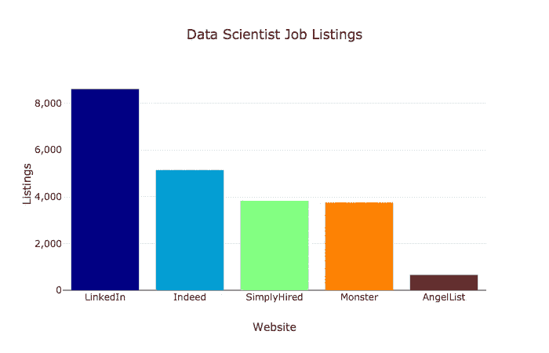
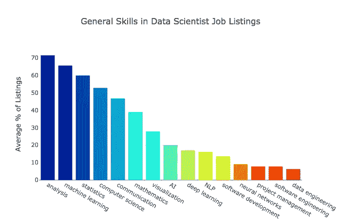
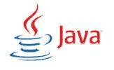
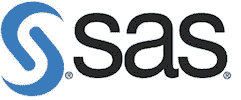
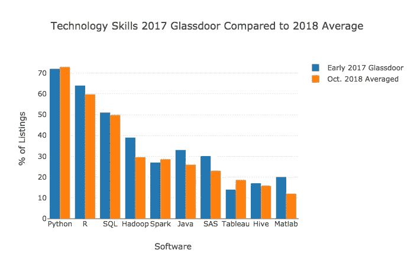

# 数据科学家最需要的技能

> 原文：<https://towardsdatascience.com/the-most-in-demand-skills-for-data-scientists-4a4a8db896db?source=collection_archive---------1----------------------->

## 雇主在寻找什么？

数据科学家应该知道很多东西——机器学习、计算机科学、统计学、数学、数据可视化、通信和深度学习。在这些领域中，有数十种语言、框架和技术可供数据科学家学习。想成为雇主抢手的数据科学家应该如何花费学习预算？

我搜索了工作列表网站，寻找数据科学家最需要的技能。我研究了一般的数据科学技能，并分别研究了特定的语言和工具。

更新:2019 年底，我再次查看了这些技术，并将它们与 2018 年的结果进行了比较，以了解哪些技能在上升，哪些在下降。见分析[这里](/the-most-in-demand-tech-skills-for-data-scientists-d716d10c191d)。

我于 2018 年 10 月 10 日在 [LinkedIn](https://www.linkedin.com) 、[果然](https://www.indeed.com)、[简单雇佣](https://www.simplyhired.com)、[怪兽](https://www.monster.com)、 [AngelList](https://angel.co/jobs) 上搜索招聘信息。这张图表显示了每个网站列出的数据科学家职位的数量。

我通读了许多工作清单和调查，寻找最常见的技能。像*管理*这样的术语没有进行比较，因为它们可以在工作列表中的许多不同的上下文中使用。

使用*“数据科学家”“【关键词】”*对美国进行所有搜索。使用精确匹配搜索减少了结果的数量。然而，这种方法确保了结果与数据科学家的职位相关，并以类似的方式影响所有搜索词。

AngelList 提供了拥有数据科学家名单的公司数量，而不是职位数量。我从两个分析中排除了 AngelList，因为它的搜索算法似乎是作为一种*或*类型的逻辑搜索来运行的，没有能力将其更改为*和*。如果你在寻找*“数据科学家”【tensor flow】*的职位，AngelList 可以很好地工作，但如果你的关键词是“*数据科学家”【react . js】*，它会返回太多非数据科学家职位的公司列表。

Glassdoor 也被排除在我的分析之外。该网站声称在美国有 26263 个*【数据科学家】*职位，但它显示给我的职位不超过 900 个。此外，它的数据科学家职位列表数量不太可能超过任何其他主要平台的三倍。

LinkedIn 上有超过 400 个通用技能的条目和超过 200 个特定技术的条目被纳入最终分析。肯定有一些交叉张贴。结果记录在这个[谷歌表](https://docs.google.com/spreadsheets/d/1df7QTgdAOItQJadLoMHlIZH3AsQ2j2_yoyvHOpsy9qU/edit?usp=sharing)中。

我下载了。csv 文件并将其导入 JupyterLab。然后，我计算了出现的百分比，并在所有的工作列表网站上进行平均。

我还将软件结果与 2017 年上半年数据科学家工作清单的 [Glassdoor 研究](https://www.glassdoor.com/research/data-scientist-personas/)进行了比较。结合来自 [KDNuggets 的使用调查](https://www.kdnuggets.com/2018/05/poll-tools-analytics-data-science-machine-learning-results.html/2)的信息，看起来一些技能变得越来越重要，而另一些则失去了重要性。我们一会儿会谈到这些。

查看我的 Kaggle 内核的交互式图表和附加分析[这里](https://www.kaggle.com/discdiver/the-most-in-demand-skills-for-data-scientists/)。我用 Plotly 来实现可视化。在撰写本文时，将 Plotly 与 JupyterLab 一起使用需要一些争论。我写了一个使用 Plotly 的指南，你可以在这里看到。

# 一般技能

以下是雇主最常寻求的通用数据科学家技能的图表。

结果显示，分析和机器学习是数据科学家工作的核心。从数据中收集见解是数据科学的主要功能。机器学习就是创造系统来预测性能，它非常受欢迎。

数据科学需要统计学和计算机科学技能，这并不奇怪。统计学，计算机科学，数学也是大学专业，大概对他们的频率有帮助。

有趣的是，近一半的工作清单中都提到了沟通。数据科学家需要能够交流见解并与其他人合作。

AI 和深度学习不像其他一些术语那样频繁出现。然而，它们是机器学习的子集。深度学习正被用于越来越多的机器学习任务，而其他算法以前曾被用于这些任务。比如现在大多数自然语言处理问题最好的机器学习算法就是深度学习算法。我预计未来将更明确地寻求深度学习技能，机器学习将成为深度学习的同义词。

雇主在寻找哪些针对数据科学家的特定软件工具？让我们接下来处理那个问题。

# 技术技能

以下是雇主正在寻找有经验的数据科学家的前 20 种特定语言、库和技术工具。

让我们简单看看最常见的技术技能。

Python 是最受欢迎的语言。这种开源语言的流行已经被广泛观察到。它对初学者友好，有许多支持资源。绝大多数新的数据科学工具都与之兼容。Python 是数据科学家的主要语言。

[R](https://www.r-project.org/about.html) 紧随 Python 之后。它曾经是数据科学的主要语言。我很惊讶地看到它仍然如此受欢迎。这种开源语言的根源是统计学，它仍然很受统计学家的欢迎。

Python 或 R 是几乎每个数据科学家职位的必备技能。

[SQL](https://en.wikipedia.org/wiki/SQL) 的需求量也很大。SQL 代表结构化查询语言，是与关系数据库交互的主要方式。在数据科学领域，SQL 有时会被忽视，但如果你打算进入就业市场，这是一项值得掌握的技能。2019 年 12 月更新:我正在编写一本 SQL 书籍。加入我的[数据牛逼](https://dataawesome.com)邮件列表，确保你不会错过。👍

接下来是 [Hadoop](https://hadoop.apache.org/) 和 [Spark](https://spark.apache.org/) ，它们都是来自 Apache 的大数据开源工具。

> Apache Hadoop 是一个开源软件平台，用于在由商用硬件构建的计算机集群上对超大型数据集进行分布式存储和分布式处理。— [来源](https://hortonworks.com/apache/hadoop/)。
> 
> Apache Spark 是一个快速的内存数据处理引擎，具有优雅和丰富的开发 API，允许数据工作者高效地执行需要快速迭代访问数据集的流、机器学习或 SQL 工作负载。— S [源](https://hortonworks.com/apache/spark/)。

与许多其他工具相比，这些工具在媒体和教程中很少被提及。我认为拥有这些技能的求职者比 Python、R 和 SQL 要少得多。如果您已经或能够获得 Hadoop 和 Spark 的经验，它应该会让您在竞争中占据优势。

然后是 [Java](https://www.java.com/en/) 和 [SAS](https://www.sas.com/en_us/home.html) 。看到这些语言如此之高，我很惊讶。两家公司背后都有大公司，至少有一些免费的产品。在数据科学社区中，Java 和 SAS 通常很少受到关注。

Tableau 是下一个热门。这个分析平台和可视化工具功能强大，易于使用，并且越来越受欢迎。它有一个免费的公开版本，但如果你想让你的数据保密，就要花钱。

如果你不熟悉 Tableau，绝对值得在 Udemy 上上一堂 [Tableau 10 A-Z](https://www.udemy.com/tableau10/) 这样的速成课。我没有从这个建议中获得佣金——我只是参加了这个课程，发现它很有价值。

下面的图表显示了一个更大的最受欢迎的语言、框架和其他数据科学软件工具的列表。

## 历史比较

GlassDoor 在其网站上对 2017 年 1 月至 2017 年 7 月数据科学家最常见的 10 种软件技能进行了[分析](https://www.glassdoor.com/research/data-scientist-personas/)。以下是 2018 年 10 月，这些术语在他们网站上出现的频率与 LinkedIn、Indeed、SimplyHired 和 Monster 的平均频率的比较。

结果相当相似。我的分析和 GlassDoor 都发现 Python、R 和 SQL 是最受欢迎的。我们还发现了同样的九大技术技能，尽管顺序略有不同。

结果表明，与 2017 年上半年相比，R、Hadoop、Java、SAS 和 MatLab 现在的需求较少，Tableau 的需求较多。鉴于来自 [KDnuggets 开发者调查](https://www.kdnuggets.com/2018/05/poll-tools-analytics-data-science-machine-learning-results.html/2)等来源的补充结果，这正是我所期望的。其中，R、Hadoop、Java 和 SAS 都显示出明显的多年下降趋势，Tableau 显示出明显的上升趋势。

# 推荐

基于这些分析的结果，以下是对当前和有志成为数据科学家的一些一般性建议，这些科学家关心的是如何让自己变得更有市场。

*   证明你可以做数据分析，并专注于成为真正熟练的机器学习。
*   投资于你的沟通技巧。我推荐阅读《T2》这本书来帮助你的想法产生更大的影响。还可以使用[海明威编辑器](http://www.hemingwayapp.com/)应用程序来提高你写作的清晰度。
*   掌握一个深度学习框架。精通深度学习框架是精通机器学习越来越大的一部分。关于深度学习框架在使用、兴趣和受欢迎程度方面的比较，请参见我的文章[这里](/deep-learning-framework-power-scores-2018-23607ddf297a)。
*   如果你在学习 Python 和 R 之间做选择，选择 Python。如果你对 Python 不感冒，可以考虑学习 r。如果你也懂 r，你肯定会更有市场。

当雇主在寻找具有 python 技能的数据科学家时，他们也可能希望候选人知道常见的 Python 数据科学库:NumPy、pandas、scikit-learn 和 Matplotlib。如果您想学习这套工具，我推荐以下资源:

*   2019 年 12 月更新:我最近发布了我的[令人难忘的 Python](https://memorablepython.com) 书，以帮助你以对大脑友好的方式学习 Python！🐍如果这听起来符合你的口味，那就去看看。😀

*   [DataCamp](https://www.datacamp.com/) 和 [DataQuest](https://www.dataquest.io/) —它们都是价格合理的在线 SaaS 数据科学教育产品，在这里你可以边编码边学习。他们都教授一些技术工具。
*   [数据学校](https://www.dataschool.io/start/)有各种资源，包括一套很好的解释数据科学概念的 [YouTube 视频](https://www.youtube.com/dataschool)。
*   [*用于数据分析的 Python*](https://www.amazon.com/Python-Data-Analysis-Wrangling-IPython/dp/1491957662)*作者 McKinney。这本书由 pandas library 的第一作者撰写，重点关注 pandas，并讨论了数据科学的基本 Python、NumPy 和 scikit-learn 功能。*
*   *[*用 Python 学习机器简介*](https://www.amazon.com/Introduction-Machine-Learning-Python-Scientists-ebook/dp/B01M0LNE8C) 穆勒&圭多。Müller 是 scikit-learn 的主要维护者。是一本用 scikit-learn 学习机器学习的极好的书。*

*如果你想进入深度学习，我建议先从 [Keras](https://keras.io/) 或 [FastAI](https://github.com/fastai/fastai) 开始，然后再进入 [TensorFlow](https://www.tensorflow.org/) 或 [PyTorch](https://pytorch.org/) 。Chollet 的 [*用 Python 进行深度学习*](https://www.amazon.com/Deep-Learning-Python-Francois-Chollet/dp/1617294438) 是学习 Keras 的绝佳资源。*

*除了这些建议，我建议你学习你感兴趣的东西，尽管在决定如何分配学习时间时，显然有许多考虑因素。*

**

*如果你正在通过在线门户网站寻找一份数据科学家的工作，我建议你从 LinkedIn 开始——它总是有最多的结果。*

*如果你在找工作或在工作网站上发布职位，关键词很重要。“*数据科学*”在每个网站上返回的结果数量是“*数据科学家*”的近 3 倍。但是如果你严格地寻找一份数据科学家的工作，你可能最好搜索“*数据科学家*”。*

*不管你在哪里寻找，我建议你制作一个在线作品集，展示你在尽可能多的需求技能领域的熟练程度。我在这里做了一个投资组合网站[的小指南。](/build-a-portfolio-website-in-a-flash-9d5ec30a73a7)*

*作为这个项目的一部分，我收集了其他数据，我可能会变成文章。[跟着我](https://medium.com/@jeffhale)确保你不会错过。👍*

*如果你想看到交互式 Plotly 图表和它们背后的代码，请查看我的 [Kaggle 内核](https://www.kaggle.com/discdiver/the-most-in-demand-skills-for-data-scientists/)。*

*我希望这篇文章能让你对那些雇佣数据科学家的组织有所了解。如果你学到了什么，请在你最喜欢的社交媒体上分享，这样其他人也可以找到它😃。*

*我写关于数据科学、云计算和其他技术的东西。如果你对这些感兴趣，请关注我，在这里阅读更多。😀*

**

*快乐学习！📖*