# 神经网络的最完整的图表，解释

> 原文：<https://towardsdatascience.com/the-mostly-complete-chart-of-neural-networks-explained-3fb6f2367464?source=collection_archive---------0----------------------->

神经网络类型的动物园呈指数增长。人们需要一张地图来在许多新兴的架构和方法之间导航。

幸运的是，[阿西莫夫研究所](https://www.asimovinstitute.org/)的 [Fjodor van Veen](https://www.asimovinstitute.org/author/fjodorvanveen/) 编辑了一份关于神经网络拓扑的精彩备忘单。如果你不是机器学习的新手，你应该以前见过它:

在这个故事中，我将介绍每一个提到的拓扑结构，并尝试解释它是如何工作的，以及在哪里使用。准备好了吗？我们走吧！

**感知器**。我们所知道的最简单和最古老的神经元模型。获取一些输入，对它们求和，应用激活函数，并将它们传递到输出层。这里没有魔法。

**前馈神经网络**也相当古老——这种方法起源于 50 年代。它的工作方式在我之前的一篇文章中有所描述——“[老派矩阵 NN](https://medium.com/towards-data-science/diy-ai-an-old-school-matrix-nn-401a00021a55) ”，但一般来说它遵循以下规则:

1.  所有节点都完全连接
2.  激活从输入层流向输出层，没有环回
3.  在输入和输出之间有一层(隐藏层)

在大多数情况下，使用[反向传播](https://en.wikipedia.org/wiki/Backpropagation)方法训练这种类型的网络。

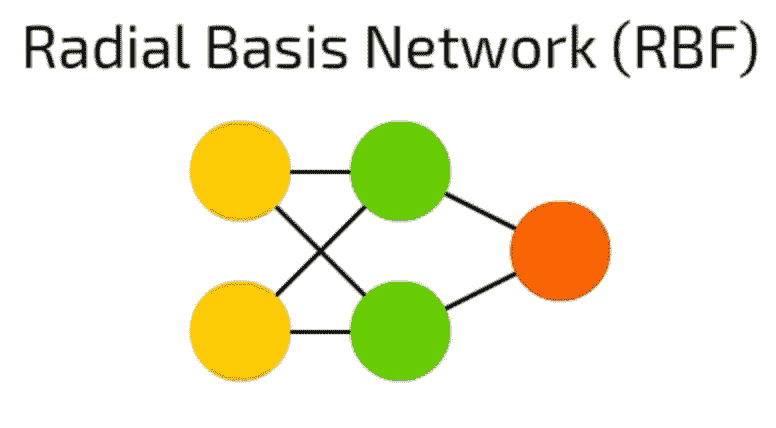

**RBF 神经网络**实际上是 FF(前馈)神经网络，使用[径向基函数](https://en.wikipedia.org/wiki/Radial_basis_function)代替[逻辑函数](https://en.wikipedia.org/wiki/Logistic_function)作为激活函数。有什么区别？

逻辑函数将某个任意值映射到 0…1 范围，回答“是或否”的问题。它适用于分类和决策系统，但不适用于连续值。

相反，径向基函数回答了“我们离目标有多远”这个问题？这非常适合函数逼近和机器控制(例如，作为 [PID](https://en.wikipedia.org/wiki/PID_controller) 控制器的替代)。

简而言之，这些只是激活功能和器具不同的 FF 网络。

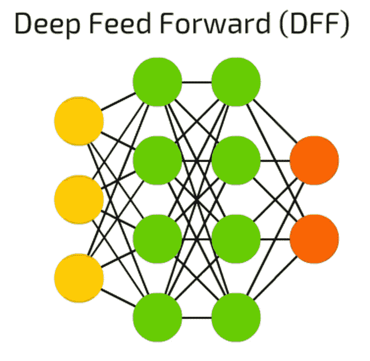

**DFF 神经网络**在 90 年代初打开了[深度学习](https://en.wikipedia.org/wiki/Deep_learning)的潘多拉盒子。这些只是 FF NNs，但是有不止一个隐藏层。那么，是什么让它们如此不同呢？

如果你读过我之前关于反向传播的文章，你可能已经注意到，当训练一个传统的 FF 时，我们只把少量的错误传递给前一层。因为堆叠更多的层导致训练时间的指数增长，使得 dff 非常不切实际。只是在 2000 年代早期，我们开发了一系列方法来有效地训练 DFFs 现在，它们形成了现代机器学习系统的核心，涵盖了与 FFs 相同的目的，但结果要好得多。

**递归神经网络**引入不同类型的细胞——递归细胞。这种类型的第一个网络被称为[乔丹网络](https://en.wikipedia.org/wiki/Recurrent_neural_network#Jordan_network)，当每个隐藏单元以固定的延迟——一次或多次迭代——接收它自己的输出。除此之外，它就像普通的 FNN。

当然，有许多变化——像将状态传递给输入节点、可变延迟等，但是主要思想是相同的。这种类型的神经网络主要在*上下文*很重要的时候使用——当来自过去迭代或样本的决策可以影响当前的决策时。这种上下文最常见的例子是文本——一个单词只能在前面的单词或句子的上下文中进行分析。

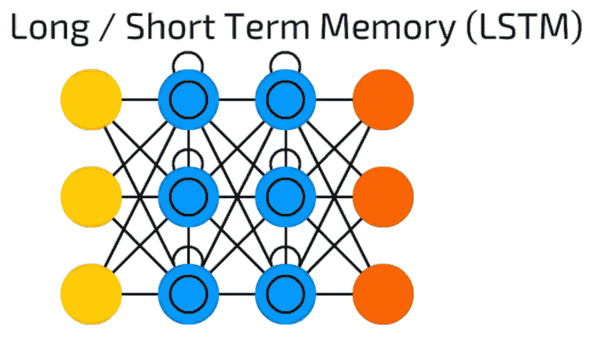

这种类型引入了一个*存储单元，*一个特殊的单元，可以在数据有时间间隙(或滞后)时处理数据。rnn 可以通过“记住”前十个单词来处理文本，而 LSTM 网络可以通过“记住”许多帧前发生的事情来处理视频帧。LSTM 网络也广泛用于书写和语音识别。

*记忆细胞*实际上由几个称为门的元素组成，这些元素是循环出现的，控制着信息如何被记忆和遗忘。在维基百科的插图中可以很好地看到该结构(注意，块之间没有激活函数):

 [## 长短期记忆-维基百科

### 长短期记忆(LSTM)是一种支持机器学习的人工神经网络架构。这是…

en.wikipedia.org](https://en.wikipedia.org/wiki/Long_short-term_memory#/media/File:Peephole_Long_Short-Term_Memory.svg) 

图上的(x)是*门*，它们有自己的权重，有时还有激活功能。在每个样本上，它们决定是否向前传递数据、擦除内存等等——你可以在这里阅读更详细的解释[。输入门决定有多少来自上一个样本的信息将被保存在内存中；输出门控制传递到下一层的数据量，遗忘门控制存储的存储器的撕裂率。](http://colah.github.io/posts/2015-08-Understanding-LSTMs/)

然而，这是 LSTM 单元的一个非常简单的实现，还存在许多其他的架构。

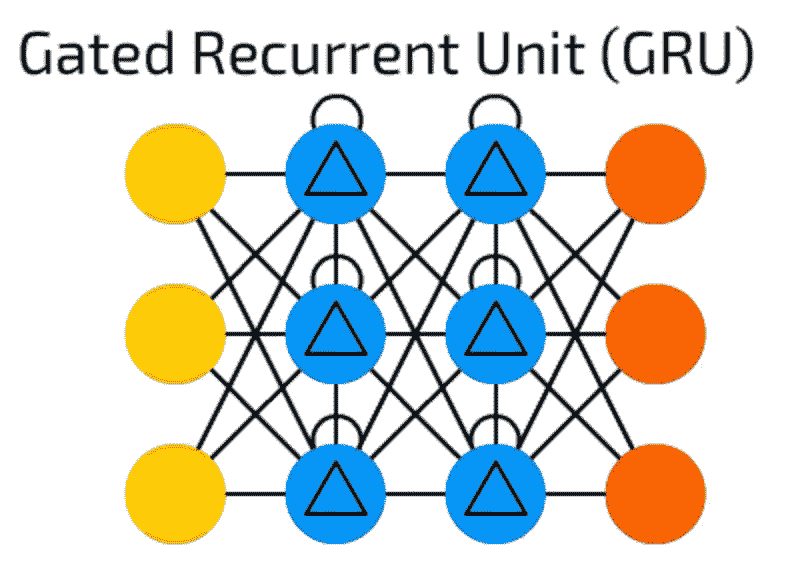

gru 是具有不同门控的 LSTMs。句号。

听起来很简单，但是缺少输出门使得对一个具体的输入多次重复相同的输出更容易，并且目前在声音(音乐)和语音合成中使用得最多。

然而，实际的组成略有不同:所有的 LSTM 门被组合成所谓的*更新门*，而*重置门*与输入紧密相连。

它们比 LSTMs 消耗更少的资源，并且几乎同样有效。

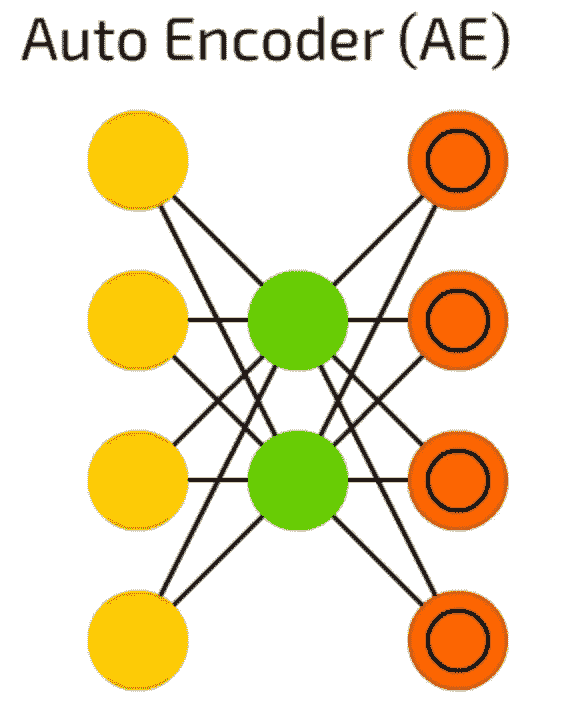

自动编码器用于分类、聚类和特征压缩。

当你训练 FF 神经网络进行分类时，你通常必须输入 Y 个类别中的 X 个样本，并期望 Y 个输出单元中的一个被激活。这就是所谓的“监督学习”。

另一方面，AEs 可以在没有监督的情况下进行训练。它们的结构是，当隐藏单元的数量小于输入单元的数量(输出单元的数量等于输入单元的数量)时，当 AE 以输出尽可能接近输入的方式训练时，迫使 AEs 归纳数据并搜索共同模式。

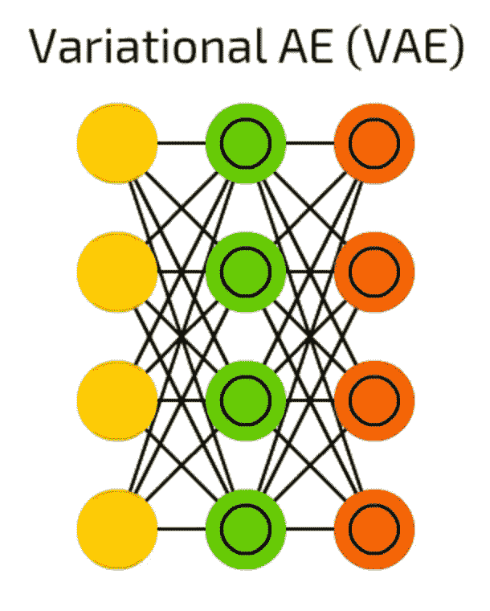

与 AE 相比，VAEs 压缩概率而不是特征。

尽管做了简单改变，当 AEs 回答“我们如何概括数据？”，VAEs 回答问题“两个事件之间的联系有多强？我们应该在两个事件之间分配误差，还是它们是完全独立的？”。

更深入的解释(有一些代码)可以在[这里](https://github.com/kvfrans/variational-autoencoder)找到。

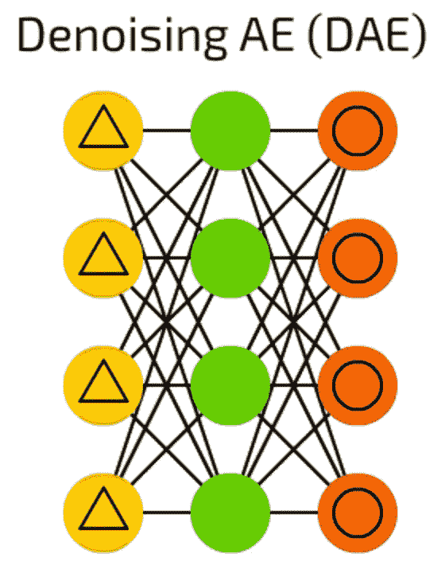

虽然 AEs 很酷，但它们有时不是找到最健壮的特性，而是适应输入数据(这实际上是过拟合的一个例子)。

DAE 会在输入单元上增加一点噪声—通过随机位改变数据，随机切换输入中的位，等等。通过这样做，可以强制 DAE 从有点噪声的输入中重建输出，使其更通用，并强制选择更多的共同特征。

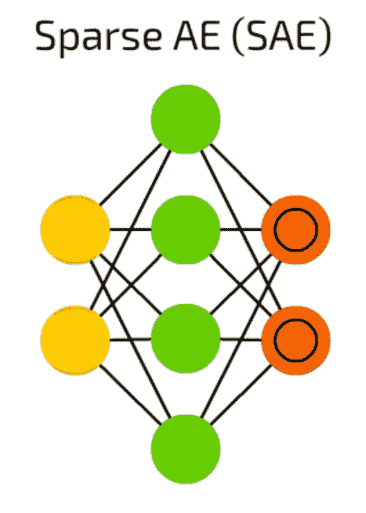

SAE 是另一种自动编码器类型，在某些情况下可以揭示数据中隐藏的分组模式。结构与 AE 中的相同，但隐藏单元数大于输入/输出层单元数。

马尔可夫链是一个非常古老的图形概念，其中每条边都有一个概率。在过去，它们被用来构造文本，比如“在单词 *hello* 之后，我们可能有单词 *dear* 有 0.0053%的概率，单词 *you* 有 0.03551%的概率”(顺便说一下，你的 T9 使用 MCs 来预测你的输入)。

这种 MCs 不是传统意义上的神经网络，MCs 可以用于基于概率的分类(如[贝叶斯过滤器](https://en.wikipedia.org/wiki/Bayes%27_theorem))，用于聚类(某种类型)，以及作为有限状态机。

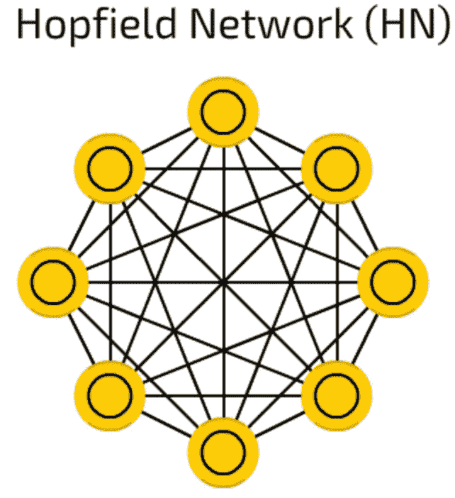

Hopfield 网络是在有限的样本集上训练的，因此它们用相同的样本响应已知的样本。

每个单元在训练前作为输入单元，训练时作为隐藏单元，使用时作为输出单元。

当 HNs 试图重构训练样本时，它们可以用于去噪和恢复输入。给定一半的学习图片或序列，他们将返回完整的样本。

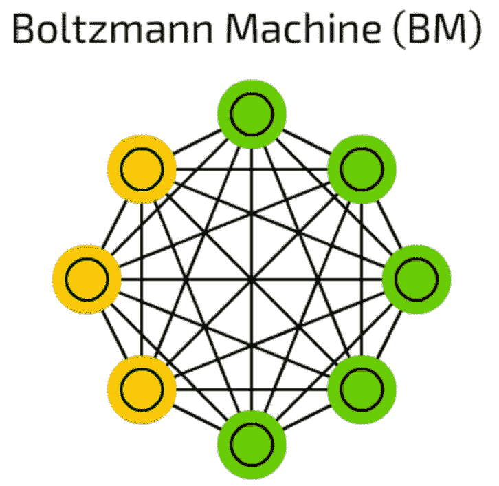

玻尔兹曼机器非常类似于 HNs，其中一些细胞被标记为输入并保持隐藏。一旦每个隐藏单元更新它们的状态，输入单元就变成输出(在训练期间，BMs / HNs 逐个更新单元，而不是并行更新)。

这是使用[模拟退火](https://en.wikipedia.org/wiki/Simulated_annealing)方法成功获得的第一个网络拓扑。

多个堆叠的玻尔兹曼机器可以形成一个所谓的[深度信念网络](https://en.wikipedia.org/wiki/Deep_belief_network)(见下文)，用于特征检测和提取。

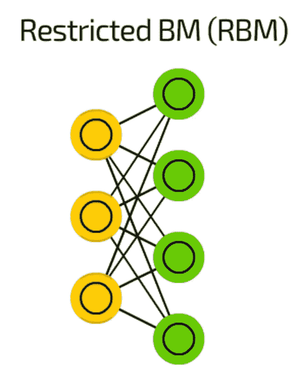

RBM 在结构上类似于 BMs，但是由于受到限制，允许像 FFs 一样使用反向传播来训练(唯一的区别是在反向传播传递之前，数据被传递回输入层一次)。

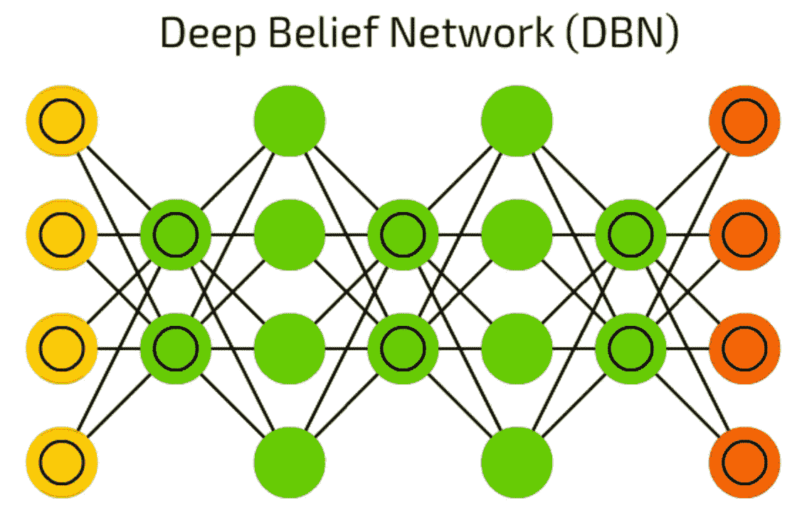

上面提到的 dbn，其实就是一堆玻尔兹曼机(被 VAEs 包围)。它们可以链接在一起(当一个神经网络训练另一个神经网络时),并且可以用于通过已经学习的模式生成数据。

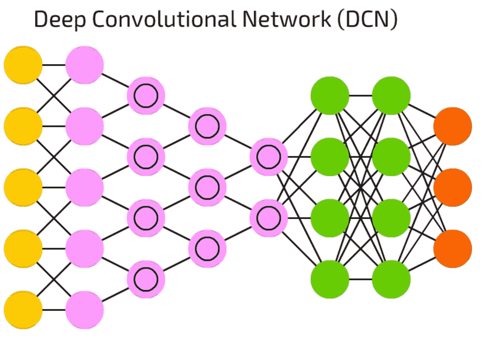

DCN 现在是人工神经网络的明星。它们具有卷积单元(或池层)和内核，每一个都有不同的用途。

卷积内核实际上处理输入数据，池层简化了输入数据(主要使用非线性函数，如 max)，减少了不必要的功能。

通常用于图像识别，它们对图像的小子集(大约 20x20 像素)进行操作。输入窗口沿着图像逐像素滑动。数据被传递到卷积层，卷积层形成一个漏斗(压缩检测到的特征)。就图像识别而言，第一层检测特定对象的渐变、第二条线、第三个形状等等。dff 通常附加到最后的卷积层，用于进一步的数据处理。

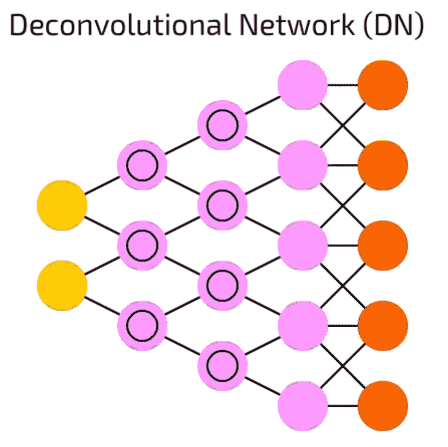

DNs 是 DCN 的反序。DN 取猫图像，产生类似{狗:0，蜥蜴:0，马:0，猫:1 }的矢量。DCN 可以用这个向量来画一只猫。我试图找到一个可靠的演示，但最好的演示是在 youtube 上。

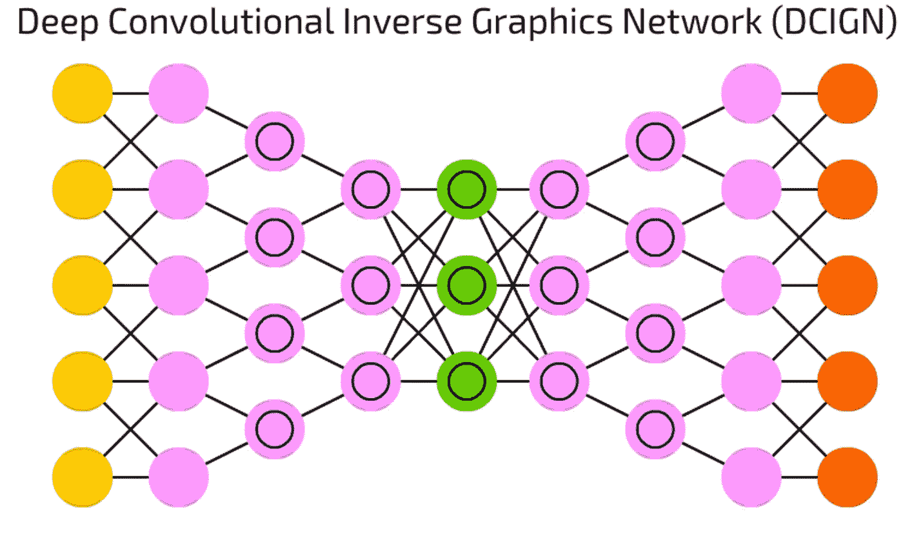

设计(哦，我的上帝，这是长的)看起来像 DCN 和 DN 粘在一起，但它是不正确的。

实际上，它是一个自动编码器。DCN 和 DN 不是独立的网络，而是网络输入和输出的隔离物。这些网络主要用于图像处理，可以处理之前没有训练过的图像。由于它们的抽象层次，这些网络可以从图像中删除某些对象，重新绘制图像，或者用斑马代替马，就像著名的 [CycleGAN](https://github.com/junyanz/CycleGAN) 所做的那样。

GAN 代表了一个由发生器和鉴别器组成的双网络大家族。它们不断地试图欺骗对方——生成器试图生成一些数据，而接收样本数据的鉴别器试图区分生成的数据和样本。如果你能够保持这两个网络之间的训练平衡，这种类型的神经网络可以不断进化，从而生成现实生活中的图像。

[pix2pix](https://affinelayer.com/pix2pix/) 就是这种方法的一个很好的例子。

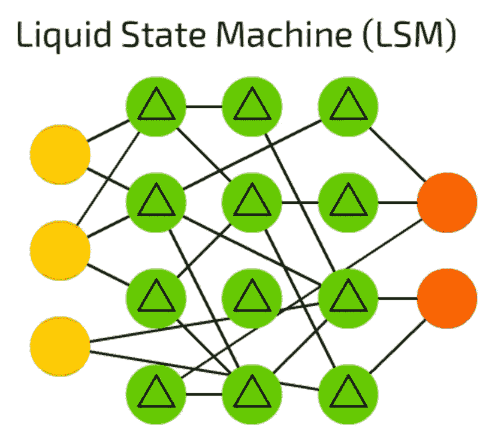

LSM 是稀疏(非完全连接)神经网络，其中激活函数由阈值水平代替。单元累加连续样本的值，仅当达到阈值时发出输出，将内部计数器再次设置为零。

这种想法来自人脑，这些网络广泛应用于计算机视觉和语音识别系统，但没有重大突破。

ELM 试图通过创建具有随机连接的稀疏隐藏层来降低 FF 网络背后的复杂性。它们需要更少的计算能力，但实际效率严重依赖于任务和数据。

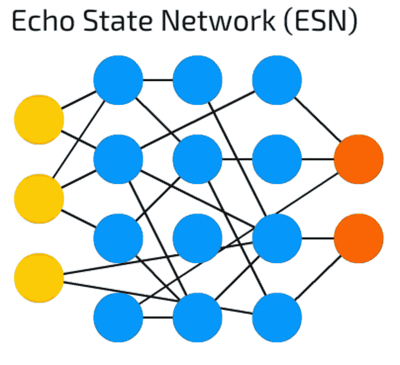

ESN 是具有特殊训练方法的循环网络的子类型。数据被传递给输入，如果被多次迭代监视，则传递给输出(允许循环特性生效)。此后，仅更新隐藏单元格之间的权重。

就我个人而言，除了多个理论基准之外，我不知道这种类型的真正应用。随便加你的)。

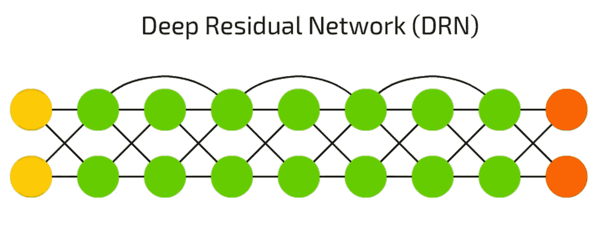

DRN 是一个深层网络，其中部分输入数据被传递到下一层。这个特性允许它们非常深(高达 300 层)，但实际上它们是一种没有显式延迟的 RNN。

KN 引入了“到单元的距离”功能。这种类型的网络主要用于分类，试图调整它们的细胞以对特定输入做出最大反应。当某个单元被更新时，其最近的邻居也被更新。

像支持向量机一样，这些网络并不总是被认为是“真正的”神经网络。

SVM 用于二元分类任务。不管网络可以处理多少维度或输入，答案总是“是”或“不是”。

支持向量机并不总是被认为是一个神经网络。

哈，最后一个！

神经网络有点像黑匣子——我们可以训练它们，得到结果，增强它们，但实际的决策路径对我们来说大多是隐藏的。

NTM 试图解决这个问题——它是一个提取了记忆细胞的 FF 吗？一些作者也说这是对 LSTM 的抽象。

存储器通过其内容寻址，并且网络可以根据当前状态从存储器中读取和向存储器中写入，这代表了一个不完全的神经网络。

希望你喜欢这个概述。如果你觉得我说错了，可以随意评论，[订阅](https://medium.com/@andrew.tchircoff)以后关于机器学习的文章(还有，如果对题目感兴趣可以查看我的 [DIY AI](https://medium.com/@andrew.tchircoff/diy-ai-the-series-597e82131cb2) 系列)。

回头见！