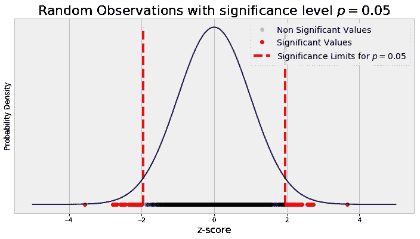
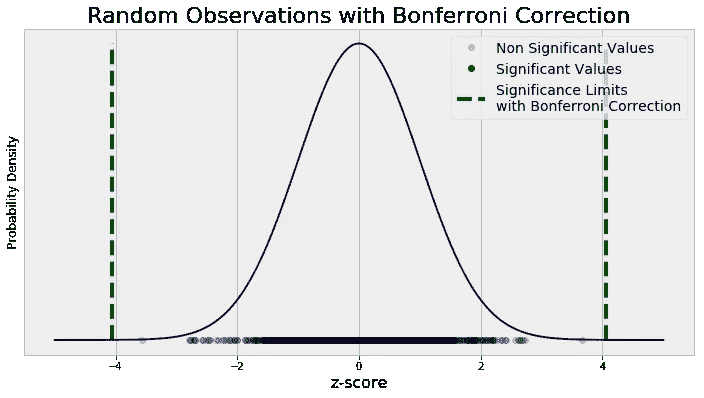

# 噪音的误导效应:多重比较问题

> 原文：<https://towardsdatascience.com/the-multiple-comparisons-problem-e5573e8b9578?source=collection_archive---------2----------------------->

**如何避免被随机性愚弄**

一家大型制药公司的首席执行官遇到了一个问题。他的化学家们开发的增强意志力的神奇新药每次试验都失败了。首席执行官无法相信这些结果，但研究人员告诉他，在 0.05 的显著性水平(p 值)上，没有证据表明这对意志力有影响。确信药物在某些方面肯定是有益的，首席执行官有了一个绝妙的主意:不是只测试药物的一种效果，而是同时测试 1000 种不同的效果，所有的效果都是相同的 p 值。即使它不会增加意志力，它也必须做一些事情，比如减少焦虑或增强记忆。持怀疑态度的研究人员完全按照首席执行官所说的重新进行了试验，监测了服用该药物的受试者的 1000 项不同的健康指标。研究人员带回了令人震惊的消息:该药物对 50 个测量值有显著影响！奇迹般的权利？实际上，如果他们在这个实验分析中发现*没有*显著影响，那会更令人惊讶。

首席执行官的错误是[多重比较问题](http://www.statisticshowto.com/multiple-testing-problem/)的一个例子。这个问题归结于现实世界中数据的噪音。虽然噪声影响一个结果的机会可能很小，但是我们进行的测量越多，随机波动被误归类为有意义结果的可能性就越大。虽然这影响了进行客观研究的研究人员，但它也可能被用于邪恶的目的。

首席执行官有一种药物，他想卖，但它没有达到它的设计目的。他没有承认失败，而是指示他的研究人员继续观察，直到他们发现药物改善的一些重要迹象。即使这种药物对任何健康指标完全没有效果，研究人员最终也会发现，由于数据中的随机噪声，这种药物确实改善了一些指标。由于这个原因，多重比较问题也被称为[看别处效应](https://en.wikipedia.org/wiki/Look-elsewhere_effect):如果一个研究者没有找到她想要的结果，她可以继续寻找，直到她找到一些有益的效应！

If at first you don’t succeed, just keep searching!

幸运的是，大多数统计学家和研究人员是诚实的，并且使用方法来解释多重比较问题。最常见的技术称为 [Bonferroni 校正](http://www.statisticssolutions.com/bonferroni-correction/)，但在解释之前，我们需要先谈谈 p 值。

[p 值](https://en.wikipedia.org/wiki/P-value)表示在零假设为真的情况下，检验统计量至少与测量值一样极端的概率。在药物的例子中，对于最初的试验，无效假设是药物没有增加个体的平均动机。另一个假设，或者研究者的信念，是药物增加了平均动机。p 值为 0.05，这意味着在一个药物*不会*增加平均动机的世界中，研究人员将测量药物*会因随机噪声而增加动机 5%的时间。*

在进行研究之前，研究人员选择一个 p 值(称为 alpha 或显著性水平)来建立[统计显著性](/statistical-significance-hypothesis-testing-the-normal-curve-and-p-values-93274fa32687)。如果测得的 p 值低于阈值，则拒绝零假设，结果具有统计学意义。较低的测量 p 值被认为更好，因为它表明结果不太可能偶然出现。

一旦我们知道 p 值代表什么，我们就能发现 CEO 的错误。他命令以同样的 p 值 0.05 再次进行试验，但他不是只测试一种效果，而是要测试 1000 种效果。如果我们执行 1000 次假设检验，p 值为 0.05，由于随机噪声(1000 次的 5%)，我们预计平均会找到 50 个显著结果。一些结果实际上可能是有意义的，但是宣布它们都是有意义的，并根据这项研究来销售药物是不道德的！

下图说明了这个问题。我从一个标准的正态分布中产生了 1000 个随机数，并将它们绘制在相应的概率密度函数上。我们可以忽略此处的 y 轴，而专注于 x 轴，即 z 得分。如果我们执行假设检验，并假设我们的检验统计(测量值)的平均值来自正态分布，那么我们根据 z 得分计算我们的[检验统计。使用我们为假设检验选择的 p 值(α),我们可以找到统计显著性所需的 z 值。p 值为 0.05 的这些阈值显示为红色垂直线，线外的观察值被认为具有统计显著性。黑点是不重要的随机生成的观察值，而红点是“重要的”随机生成的数据点。](http://www.statisticshowto.com/probability-and-statistics/z-score/)

Random Observations with a p value of 0.05

我们可以看到，通过随机观察和使用未校正的 p 值，我们将这些结果中的一些归类为显著的！如果我们有一种药物要卖，这可能是一个好消息，但是作为负责任的数据科学家，我们需要考虑进行多次测试，这样我们就不会被噪音误导。

多重比较问题的一个简单解决方法是 **Bonferroni 校正**。为了补偿许多假设检验，我们取单个比较的 p 值，并除以检验次数。在药品公司试验的情况下，原始的 p 值 0.05 应该除以 1000，得到新的显著性阈值 0.00005。这意味着结果必须更加极端才能被认为是有意义的，从而降低了随机噪声被描述为有意义的概率。

我们可以将 Bonferroni 校正应用于上图，看看它如何影响随机点的分类。该图具有相同的结构，但现在显著性阈值说明了多重测试。

Random Observations with Bonferroni Correction to Significance Level

没有随机数据点现在被认为是重要的！有[的批评认为 Bonferroni 修正过于保守](https://www.ncbi.nlm.nih.gov/pmc/articles/PMC1112991/)，它可能会导致我们拒绝一些实际上有意义的结果。然而，该方法背后的重要概念是，当我们进行许多比较时，显著性值需要调整。

多重比较的问题不仅仅局限于假设检验。如果我们比较足够多的数据集，我们可以发现相关性只不过是随机噪声。网站[的虚假相关性](http://www.tylervigen.com/spurious-correlations)幽默地说明了这一点，该网站列举了一些完全不相关的趋势，而这些趋势恰好密切相关。

Seems Legit ([Source](http://www.tylervigen.com/spurious-correlations))

当我们检查研究时，要记住多重比较问题，这很重要，但它也可以用于我们的日常生活。如果我们足够努力，我们可以在任何地方找到相关性，但这并不意味着我们应该因为它们而改变生活方式。也许我们每天称体重，发现体重与发短信的数量呈负相关。寄希望于减肥而发更多的短信是愚蠢的。人类擅长识别模式，当我们足够努力地寻找并进行足够多的比较时，我们可以说服自己随机噪音中有意义。一旦我们意识到这种趋势，我们就准备分析可疑的主张，做出理性的选择。

一如既往，我欢迎反馈和建设性的批评。可以在 Twitter [@koehrsen_will](https://twitter.com/koehrsen_will) 上找到我。