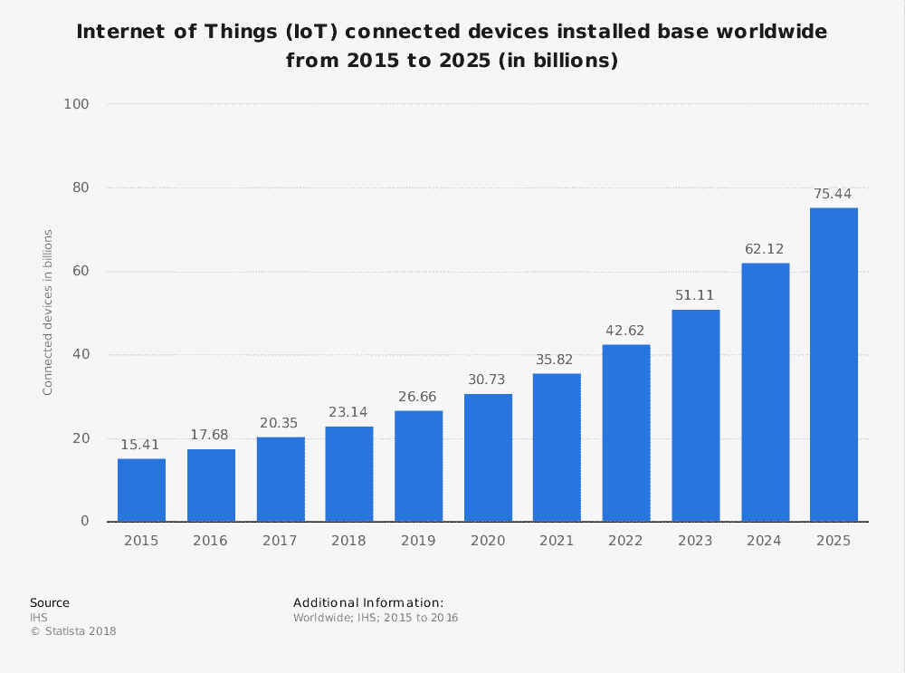
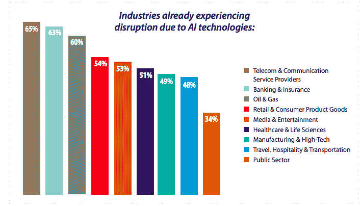
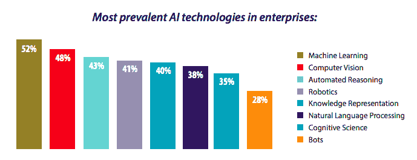
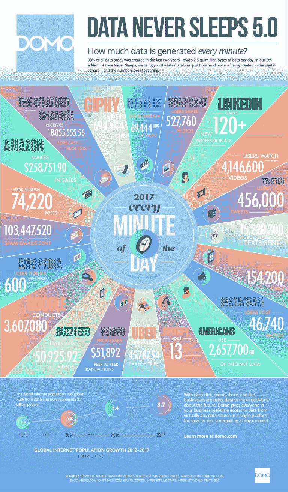

# 对数据基础设施的需求，以便更好地利用人工智能

> 原文：<https://towardsdatascience.com/the-need-for-data-infrastructure-for-best-utilization-of-artificial-intelligence-72612c1026e0?source=collection_archive---------7----------------------->

[来源](https://pixabay.com/en/artificial-intelligence-brain-think-3382507/)

随着智能手机、智能汽车、智能家居等创新的出现，技术正迅速将我们的世界转变为一个“智能”世界。物联网(IoT)是其中的主要贡献者之一。物联网的核心是配备传感器和微芯片的互联设备，这些设备有助于通过互联网在中央平台上传输数据，以提高效率和性能。[据估计，到 2020 年](https://www.fool.com/investing/general/2015/02/06/17-internet-of-things-statistics-you-dont-know.aspx)，全球联网设备的数量将接近 500 亿台。

[来源](https://www.statista.com/statistics/471264/iot-number-of-connected-devices-worldwide/)

随着连接设备的数量持续快速增长，管理和分析这些设备产生的海量数据的需求将会增加。这些数据至关重要，因为它包含有价值的见解和模式，可以帮助企业和组织评估潜在风险，寻找新的业务机会，最重要的是提高组织的整体运作和生产力。现在，这就是人工智能(AI)和机器学习(ML)的用武之地。AI 和 ML 技术允许数据科学家深入研究海量数据，并从中发现有意义的见解。在强调人工智能对于物联网和机器的重要性时，约翰·麦卡锡教授恰当地[指出](https://www.cio.com/article/3234656/artificial-intelligence/ai-defined-infrastructure-be-prepared-for-a-new-generation-of-business-models-and-applications.html):

人工智能的目标是开发具有智能行为的机器。

尽管处于发展阶段，人工智能已经开始在全球市场创造就业前景。[凯捷](https://www.techrepublic.com/article/83-of-companies-using-ai-said-it-is-creating-new-jobs-but-theres-a-catch/)报告称，近 83%利用人工智能技术的组织认为人工智能领域已经开始涌现新的工作岗位。随着越来越多的组织加入大数据和人工智能的行列，现在对数据科学家、数据工程师、数据分析师等熟练数据专业人员的需求巨大。

[来源](https://www.infosys.com/age-of-ai/Documents/age-of-ai-infosys-research-report.pdf)

现在，互联网上充斥着高度教育性和知识性的在线人工智能课程，让你在人工智能领域开始职业生涯变得更加方便。这些课程是专门为有抱负的学生介绍人工智能的基本概念，如算法，自然语言处理等。，并逐步向机器学习、深度学习等更复杂的概念进展。如果你和技术领域有一点点关系，建议你参加这些课程，提高你的就业能力。因为，现在已经很清楚了，各种组织都在不断寻找高技能的数据专业人员。没有比现在更好的时机让你开始了！

[来源](https://www.infosys.com/age-of-ai/Documents/age-of-ai-infosys-research-report.pdf)

**计算在数据管理中的作用**

如今，数据呈指数级增长，每天产生近 [2.5 万亿次数据](https://www.domo.com/learn/data-never-sleeps-5)！在我们生活的数据驱动的世界中，这些数据是所有信息的来源。然而，管理如此海量的数据本身就是一项挑战。由于高端计算流程，我们能够存储、处理和分析这些数据，以揭示隐藏的趋势和见解，从而改善业务运营、提高生活质量，最重要的是，促进创新。

[来源](https://web-assets.domo.com/blog/wp-content/uploads/2017/07/17_domo_data-never-sleeps-5-01-768x1312.png)

计算机处理和分析数据的速度比人类快得多，也更准确，因此，计算机正在极大地帮助公司利用其掌握的数据来计算重要的统计数据、监控员工绩效、实现自动化、提高生产率和销售额、提高机器的效率等等。正是由于这种计算能力，今天的组织可以获得大量的统计和技术见解和数字。此外，云计算等技术增强了人工智能的功能。例如，网飞和亚马逊等工业巨头依赖基于云的框架来处理需要全面分析和计算的人工智能任务和服务。

**数据基础设施和人工智能**

数据基础设施是数据处理和分析的一个重要方面。如果没有合适的数据基础设施，企业和组织就无法从数据中创造价值。对于数据基础设施，我们指的是处理、存储、传输和保护数据所需的整个后端计算支持系统。

虽然许多公司使用软件定义的基础架构(SDI)来支持动态 IT 环境，但 SDI 仍有其积压工作。SDI 不仅受到静态源代码的限制，而且它的功能在很大程度上也依赖于为特定环境编写代码的软件开发人员的技能和专业知识。因此，SDI 不是“智能的”现在的趋势是转向人工智能定义的基础设施(ADI)。

从本质上讲，ADI 是 SDI 的智能升级版，全面集成了复杂的 AI 和 ML 算法，可以从现有信息中“学习”以自动构建自修复框架。ADI 公司可以:

*   不断分析现有基础设施所有组件的动态行为，并“学习”理解它们自身的工作方式。
*   通过主动监控基础架构组件的功能并自主采取措施解决问题(如果有)，创建一个无错误的环境。
*   根据工作负载的要求部署资源，并在不再需要时取消分配特定资源。

这些数据基础设施有助于支持各种人工智能相关的技术和应用，包括:

*   **对现有框架的支持**:数据基础设施应该整合人工智能框架，如 TensorFlow、Caffe、Theano 和 Torch，以增强和支持现有框架。然而，重点不应该仅仅依赖于人工智能框架，而是应该符合软件开发人员的需求和兴趣。
*   **GPU 友好环境**:为了确保 AI 任务和进程的无缝处理，数据基础设施必须支持具有令人印象深刻的计算能力的 GPU 环境。微软的 N 系列 GPU 实例就是一个很好的例子
*   **人工智能优化的管理环境和工具**:缺乏合适的管理环境和工具来支持和运行人工智能应用是当前数据基础设施的最大缺点之一。因此，集成正确的管理工具和环境以提供最佳性能至关重要。
*   **机器推理**:AI 环境中不可分割的一部分的机器推理。机器推理算法使人工智能环境能够跟上基础设施和技术的动态趋势，从而为最佳行动提供有意义的见解。

**组织技能在 AI 实施中的重要性**

仅仅投资和利用人工智能技术是不够的。公司和企业需要一个专业人才库，能够以确保最佳结果的方式使用这些人工智能工具。随着人工智能和机器学习继续渗透到全球各地的行业和企业，越来越需要重新思考一个组织的整个领导力和思维过程，从产品战略和客户体验到寻找提高人力资本生产率的方法。商业世界的领导者必须通过以下方式鼓励智能人工智能集成到他们的系统中:

*   **以人为本**

仅仅投资人工智能技术不会有任何结果。企业也必须相应地投资于员工。根据杜克大学人类自主实验室主任[米西·卡明斯](https://www.infosys.com/age-of-ai/Documents/age-of-ai-infosys-research-report.pdf)，

*“人工智能的未来是支持和增强人类的能力，这样一个人-人工智能团队比任何一个单独的团队都更强大。”*

*   **培养学习的工作文化**

作为一个发展中的领域，人工智能需要不断的训练和学习，以跟上它今天带来的创新和变化。在未来，人工智能将在技术领域带来新的变化，只有通过鼓励和创造不断学习和培训的工作环境，组织才能跟上人工智能的创新。

*   **提高业务运营的透明度**

组织应该努力维护并推动其业务各个方面的透明度。领导者和管理者应该与员工就他们的人工智能方法进行公开交流。这不仅有助于获得他们的信任和信心，还会鼓舞他们的士气，激励他们更加努力地工作。

Adecco 集团首席执行官 Alain de haze[称](https://www.infosys.com/age-of-ai/Documents/age-of-ai-infosys-research-report.pdf):

*“融合了人类输入和人工智能的增强智能，将成为商业成功和形成繁荣社会的关键驱动力。我们正处于人类历史上前所未见的技术变革的尖端。技术进步要求更深入地关注人类固有的技能——批判性思维、情商和价值判断。”*

因此，拥有正确的数据基础设施以及适当的组织技能可以帮助企业和组织以正确的方式利用人工智能工具和技术。