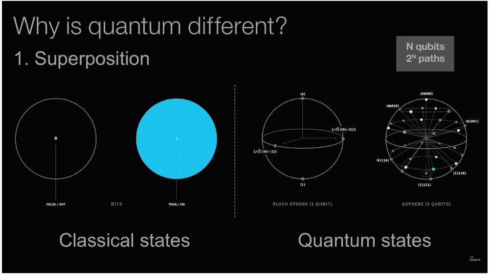
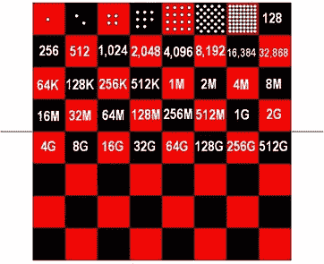
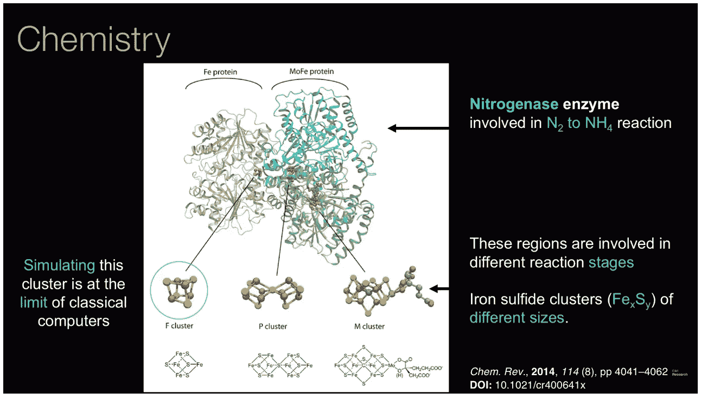
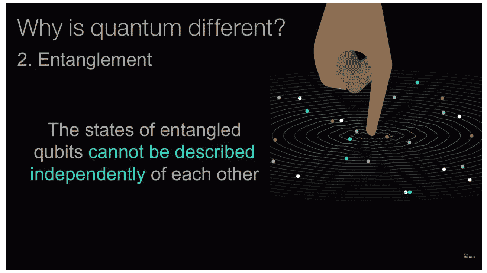
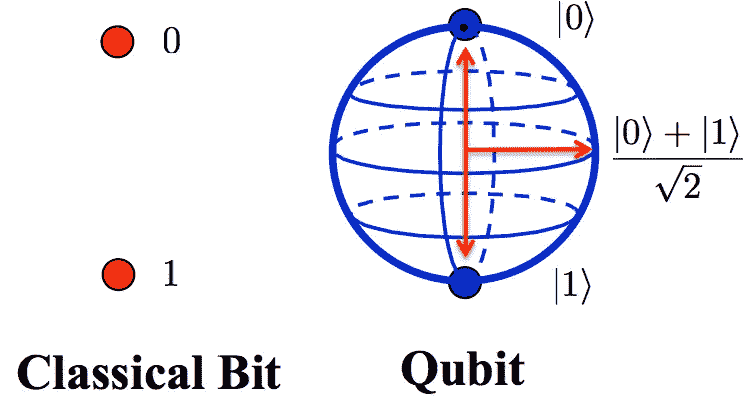
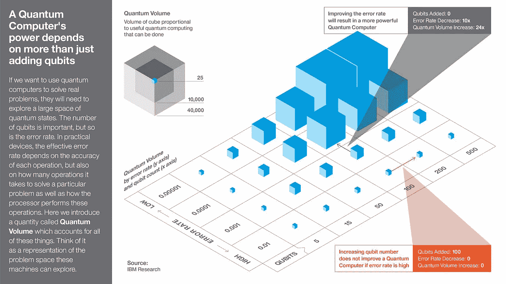

# 量子计算的需求、前景和现实

> 原文：<https://towardsdatascience.com/the-need-promise-and-reality-of-quantum-computing-4264ce15c6c0?source=collection_archive---------0----------------------->

尽管给我们带来了人类历史上最壮观的技术创新浪潮，但数字革命似乎仍然无法解决某些计算问题。其中一些问题可能会阻碍关键的科学突破，甚至全球经济。尽管几十年来，传统计算机的能力和处理速度几乎每两年就翻一番，但它们似乎仍无法解决这些长期存在的问题。想知道为什么吗？问任何一个计算机科学家，他们可能会给你同样的答案:今天的数字，传统的计算机是建立在一个经典的，非常有限的计算模型上的。从长远来看，为了有效地解决世界上最持久的计算问题，我们将不得不转向一种全新的、更有能力的动物:量子计算机。

最终，经典计算机和量子计算机之间的区别不像旧车和新车之间的区别。相反，这就像马与鹰的区别:一个能跑，另一个能飞。经典计算机和量子计算机确实如此不同。在这里，我们好好看看关键的区别在哪里，并深入探究量子计算机的独特之处。然而，你在这里找不到关于量子计算机最终如何发挥其魔力的最终解释。因为没有人真正知道。

# 经典计算的硬性限制

## 摩尔定律，施莫尔定律

几十年来，传统计算机的速度和计算能力每两年翻一番(有些人认为仅仅是 18 个月)。这就是众所周知的摩尔定律。尽管飞速发展的步伐可能最终开始略微放缓，但今天充满房间的超级计算机是明天的廉价笔记本电脑这一点或多或少是真实的。因此，按照这种速度，似乎有理由假设，在可预见的未来，没有传统计算机最终无法处理的计算任务。尽管如此，除非我们谈论的是几万亿年(甚至更久)，否则对于某些棘手的任务来说，这根本不是一个安全的假设。

## 传统计算机的致命弱点

事实是，像快速寻找非常大的整数的质因数这样的计算任务，即使是未来最快的传统计算机也可能无法完成。这背后的原因是，寻找一个数的质因数是一个具有指数增长的函数。什么是指数增长？让我们深入研究一下，因为这对于理解为什么量子计算机有如此大的潜力以及为什么经典计算机有所欠缺是非常重要的。

## 指数增长快速入门

随着你拥有的“东西”数量的增加，有些东西会以固定的速度增长，而有些东西会增长得更快。当增长相对于增长的总数变得更快(不恒定)时，那么它就是**指数**。

指数增长是极其强大的。指数增长的一个最重要的特征是，虽然它开始时很慢，但它可以相当快地产生巨大的数量——通常是以令人震惊的方式。

如果没有例子的话，这个定义可能有点难以理解，所以让我们深入一个小故事。

有一个传说，一位智者得到了国王的奖赏，他要求统治者在棋盘的第一格放一粒米，第二格放两粒米，第三格放四粒米，以此类推。每个方块都要有两倍于前一个方块的谷粒。国王同意了他的请求，但很快意识到填满棋盘所需的大米超过了整个王国的数量，并将花费他所有的资产。

**水稻指数增长:**

任何正方形上的颗粒数量反映了以下规则或公式:

在这个公式中， *k* 是方块的数目， *N* 是方块上的米粒数目。

*   如果 *k* = 1(第一个平方)，那么 *N* = 2⁰，等于 1。
*   如果 *k* = 5(第五个平方)，那么 *N* = 2⁴，等于 16。

**这是指数增长，因为当我们从一个方块到另一个方块时，指数或幂会增加。**

为了进一步概念化，我已经包括了一个关于指数函数的输入量的指数增长的图表。

如你所见，该函数开始时相对较慢，但很快就达到了传统计算机在输入足够大的情况下无法计算的数值。

## **实指数函数有实结果**

好了，故事讲够了。让我们继续讨论现实世界中的指数问题，就像我们之前讨论的那样。质因数分解。

坐 51 号车。看看你需要多长时间找到两个唯一的质数，你可以乘在一起生成它。如果你熟悉这类问题，你可能只需要几秒钟就能发现 3 和 17 都是质数，都等于 51。事实证明，这个看似简单的过程是数字经济的核心，也是我们最安全的加密类型的基础。我们在加密中使用这种技术的原因是，随着质因数分解中使用的数字变得越来越大，传统计算机分解它们变得越来越困难。一旦你达到一定的位数，你会发现即使是最快的传统计算机也需要几个月、几年、几个世纪、几千年，甚至无数个世纪才能将它分解。

有了这种想法，即使在可预见的未来，计算机的处理能力继续每两年翻一倍(不要打赌)，它们也将永远与质因数分解作斗争。现代科学和数学核心的其他同样顽固的问题包括某些分子建模和数学优化问题，这些问题可能会使任何敢于靠近它们的超级计算机崩溃。

下面是 IBM Research 的一个很好的例子，展示了我们可以在世界上最强大的超级计算机上模拟的最复杂的分子(F 团簇)。正如你所看到的(在图像的左下方)，这种分子一点也不复杂，如果我们想要模拟更复杂的分子以发现更好的药物治疗并了解我们的生物学，那么我们将需要一种不同的方法！

Molecular Simulation Problem. Source: IBM Research

# 进入量子计算机

传统的计算机是严格数字化的，完全依赖于经典的计算原理和特性。另一方面，量子计算机是严格的*量子*。因此，他们依靠*量子*原理和特性——最重要的是**叠加 和**纠缠 ——这使得他们几乎不可思议的能力与众不同，以解决看似不可逾越的问题。****

## 叠加

为了让叠加的概念有意义，让我们考虑一个最简单的系统:一个双态系统。一个普通的、经典的双态系统就像一个开/关开关，总是处于一种状态(开)或另一种状态(关)。然而双态量子系统完全是另外一回事。当然，无论何时你*测量*它的状态，你都会发现它确实不是开就是关，就像一个经典系统一样。但是*在*测量之间，一个量子系统可以同时处于开态和关态的*叠加*，不管这是多么违背直觉，甚至是超自然的，这在我们看来可能是这样。

Superposition. Source: IBM Research

一般来说，物理学家认为在测量之前谈论量子系统的状态是没有意义的，比如它的*自旋*。一些人甚至认为测量一个量子系统的行为*导致*它从一个不确定的黑暗状态崩溃到你测量的值(开或关，升或降)。虽然可能无法想象，但无法回避的事实是，这一神秘现象不仅是真实的，而且带来了解决问题能力的新维度，为量子计算机铺平了道路。牢记叠加的思想。我们一会儿将回到如何在量子计算中使用它。

叠加是如何实现的已经超出了本文的范围，但是相信它已经被证明是正确的。如果你想理解是什么导致了叠加，那么你首先需要理解[波粒二象性](https://en.wikipedia.org/wiki/Wave%E2%80%93particle_duality)的概念。

## 纠缠

好的，接下来是量子力学的下一个特性，我们需要利用它来制造量子计算机。

众所周知，一旦两个量子系统相互作用，它们就变成无可救药的 ***纠缠*** 伙伴。从那时起，一个系统的状态将为您提供关于另一个系统状态的精确信息，**无论这两个系统相距多远**。说真的，这两个系统可能相距*光年*远，但仍能给你关于彼此的精确而即时的信息。让我们用一个具体的例子来说明这一点，因为这甚至引起了爱因斯坦对这怎么可能的困惑。(爱因斯坦将这种现象称为“幽灵般的超距作用”)

Quantum Entanglement. Source: IBM Research

假设你有两个电子，A 和 b。一旦你让它们以正确的方式相互作用，它们的自旋就会自动纠缠在一起。从那时起，如果 A 的自旋是*向上*，B 的自旋将是*向下*，就像跷跷板上的两个孩子，只不过即使你把 A 和 B 带到地球(或银河系，就此而言)的两端，这也是成立的。尽管它们之间相隔数千英里(或光年)，但事实证明，如果你测量 A 的自旋*向上*，你会立刻*知道 B 的自旋是*向下*。但是等等:我们已经知道，这些系统没有自旋等状态的精确值，而是在测量之前以一种模糊的叠加状态存在。那么，我们测量的 A 实际上是不是导致 B 瞬间坍缩到相反的值，即使两者相距*光年*？如果是这样的话，那么我们还有另一个问题要解决，因为爱因斯坦告诉我们，两个系统之间的因果影响，比如光信号，都不会超过光速。那么是什么原因呢？总而言之，我们真的不知道。我们只知道量子纠缠是真实的，你可以利用它创造奇迹。*

# 量子位

*量子位*在量子计算中扮演的角色与*位*在经典计算中扮演的角色相同:它是信息的基本单位。然而，与一个量子位相比，比特是完全无聊的。尽管比特和量子位都产生两种状态之一(a **0** 或 **1** )作为计算结果，但在计算结果之前，一个量子位可以同时处于*0 和 **1** 两种状态。如果这听起来像量子叠加，它就是。量子位是卓越的量子系统。*

正如传统计算机是由*位*和*位*组成的*量子位*一样，量子计算机是由处于自旋状态的电子组成的，自旋状态要么是*向上*要么是*向下*(当然，一旦测量出来)。正如处于开/关状态的晶体管串在一起形成在数字计算机中执行经典计算的*逻辑门*，处于上/下自旋状态的电子串在一起形成在量子计算机中执行量子计算的*量子* *门*。然而，将单个电子串在一起(同时保持它们的自旋状态)说起来远比做起来容易。

Quantum Algorithms. Source: IBM Research

# 我们今天在哪里？

当英特尔正忙于生产每片拥有数十亿个晶体管的传统芯片时，世界领先的实验计算机科学家们仍在努力建造拥有多种量子位的量子计算机“芯片”。为了让你知道我们在量子计算的历史上有多早，这是一件大事，最近 [IBM 推出了世界上最大的量子计算机](https://futurism.com/ibm-announced-50-qubit-quantum-computer/)，它有一个惊人的……等等……50 个量子位。尽管如此，这只是一个开始，如果摩尔定律适用于量子计算机，我们应该在几年内达到数百台，几年后达到数千台。十亿？我不会屏住呼吸，但话又说回来，你不需要 10 亿个量子位就能在一些关键类别上胜过传统计算机，例如素数分类、分子建模和一系列优化问题，这些都是当今传统计算机无法解决的。

## 2018 年的量子计算机

尽管如此，截至目前，几乎每台量子计算机都是一个价值数百万美元的近乎疯狂的科学家项目，[看起来也是其中的一部分。你通常会在 IBM 等大型 IT 公司的研发部门，或者麻省理工学院等大型研究型大学的实验物理学部门找到他们。它们必须被超冷到绝对零度以上(这比星系间空间还要冷)，实验人员需要使用精确频率的微波与计算机中的每个量子位单独通信。不用说，这是不可扩展的。但最早的传统计算机的真空管也没有，所以我们不要太苛刻地判断这第一代。](https://www.google.com/search?q=quantum+computer+MIT&client=firefox-b-1&source=lnms&tbm=isch&sa=X&ved=0ahUKEwj4nq-Y4OfYAhWP0FMKHQUKDg4Q_AUIDCgD&biw=900&bih=952)

## 等待突破的障碍

量子计算机尚未成为主流的主要原因是，世界上最优秀的头脑和发明家仍在与高错误率和低数量的量子位作斗争。当我们一起解决这两个问题时，我们将快速增加 IBM 所谓的每台计算机的“量子量”，这是一种可视化量子计算机可以执行的有用计算量的方式。

Quantum Volume. Source: IBM Research

简而言之，为了让量子计算起飞，让量子驱动的 Macbooks 开始从货架上飞起来，我们需要更多的量子位和更少的错误。这需要时间，但至少我们知道我们的目标是什么，我们面临的是什么。

# 神话 vs 解释

虽然我们知道量子计算机可以轻松地做任何常规计算机做梦都想不到的事情，但我们并不真正知道它们是如何做到的。如果这听起来令人惊讶，鉴于第一代量子计算机已经存在，请记住单词 *quantum* 。我们已经用量子力学解决问题一个世纪了，我们仍然不知道它是如何工作的。量子计算作为量子家族的一员，也是同病相怜。迈克尔·尼尔森(基本上是[写了这本书](https://www.amazon.com/Quantum-Computation-Information-10th-Anniversary/dp/1107002176))和[令人信服地争辩说，任何关于量子计算的解释都注定会失之交臂。毕竟，根据尼尔森的说法，如果对量子计算机如何工作有一个简单明了的解释(也就是说，你可以将它可视化)，那么它就可以在传统计算机上进行模拟。但是如果它可以在传统计算机上模拟，那么它*不可能*是量子计算机的精确模型，因为量子计算机按照定义做传统计算机做不到的事情。](http://michaelnielsen.org/blog/quantum-computing-for-everyone/)

根据尼尔森的说法，最流行的假装解释量子计算的神话叫做*量子并行。*因为你会经常听到量子并行性的故事，所以让我们来看一下。量子并行背后的基本思想是，量子计算机与传统计算机不同，它同时探索所有可能的计算结果/解决方案(即在一次操作中)，而数字计算机必须缓慢前进，依次查看每个解决方案。根据尼尔森的说法，量子并行性故事的这一部分大致正确。然而，他尖锐地批评了故事的其余部分，它继续说，在调查了所有解决方案后，量子计算机挑选出了最好的一个。根据尼尔森的说法，现在*那个*是一个神话。他坚持认为，事实是，像所有量子系统一样，量子计算机在幕后真正做的事情完全超出了我们的能力范围。我们看到了输入和输出，其间发生了什么是神秘的。

如果你喜欢这篇文章，我会非常兴奋，如果你点击拍手按钮:)或与你好奇的朋友分享。我在我的个人博客(jasonroell.com)上有更多类似的东西，或者你可以订阅我的媒体简介，让我一写完文章就发给你！(多牛逼？！)

无论如何，再次感谢你的阅读祝你有美好的一天！