# 我们时代的新闻

> 原文：<https://towardsdatascience.com/the-news-of-our-times-f8e5fdc0999a?source=collection_archive---------4----------------------->

Photo by [Roman Kraft](https://unsplash.com/@romankraft?utm_source=medium&utm_medium=referral) on [Unsplash](https://unsplash.com?utm_source=medium&utm_medium=referral)

# 介绍

假新闻是 2016 年美国总统大选后这些天非常热门的话题。脸书和谷歌正在用自己的行动来减少假新闻的传播，包括降低搜索结果的排名和拉广告资金[ [1](http://www.reuters.com/article/us-alphabet-advertising-idUSKBN1392MM) ， [2](https://techcrunch.com/2016/12/15/facebook-now-flags-and-down-ranks-fake-news-with-help-from-outside-fact-checkers/) ]。在没有彻底核对声明的情况下自动标记假新闻的技术挑战——目前只有人类才能完成这项任务——是防止假新闻传播的严重障碍。有机会解决这个独特而具有挑战性的(现实世界)问题让我兴奋不已，我找到了解决以下项目的灵感。

# 项目目标

我的项目分析了 2016 年 8 月 26 日至 2017 年 1 月 20 日期间脸书新闻页面的帖子，以探索选举对新闻类型的发布和参与的影响。其他支持项目目标包括:

*   调查一些可以唯一识别共享的脸书新闻帖子是否来自主流、虚假、阴谋或讽刺来源的因素。我怀疑假新闻、阴谋新闻和讽刺新闻来源之间的差异是微妙的，因此，它们之间潜在的细微差异需要更仔细地检查，而不仅仅是检查主流和假新闻之间的差异。因此，多类检查优于二类检查(即假新闻和非假新闻)。
*   利用新闻类型之间的差异来建立多类逻辑回归模型，该模型使用重要的一个或两个单词序列、也称为单字母组合和双字母组合、来自帖子消息的类型(例如“#neverhillary”、“follow american”)、参与活动的模式(例如，在帖子的脸书反应、分享和评论总数中喜欢的比例)、帖子附件的类型(例如，图像、视频、无等)来标记共享的脸书新闻帖子。)，以及各种时间因素(即一周中的某一天、一天中的某个小时，以及选择的时间[即之前、当天或之后])。回归模型适用于本项目，通过检查哪些模型系数离零最远来确定最重要的模型特征。一个适当校准的模型的价值可以帮助脸书识别哪些帖子需要标记，以便采取行动阻止假新闻的传播，或者供计算记者用来跟踪与假新闻相关的问题，以履行未来的报道责任。

# 数据源

我的数据集是通过以下步骤组装的。2014 年 10 月 21 日，皮尤研究中心发布了一份主流新闻网站列表，名为《政治两极分化&媒体习惯:从福克斯新闻频道到脸书，自由派和保守派如何跟上政治。皮尤的研究发现，公众更信任的知名消息来源也在名单之列。
2。两个来源被用来生成虚假、阴谋和讽刺新闻网站的列表。梅里马克学院的 Melissa Zimdars 博士编制的一份[虚假、阴谋和讽刺新闻来源列表，与 2016 年 10 月和 11 月编制的](https://github.com/BigMcLargeHuge/opensources)[虚假新闻 Kaggle 数据集](https://www.kaggle.com/mrisdal/fake-news)中相应目标类型和未知类型的新闻来源列表进行了交叉检查，使用了来自 Daniel Sieradski 的 [BS(“胡说”)检测器 Chrome 扩展。在 Zimdars 博士的列表中被列为虚假、阴谋和讽刺的所有新闻源都被检查脸书页面，除非新闻标签与 Kaggle 数据集中源的新闻标签明显冲突。为了专注于美国媒体，各种已知的外国页面被排除在外，尽管所有的外国页面并没有完全消除。
3。所有的新闻发布都是通过](https://www.producthunt.com/posts/b-s-detector)[脸书图表 API](https://developers.facebook.com/docs/graph-api) 从主流、虚假、阴谋和讽刺来源的脸书页面中检索的。

# 假设

*   Melissa Zimdars 汇编的名单中有脸书的帖子，从整体上看，这些帖子与指定的类别一致。主流新闻报道包含准确的信息，旨在让读者了解时事。假新闻包含不准确的信息，旨在误导读者。共谋不包含可以通过未知或不明显的意图进行验证的信息。讽刺作品可能包含不准确的信息和/或未经证实的信息，目的是为了迎合或娱乐读者。
*   彻底交叉检查和验证声明/账户有效性的代理，即良好的新闻报道，并推断意图可以预测新闻的类型。
*   当对新闻类型的曝光率变化并且依赖于之前用户对脸书信息的参与度时，建立在偏斜样本上的模型可以用于准确地对现实世界中的新闻进行分类。
*   每一个脸书新闻邮报可以充分，适当地分配到一个独特的类别。
*   新闻类型的概率的对数相对于模型参数是线性的。

# 导入、清理和合并数据

在执行探索性数据分析(EDA)之前，采取了以下步骤来下载和清理数据。帖子信息通过脸书的 Graph API 编译到一个本地驱动器，通过修改另一个[程序员](https://drive.google.com/file/d/0Bw1LIIbSl0xuRTNCZElUa3U1b1U/view)提供的 Python 代码。从脸书提取的数据包括帖子信息、链接标题、链接类型、发布日期，以及评论、分享、喜欢、喜爱、wows、hahas、sads 和 angrys 的个人计数。
2。从现有数据集中生成额外的数据列，或者与已知信息合并以形成更详细的最终数据集，该数据集还显示脸书页面 id、新闻页面类型(即主流、虚假、阴谋或讽刺)、星期几、小时、选举时间以及所有用户参与活动的总和(即评论、分享、喜欢、喜爱、wows、hahas、sads 和 angrys 的总和)。
3。所有文本都从 unicode 格式转换为字符串格式。
4。99 个职位被确定为多余的(占总数的 0.04%)，因此被删除。
5。从帖子中删除了所有 URL，以避免在从帖子中识别重要的字母组合和双字母组合时进行选择。

从脸书消息文本中生成重要的字母组合和二元组合是目标中描述的模型的关键部分。具体来说，从 post 消息中生成重要的字母组合和二元组合的列表遵循三个步骤。首先，使用计数矢量器生成每种新闻类型最常见的 6，000 个单词的四个列表。接下来，考虑到来自脸书帖子的消息集合，计算代表脸书消息中的单词的重要性的值(也称为单词的频率逆文档频率(TF-IDF )),并且选择具有最高 TF-IDF 分数的 6000 个单词。通过只选择经常使用的词，单词的数量再次减少，但在四种新闻类型中只有一种使用独特的词。结果列表只包含 793 个单词。该列表进一步缩减到 470 个单词，以删除无意义的单词或与单个页面密切相关的单词(例如，页面名称或特定新闻节目的主持人)。

# 探索性数据分析

以下部分探讨了数据集的特征，以更好地理解预测器在最终模型中的表现。

最终数据集包括来自 129 个脸书页面的超过 27.4 万篇帖子和超过 9 亿次参与活动。尽管数据集中主流站点的数量很少，但主流帖子是第二常见的帖子类型(图 1 和图 2)。

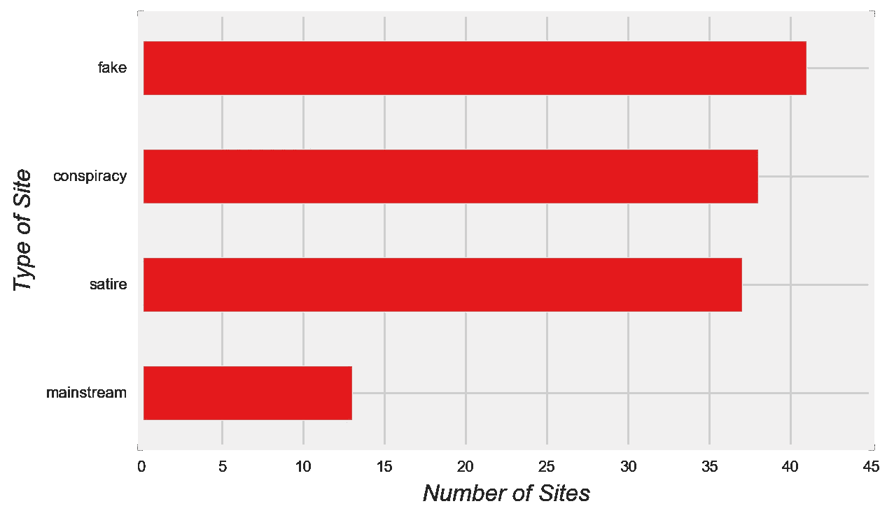

**Figure 1**

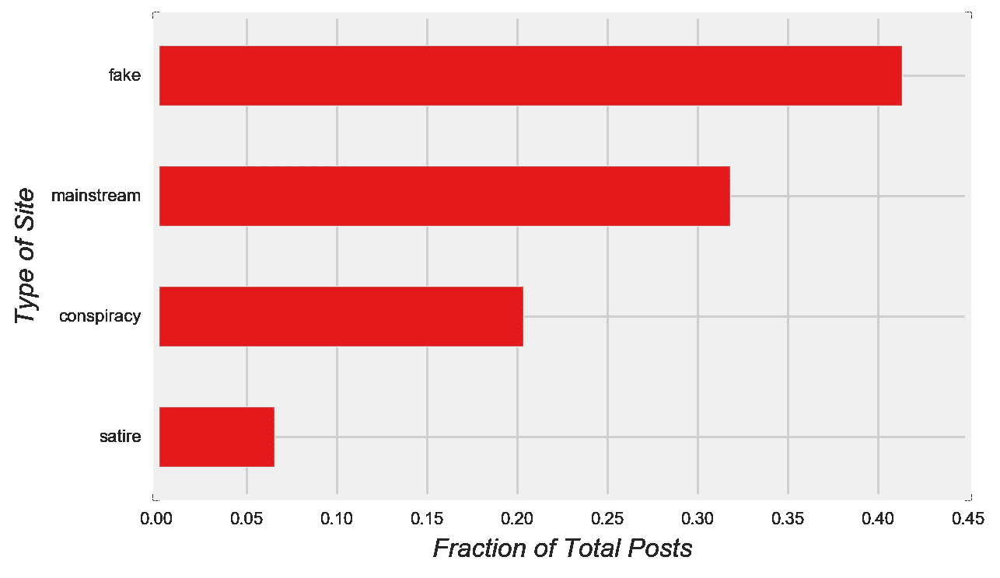

**Figure 2**

此外，无论新闻类型如何，只有少数页面发布并获得了大部分参与度(图 3)。基于这一观察，我预计一个建立在现有的倾斜数据集上的模型，对于拥有最多帖子和最高参与度的网站来说，会表现得更好。

**Figure 3**

现在，模型预测的具体特征是关于职位和参与活动的探讨。如果我观察到不同类型新闻的帖子模式在各种模型预测方面的差异，我希望它们在最终模型中反映为相对于零的高正或负模型系数。

为了开始评估模型预测值，我调查了不同新闻类型的帖子附件和参与度的频率。经过检查，所有类型的新闻都比任何其他类型的附件更频繁地包含带有链接的帖子，并且除了共谋之外，所有其他类型的附件都显示链接获得了最高的参与百分比(图 4)。然而，关于第二种最常见的附件类型，与所有其他类型的新闻相比，主流页面更频繁地将视频附加到帖子上。因此，与所有其他类型的新闻视频的系数相比，我预计该模型对于主流视频具有相对较高的系数。

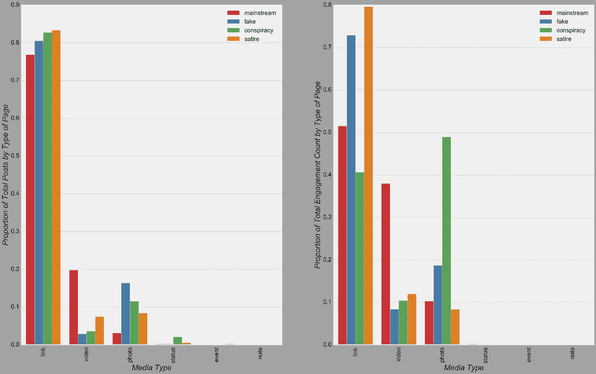

**Figure 4**

接下来，我调查了与美国总统选举相关的帖子的频率和参与度。我观察到，帖子数量的最大变化发生在选举后假新闻的减少，这在很大程度上是由于前三个最多产页面的帖子数量减少(图 5 和图 6)。由于选举后假新闻帖子的百分比明显减少，我预计最终模型与总统选举后假新闻模型系数相比，总统选举前假新闻模型系数相对较高。然而，与假新闻相关的参与活动大幅增加，仅次于主流新闻的参与高峰，部分原因是主流帖子数量的增加(图 5)。主流新闻参与度的激增主要是由于 CNN、ABC News 和《今日美国》的帖子参与度相对较高(图 7)。

因此，我希望该模型能够显示出主流视频的系数与所有其他类型新闻的系数之间相对较大的差异。

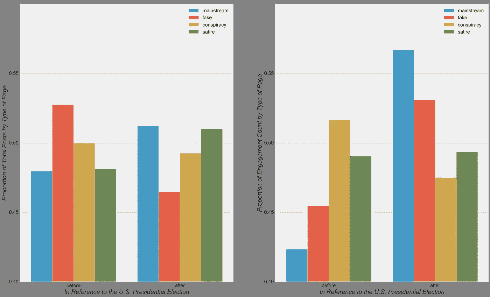

**Figure 5**

**Figure 6**

**Figure 7**

对一周中各天的帖子频率和参与度的检查显示，无论新闻类型如何，周六和周日的帖子数量和参与活动相对于一周中的其他日子都有明显下降(图 8)。由于一周内不同类型的新闻发布频率的变化很小，我预计该模型会显示出相对于该预测值相对较低的系数。

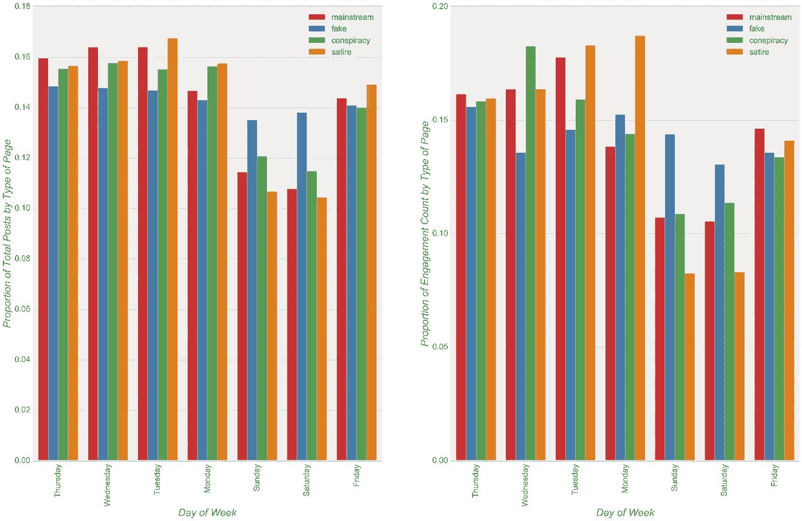

**Figure 8**

关于一天中的时间，当考虑到横跨美国 48 个州的四个时区时，无论新闻类型如何，帖子都在工作时间出现峰值(图 9)。不同类型的新闻在发布时间上的差异相对较小，讽刺新闻除外，它在早上 6 点到晚上 12 点(太平洋标准时间)之间出现了相当大的高峰。除了讽刺新闻之外，不同类型的新闻在一天的几个小时中的帖子模式几乎没有差异，与讽刺新闻的一天几个小时的模型系数相比，主流、虚假和阴谋新闻的一天几个小时的模型系数预计更接近于零。有趣的是，与发布时间相比，一天中的几个小时的参与水平似乎相对一致，这表明全球用户和/或美国深夜用户的广泛参与。相对于其他类型的新闻，阴谋网站的参与度似乎在所有时间都是最一致的，而讽刺页面的参与度在帖子最多的时候达到峰值，即早上 6 点到 7 点之间。

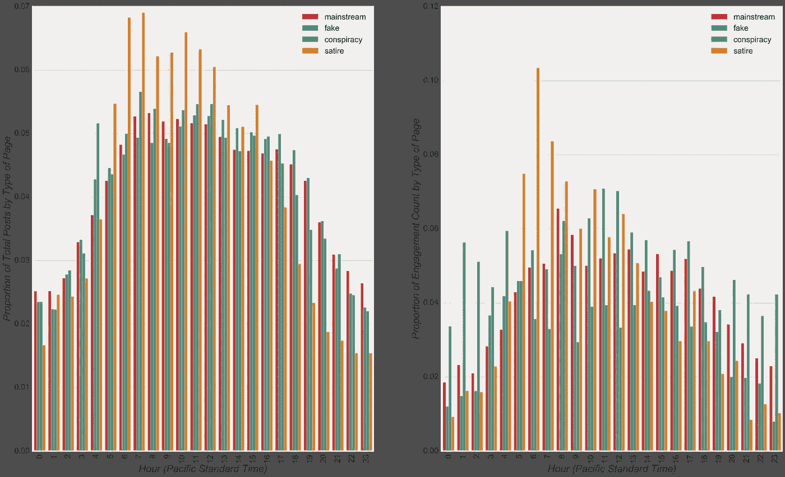

**Figure 9**

该模型还包括每种参与活动的预测因素。为了比较不同类型的新闻之间参与活动模式的差异，这种模型预测值是特定参与活动在响应帖子的总参与活动中所占的比例。下面是按新闻类型和参与度最高的页面对参与度活动的调查。

“赞”之后是“分享”是对帖子最常见的参与行为(图 10)，尽管所有类型的新闻参与行为相对于平均值都有很大的变化。有趣的是，在所有类型的新闻中，讽刺作品的平均参与度位居第二，但总参与度最低。或许并不令人惊讶的是，与其他类型的新闻相比，讽刺类文章的平均点击数明显更高。此外，哈哈是个人讽刺页面中第二或第三常见的参与度反应(图 11)。因此，我希望最终的模型显示讽刺的哈哈模型系数，与所有其他类型的新闻的哈哈系数相比，相对较高。然而，需要更多的讽刺文章来更好地理解和比较其他类型的新闻，因为相对于所有其他类型的新闻，项目数据集包含的讽刺文章要少得多(图 10)。

经过进一步检查，还出现了其他模式。分享和评论是讽刺新闻页面或高度参与的主流新闻页面(如福克斯新闻频道)中第二或第三常见的参与行为。和美国有线电视新闻网，但在其余主流来源中，作为其他参与行为的一部分，相对不太常见(图 11)。在虚假和阴谋新闻中，分享再次成为第二常见的参与类型(有时是最常见的)，回应虚假和阴谋帖子的分享比例似乎比主流和讽刺新闻中的分享比例更大。基于这些观察，我预计最终模型的虚假和阴谋页面的份额系数要高于主流和讽刺页面的份额系数。

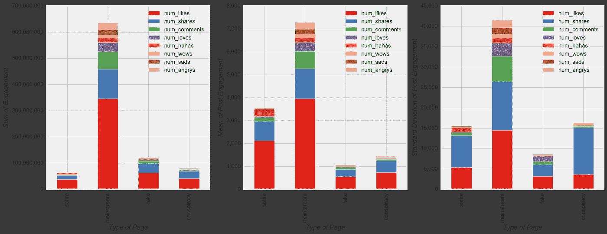

**Figure 10**

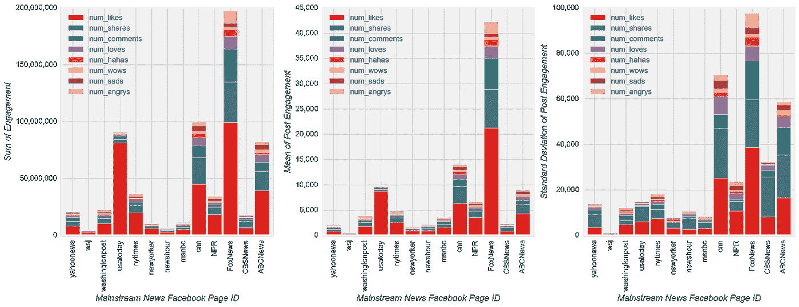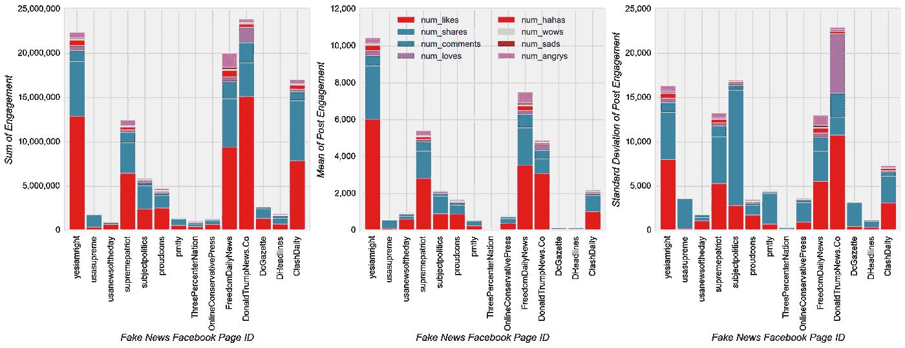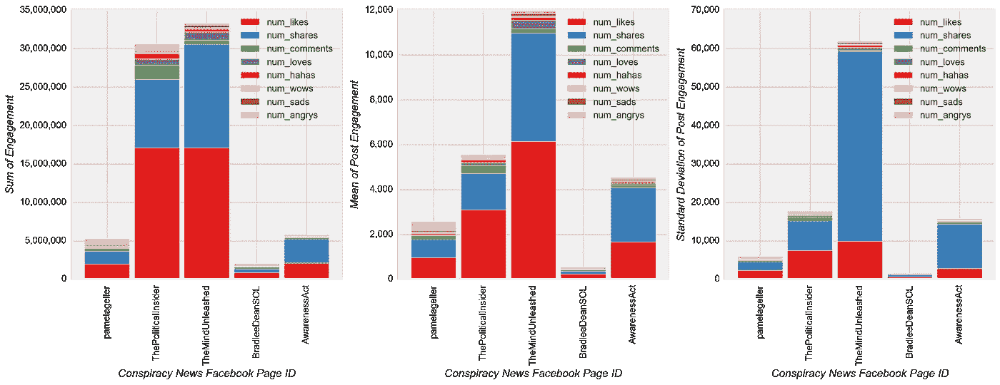

**Figure 11**

模型中包含的其余预测因子是从每种新闻类型的帖子中选择的重要字母组合和双字母组合。选择这些 n 元语法是为了提取帖子中使用的最大数量的不同单词，以及每种类型的新闻中唯一的最常用的单词。尽管如此，根据新闻的类型，只有 2%(主流)到 29%(讽刺)的帖子包含信息文本。因此，考虑到训练集远小于训练数据集中的帖子数量，在模型中包含单字母组合和双字母组合有增加大量噪声的风险。因此，与之前讨论的模型预测值相比，与最终模型中重要的单字母组合和双字母组合相关的系数受到了更大程度的质疑，并且没有在模型评估中进行讨论。

# EDA 摘要

*   不管是什么类型的新闻，只有少数几个页面发布并获得了大部分参与度(图 3)。
*   关于帖子中第二常见的附件类型，主流页面发布视频的频率高于所有其他类型的新闻(图 4)。
*   发帖量的最大变化发生在选举后假新闻的减少，这在很大程度上是由于三大最多产来源的发帖量减少(图 5 和图 6)。
*   无论是哪种类型的新闻，相对于一周中的其他日子，周六和周日的帖子数量和参与活动水平都有明显下降(图 8)。
*   考虑到横跨美国 48 个州的四个时区，无论新闻类型如何，帖子在工作时间达到峰值(图 9)。
*   也许不出所料，与其他类型新闻的平均点击数相比，讽刺类文章的平均点击数明显更高(图 10)。
*   回应虚假和阴谋帖子的比例似乎比回应主流和讽刺新闻的比例更大(图 11)。

# 模型结构

检验主要定量预测因子的相关性，以确定最终模型中正则化的适当设置。当检查相关性热图时，无论新闻类型如何，参与活动之间和/或时间段之间(即一周中的小时或天)都没有出现强相关性(图 12)。因此，在最终的模型中，使用套索进行正则化似乎是一个合适的设置。

在评估每种类型新闻的相关性时，主流新闻在哈哈和评论之间具有相对较高的相关性(正相关[+])、生气和评论(+)、哇和分享(+)、喜欢和喜欢(+)、喜欢和评论(负相关[-])、喜欢和分享(-)、哇和喜欢(-)、哈哈和喜欢(-)、伤心和喜欢(-)、生气和喜欢(-)(图 13)。假新闻在愤怒和评论(+)以及喜欢和分享(-)之间具有相对较高的相关性。此外，讽刺新闻有相对较高的相关性，如和份额(-)。

**Figure 12**

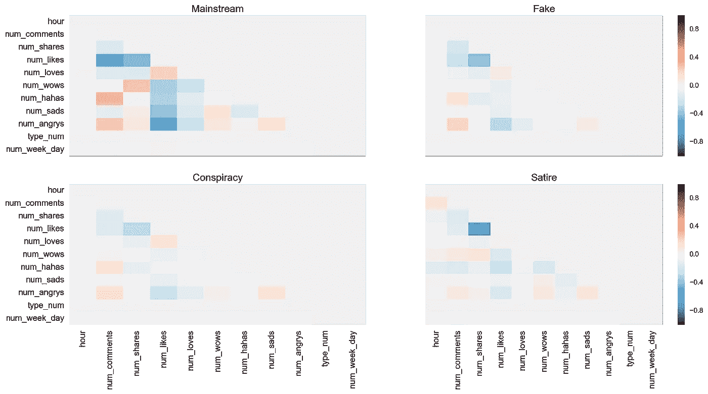

**Figure 13**

在这个项目中选择了一个逻辑回归模型，以便使用分类和数字预测器按类型对新闻进行分类。与朴素贝叶斯等其他模型相比，回归模型生成的系数具有指示预测值相对重要性的量值。Scikit-Learn 中逻辑回归模型的所有默认设置都保持不变，除了 lasso 正则化的说明(如上所述)和模型收敛的最大迭代次数的增加。

# 模型结果和评估

最终的模型取得了很大的成功。在测试数据集上实现了 57%的平均准确率，测试训练分割为 30%-70%，这相当于比基线增加了 16%。受试者操作特征(ROC)曲线下的区域看起来也非常好，该曲线显示了代表每种类型新闻的个体准确性得分的区域。这些区域的范围从 74%(虚假和阴谋)到 86%(讽刺)，当大于 50%时表示模型成功(图 14)。因此，当依靠由 Melissa Zimdars 博士编制的来源列表来从特定的帖子特征预测《脸书邮报》的新闻类型时，实现了可量化的成功程度。

**Figure 14**

尽管如此，这个模型还是显示出明显的弱点。精确度(即一种类型的新闻的正确预测占该类型新闻的总预测的百分比)和召回率(即一种类型的新闻的正确预测占真实存在的新闻的总类型的百分比)分别在 53%(讽刺)和 70%(阴谋)之间以及 8%(阴谋)和 77%(虚假)之间。如图 15 所示，低召回值是由于模型预测大多数阴谋和讽刺文章是主流和虚假的。

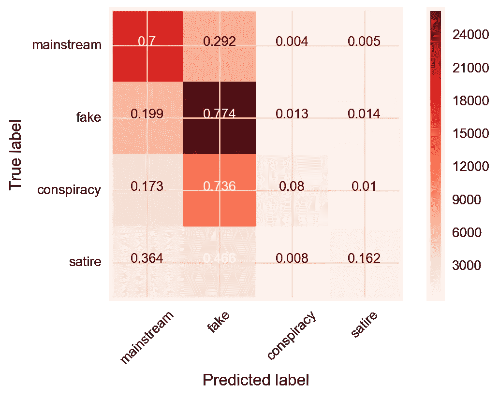

**Figure 15**

从页面级别的角度来看，当观察几乎所有高容量和低容量的阴谋和讽刺页面错误地预测正确预测数的数倍时，这些低召回率结果是明显的(图 16)。Fprnradio(阴谋)和 NewsThump(讽刺)是这种情况下的例外，不正确和正确的计数相对接近。Elmundotoday(讽刺)和 theunrealpage(讽刺)也是例外，正确的预测计数至少是错误计数的两倍。

尽管所有类型的新闻都只有少数来源发布了大部分总量并获得了大量参与(图 3)，但该模型并没有过度适应最多产或参与最多的页面的特征。使用测试数据集，对按页面分类和错误分类的帖子的审查证实了这一观察。高容量和低容量的虚假和主流新闻页面被分类为真实类别的频率高于误分类(图 16)，即分别占帖子的 77%和 70%(图 15)。《纽约客》(主流)是一个例外，错误分类略多一些(图 16)。此外，几乎所有高容量和低容量阴谋和讽刺页面的帖子都被错误分类，比正确分类的帖子多几倍。

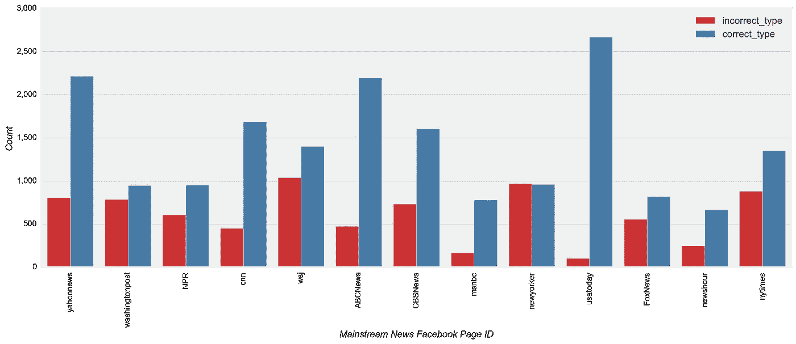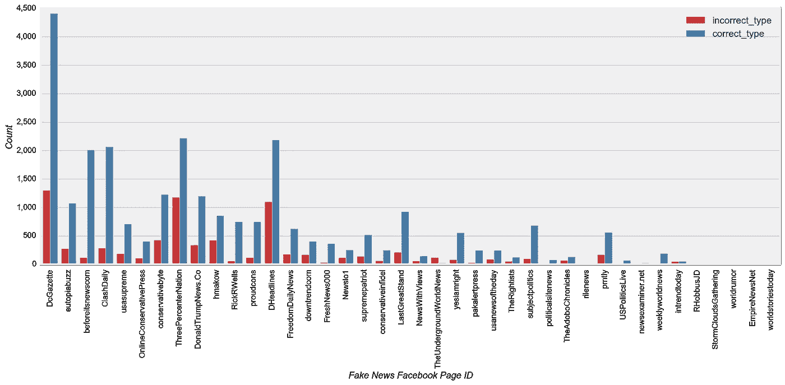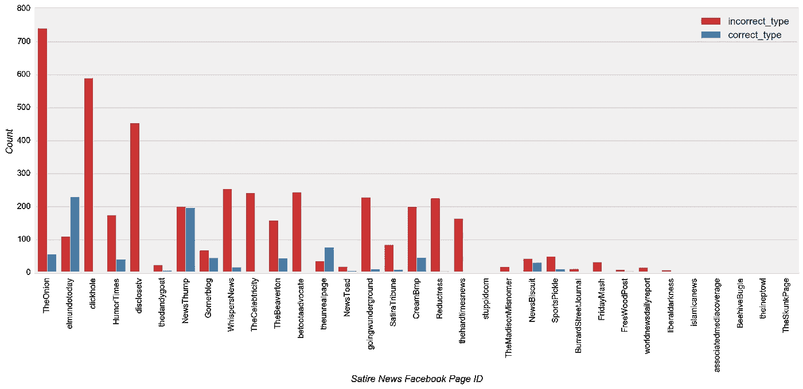

**Figure 16**

总体而言，最高的模型系数在很大程度上与参与类型相关(前二十个系数中的 60%，即四种新闻类型中每一种的最高五个系数)(图 17)。下面列出了按新闻类型划分的最高模型系数。在为每一类新闻列出的系数中，最明显的是^和|^|.^指示该系数值在具有相同符号(+或-)的另一种类型的新闻的相应系数中是最高的。|^|表示与^相同的意思，但是不考虑这个符号。

*   主流新闻:喜欢(+2.141 |^|，即主流新闻的喜欢系数值的绝对值大于所有其他类型新闻的喜欢系数)、评论(+1.122 |^|)、sads (+1.064 |^|)、neverhillary (-0.772 |^|)、angrys (+0.622 ^，即主流新闻的 angrys 系数的正值大于任何其他类型新闻的任何正 angrys 系数的值)
*   假新闻:萨德(-0.528 ^)，总统巴拉克(-0.344 ^)，视频附件(-0.344 ^)，喜欢(-0.339 ^)，追随总统(+0.327 ^)
*   阴谋新闻:评论(-0.404 ^)，哈哈斯(-0.307 ^)，旅游门票(+0.294 |^|)，巴拉克总统(-0.283)，喜欢(-0.269)
*   讽刺新闻:安格里斯(-1.993 |^|)，哈哈斯(+0.725 |^|)，爱(-0.696 |^|)，喜欢(+0.672)，内韦尔希拉里(-0.549)

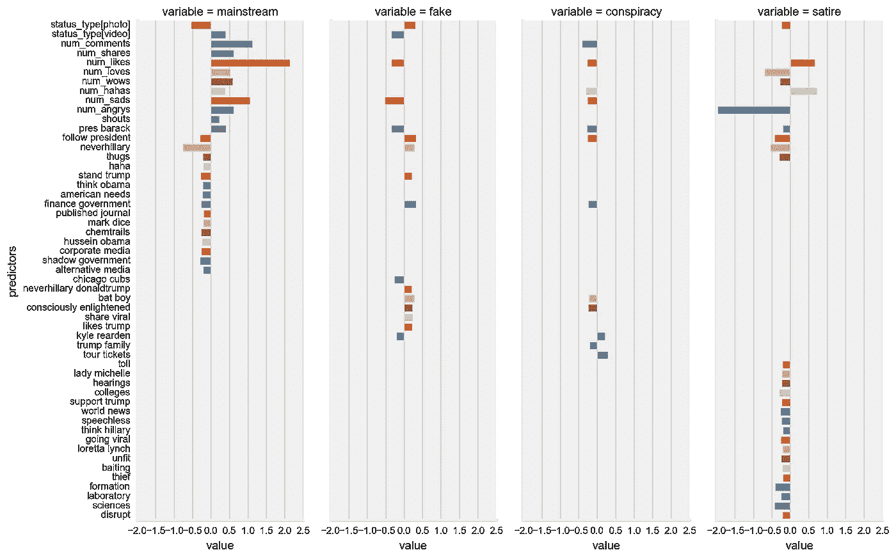

**Figure 17**

根据上述 EDA 中记录的观察结果评估模型系数值，以进一步评估模型的性能。这些评估总结如下:

*   如上所述，主流页面发布视频的频率高于所有其他类型的新闻(图 4)。在检查模型系数时，这一观察结果反映在主流视频的模型系数(0.403)相对较高，而其他类型新闻的视频系数(-0.344 至 0.032)(图 17)。
*   选举后，假新闻帖子的比例明显下降(图 5)。这一观察结果反映在总统选举前的假新闻系数比总统选举后的假新闻系数相对较高(反映为总统选举后假新闻系数下降了 4.5%)。
*   此外，正如预期的那样，由于一周中不同类型的新闻中的帖子频率变化很小(图 8)，一周中各天的模型系数在不同类型的新闻中变化很小(即在-0.078 到 0.080 之间)。
*   正如所料，除了讽刺新闻(图 9)之外，不同类型的新闻在一天的几个小时内的帖子模式几乎没有差异，与讽刺新闻的模型系数(-0.138)相比，主流、虚假和阴谋新闻的一天几个小时的模型系数相对较低(-0.025 至 0.059)。
*   该模型还证实了或许是最不令人惊讶的观察结果。也就是说，与其他类型新闻的平均点击数相比，讽刺文章的平均点击数明显更高(图 10)。这一观察结果反映在讽刺的哈哈模型系数(0.725)相对于所有其他类型新闻的哈哈系数(-0.307 到 0.394)较高(图 17)。
*   在审查份额系数时，假新闻(0.036)和阴谋新闻(0.162)的数值实际上低于主流新闻(0.615)和讽刺新闻(0.183)。从页面层面来看，这一结果与预期相矛盾，预期是基于观察到高参与度虚假和阴谋帖子的份额比例高于高参与度主流和讽刺帖子的份额比例(图 11)。然而，在进一步检查后，主流和讽刺新闻的平均份额实际上高于虚假和阴谋新闻的平均份额(图 10)，因此，最初的预期是相反的。

# 结论

*   当依靠由 Melissa Zimdars 博士编制的来源列表来从特定的帖子特征预测《脸书邮报》的新闻类型时，实现了可量化的成功程度。在测试数据集上实现了 57%的平均准确性，测试序列分割为 30%-70%，比基线增加了 16%，ROC 曲线下的区域表明测试数据集上的模型表现良好(图 14)。
*   测试数据集上的低召回值是由模型预测大多数阴谋和讽刺帖子为主流和虚假帖子造成的(图 15 和图 16)。
*   尽管所有类型的新闻只有少数来源发布了大部分总量并获得了大量参与(图 3)，但该模型并没有过度拟合最多产或参与最多的页面的特征，这在测试数据集上按页面对分类和错误分类的帖子进行的审查中得到证实(图 16)。
*   总体而言，最高的模型系数主要与参与类型相关(图 17)。
*   模型系数的值证实了 EDA 中描述的许多观察结果，包括主流新闻更频繁地发布视频(图 4)，总统选举前后假新闻发布的变化(图 5)，一周内不同类型新闻发布的低变化(图 8)，以及讽刺新闻的独特特征(即一天中几个小时的独特发布模式以及与其他类型新闻相比每个帖子的平均哈哈数较高)(图 9 和图 10)。

# 未来的工作

*   使用更多的帖子、消息和新闻页面来校准和验证模型，其中帖子数据集在新闻类型中的采样比当前数据集更均匀。校准和验证后，确认模型的重要预测因素是否发生了变化。
*   改变模型中使用的消息文本中单词的数量和类型。此外，可能包括脸书链接名称的 n 元语法。
*   检查数据集中预先分类的帖子的内容，如有必要，更正标签。
*   评估其他要素工程选项，以与套索正则化的性能进行比较。
*   使用 GridSearch 改变正则化程度(即 C 参数)。

# 更多信息

更多信息请参考我最近做的[技术报告](https://github.com/lukearmbruster/GA-DSI-4-Capstone_Project/blob/master/DSI_Capstone_Technical_Report.ipynb)和 Python 代码或者[演示](https://docs.google.com/presentation/d/1ZGF9nfiR4TT_wyTAbSi9_-NnaK7VUG8auo9ITJDpiJg/edit?usp=sharing)。这部作品的延伸也可以在 [Tableau Public](https://public.tableau.com/profile/luke.armbruster3389#!/) 上看到。