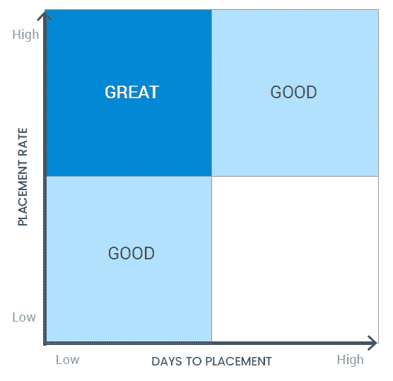

# 在高管搜索中，你只需要跟踪两个指标

> 原文：<https://towardsdatascience.com/the-only-2-metrics-you-need-to-track-in-executive-search-b98d37bbbc66?source=collection_archive---------17----------------------->

在招聘中，度量标准可以作为一种揭示性的绩效衡量标准。

> 它们还会让你偏离任何招聘项目的最终目标:尽快安排最好的候选人。

换句话说，做你的客户雇你做的事情。

考虑到这一点，招聘是一个相当简单的做法。但是，许多搜索公司已经决定关注那些不能真正衡量成功的东西。一大堆额外的、销售类型的指标已经悄悄进入招聘:打电话、发邮件、收简历——这些只是达到目的的手段。虽然跟踪这些活动当然是可以接受的，但是用这些指标来定义成功是不合适的。

归根结底，您的客户并不关心这些指标。充其量，它们是借口(“看看我做的所有活动！”)只有在你没有快速安排候选人的时候才会出现。工作和完成工作是有区别的。活动不等于生产力。最终，你如何快速有效地安置候选人决定了你对客户的价值——而不是需要付出多少努力。

**两个指标——安置率(“PR”)和安置天数(“DTP”)——应该定义一家公司的表现。**

以下是衡量这两个关键指标将如何帮助你的搜索公司确定什么是有效的，什么是无效的。

# **简单是关键。**

确定安置率就像问一个是或否的问题一样简单:安置完成了吗？要么是一家猎头公司安排了一名候选人(是)，要么是内部招聘(否)，要么是该公司被解雇(否)。安置率的计算方法如下:

**安置率** =安置总数/项目总数

平均安置天数衡量的是进行一次安置所需的平均时间。计算方法如下:

**安置天数** =安置项目总天数/安置项目总数

这两个简单的指标提供了对有效性和效率的真实测量。跟踪他们——你可以自己做，也可以用招聘软件如[时钟](https://clockworkrecruiting.com/?utm_source=medium&utm_medium=post&utm_campaign=two_metrics_1018)来做——让你的猎头公司衡量什么是真正重要的。这也是一种简单的方法，可以展示公司内部的优秀员工，让人们专注于重要的事情。

# **跟踪这两个简单的指标有助于赢得工作并建立一种受驱动的工作场所文化。**

当一个潜在客户找到你的猎头公司，要求你为他们的软件公司招聘一名营销副总裁时，你应该能够说，“是的，我们绝对可以帮忙。根据与您的项目类似的 31 个安置，我们的平均安置天数为 86 天。我们这类搜索的安置率是 94%。”

像这样的回答会让你的潜在客户知道你有成功的记录，并使用数据作为业绩的真正衡量标准。这可能看起来很激进，但实际上，它只是关注于正确的指标。

不跟踪这些指标的公司可能会带着一个懒惰的粗略估计接近客户，比如，“这应该需要，嗯…三到六个月的时间。”

> 像这样半心半意的推销不会给你带来很多客户。

除此之外，在内部创造宽松的期望会对你的招聘团队的表现产生反作用。如果招聘人员已经进行了三个月的搜索，但觉得在达到“大概”估计之前还有三个月左右的时间，那就没有紧迫感。他们会高兴地提前 15 分钟离开，认为他们有足够的时间来完成搜索。

> 但是当你把这两个关键指标带入等式时，它量化了生产力。它可以改变公司文化。

如果你衡量的是平均水平，并设定了这样的期望，即你公司的每个人在项目的 DTP 和 PR 方面都应该高于平均水平，那么你正在培养一种卓越的文化。你的团队知道他们是如何被衡量的，并且知道唯一真正重要的事情是做好布局并且高效地做。他们会竭尽全力完成工作，在 DTP 和 PR 方面达到“高于平均水平”。

**如果这需要 10 个电话或 1000 个电话，那就这样吧。**

有一种方法来衡量表现也有助于你奖励优秀。对表现优异的员工实施奖金制度，根据他们的 PR 和 DTP 平均值与同事进行比较。你可以很容易地在下图中绘制出你公司的平均公关和 DPT。

那些表现高于平均水平的人是“伟大的”或你的“左上表现者”。

只有其中一项指标高于平均水平的人属于“好”的类别。

那些在这两项指标上都没有超过平均水平的人需要加快步伐。

瞧，你有了一个简单的、指标驱动的方法来激励优秀的绩效。

真正变得更好并持续发展业务的唯一方法是跟踪这两个指标，并让自己成为左上方的表现者。

> 记住，最终，客户只关心你是否能快速找到一个好的候选人。

关注正确的指标将有助于您的公司实现目标。