# 音乐事物的顺序

> 原文：<https://towardsdatascience.com/the-order-of-musical-things-4ccdb3450d76?source=collection_archive---------6----------------------->


## 对 18，000 条 Pitchfork 评论的分析

我记得读过的第一篇 Pitchfork 文章是大卫·克洛斯的特写，[专辑，在阅读过度紧张的 Pitchfork 评论](http://pitchfork.com/features/guest-lists/6044-david-cross-albums-to-listen-to-while-reading-overwrought-pitchfork-reviews/)时听，它嘲笑了该网站的多音节吉他粉碎，这是一种将单词打包成沙丁鱼罐头的风格。在其最佳状态下，Pitchfork 熟练地完成了艺术评论家的一项工作，即赋予作品以意义。但这个网站一直遭受着口头烟火的副作用，要么令人眼花缭乱，要么令人焦头烂额——对火星沃尔塔的*哑巴弗朗西斯*的评估是“不顾一切地想要尽可能地毗连，结果是一堆同质的意识流浮夸”，两者兼而有之。即使诞生才几年，Pitchfork 就已经产生了足够多的自我模仿，以至于 Cross 可以让网站的档案做很多讽刺性的提升:

> 一边读着《动物评论》的歌曲《大钳》。(以下是一个简短的摘录):“最柔和的声音”将清晰的吉他声音层层叠叠，塔雷和贝尔在上面和谐地低语，仿佛在对着从边远地区小溪的皮肤窥视他们的视觉唱歌。他们质朴、神秘的声音和他们周围几乎没有受到干扰的森林表明，无论是什么样的鬼魂居住在这些森林里，他们都非常乐意听一两首摇篮曲。同样，史诗《拜访朋友》聚集了面目全非、变异的幽灵(即，二人组奇怪地操纵了声音)，以树顶的面目盘旋在他们垂死的火上。”为什么不听听蒂沙拉·奎尔费瑟的《我变成了我们》。世界上唯一一个生活在铁肺里的三倍黄金销量的美国土著艺术家的致命和密封的渴望。这就好像刚刚死去，仍然是纯洁的天使，把手伸进圣母的喉咙，轻轻地发出人类此生希望听到的最甜美、最哀怨的声音。评分:7.17

让 Pitchfork 超越其紫色散文的是其令人难以置信的精确评级系统，即相信它可以以分米精度识别每张专辑的好坏程度。Pitchfork 总是提供比模糊的暗示更多的东西，比如某样东西属于四颗星附近，并承诺更精确的东西，暗示着，更真实的东西。

今年 5 月，一位名为诺兰·康威的数据科学家搜集并上传了 18000 条 Pitchfork 评论，并将它们放到了 Kaggle 上。问 Pitchfork 的评分系统(我会将其与一般的书面批评区分开来)是否有一种可识别的方法不同于问这种方法是否可以通过数据分析来识别。但是，如果 Pitchfork 的大量评论的分数很容易通过图表和代码显示出来，这将比克罗斯先生所能收集到的任何东西都更具讽刺性。

这是我们数据集的鸟瞰图，是 R:

```
##      score        best_new_music                   author     
##  Min.   : 0.000   Min.   :0.00000   joe tangari       :  815  
##  1st Qu.: 6.400   1st Qu.:0.00000   stephen m. deusner:  725  
##  Median : 7.200   Median :0.00000   ian cohen         :  699  
##  Mean   : 7.006   Mean   :0.05128   brian howe        :  500  
##  3rd Qu.: 7.800   3rd Qu.:0.00000   mark richardson   :  476  
##  Max.   :10.000   Max.   :1.00000   stuart berman     :  445  
##                                     (Other)           :14729  
##               author_type          pub_date      pub_weekday   
##  contributor        :12420   2000-03-31:   15   Min.   :0.000  
##                     : 3904   2000-04-30:   14   1st Qu.:1.000  
##  senior editor      :  486   2001-03-31:   13   Median :2.000  
##  executive editor   :  475   1999-04-20:   12   Mean   :2.107  
##  senior staff writer:  439   2001-02-20:   11   3rd Qu.:3.000  
##  contributing editor:  210   1999-06-08:   10   Max.   :6.000  
##  (Other)            :  455   (Other)   :18314                  
##     pub_day        pub_month         pub_year             genre     
##  Min.   : 1.00   Min.   : 1.000   Min.   :1999   rock        :7815  
##  1st Qu.: 8.00   1st Qu.: 3.000   1st Qu.:2005   electronic  :2900  
##  Median :15.00   Median : 6.000   Median :2009               :2365  
##  Mean   :15.53   Mean   : 6.283   Mean   :2009   rap         :1413  
##  3rd Qu.:23.00   3rd Qu.: 9.000   3rd Qu.:2013   experimental:1141  
##  Max.   :31.00   Max.   :12.000   Max.   :2017   pop/r&b     :1128  
##                                                  (Other)     :1627  
##            label         diversity          length      
##  self-released:  419   Min.   :0.0000   Min.   :   0.0  
##  drag city    :  263   1st Qu.:0.5448   1st Qu.: 498.0  
##  sub pop      :  261   Median :0.5778   Median : 604.0  
##  thrill jockey:  241   Mean   :0.5771   Mean   : 650.1  
##  merge        :  231   3rd Qu.:0.6108   3rd Qu.: 746.0  
##  warp         :  210   Max.   :0.8889   Max.   :3688.0  
##  (Other)      :16764
```

已经出现了一些问题:

*   汇编比比皆是，“各种艺术家”有 687 张专辑。最受欢迎的团体/艺术家由声音引导。
*   一张专辑入选 Pitchfork 的年度年终最佳新音乐是由 1 来表示的，而不是由 BNM 排行榜中的排名来表示的，这太糟糕了，但康威先生想到将这一点包括在内是件好事。
*   摘要功能中网站的所有顶级发布日都来自 Pitchfork 的早期，Pitchfork 成立于 1999 年 1 月。
*   DJ Kicks mixtapes 是评论最多的专辑系列。
*   太多的艺术家制作了以罗马数字命名的专辑系列。
*   Monteal 的 20 张专辑看起来太多了。

分数是这样下降的:

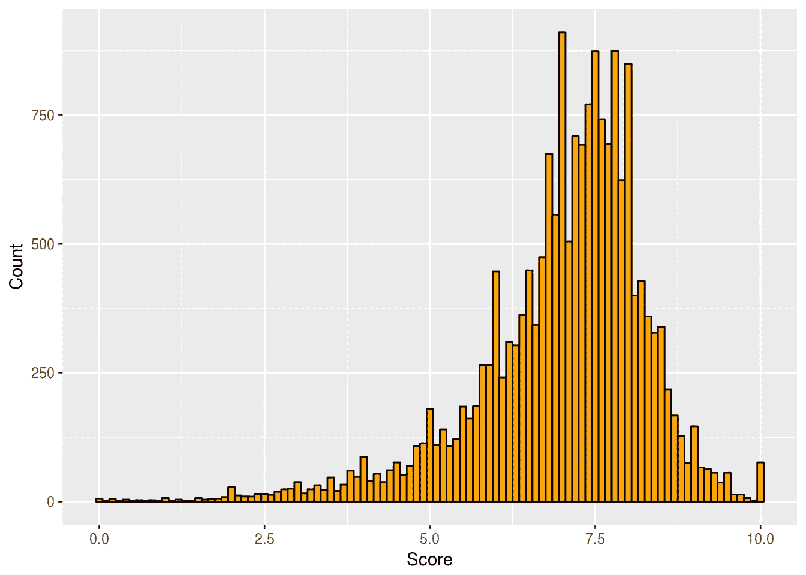

或者准确地说:

```
##Min. 1st Qu.  Median    Mean 3rd Qu.    Max. 
##0.000   6.400   7.200   7.006   7.800  10.000
```

左偏的数据几乎是正常的，这意味着我们可以使用老师教给我们的所有常用的统计技巧。Pitchfork 的评分似乎是曲线型的——如果你发行一张专辑，你可能会得到接近 c 的分数。

需要注意的是，数据集包含许多具有重叠行的专辑，以说明每个不同的流派类别(一张电台司令专辑有他妈的 20 行)，并且许多行被删除，以便专辑不会出现多次(例如，20)，Pitchfork 语料库中的流派分配相应地细分如下:

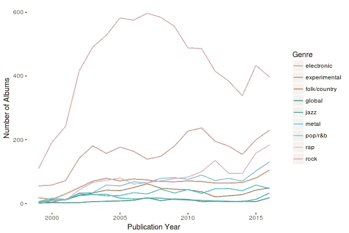

这张图表可能会诱使人们开始思考这些类别意味着什么——“电子”是否是一种真正的音乐类型，为什么非美国音乐似乎被归类在原始的“全球”类别下，Pitchfork 的批评如此集中于摇滚意味着什么，这一切都说明了音乐的状态。克罗斯的讽刺作品更多地反映了 Pitchfork 的评论并不像约翰·埃利奥特·加德纳(John Elliot Gardner)的评论那样是关于音乐的，因此清唱剧被分解到组件层面。如果我们*屈服于这种诱惑，我们中的一个人可能会说，也许爵士乐很少受到关注，因为 Pitchfork 的机构不是为处理这种程度的音乐深度而建立的，所以它服从于那些意义在于文化和娱乐而不是真正艺术的平衡的项目，音乐已经变得更像娱乐而不是艺术，这似乎只是可能，但并不确定。从这张图表中我们能看到的是，Pitchfork 评论了很多摇滚，但它也越来越多地评论其他音乐流派。*

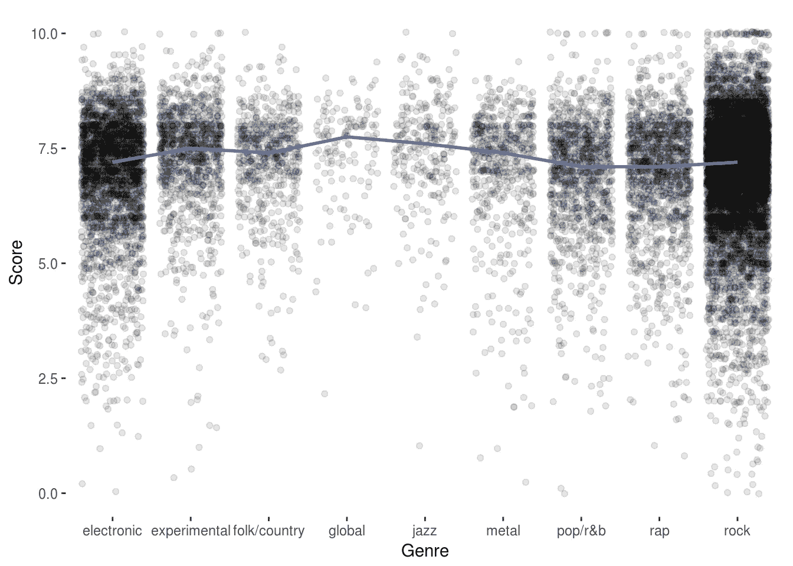

Medium will only let place your image in the center or on the left side. You cannot place it on the right side. Lol.

乍一看，类型似乎对 Pitchfork 如何分配分数并没有太大影响。问题是，在处理数据时，应该对眼神给予多大的重视。在很大程度上，眼神已经取代了以前流行的测试重要性的方法。看到环球和爵士得分的小幅上升了吗？这有关系吗？我可以证明，对这些数据进行显著性测试的结果是肯定的。全球类别有 144 篇评论。这意味着你必须从其他类别中抽取 144 篇文章，看看它们的平均分是否足够相似，以至于它们不是随机发生的。如果你这样做，测试会告诉你它们*实际上是*非常重要。但这是 2017 年——没人再关心 p 值了，但它们提供了一个有趣的紧张点。

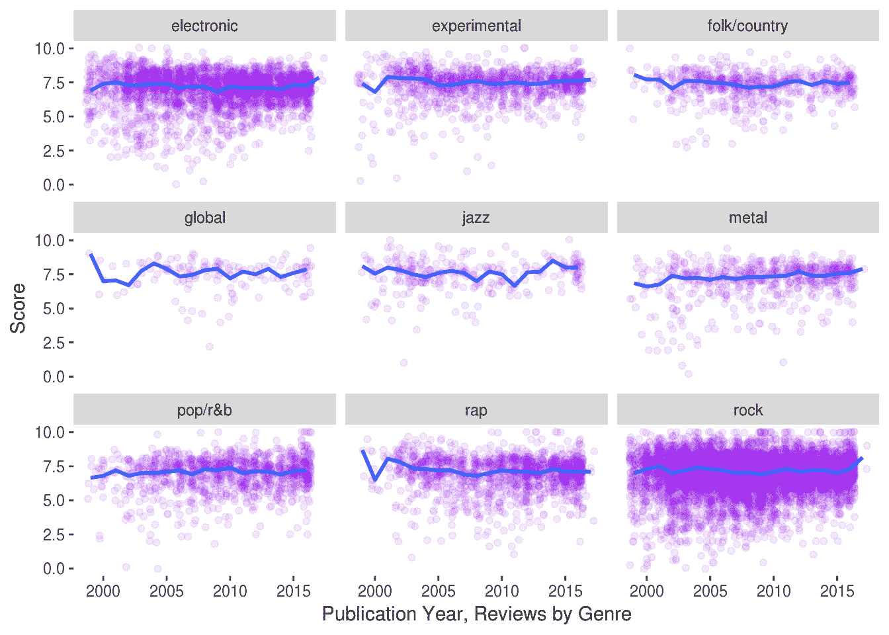

Reviews by year and genre. The blue line is the mean score.

我们可以假设，不同的评论家群体对他们的主题或多或少比其他人宽容，但在我们开始这一切之前，请允许我转移话题，向你介绍作家的当代状况:

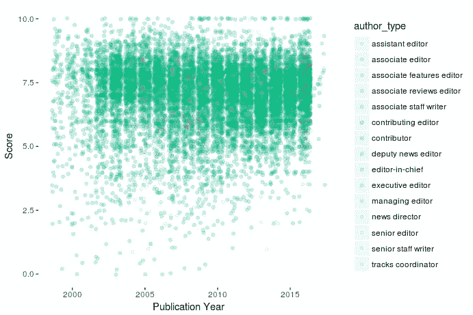

这是一个偶然的视觉化现象，开始是一个关于作者类型的分数如何分解的问题，结果是我见过的现代媒体对自由职业者依赖的最鲜明的图像。不幸的是，这当然不是 Pitchfork 特有的。作为一个在其他出版物的图表中以绿点自居的人，这是一颗美丽而可怕的超新星。

但是即使碎片被扫除，也只有另一个模棱两可的非结论。

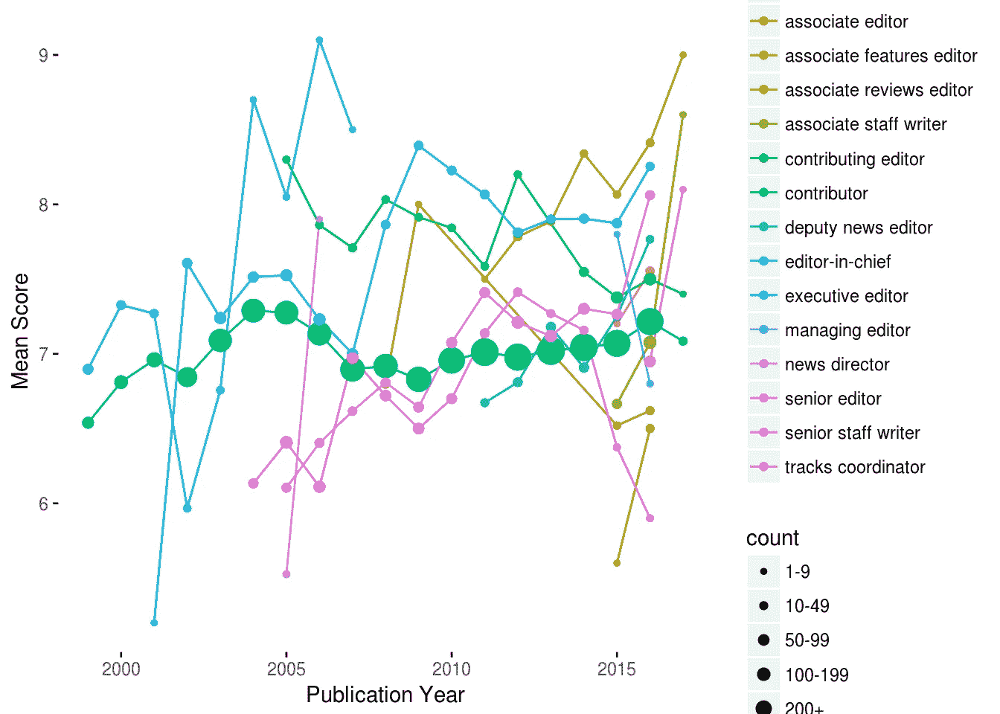

这与体裁假说有着同样的局限性，也就是说，也许*是*作者之间的一些重大差异，但这是一个没有反驳机会的猜想。根据手头的数据，认为一个助理评论编辑是一个特别阿谀奉承的批评家是不合理的。因此，我们可能会找到另一种方法，首先看看得分是否与多产有关。


Pitchfork 有一群忠实的作家；人均评论数的中位数是 123。这里的假设是，随着作家获得经验，他们会润色和强化自己的观点，或者他们会明智和软化自己对他人缺点的观点——无论哪种方式，事情都会发生变化。

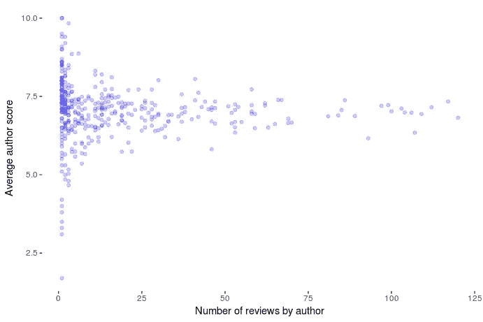

事实证明，这两个都不是真的。相反，作者被统计学的铁律所束缚。在这种情况下，规则是中心极限定理。CLT 是统计定理的基石，它指出，如果你有任何分布的数据，你从这些数据中取样，取这些样本的平均值，这些数据的分布将是一个正态的钟形曲线。谁不为在野外看到数学现实而感到有点眩晕呢，瞧，它就在这里。你写的评论越多，你的平均分就越接近 7.0 左右的平均值。(顺便说一句，正如我们的老朋友帕累托所承诺的那样，最多产的 20%的干草叉评论作者负责评论总产量的 80%。)

与高分相关的是评论的长度。


这很有趣，但它并没有真正让我们预测未来；它没有告知我们对 Pitchfork 高度评价的音乐类型的理解，只是一旦*已经*评价了它们，如果分数更高，评价可能会更长。从逻辑上讲，这是有道理的:一个作家会滔滔不绝地谈论他/她已经爱上的一张专辑，而一张糟糕的专辑更有可能(尽管肯定不确定)被迅速打发掉。例如，看到左下角的那条路了吗？如果我没记错的话，那应该是人造革的 40 强女主人 Jet，Pitchfork 对它的评价是 0 分，只不过是一张黑猩猩往自己嘴里撒尿的. gif 文件。

```
subset(reviews, score == 0 & length == 0)reviewid   title      artist
605494     shine on   jet
```

英雄联盟

下面简要介绍另一系列寻找分数和变量之间相关性的失败尝试。例如，这个变量:

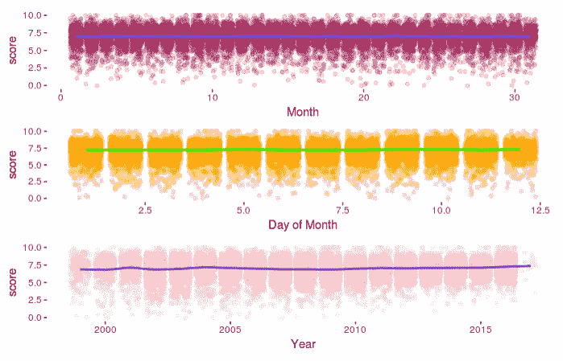

平均分一直保持稳定。即使是艺术家达到顶峰然后下降的假设，也很容易被反驳，因此可以通过新专辑在艺术家作品序列中的位置来预测分数，正如这张热图 quadriptych 所示:

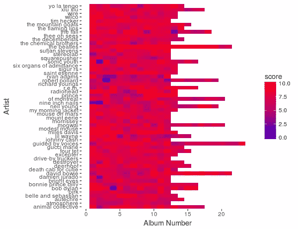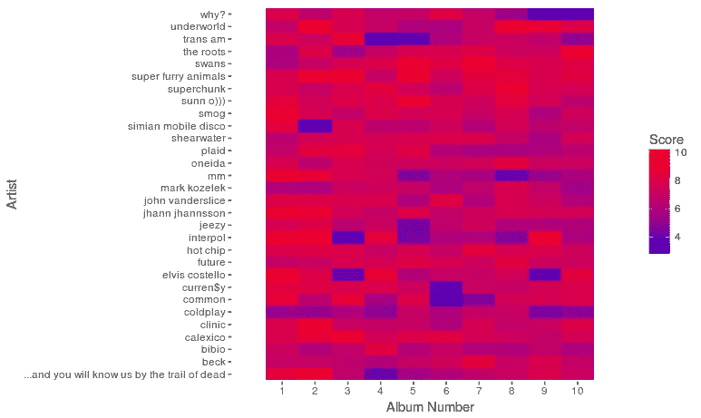

Left: a messy heatmap of album scores by album number. Right: a clean heatmap of scores for artists with exactly ten albums. It turns out you CAN post pictures on the right side on Medium but only if you simultaneously upload them with another picture. I don’t know how this is anything but a bug.

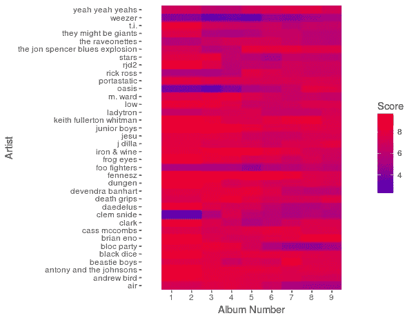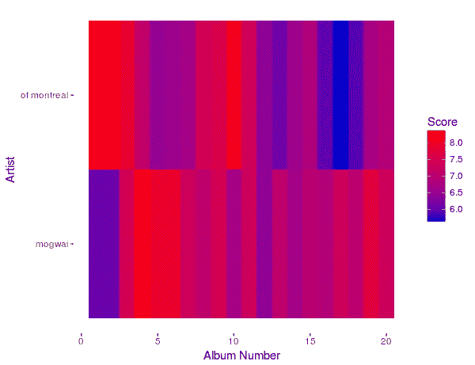

Left: scores for artists with nine albums. Right: scores for artists for artists with 20 albums. You get the idea.

如果你从这些热图中发现任何信息有困难，我会让它变得更容易。下面，你可以看到所有拥有超过八张专辑的艺术家的总体情况，并看到随着艺术家曲目的增加，他们在分数方面没有太大变化。(Medium 有时不能很好地与第三方合作，而且很明显，R 中用于制作该图的 viz 库[以及 javascript 包装器的极少数选择之一]需要登录。如果你在下面看到的看起来不太对，一个捕捉到它大致主旨的截图是[这里](http://imgur.com/a/yq9LE)。)

Mouse over each data point for details.

还记得几个散点图吗？当时我们努力观察体裁是否与更高的评论分数相关联？我说我进行了统计测试，看看事实上是否如此。这是测试的代码。你不需要密切关注它，只需要了解它的周长:

```
set.seed(1984)myVars = c(‘genre’, ‘score’)jazz <- subset(reviews, genre == ‘jazz’)[myVars]
global <- subset(reviews, genre == ‘global’)[myVars]
rock <- subset(reviews, genre == ‘rock’)[myVars][sample(1:nrow(subset(reviews, genre == ‘rock’)), 144,
 replace=FALSE),]
rap <- subset(reviews, genre == ‘rap’)[myVars][sample(1:nrow(subset(reviews, genre == ‘rap’)), 144,
 replace=FALSE),]
electronic <- subset(reviews, genre == ‘electronic’)[myVars][sample(1:nrow(subset(reviews, genre == ‘electronic’)), 144,replace=FALSE),]
pop <- subset(reviews, genre == ‘pop/r&b’)[myVars][sample(1:nrow(subset(reviews, genre == ‘pop/r&b’)), 144,replace=FALSE),]
metal <- subset(reviews, genre == ‘metal’)[myVars][sample(1:nrow(subset(reviews, genre == ‘metal’)), 144,replace=FALSE),]
experimental <- subset(reviews, genre == ‘experimental’)[myVars][sample(1:nrow(subset(reviews, genre == ‘experimental’)), 144,replace=FALSE),]
country <- subset(reviews, genre == ‘folk/country’)[myVars][sample(1:nrow(subset(reviews, genre == ‘folk/country’)), 144,replace=FALSE),]testing <- rbind(jazz, global, rap, rock, 
 electronic, pop, metal, experimental, country)testing.numbers <- group_by(testing, genre)test <- lm(score ~ genre, testing)anova(test)
```

所有这些代码都产生了一堆输出，看起来像是:

```
Call:
lm(formula = score ~ genre, data = testing)

Residuals:
    Min      1Q  Median      3Q     Max 
-6.8465 -0.5593  0.2375  0.8104  3.0722 

Coefficients:
                    Estimate Std. Error t value Pr(>|t|)    
(Intercept)        6.9458333  0.1020924  68.035  < 2e-16 ***
genreexperimental  0.4166667  0.1443805   2.886 0.003962 ** 
genrefolk/country  0.3909722  0.1443805   2.708 0.006852 ** 
genreglobal        0.4854167  0.1443805   3.362 0.000794 ***
genrejazz          0.5134394  0.1260184   4.074 4.87e-05 ***
genremetal        -0.0562500  0.1443805  -0.390 0.696894    
genrepop/r&b       0.0006944  0.1443805   0.005 0.996163    
genrerap          -0.2604167  0.1443805  -1.804 0.071493 .  
genrerock         -0.0180556  0.1443805  -0.125 0.900497    
---
Signif. codes:  0 ‘***’ 0.001 ‘**’ 0.01 ‘*’ 0.05 ‘.’ 0.1 ‘ ’ 1

Residual standard error: 1.225 on 1418 degrees of freedom
Multiple R-squared:  0.04874,	Adjusted R-squared:  0.04337 
F-statistic: 9.081 on 8 and 1418 DF,  p-value: 3.106e-12

Analysis of Variance Table

Response: score
            Df  Sum Sq Mean Sq F value    Pr(>F)    
genre        8  109.04 13.6302  9.0814 3.106e-12 ***
Residuals 1418 2128.26  1.5009
```

在英语中，这意味着某些体裁与更高的分数相关，但只是分数的一部分。这是几十行代码，输出几十行结果，但结果并不起眼，含糊不清，它是你刚刚阅读的所有内容的简写——一个又一个图表，总共几百行代码和 RStudio 中的许多小时，产生了许多漂亮的颜色，却没有多少信息。

我在玩数据集的时候注意到了一些东西，我喜欢它的地方是，在所有的分析和与 R 库的对抗、刻面包装以及显示几乎没有实质性相关性的多元散点图和热图之后，也许从一个 800 兆字节的 18，000 行数据的文件中唯一重要的洞察可以从一个只有四个单词和两个数字的单行命令中收集到，

```
head(subset(reviews, score == 10), 20) artist                  album                               pub_year
beastie boys            paul's boutique                      2002
boards of canada        music has the right to children      2015
bob dylan               blood on the tracks                  2009
bonnie prince billy     i see a darkness                     2004
brian eno               another green world                  2016
bruce springsteen       born to run: 30th anniversary ed...  1999
can                     tago mago [40th anniversary edition] 2016
dangelo                 voodoo                               2005 
david bowie             "heroes"                             2011
david bowie             low                                  2012
dj shadow               endtroducing... [deluxe edition]     2016
elvis costello & the attractions   this year's model         2016
fleetwood mac           rumours                              2005
glenn branca            the ascension                        2002
gza                     liquid swords: chess box deluxe ed...2013
james brown             live at the apollo [expanded ed...]  2003
j dilla                 donuts (45 box set)                  2012
john coltrane           the olatunji concert: the last li... 2004
...and you will kno...  source tags and codes                2002
a tribe called quest    people's instinctive travels and...  2015
```

以下是这 76 张专辑中满分为 10 分的前 20 张。在 20 张专辑中，除了一张之外，其他都是在专辑(或者专辑中的音乐，如果是选集/再版)实际发行多年后创作的。那是在作者开始怀念在泽西城外听着老板哼唱长大的岁月之后，在这张专辑被引入国家经典之后，在关于这是否是一件伟大艺术作品的争论尘埃落定之后。具有讽刺意味的是，我们在数据科学方面的考察的关键教训是，我们不需要运行一个测试或绘制一个图表就可以知道，没有什么比专辑发行日期和评论日期之间的差异更能预测谁会得到 10 分。这是为什么呢？2016 年给《赛道上的血》打分还有什么意义？也许这在一定程度上是一种信号，表明作者意识到一件事有多重要，当他们看到它时，他们有批判的眼光知道它是 10 分。但这是 Pitchfork，根据我们的计算，分数越高，作者就越有可能为一张专辑的荣耀唱赞歌。分配一个 10 就是做一个十字的标记，这就是为什么塔戈玛戈现在在干草叉的礼拜仪式中，被认可为完美而神圣。7.3 和 7.4 有什么区别？其实没什么，但小数点的存在只是为了给人留下这样的印象:对流行音乐的评估是用科学的严谨来证明的，并输出准确、客观、非人为的结果——强加于或多或少无序的事物上的任意秩序实际上一点也不任意。但 9.9 和 10 的区别，是衡量和崇拜的区别。

作为一个创造内容的人，我在法律上有义务经营一份个人时事通讯。可以在这里报名[](https://tinyletter.com/asthompson)**。**