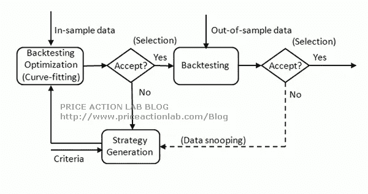
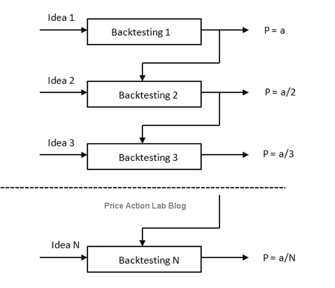

# 难以捉摸的市场边缘的悖论

> 原文：<https://towardsdatascience.com/the-paradox-of-the-elusive-market-edge-5e6b57b04398?source=collection_archive---------4----------------------->

你尝试得越多，成功的机会就越高。人们可能会认为，这一适用于日常生活的经验证的启发法也适用于试图在市场中寻找优势的时候。但是这种启发不适用于这种情况，实际上，这是失败的原因。其原因是数据挖掘偏差，当一个人试图在办公室找到一支丢失的钢笔或存储在计算机磁盘上的文件时，这种影响并不存在。

**数据挖掘偏差**

交易者和投资者通常试图通过测试历史数据的各种想法来找到市场边缘，以确定他们的历史盈利能力。实现这一点的过程被称为*回溯测试*。这个想法原则上很简单:开发一个数学模型，然后用历史数据进行测试。然后，使用回溯测试中未使用的新数据和各种其他验证方法来验证性能。如果模型性能不令人满意，则要么对其进行修改，要么开始寻找新的模型。这一过程的示意图如下所示[1]。

Figure 1\. Backtesting process. Source: [Fooled By Technical Analysis](http://www.priceactionlab.com/Blog/the-book/)

如上图所示，数据挖掘偏差有三个主要组成部分。第一个原因是基于历史数据的曲线拟合模型。注意，所有模型都是关于某个任意目标函数的数据的曲线拟合。问题是它们是否也过度拟合，但如果其他两种形式的偏差占主导地位，这可能并不重要。数据挖掘偏差的第二个组成部分是第一次回测步骤后的选择偏差，这是因为接受了一个潜在的优势，同时拒绝了许多其他优势。在对看不见的数据进行性能验证后，选择偏差再次被引入，也称为样本外偏差。

数据挖掘偏见的第三个也是最可怕的组成部分是由于数据窥探。当模型(策略)在验证步骤后被拒绝，流程重新开始时，就会出现这种情况。通常，没有人会在第一次失败后永远放弃，但大多数人会无情地利用现代工具挖掘数据，以发现有利可图的优势。在这种情况下，所有的验证工具都成为过程的一部分，不再有效。

一言以蔽之，当你听到有人声称他们进行了样本外测试，并发现了良好的结果，不仅是在金融领域，而是在任何领域，你应该问问他们在此之前拒绝了多少模型。更糟糕的是:你应该问他们是否知道有多少基于相同数据的模型被所有有抱负的量化交易者和投资者所拒绝。如果他们知道，那么已经提出了一些方法来调整数据挖掘偏差的验证统计，但在大多数情况下，这甚至是不需要的，因为偏差已经很大，没有验证测试是鲁棒的。关键是被拒绝的模型可能是好的(第二类错误)，或者被接受的模型实际上可能是坏的(第一类错误)。**你永远不会知道，因为没有办法知道整个地球上的集体数据挖掘偏见。**下面的图 2 显示了这种累积数据挖掘偏差的原理。

Figure 2\. Probability P of discovering an edge as a function of backtesting trials N

在图 2 中，“a”是 N、试验次数以及与数据和模型有关的其他参数的某个有界非线性函数。关键在于，随着 N 变大，找到真正边缘的概率 P 变为零。**与直觉相反的结果是，不断回溯测试新想法会降低找到优势的几率**。这对于人工回测来说是正确的，但在挖掘数据以发现市场优势的机器学习程序中也更明显。(详见[本文](http://www.priceactionlab.com/Blog/2012/06/fooled-by-randomness-through-selection-bias/)。)

那么，我们如何应对难以捉摸的市场边缘的悖论呢？一种解决方法是，只有当有一个独特的想法不太可能被其他人发现时，才使用回溯测试。这很难，但却是可能的。当经常使用数据挖掘时，另一个补救方法是通过使用更高级的测试来最小化数据挖掘偏差，而不是试图估计它。一般来说，数据挖掘偏倚是无法估计的，因为试验的真实数量及其来源都是未知的。

关于回溯测试的这些和其他事实，以及处理数据挖掘偏差的例子和规则，可以在[1]中找到。

[1]哈里斯。m .，被技术分析愚弄:图表、回溯测试和数据挖掘的风险，2015 年，[仅在线提供](http://www.priceactionlab.com/Blog/the-book/)。

***注来自《走向数据科学》的编辑:*** *虽然我们允许独立作者根据我们的* [*规则和指导方针*](/questions-96667b06af5) *发表文章，但我们不认可每个作者的贡献。你不应该在没有寻求专业建议的情况下依赖一个作者的作品。详见我们的* [*读者术语*](/readers-terms-b5d780a700a4) *。*

**关于作者:**迈克尔·哈里斯(Michael Harris)是一名交易员和畅销书作家。他也是 17 年前第一个识别价格行为无参数模式的商业软件的开发者。在过去的七年里，他一直致力于开发 [DLPAL](http://www.priceactionlab.com/Blog/price-action-lab-software/) ，这是一个软件程序，可以用来识别市场数据中的短期异常，与固定模型和机器学习模型一起使用。点击此处了解更多信息。