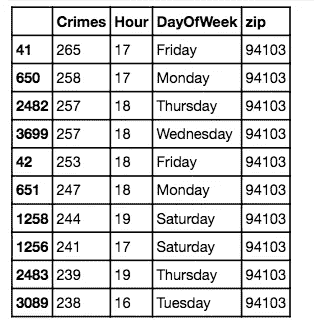
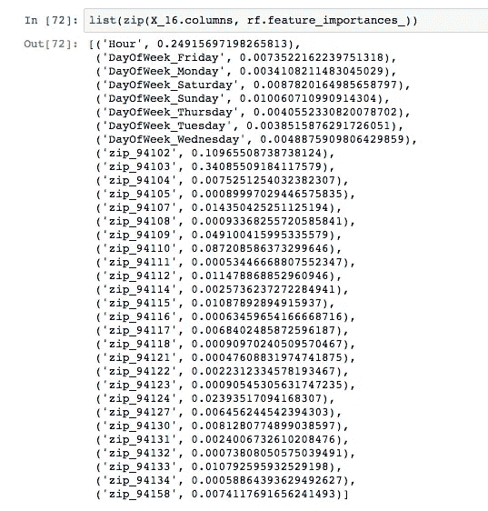

# 数据科学出了问题:预测性警务是一种大规模杀伤性武器

> 原文：<https://towardsdatascience.com/the-perils-of-predictive-policing-11928a9f1d60?source=collection_archive---------5----------------------->

预测结果[见**互动图**此处。](https://orlandott.github.io/Predictive_Policing/)

Click the link above to see the interactive map.

对于**代码**，请访问本项目回购[这里](https://github.com/orlandott/Predictive_Policing)。

当新技术出现时，我们的道德和法律通常需要一些时间来适应。作为一名社会科学家和训练有素的哲学家，我一直对技术和道德的交集感兴趣。几个月前，我读了凯茜·奥尼尔的书[数学毁灭的武器(链接到我的评论)](http://orlandotorres.org/books.html#wmd)，意识到它的信息太重要了，却被数据科学家忽视了。

我开始这个项目是为了展示我们的新算法所产生的潜在伦理冲突。在每一个可以想象的领域，算法都被用来过滤人。在许多情况下，算法是模糊的，不受质疑的，并且是自我延续的。这就是奥尼尔所说的数学毁灭武器——大规模杀伤性武器。它们从设计上来说是不公平的:它们是我们的偏见变成了代码并被释放出来。最糟糕的是，他们创造了强化上述模型的反馈循环。

我决定创建一个大规模杀伤性武器为说明目的。这个项目旨在尽可能简单明了。这两个目标是，第一，展示创造一个破坏数学的武器是多么容易。其次，帮助有抱负的数据科学家了解项目从开始到结束的过程。我希望人们受到启发，重新思考他们的模型的伦理含义。

对于这个项目，我将创建一个预测警务模型，以确定哪里更有可能发生犯罪。我将展示创建这样一个模型是多么容易，以及为什么它会如此危险。像这样的模型被全美国的警察机构采用。鉴于所有人类固有的普遍的种族主义，鉴于有色人种被警察杀害的可能性已经增加了一倍，这是一个可怕的趋势。以下是数据科学如何让问题变得更糟。

# 数据

这个项目使用的数据是旧金山市的[开放数据](https://datasf.org/opendata/)倡议的一部分，这是对公共政策感兴趣的数据科学家的一个很好的资源。希望更多的城市将继续遵循这一倡议，并使他们的数据公开和机器可读。

2016 年的犯罪数据是这样的:

预测性警务模式，以及大规模杀伤性武器，价值模糊而复杂。他们可以对客户无法理解的技术魔术收取更高的溢价。他们通常使用数百甚至数千个不同的输入变量来进行预测。他们声称这是他们预测如此准确的原因。

我将反其道而行之，以展示大规模杀伤性武器的内部运作，以及制造一个大规模杀伤性武器是多么容易。

我将尝试预测:

给定一周中的第**天**和一天中的第**时间**，在给定的**邮政编码**中将发生的**犯罪事件数量**。

我将在 2016 年的数据上训练我的模型，然后用 2017 年的数据来测试我做得有多好。

在只选择了我想要的变量后，对每个邮政编码每小时每年的犯罪总数求和，得到如下结果:

换句话说，2016 年全年，在邮政编码为 94103 的地区，周五 17:00 至 18:00 之间，共报告了 265 起犯罪事件。

由于我将这些按犯罪数量排序，我们可以看到犯罪数量最高的总是发生在邮政编码为 94103 的地区。这已经给了你一个卖蛇油模型有多容易的暗示:“派警察到 94103 找犯罪！”

然而，这太简单了，如果客户知道我们只是预测已经最常发生的犯罪，没有人会为此付出太多。让我们把它变得更复杂。

# 训练/测试分割

数据科学家通常随机拆分数据进行测试，大约 70%用于训练，30%用于测试。然而，当涉及到时间因素时，通常会按时间顺序将其分开，看看我们是否能够预测未来。我会用 2016 年的数据来看我是否能预测到 2017 年的数据。

测试是机器学习的神奇之处。当我在人口研究所的时候，我们对世界进行预测，然后在一篇论文中提出。没人知道它们是好的预测还是坏的预测，但没人问。如果它们看起来合理、直观，这个项目就会受到称赞。

数据科学更严谨。我们将数据分为训练集和测试集。我们基于训练集创建模型，进行预测，然后将我们的预测与测试集的实际结果进行比较。

我们反复迭代，直到得到更好的结果。然后我们再次迭代，为了更好的准确性，我们愿意牺牲理解。

这是一把双刃剑。对于某些应用程序来说，它可能非常有用。例如，我们不需要确切知道图像识别模型是如何工作的。如果它能在提示时识别出某人的脸，这才是重要的。当我们做出筛选人的决定时，问题就出现了，我们无法向他们解释为什么他们会被选中，或者被歧视。

如果我们告诉某人，他们被解雇是因为我们的模型说他们表现不佳，然后我们无法解释我们的模型是如何工作的，他们永远不能对这个决定提出上诉。如果我们犯了错，谁会知道？如果我们晦涩的模型编码了常见的种族主义、性别歧视或阶级歧视假设，谁能站出来反对这种不公正？

# 尝试五种不同的模型

既然我们已经将数据分成了训练和测试两部分，我们就可以开始评估不同模型的表现了。

**注意**:所有这些模型都有不同的方法来调整它们(超参数)——为了简单起见，我将使用默认值，在这一点上我不会深入讨论，只是要知道通常有一种方法可以提高这些模型的精度。

# 1.线性回归

这是 19 世纪早期的一种快速简单的统计技术。线性模型试图通过数据画一条尽可能适合它的线。这个模型是有价值的，因为它是可以解释的。如果我们愿意，我们可以说每个输入在做出最终预测时有多重要。我们用 2016 年的数据训练模型，进行预测，看看它们与 2017 年的实际犯罪数量有多匹配。

我们的结果表明，我们可以用这个模型预测 63%的犯罪数量。这是一个很好的基线，但是我们可以用更新的技术做得更好。

# 2.随机森林回归量

简而言之，随机森林模型是一堆随机决策树一起工作。

简而言之，决策树就是在最有可能分裂的地方分裂数据，然后选择最有可能的结果。

例如，我们的模型首先注意到星期五是犯罪率最高的一天，而 94103 是犯罪率最高的邮政编码。然后，它检查所有的观察结果，并询问“它发生在星期五吗？”如果答案是“是”,它就预示着一定数量的犯罪。如果答案是“否”,它预测的数字会更小。然后它问“它发生在 94103 年吗？”如果答案是肯定的，预测值会更高，如果答案是否定的，预测值会更低。它以这种方式继续下去，然后对每个不同的输入进行预测。

让我们看看我们做得有多好。

哇哦。我们达到了 80%的准确率，对于额外的三行代码来说已经不错了。

这就是发现每个特征或自变量是多么重要:

这些结果仍有些许可解释之处。我们可以看到，决定这个模型预测的犯罪数量的最重要的特征是它是否是邮政编码 94103，它是一天中的什么时间，以及它是否是邮政编码 94102。它基于所有这些输入的组合来预测将会发生多少犯罪。

# 3.k-最近邻

在 KNN 模型中，我们开始失去解释我们到底是如何得到结果的能力。潜在的理论很容易理解，但解释一个特定的结果是如何产生的却不容易。

KNN 模型是不言自明的。它查看输入的最近“邻居”,并给出与其邻居最相似的答案。

例如，假设我们的模型看到一个输入“星期五，94103，下午 4 点”它可能确定“最近的邻居”是“星期五，94103，下午 5 点”和“星期五，94103，下午 6 点”它将获取在这两个邻居处发生的犯罪数量，对它们进行平均，结果将是我们最初的 4pm 输入的预测。邻居的数量，以及定义“平均”的方法可以有很大的不同，但直觉是相同的。

让我们看看我们是怎么做的:

这次开箱的 KNN 没有我们其他型号的表现好。如果我们找到一个最佳数量的邻居，这可能会有所改善，但我会保持简单，只是移动到下一个模型。

# 4.XGBoost

XGBoost 是一个屡获殊荣的算法，因在 [Kaggle](https://www.kaggle.com/) 比赛中表现出色而闻名。

简单来说，它也是一个树的集合，就像我们上面看到的随机森林。然而，不同之处在于，正如其名称所暗示的，random forest 随机拆分数据。然而，增强的树模型迭代地构造树，并且为了减少误差，对每个后续的树重新加权示例。换句话说，它构建树，比较它们做得有多好，然后构建越来越好的树。

我们精确度的微小提高。但是好到足以转移到下一个模型。

# 5.深度学习——多层感知器

现在我们已经到了无法解释我们是如何得到这些结果的地步。如果有人基于深度学习模型被收取更高的贷款利息，他们问“是什么因素导致了你向我收取的金额？”，我们就没有办法给他们一个答案。

如果我们正在影响人们的生活，并且无法解释原因，这就是数据科学变得非常危险的地方。如果我们犯了一个错误，或者如果我们在模型中引入了我们的偏见，这个模型几乎就是一个黑箱。

我将使用多层感知器回归器来看看我的预测有多准确。我选择了 4 个隐藏层，每个层有 100 个节点。我不会进行随机搜索来找到最佳的超参数，但是正如你所看到的，有很多选项可以调整。

我们现在可以预测一周中某一天某一小时某一邮政编码会发生多少起犯罪，准确率约为 87%。尽管我们甚至没有花时间调优超参数或获取更多数据，我们还是这样做了。

# 讨论

在尝试了五种不同的模型后，我们几乎达到了 90%的准确率。这是用最简单的方法做的。如果我们想改善我们的结果，我们可以做以下事情:

-使用更多的输入变量:天气、人口密度、到酒类商店或无家可归者收容所的距离、每个邮政编码的人口构成等等。

-调整超参数:我们可以进行“网格搜索”,以找到在 KNN 模型中使用的最佳邻居数量，随机森林模型中的树的大小，线性回归模型中使用的正则化以及深度学习模型中的许多选项。

-使用更多数据:2015 年、2014 年和其他年份的可用数据。

如你所见，还有很大的改进空间。但是我的观点是用最少的努力得到最好的模型。我想展示做出这些预测有多容易，以及我们失去可解释性有多快。

如果我们开始向我们预测会有更多犯罪的地区派遣更多的警察，警察就会发现犯罪。然而，如果我们开始向任何地方派遣更多的警察*，他们也会发现更多的犯罪。这仅仅是因为在任何特定地区都有更多的警察试图发现犯罪。*

这意味着我们的模型可能是错误的，但它看起来总是正确的。如果警察已经因为人们固有的种族偏见而经常去某个社区搜查，他们就会发现更多的犯罪。这将意味着模型将一次又一次地把他们送到那里，并将成为一个自我实现的预言。

数据科学家必须开始更加意识到我们的算法可能被滥用。我们必须开始考虑让我们的模型[更加透明](https://www.nytimes.com/2017/11/21/magazine/can-ai-be-taught-to-explain-itself.html)。我们必须意识到我们的模型是如何伤害人们的。我们必须做得更好。

预测结果[见**互动图**此处](https://orlandott.github.io/Predictive_Policing/)。

对于**代码**，请访问此处的本项目回购[。](https://github.com/orlandott/Predictive_Policing)