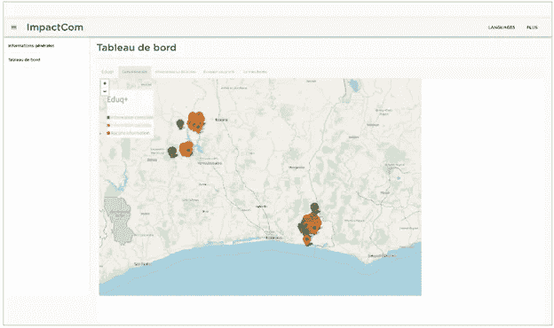
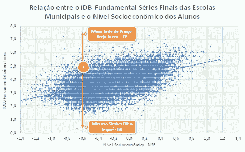

# 数据的力量

> 原文：<https://towardsdatascience.com/the-power-of-data-815a84539c9b?source=collection_archive---------21----------------------->

## 关于数据(或缺乏数据)如何帮助(或失败)发展中国家决策者的思考

# **前言**

上周五，当我站起来在科特迪瓦教育部和 TRECC(一个由雅各布基金会领导的旨在改变可可产区教育的伙伴关系)之间的指导委员会会议上发言时，距离我第一次来到阿比让已经过去了 14 个月。

象牙海岸是一个充满活力的国家，反映了贯穿大部分大陆的矛盾。丰富多样的种族、语言和文化，以及充满武装冲突和政治紧张的历史。咖啡和可可等大宗商品推动了经济的增长，同时伴随着令人震惊的童工水平和令人沮丧的教育成就。

第一次旅行的目的是引发一场讨论，如何将巴西 MGov 的成功经验——Eduq+，一种 [*nudgebot*](https://medium.com/@guilhermefinkelfarblichand/chatbots-vs-nudgebots-49b11e02b462) 发送短信给家长，鼓励他们参与孩子的学校生活——应用于科特迪瓦的学校儿童。对巴西学生的出勤率、学习和成绩进步产生了惊人的影响(给政府带来了超过 1000%的投资回报)，类似的影响能否在撒哈拉以南非洲更具挑战性的环境中复制？

有几个理由相信答案可能是*否*。首先，因为估计约 50%的科特迪瓦父母是文盲。此外，在能够阅读的人中，至少有一半报告说他们不能阅读正式的法语。短信在这种情况下有用吗？第二，因为象牙海岸的教师缺勤率被认为很高——在类似的环境中，教师缺勤率约为 60%——所以让家长参与可能对学习没有任何影响；毕竟，如果学生在学校很少学到东西，那么出勤有什么好处呢？

在接下来的一年里，一台重型机器开始运转，以确保能够成功实现可转移性。我们与当地教育系统的所有利益相关者进行了广泛的磋商，建立了当地的伙伴关系，并对邻国的不成功经验进行了审查，以便为我们的工作提供信息。

三个关键的变化带来了最大的机会，积极的影响在巴西发现将转移到象牙海岸。首先，Eduq+不仅可以通过短信联系到家长，还可以通过语音信息联系到家长。第二，也是最重要的，根据每个参与者的选择，音频信息将以 7 种不同的语言传递——简化法语和 6 种当地方言。第三，教师也将成为 Eduq+的目标，目的是鼓励他们少缺课，更有效地利用课堂时间。

为了了解哪些约束是可转让性的真正关键，每个创新都被随机分配(与宾夕法尼亚大学的 Sharon Wolf 联合进行的一项正在进行的研究)。在一些学校，家长和老师都收不到信息；在其他学校，要么只有老师，要么只有家长会收到信息；在其余情况下，父母和老师都将成为目标。每当父母被分配接收信息时，在这些学校中的一半中，父母被分配接收简化法语的文本信息(没有方言的书面版本)，而在另一半中，父母被分配接收他们选择的语言的音频信息。

目标是跟踪每个版本的 Eduq+对学生出勤率、学习、成绩进步和辍学率的影响。

这就是我要分享的故事开始的时候。

# **缺失数据**

在这个过程的早期，一个非常重要的问题引起了我们的注意:教育部没有关于学生成绩、留级率、辍学率甚至出勤率的系统数据。

在这方面，象牙海岸并不孤单:我敢说，撒哈拉以南非洲没有一个国家系统地跟踪这类数据。即使在像巴西这样的发展中国家，我们开始每年跟踪每所学校的学习情况(T4)也不过是 10 年前的事情。即便如此，出勤率数据通常也无法获得，需要与当地政府合作。

一个教育部没有数据会怎么样？我们做了什么来解决这个问题？

# **丢失数据的一些后果**

当戈亚斯州在高中成绩排名中上升到首位时，教育秘书处将其主要归因于该州在学生连续多天缺课时做出快速反应的政策。据该州称，这被认为是辍学率的最佳预测指标，一旦政策出台，辍学率至少下降了一半。

该州不得不成立一个庞大的工作组，以确保出勤数据能够及时获得。虽然教师每天都以书面形式记录出勤情况，但他们通常只在学年结束时将此类数据输入在线系统，因为那时对早期旷课和辍学采取行动已经太晚了。

尽管听起来令人兴奋，但戈亚斯的政策实际上并不具有可扩展性:教育秘书处内部可以设立的呼叫中心职位数量存在物理限制，而且外包此类服务的成本很高。结果，可能使戈亚斯地位上升的关键政策之一不再存在，也没有被其他州系统地采纳。

在一项旨在创建这一政策的可扩展版本的实验中——使用 Eduq+及时通知父母他们孩子的出勤情况，这是一个与 [Eric Bettinger](https://ed.stanford.edu/faculty/ebetting) (斯坦福大学) [Nina Cunha](https://cepa.stanford.edu/people/nina-cunha) (FH360)和 [Ricardo Madeira](https://lemanncenter.stanford.edu/people/ricardo-madeira) (圣保罗大学)的联合项目——我们发现，即使是巴西最富裕的州圣保罗也没有实时信息系统来跟踪学生的出勤情况。

当然，这让学校系统付出了沉重的代价:[我们的研究表明](https://www.povertyactionlab.org/evaluation/effect-sms-messaging-student-attendance-brazil)通过让家长关注孩子的学校生活，与家长的沟通能够将九年级学生的缺课率降低 15%,留级率降低 1/3。

# **数据的奇迹**

在该研究的背景下，我们必须创建一个简单的系统，允许教师以粗略的方式在线报告儿童的每周出勤/行为，旨在尽可能方便、节省教师的时间，同时仍然向护理人员传递一些有用的信息。2/3 的教师在典型的一周内填写了关于他们学生的信息，即使没有金钱激励！

虽然 Eduq+甚至还没有触及其市场潜力的表面——巴西约有 4000 万学龄儿童——但它的规模每年都在增长，目前在该国约有 20 万活跃用户。

利用这一成功经验，象牙海岸的计划是为每所参与学校提供一台联网平板电脑，这样，每所学校的管理人员都可以在 MGov 的平台上填写教师和学生每周的出勤信息。

但就在那时，我们了解到——惊喜！—教育部甚至不知道学校在哪里……

所以我们从基础开始。现在，我们可以在地图上显示学校的每周教师和学生出勤率，这是我们与 TRECC 合作的第一年。

Eduq+’s dashboard for the Ivorian Ministry of Education

尽管看起来很简单，但这绝对是革命性的。它首次为学校系统提供了规划、监控和采取基于证据的行动所需的最基本的工具。

# **当你无法获得数据时…代理它**

当然，这只是第一步。我们最终将能够以高频率展示我们对不同学校学生的读写和计算能力是否有所提高的最佳预测。

如果教育部没有每年一次的标准化考试，这怎么可能，更高频率的考试又如何呢？

答案在于借鉴流行病学和公共卫生的见解。当我们想要预测一种疾病是否正在传播时，我们并不完全依赖诊断计数，在社区分散、距离最近的诊所数英里之外的贫困地区，获得诊断计数可能非常缓慢，并且容易漏报。相反，我们依赖于更高频率的调查，这种调查遵循一种识别疾病的协议。这孩子一直感到不舒服吗？她发烧了吗？呼吸急促？如果答案是系统地*是的*，那么我们可以有把握地预测肺炎的发病率。

话虽如此，调查也面临挑战，比如零通胀:大多数参与者不回答(或少报)的倾向。有趣的是，利用良好的统计特性，虽然预测模型对个体来说往往很不准确，但对更多的聚合单元来说却越来越准确，比如村庄。

因此，现在有很好的模型来预测流行病的早期传播，而在为时已晚之前仍有时间采取行动。巴西创业公司 Epitrack 在巴西、美国和其他地方正是这样做的。

我们能为教育做同样的事情吗？这一类比表明，原则上我们可以，尤其是如果我们试图从学校获得基于个人报告的准确预测。

> 挑战在于，与预测疾病的探索不同，预测学习没有明显的方案。其实是科研人员还没有解决的问题。

此时此刻，MGov 正在巴西的背景下测试 10 种不同的协议，以评估什么是最好的"*温度计"*"，以高频率(每两周一次)评估哪些学校正在改善，哪些学校没有改善。

# **不需要数据时**

这里有一句忠告。仔细看看我们关于与父母沟通的研究表明，信息对于提高学习并不是真正必要的。吸引父母的注意力——换句话说，促使他们参与到孩子的学校生活中——足以导致我们在那项研究中记录的巨大成就。

然而，这并不是说这些信息与其他利益攸关方无关。教育系统知道在哪里采取行动仍然有巨大的价值，特别是当涉及到时间敏感的问题时，如学生在今年上半年的系统缺席，以及教师惊人的高缺勤率。如果运用得当，知识永远是力量。

# **数据不足时**

然而，我们也必须面对这样一个问题，有时，仅仅获得正确的数据是不够的。巴西是一个典型的例子。它有学生水平表现的惊人数据。但是它仍然很少使用它们…

Scatterplot of the relationship between each school’s socioeconomic conditions and its students’ achievement

上图展示了社会经济水平相同地区的学校表现出的异常差异。IDEB 被计算为数学和语言评估的平均分，由学校的留级惩罚(因此，分数在 0 到 10 之间)。我们可以看到，一些条件相近的学校，学生成绩相差 7 分。

这种差异可能存在并持续的唯一原因是，政府没有系统地利用这种数据将学校配对，以纠正它们之间的不平等或促使它们相互学习。

# **人工智能如何帮助**

人工智能可以帮助政府最好地利用数据，而无需等待昂贵而漫长的政治决策。

首先，将相关的学校联系起来(但最近的表现有系统的不同)，比如通过自动共享模板来填写来自支持项目的资金申请，如巴西的 [PDE Escola](http://pdeescola.mec.gov.br/) 。该计划允许低于全国 IDEB 平均水平的学校根据社区驱动的自我评估向联邦政府申请课程或实物投资。为什么教育部不自动与表现不佳的学校分享其他类似学校(反而有所改善)过去要求的内容？这可以通过人工智能轻松实现——这是一个唾手可得的果实。

另一个例子是教师培训。在巴西，教师的附加值很低:学生学得很少，90%的学生在高中毕业时没有达到该水平教学所需的最低数学技能。更具挑战性的是，新的共同核心课程标准要求教师改变他们的工作方式。该国如何确保教师接受在职培训来做到这一点？

一种方法是给老师发短信，系统地支持他们对新标准的理解，并分享资源帮助他们准备新的教案。然而，并不是每个老师都需要同样的支持。人工智能可以允许根据每个教师的需求定制培训计划，基于对这些计划的哪些特征可以最大限度地提高每个教室的学习效果的预测，利用我之前描述过的相同的"*温度计"*。

当然，技术总是伴随着承诺和风险:(1)伦理维度应该仔细考虑，(2)算法必须谨慎地与实验相结合，以确保它们不会复制不平等，(3)结果数据(或至少是这些数据的代理)必须以足够高的频率生成，以便及时进行微调。

MGov 正在努力解决这些问题。

# 编后记

如果我们不能为决策者提供更好的数据来支持他们的意见，或者我们不能利用技术来帮助政府直接利用更好的数据，而不是在复杂而漫长的政治决策中打转，我们就会让整整一代学生失望，他们想要学习，但却没有获得所需的工具和资源。

我们开始接受这是*的正常业务*。这需要改变。必须释放数据的力量，否则我们将继续辜负这些孩子的未来。