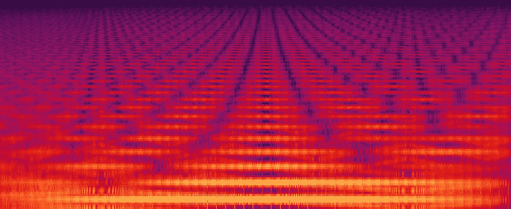
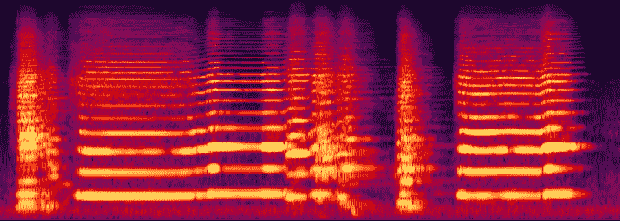
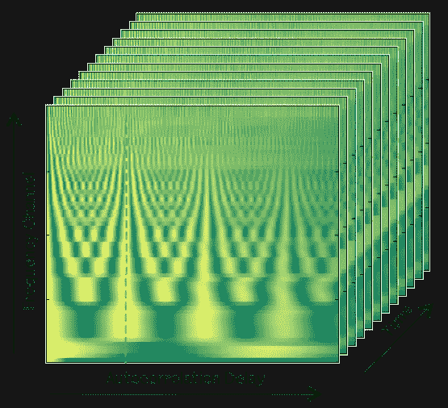
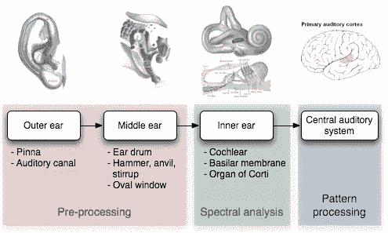

# 人工智能在音频处理中的前景

> 原文：<https://towardsdatascience.com/the-promise-of-ai-in-audio-processing-a7e4996eb2ca?source=collection_archive---------0----------------------->

2017 年是人工智能的好年景，尤其是深度学习。我们已经看到图像和视频处理的人工智能技术的兴起。尽管事情往往需要一段时间才能进入音频世界，但在这里我们也看到了令人印象深刻的技术进步。

在这篇文章中，我将总结其中的一些进展，概述人工智能在音频处理方面的进一步潜力，并描述我们在追求这一目标时可能遇到的一些可能的陷阱和挑战。

## 迈向更智能的音频

激发我对音频处理的人工智能用例兴趣的是 2016 年底发布的 [Google Deepmind 的*“wave net”*](https://deepmind.com/blog/wavenet-generative-model-raw-audio/)——一种生成音频记录的深度学习模型[1]。Deepmind 的研究人员使用一种经过调整的网络架构，一种*扩展的卷积神经网络*，成功地生成了非常令人信服的文本到语音转换，以及一些从古典钢琴录音中训练出来的有趣的类似音乐的录音。

An illustration of WaveNet’s dilated model for sample generation (photo credit: [Google Deepmind](https://deepmind.com/blog/wavenet-generative-model-raw-audio/))

在商业领域，我们也看到了机器学习在产品中的更多应用——以 [LANDR](https://www.landr.com) 为例，这是一种自动化音频制作服务，它依靠人工智能来设置数字音频处理和细化的参数。

今年，pro audio software mogul[iZotope](https://www.izotope.com)发布了 [Neutron 2](https://www.izotope.com/en/products/mix/neutron.html) ，这是一款音频混合工具，具有一个*“轨道助手”*，它利用人工智能来检测乐器，并向用户建议合适的预设。在用 AI 对音频进行更直接的处理时，iZotope 还在他们的音频恢复套件 [RX 6](https://www.izotope.com/en/products/repair-and-edit/rx.html) 中提供了一个[实用程序来隔离对话](https://www.izotope.com/en/products/repair-and-edit/rx/features/dialogue-isolate.html)。

A short demonstration of iZotope’s dialogue isolate feature

## 人工智能在数字信号处理中的潜力

我们仍然处于 AI 在音频处理中应用的早期。深度学习方法允许我们从一个新的角度来处理信号处理问题，这个角度在音频行业中仍然很大程度上被忽略。到目前为止，我们已经把注意力集中在公式化的处理上:对一个问题有了深入的理解，并手动设计函数来解决它。然而，理解声音是一项非常复杂的任务，我们作为人类，直觉上认为很容易的问题往往很难用公式来描述。

举个例子，源分离:你发现自己处在两个人互相交谈的场景中。事实发生后，在你的脑海中，你可以想象两个人中的任何一个不需要太多努力就可以单独说话。但是我们如何描述一个分离这两种声音的公式呢？嗯，看情况:

> 有没有统一的方法来描述人的声音听起来怎么样？如果是，性别、年龄、精力、个性是如何影响这些描述的参数的？与听众的物理距离和房间声学如何影响这种理解？录音过程中可能出现的非人类噪音怎么办？我们可以根据哪些参数来区分不同的声音？

正如你所看到的，为这个问题的全部范围设计一个公式需要注意很多参数。在这里，AI 可以提供一种更务实的方法——通过设置适当的学习条件，我们可以自动统计估计这一功能的复杂性。事实上， [Eriksholm](https://www.eriksholm.com/) (助听器制造商 [Oticon](https://www.oticon.com/) 的研究中心)的研究人员最近提出了一种使用卷积递归神经网络架构在实时应用中实现改进的源分离的方法[2]。

随着用深度神经网络处理音频的方法不断改进，我们只能开始想象我们可以解决的困难问题——下面是我对实时音频处理中深度学习的一些想象:

*   **选择性噪声消除**，仅去除某些元素，如车辆交通
*   **高保真音频重建**，来自小型低质量麦克风
*   **模拟音频仿真**，估计非线性模拟音频组件之间的复杂交互
*   **语音处理**，改变说话者、方言或录音中的语言
*   **改进的空间模拟**，用于混响和双耳处理

## 表现和建筑的挑战

WaveNet 是第一批成功尝试在原始样本水平上生成音频的公司之一。这里的一个大问题是，CD 质量的音频通常以每秒 44100 个样本的速度存储，因此，用 WaveNet 生成*秒*的声音需要*小时*。这排除了该方法在实时应用中的使用。这只是一大堆需要理解的数据。

另一方面，许多当前利用神经网络进行音频处理的解决方案利用了频谱图表示和卷积网络。在这些解决方案中，音频频谱本质上是在 2D 图像上随时间变化的幅度，卷积网络用于扫描和处理该图像[3]。通常，这些方法的结果并不像我们在视觉领域看到的那样令人信服，例如 *CycleGAN* 可以为电影做一些令人印象深刻的风格转换[4]。

CycleGAN transforming horses into zebras (photo credit: [CycleGAN](https://github.com/junyanz/CycleGAN))

电影和音频剪辑有一些共同点，因为它们都描绘了随时间的运动。考虑到 CycleGAN 等图像处理网络的创新，人们可能会认为这种风格转移也适用于音频。

但是，电影和音频剪辑不是一回事——如果你冻结一部电影的一帧，仍然可以收集到关于该帧中的动作的大量信息。然而，如果你冻结一个“帧”的音频，就很难收集到实际听到的内容的意义。这表明音频从根本上比电影更依赖于时间。在频谱图中，你也不能假设一个像素属于一个单独的对象:音频总是“透明的”，因此频谱图在同一帧中显示所有彼此重叠的可听声音[3]。

> 我们做机器视觉是为了做机器听觉。

卷积神经网络的设计灵感来自人类视觉系统，大致基于信息如何流入视觉皮层[5]。我相信这是一个值得考虑的问题。本质上，我们获取音频，将其转换为图像，并在将图像转换回音频之前对其进行视觉处理。所以，我们做机器视觉是为了做机器听觉。但是，正如我们直觉意识到的那样，这两种感觉的作用方式不同。看下面的声谱图，你(以你聪明的人脑)实际上能收集到多少关于音频内容的意义？如果你能听它，你会很快对正在发生的事情有一个直观的了解。也许这是一个阻碍我们在人工智能辅助音频技术方面取得进展的问题。

A five-second spectrogram. Can you tell what it is? (It’s a blues harp.)

因此，我建议，为了用神经网络实现更好的音频处理结果，我们应该分配精力来找出更好的音频表示和神经网络架构。一种这样的表示可以是自相关图，一种声音的三维表示，其中包括时间、频率和周期性[6]。事实证明，人类可以通过直观地比较声音的周期性来找到相似的模式，从而分离声源。音高和节奏也是时间因素的结果。因此，更侧重于时间的表示，如自相关图，可能是有用的。

An illustration of an autocorrelogram for sound (photo credit: [University of Sheffield](http://staffwww.dcs.shef.ac.uk/people/N.Ma/resources/correlogram/))

此外，我们可以开始考虑在建筑上模拟听觉系统的神经通路。当声音刺激我们的耳膜并进入耳蜗时，它会转换为不同频率的幅度。然后，它进入中央听觉系统进行时间模式处理。我们利用哪种分析模式从我们的中央听觉系统中的音频中收集可以在人工神经网络中建模的意义？周期性，也许[6]。声音事件的统计分组，也许[7]。扩大分析的时间框架，也许[1]。

An illustration of information flow in the auditory system (photo credit: [Universität Zu Lübeck](https://www.isip.uni-luebeck.de/research/signal-processing/invariant-features.html))

## 结论

人工智能的发展为更智能的音频信号处理带来了巨大的潜力。但为了更好地理解神经网络中的声音，我们可能需要放弃固有的视觉视角，转而考虑基于听觉系统的新技术。

在这篇文章中，我提出的问题比我提供的答案要多，希望能激发你在这种背景下对声音的思考。

这是一个更大的机器听觉项目的一部分。如果您错过了其他文章，请点击下面的链接了解最新情况:

**批评**:[CNN 和 spectrograms 做音频处理有什么问题？](/whats-wrong-with-spectrograms-and-cnns-for-audio-processing-311377d7ccd)
**第一部分:** [仿人机器听觉带 AI (1/3)](/human-like-machine-hearing-with-ai-1-3-a5713af6e2f8)
**第二部分** : [仿人机器听觉带 AI (2/3)](/human-like-machine-hearing-with-ai-2-3-f9fab903b20a)
**第三部分** : [仿人机器听觉带 AI (3/3)](/human-like-machine-hearing-with-ai-3-3-fd6238426416)

## 来源

[1] *A. Oord，S. Dieleman，H. Zen，K. Simonyan，O. Vinyals，A. Graves，N. Kalchbrenner，A. Senior，k . Kavukcuoglu*:**wave net:原始音频的生成模型**，2016

[2] *G. Naithani，T. Barker，G. Parascandolo，L. Bramslø，N. Pontoppidan，T- Virtanan* : **利用卷积递归神经网络的低时延声源分离**，2017

[3] *L. Wyse* : **卷积神经网络处理的音频谱图表示**，2017

[4] *J. Zhu，T. Park，P. Isola，A. Efros* : **使用循环一致对抗网络的不成对图像到图像翻译**，2017

[5] *Y. Bengio* : **学习人工智能的深度架构**(第 44 页)，2009

[6] *M .斯莱尼，r .里昂* : **论时间的重要性——声音的时间表现**，1993

[7] *E. Piazza，T. Sweeny，D. Wessel，M. Silver，D. Whitney* : **人类使用汇总统计来感知听觉序列**，2013