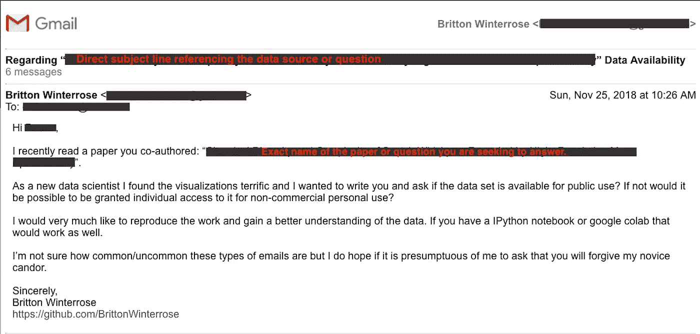
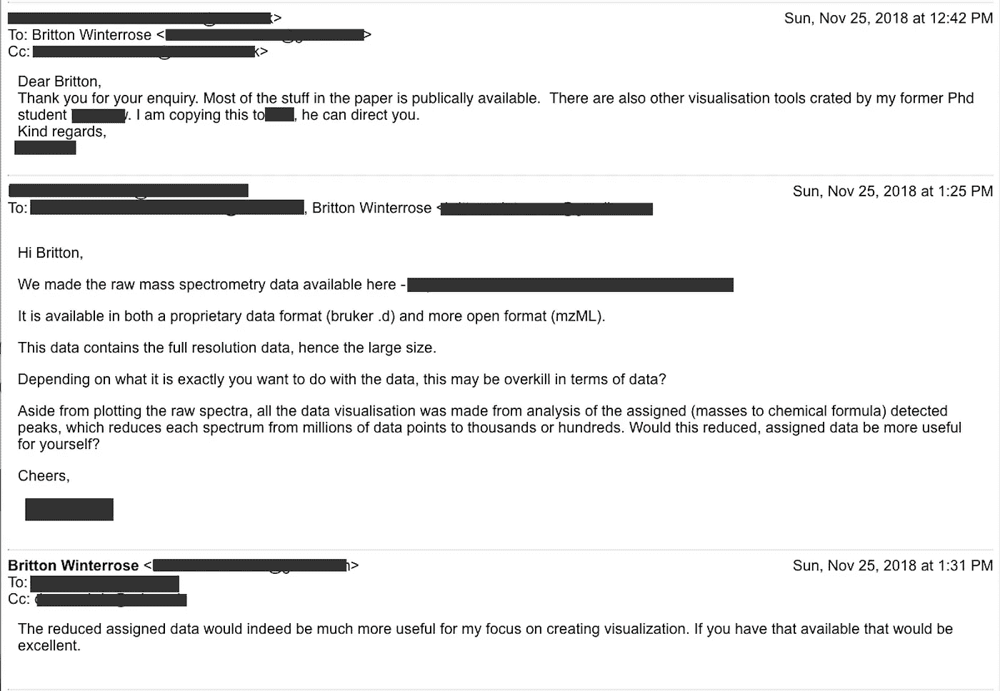

# 如何访问未发布的数据集

> 原文：<https://towardsdatascience.com/the-real-world-isnt-kaggle-de168311e99b?source=collection_archive---------11----------------------->

## 因为“真实世界”不是 Kaggle…

aggle 以透明和无与伦比的方式向数据科学家提供了大量真实世界的数据集。不幸的是，随着越来越多的新数据科学家依赖 Kaggle 向他们提供数据，他们错过了发展我们领域最重要的技能之一:搜寻和获取难以找到或私人持有的数据集。

这篇文章将帮助你发现未发表的数据集，并教你一个简单的“提问和获取”的框架。

# 我什么时候需要找到获取数据集的方法？

**最终你会需要数据，而谷歌搜索不足以获得这些数据。*这个周末就发生在我身上。它会发生在你身上。***

作为一名员工:(企业或公司内部的)数据经常会被隔离，由不同的个人或部门持有。理解简单的模式来识别和有说服力地联系有权共享这些数据的关键利益相关者，对于及时完成任务至关重要。

**作为一名企业家:**对于希望验证产品创意的数据驱动型企业家来说，做出明智决策所需的数据通常已经以某种形式存在——无论是学术形式还是专业形式——但它们有时隐藏在昂贵的付费墙后面，或者只能在有限的范围内公开获取。知道如何找到并访问它可以节省时间和金钱。

**作为一名学者:**在学术界，发现、记录和发布以前未知的知识需要勤奋地寻求&对每一个假设和主张的质疑，以发现突破的机会。如果不了解基本的沟通，学术风险是“发现”一些已知的东西，甚至浪费时间和研究资源。

## 这个周末，我就有过这样的经历。吃饭时，一位朋友问道:**“有没有可能去除波旁威士忌中的酒精，同时又不失去其复杂的味道和气味？”**

> 当我开始用谷歌搜索时，我很快意识到我能找到的唯一答案是我自己决定的。带着这个问题，我陷入了困境。

# 第 1 阶段—确定您需要的问题/数据

## **明确你的问题**

这是最重要的部分。你问的问题通常定义了你需要的信息。这也限制了你试图获取的数据的范围，而当你要求一个根本没有义务回应你的要求的人时，这些数据是有帮助的。

## **谷歌一下或者做个内部网搜索**

作为数据科学家，我们已经非常擅长谷歌搜索和基于启发式的信息搜索。在公司环境中，使用你的内部工具和文档。对于学者和企业家来说，谷歌学术是无价的。

在问别人之前进行彻底的搜索是很重要的，以确保你的问题是可靠的，并向他们表明你尊重他们的时间。这也有助于在数据集搜索时请求访问时建立信任。

> *我的研究导致了一些关于波旁威士忌中化合物分子量的有希望的研究。结果我的问题演变了。它帮助我进一步确定了一项看起来特别有前途和有用的研究和数据集。*

## **使用人际互动**

事实上，与人交谈可能会令人生畏，但这往往会影响我们获取高质量信息的速度。

[https://media.giphy.com/media/24xRxrDCLxhT2/giphy.gif](https://media.giphy.com/media/24xRxrDCLxhT2/giphy.gif)

一个简单的电话、电子邮件或 DM 是开始的地方。

老实说，只要你礼貌而中肯，几乎没有错误的方法。

你**就**就得**做。**

一旦你定义了你的问题，并确定了谁有权访问你所需要的数据(或者谁可能知道谁有权访问你所需要的数据)，那么你就可以进入第二阶段。

# **第 2 阶段——询问你找到的人，并通过询问找到**

## **问&找**

无论是电子邮件还是电话，模板都大同小异: ***有礼貌、直截了当地传达“询问”信息。***

**My “Ask” email to the bourbon study researcher.**

## *记住:*

传达出你对他们的工作和他们努力收集的数据感兴趣。这会让他们兴奋起来，并帮助他们关心你。

做人吧。确保你写的每封邮件都是专门给那个人的。你不希望你的邮件给人的感觉是机械的或者缺乏感情。

不要让人们做任何会给他们带来麻烦的事情。你也应该清楚而真实地陈述你对这些数据的意图。

如果没有得到回应，第二天继续跟进。简单的说“嗨 __，你收到我的邮件了吗？”**你不会试图向他们推销任何东西，所以不要犹豫，要坚持。简单礼貌的跟进是关键。**

**简单的电子邮件通常会很快得到回复。如果你很快收到回复，假设他们的时间不多，立即跟进。**

****

*****The individuals with the data are an invaluable resource. Time is their limited resource.*****

## ****找&问****

**一旦你开始谈话，你就进入了最后阶段。你会发现这个阶段的人都很乐于助人。你可能最终会与他们来回发送电子邮件来寻找正确的数据，但这个过程有助于你确定你真正需要的数据。**

****

****Success! A better dataset than I could have ever found on my own.****

**如果你进入了对话的死胡同或者得到了“不”,一定要跟进，询问他们是否可以为你提供任何其他有用的数据集，或者他们是否知道任何其他可以找到你需要的数据的资源。人们几乎总是会尽力帮忙，因为这减轻了不得不对别人说“不”的严重性。**

**不要害怕问一些关于数据集的简单问题，看看他们有什么额外的数据。运气好的话，他们会帮你找到你需要的数据集，并帮你节省大量时间。**

## **有些询问会引导你找到一个数据集，有些会引导你去问一个新的人，但不管你找到谁或什么 ***都要记得说谢谢。*****

****

****The most important email — the Thank You.****

> **我自己对 bourbon 数据集的搜索由于这几个技巧而成功结束。**
> 
> **请记住，你是在要求别人分享他们可能花了比你多 1000 倍的时间去做/看的东西。**
> 
> **如果你给他们的工作带来热情，他们会回报你的。**

# **作为一名数据科学家，如果你有任何其他写冰冷邮件的技巧，请在评论中分享。**