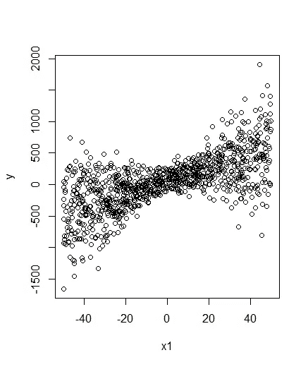
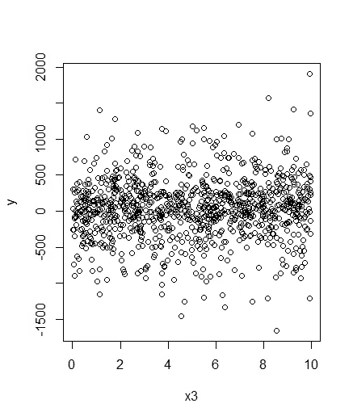
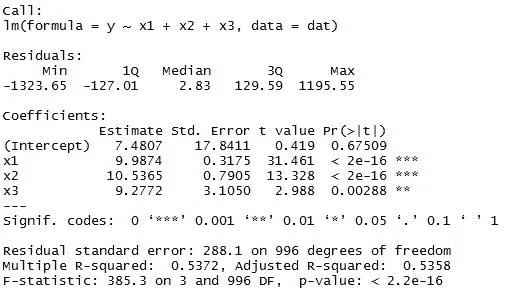

# “正确答案”偏差和统计问题

> 原文：<https://towardsdatascience.com/the-right-answer-bias-and-the-statistical-problem-18e5bf1d03c4?source=collection_archive---------1----------------------->

假设你将一枚硬币抛 10 次，得到 6 个头。概率 P(H |观测值)是多少(正确答案)？

答案肯定不是。6。其实我们根本不知道答案是什么。根据我们所看到的情况，概率 0 . 6 是最有可能的答案，但考虑到我们的样本量是如此之小，它并不比 0 . 5 或 0 . 7 更好。

增加样本量可能有助于我们更好地提炼答案，但没有没有统计学背景的人(甚至那些只是肤浅地了解的人)在看到观察结果的第一眼可能会想到的那么快。如果我们在 100 次抛硬币中得到 63 个正面，这将意味着 0.6 可能比 0.5 好得多，但这并不一定意味着 0.63 一定比 0.6 好得多。(确实意味着. 63 是比. 6 更好的答案，只是好不了多少，不足以用足够的信心来证明这个论断。)

原则上，每个人都应该知道这一点，特别是考虑到统计发现的每一个主张都带有误差幅度，我们在每门入门课程中都教授计算误差幅度的公式。但我认为这种解释通常是用一种令人困惑和误导的语言表达的。举一个简单的例子，如果我们声称 P(X) = .6 +/- .02，这并不意味着概率(以观察为条件)仅在区间(. 58，. 62)上均匀分布，许多人似乎含蓄地认为是这样，而是 P(X) < .58 is smaller than 2.5%, as per statistical convention. The probability that P(X) is, in fact, .57 is not much smaller than that it is .581, despite the latter being supposedly within the margin of error. Conversely, the probability that P(X) is in fact .6 is much greater than that it is .581, with the big caveat that the distribution of the observations are well behaved (which is where the really big can of worms resides.)

While this might seem simple, the same problem lies with interpretations of, among other things, coefficients of linear regressions. So you find that a coefficient is “significant.” What the heck does it really mean? A coefficient of b on variable x is usually taken to mean a change of b in the value of y for one unit change in the value of x, which is true, technically, but*的概率仅在平均*上均匀分布。限定词“平均”是这里的关键:x 值的单位变化可以很容易地导致 b+q 的 y 的变化，有一定的概率。这就是标准误差的用途——帮助你计算 b+q 在 y 中变化的概率，假设数据的分布符合教科书统计学的便利假设，你应该多次被提醒，这些假设的存在只是为了使解释简单，而不是让“噪音”分散你的注意力，而“噪音”在现实生活中可能非常重要。

我们可以考虑故意和肆意违反这些便利假设的情况。为了便于说明，让我们编造一些数据:

set . seed(0)
a<-r norm(1000，10，10)
b < -rnorm(1000，10，1)
c < -rnorm(1000，10，1)
x0<-runif(1000)* 20
x1<-runif(1000)* 100–50
x2<

我们所做的是在 y 和标记为 x0 到 x3 的 4 个变量之间创建一组关系，x1 到 x3 上的系数具有相同的均值，但不同的方差。通过构造，违反了同伦假设:x(任意 x)的值越大，误差就越大。但是 x1 的值越大，误差就越大。这可以通过比较下面的图来说明。此外，我对数据进行了设置，使 x1 对 y 的影响比 x2 或 x3 大得多，这并不是因为 x2 或 x3 的单位增加影响较小，而是因为 x1 的取值范围比 x2 或 x3 大得多。

y vs. x1

y vs x2

y vs x3

这里有两点:只看 y，每个 x 都淡化了他们之间的真实关系。x3 每增加一个单位，y 就会增加 10 倍。实际上，x3 的取值范围很窄(x1 的 1/10)，以至于它对 y 的影响被 x1 的影响淹没了。其次，*平均而言*，x1 值的增加会导致 y 值增加 10，但没有什么理由认为 x1 值(绝对值)越大，y 值的变化就会越小或越大，因为数据生成过程中存在异方差关系。对于较小的 x1 值，该模型相当不错。对于较大的值，这是相当糟糕的。

一个简单的线性模型(错误地)提供了一个误导的印象:

由于 x1 具有最宽的范围，它似乎以最大的一致性影响 y 的值，如最小的估计标准误差所捕获的，即使其“真实”系数从结构上来说是最大的噪声。范围最小的 x3 做的最少。当然，这反映了这样一个事实，即线性回归并不是真正用于估计噪声，而是均值，它是用于预测一个点，而不是测量分布。事实上，标准误差不是与系数相关的(估计)噪声量的估计值，而是估计系数的精度度量。

这组例子是为了说明在排除噪音的情况下，过多地寻找“正确”答案所产生的问题。给定数据生成过程的细节，“正确的”答案并不存在，只有比其他答案更正确的一些答案——但这种正确本身并不存在，而且只在特定条件下存在。虽然在上面的例子中，x 对 y 的影响的正确答案是 10，但对于 x1、x2 和 x3 也是如此。由于 x1 的噪声系数，这是最不正确的答案。对于所有三种情况，10 作为答案的有用性取决于 x 的值，因为模型内置了异方差性，但对于 x1 的大值来说，这尤其是一个大问题，这也是因为噪声的幅度以及 x1 取值的宽范围。作为一种预测工具，该模型在 x2 上更好，在 x3 上甚至更好，但我们无法通过查看数据来确定这一点。虽然绘制残差图应该告诉我们，对于较小的 x1 值，该模型作为预测工具更有用，但我们应该想知道在什么情况下，该模型更差/更好。

事实上，我不清楚如何轻松地从数据中恢复 x3 上的系数远不如 x1 或 x2 的噪声大这一事实，除了蒙特卡罗到处走动之外。我们需要将样本分割成子集，当 x3 变化时，x1(和 x2)保持在每个子集内的狭窄范围内，并比较 y 的变化，作为跨切片的 x3 的函数，或者类似的事情。但这似乎有点涉及到看似相当琐碎的问题。但是估计整个分布通常是一件棘手的事情——尽管通过重采样技术和更便宜的计算能力，这变得容易多了。难怪大多数非参数技术是最近才发展起来的。

深入研究这些问题将占用我更多的空间，所以我将这篇文章总结如下。统计数字和数据不会提供正确的答案:它们只会提供比备选方案更正确的答案，因为这些答案内置了特定的功能，而且往往是错误的和误导性的——尤其是如果你天真地误解了它们。总是有必要问，这个模型错了多少，什么时候错(后者尤其重要，因为很少有事情是随机的——我们假设随机是为了在建立模型时让我们的生活易于处理(韦斯伯格的“故意无知”，他强调，这是一件好事——如果你知道你在故意无知什么)。一旦我们建立了模型，我们可能想让这种无知消失，这样我们就可以开始了解我们的模型的真正限制是什么。

注意:在帖子最初发表后，做了一些印刷上的更正。