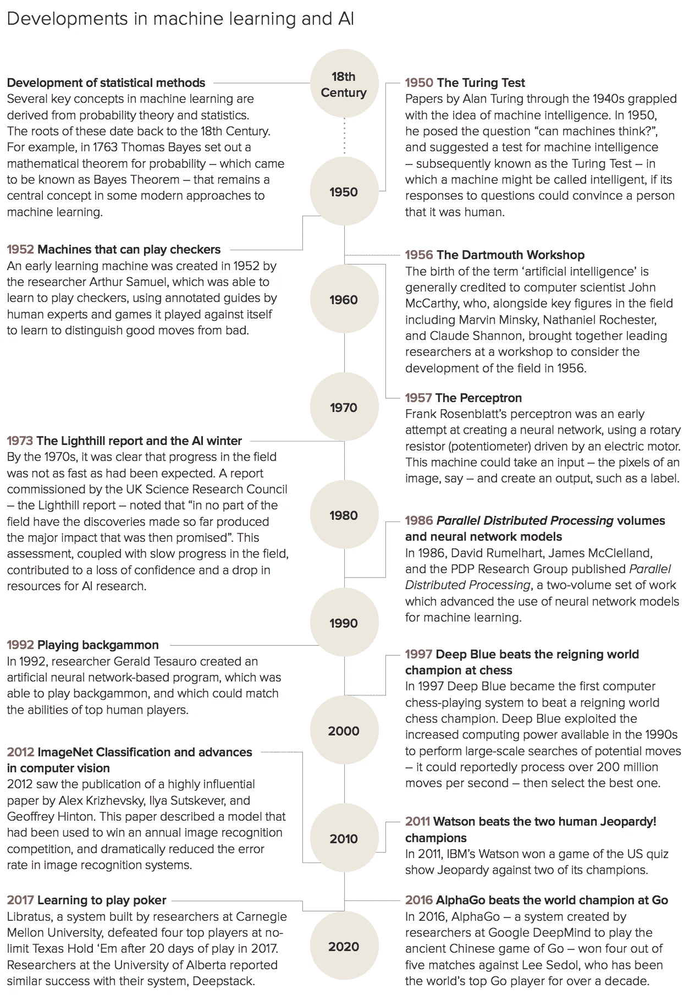
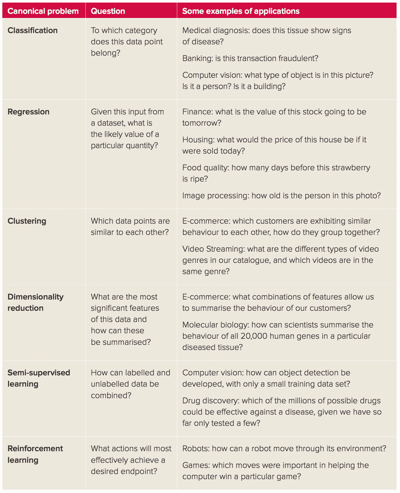
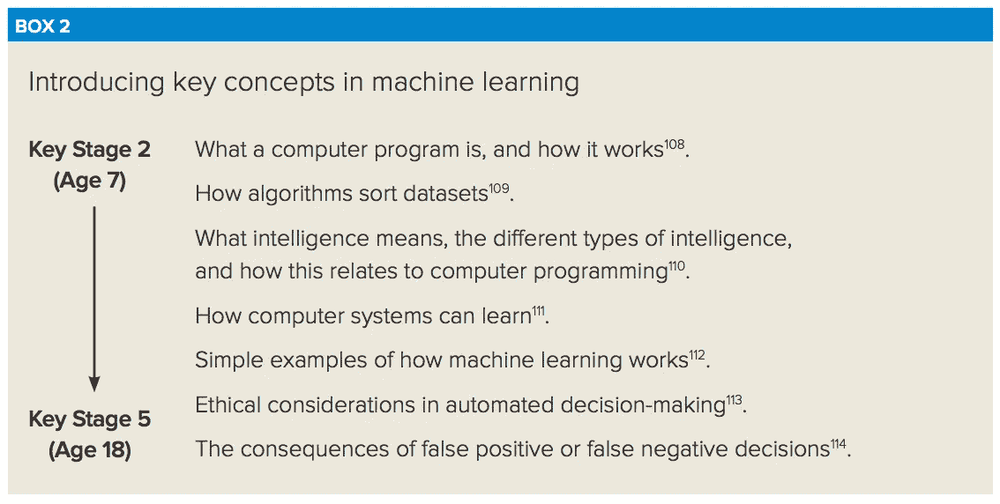

# 英国皇家学会关于机器学习的报告(2017 年 4 月)

> 原文：<https://towardsdatascience.com/the-royal-society-report-on-machine-learning-april-2017-50e228a6dd0d?source=collection_archive---------3----------------------->

英国皇家学会发起了一项(128 页！)关于机器学习的报告。我仔细阅读了它，并做了一些笔记，其中有一些有用的不同或以有用的方式传达的东西，其他人可能会觉得有用。在这里和那里，我链接了我发现的其他作品，并添加了一些观察。

*深闺披露(截至 2017 年 6 月 9 日):当我咨询公务员时，我需要对英国临时选举指南特别敏感，该指南涉及可能被视为影响选举的政治动机言论。引用的地方都是逐字逐句地从材料中摘录的，而不是我自己的观点。*

*“确保为机器学习的安全和快速部署提供尽可能好的环境，对于促进英国的经济增长、福祉和安全，以及释放‘大数据’的价值至关重要。在关键领域采取行动——塑造数据格局、培养技能、支持业务和推进研究——有助于创造这种环境。”*

# 从数据中提取价值

*   **创建支持机器学习的数据环境**。英国生物银行是实践中的一个很好的例子。
*   **延长开放数据的生命周期需要开放标准**。*“政府在创建新的开放标准方面发挥着关键作用”*

# 从机器学习中创造价值

*   **学校和大学需要更新，以关注数据技能和研究。【和情商】(T13)。另请参阅 FT.com 的观点，该观点称[情商在学校也至关重要](https://www.ft.com/content/0c7906d6-be89-11e5-9fdb-87b8d15baec2)。所以我们把情商+数据素养作为最重要的学校技能。**
*   *“英国的移民方法应该支持英国成为世界上最好的研究和创新场所之一的目标，而机器学习是支持这一目标的一个机会领域”*

*“世界上几乎 90%的数据估计都是在* [*最近五年内产生的*](https://www-01.ibm.com/software/data/bigdata/)

*“对于公众来说，‘机器学习’这个术语并不突出；皇家学会和益普索莫里调查机构的调查显示，只有 9%的人认识到这一点。然而，许多人熟悉机器学习的具体应用 17，每天都与机器学习系统进行交互。”*

# *人工智能*

****“人工智能”这个术语缺乏一个被广泛认同的定义*** *，但是有不同的描述**

*   **“[…自动化]我们与人类思维相关的活动，如决策、解决问题、学习等活动…”(Bellman，1978)**
*   **“创造机器的艺术，这些机器在由人执行时执行需要智能的功能。”(库兹韦尔，1990)**
*   **“对使感知、推理和行动成为可能的计算的研究。”(温斯顿，1992)**
*   *计算机科学的一个分支，研究智能行为的自动化(卢格和斯塔布尔菲尔德，1993)*
*   **“…致力于使机器智能化的活动，而智能是使一个实体能够在其环境中恰当地、有远见地运行的品质。”**

## *机器学习和人工智能的发展*

*这里的关键是，自从 50 年代计算机发明以来，人工智能作为一个概念就已经存在了。*

*下面的图表中唯一需要补充的是，在 2014 年的 [**图灵测试中，机器人第一次赢得了冠军**](http://www.coventry.ac.uk/primary-news/turing-test-transcripts-reveal-how-chatbot-eugene-duped-the-judges/) ，从那以后[图灵奥运会](https://motherboard.vice.com/en_us/article/the-plan-to-replace-the-turing-test-with-a-turing-olympics)成为“人工智能感知”的首选指标。*

**

## *现有方法的局限性*

***大量被人为手工标注的数据**。那些有必要规模的人已经做了一些聪明的把戏来解决这个问题:例如，*

*   *谷歌在美国的 411 目录服务帮助训练他们的语音识别系统*
*   *他们在网络上使用的 reCAPTCHA 系统有助于训练图像识别。*

***上下文很难建立**。对人类来说是“常识”的东西在计算机中没有对等物。又称“[帧问题](https://www.youtube.com/watch?v=EVAKG6Y2uIg)”。*

****人类善于将想法从一个问题域转移到另一个问题域*** *。即使有了最新的机器学习技术，这对计算机来说仍然具有挑战性。这里研究的活跃领域叫做[迁移学习](http://sebastianruder.com/transfer-learning/)。**

## *机器学习帮助解决的标准问题*

*中型不提供桌子(！！！HTML 1.0 提供了表格…想想吧…)所以我在下面放了一张图片，在这里做了一个表格*

**

# *从数据中提取价值*

**“世界上 90%的数据是在过去 5 年中创建的。”*——尽管 IBM 声称这是过去两年的。报告称每天产生 25 亿 GB，但数据来自 2014 年。[该站点有一个实时估算](http://innovate.reduxio.com/the-worlds-data)，显示截至 2017 年 4 月 27 日的数字为 28 亿 TB/d(所示的 1000 倍)*

*“英国已经承诺遵守 G7《开放数据宪章》,该宪章的原则规定，政府数据应默认公开发布，供所有人使用，并以允许自动处理的高质量格式发布”*

# *培养各级技能*

*数据的作用及其对我们生活的影响将继续在家庭和工作中变得更加普遍，因此需要从小就具备基本的“数据素养”。[关闭或重启(2012)](https://royalsociety.org/topics-policy/projects/computing-in-schools/report/) 促进了英国学校课程的积极变化*“其他学科快速发展的数据科学需求将需要在未来的课程和资格审查中加以考虑”。**

**“人们理解他们生活和工作的世界的能力越来越取决于他们对科学思想和相关技术以及社会问题的理解”**

**

*Key concepts in machine learning and recommended school age for introduction, paving the way for data literacy*

**“至少，新获得资格的专业人员应该懂数据，并且能够‘用算法思考’”**

**“作为一个跨学科的领域，机器学习目前没有得到现有资助模式的良好服务”**

**“如果这个领域要以代表广泛利益的方式前进，那么它就需要从广泛的人才库中汲取人才，如果它要避免形成一种研发‘短视’的话。吸引各种各样的人到这个领域，对于提高英国在这个领域的技能基础的整体实力也是至关重要的。”*。这是一个很难解决的问题:一般来说，计算机科学已经有很长一段时间了，而且似乎没有太大的变化。目前还不清楚这种吸引力会以何种形式出现。*

# *社会中的机器学习*

*皇家学会和益普索·莫里调查了 978 名公众。虽然只有 9%的人理解“机器学习”这个术语，但大多数人(89%)认可它的应用。这似乎是合理的:当技术透明时，它就是成功的。*

***态度: *"*** *这些公开对话中最明确的一个信息是，公众对机器学习没有单一的看法；积极或消极的态度取决于使用机器学习的环境。”**

## *机会*

*机器学习作为一个品牌依赖于“大数据”，这使得它更容易获得。人们发现的机会总结如下:*

*   *更客观*
*   *更准确*
*   *更有效率*
*   *新生物*
*   *有助于解决大规模的社会挑战，如人口老龄化*

## *关注的问题和解决这些问题的计划*

*不过，并不全是彩虹和独角兽，还有一些担忧，我认为所有这些都很合理，但有益的是，报告指出了对所有这些的积极研究:*

*   ***造成伤害的可能性:**解决方案研究包括保证系统将是“稳健的”、强有力的安全证据以及人为监督或最终决策*
*   ***去技能化和过度依赖**机器学习以及由此产生的社会去技能化或降级为利基。这是不可避免的，而且已经发生了 500 年了。在极端情况下，该调查揭示了公众对机器取代工作场所中的人的担忧，以及“改变与个人重要活动的关系:自由或自主的感觉”。对于医护人员来说，强调**准确性不是衡量成功的唯一标准**也很重要。人类的同理心和个人参与在健康和社会关怀中尤为重要。*
*   ***选择和人类经验的限制**:遗漏细微差别解释的风险(只有在数据量和解释能力更大的情况下才有可能)。*

## *关注的背景*

*调查中人们的关注程度因以下方面而异:*

*   **“技术使用者的感知意图；**
*   **谁是受益人；**
*   **使用机器学习而不是其他方法是多么必要；**
*   **是否有明显感觉不合适的活动；和**
*   **人类是否参与决策。**
*   *准确性和错误的后果也是重要的考虑因素。”*

*“从根本上说，这些公共对话中提出的问题与是否应该实施机器学习技术关系不大，而是如何最好地利用它来造福公众。从具体应用的角度，而不是从宽泛、抽象的原则的角度，更容易做出这种判断。”*

## *数据的使用、隐私和同意*

*"*随着机器学习在这种新环境中投入使用，它重新构建了关于隐私、数据使用以及在信息稀缺环境中设计的治理系统的适用性的现有问题"**

*“机器学习进一步动摇了当前‘敏感’或‘个人’和‘非敏感’数据之间的区别:它允许最初看起来无害的数据集被用来从平凡事物中推断出敏感事物。”*

**“例如，研究表明，可访问的数字记录，如脸书的“赞”,脸书用户通过这些记录表达对社交媒体网站上内容的积极情感，可以用来推断敏感的个人属性。* ***通过分析用户的脸书喜好，研究人员发现他们可以预测诸如性取向、种族、宗教或政治观点、智力或性别等特征。*** *虽然默认情况下赞是公开的，但用户并不一定期望这些会泄露更多敏感信息。然而，这些信息现在可以从他们的在线活动，或者一系列组织可以获得的数字记录中预测出来**

*"*在过去，同意被认为是良好数据治理的标志。然而，即使在同意被用作数据使用的“黄金标准”的情况下，这种同意是否是知情的，这一点一点也不清楚。尽管高达 33%的人声称他们通常会阅读网站条款和条件，但服务器端的调查表明，只有 1%的人实际上有…因此需要新的方法来导航关于同意的问题"**

## *公平和统计刻板印象*

**“机器学习应用程序可能以两种不同的方式导致偏见或缺乏公平性。**

1.  **当机器学习算法继承了存在于训练算法的数据中的主观偏见时。*【例如，一个简历库中很少有女性，可能会推断出一个简历库中将来也很少有女性。-J]*
2.  **当机器学习算法正确地发现个人的特定属性在预测结果时是有价值的，在社会可能认为使用这样的属性不合适的情况下，可能会出现不同的偏见或不公平的来源"*，[例如保险费的性别— [这在欧盟现在是非法的，](http://www.bbc.co.uk/news/business-12608777)但也可以通过其他参数来推断-J]*

## *可解释性和透明度*

***具有隐藏层的神经网络也隐藏了它们的推理。**对于高影响力的决策，可解释性和透明性对于希望了解原因的用户和希望改进系统的开发人员来说非常重要。*

**“围绕数据使用的法律框架，即新的《欧洲一般数据保护条例》中隐含了‘解释权’”**

*“在试图解决透明度问题时，可能需要在准确性和可解释性之间进行权衡。在基本层面上，硬编码的规则更容易解释，但神经网络等更不透明的方法往往更强大，可以产生更准确的结果。透明度和性能之间的权衡在不同的应用中有不同的结果，这就提出了一个问题，即是否需要明确决定优先考虑透明度还是准确性，如果需要，如何以及由谁来决定。”此外，硬编码模型(如传统编程)的构建成本要高得多，因为每个细微之处都必须到位。*

## *有责任*

**“在公众中，对于“当机器学习‘出错’时，谁应该负责”这个问题，最常见的回答是“操作员和机器为之工作的组织”(32%)，尽管这并不构成大多数人的回答，但它显然超过了认为机器本身应该负责的受访者人数(3%)。”—* 最后这一点很有趣，因为我自己认为只有当**机器意识到其行为的后果**并有足够的感知能力来引导其决策朝着激励而非抑制的方向发展时，该机器本身才应该承担责任。*

*解决责任的三种方法:*

*   **“所谓的 Bolam 测试，或者一个合理的人类专业人士是否会以同样的方式行事；**
*   **自动驾驶汽车的严格责任——或无过失或无伤害意图的责任；和**
*   **第三者责任，类似于对危险犬的规定。”**

## *与机器学习使用增加相关的潜在社会后果*

***泡泡/回音室**:通过强化现有信仰的强化内容和信息对社会群体进行分层。(例如，参见 [WSJ 红色进料，脸书](http://graphics.wsj.com/blue-feed-red-feed/)上的蓝色进料)*

***新的权力不对称:隐私与访问。** *“新的权力不对称可能被创造出来；“浮士德协定”，个人自愿放弃隐私，以换取效率、便利或获得服务的需要，而不给予知情同意”**

***人机互动**:随着这变得越来越普遍，它开始影响社会规范，比如 [Alexa 不要求孩子们说请或者谢谢](https://hunterwalk.com/2016/04/06/amazon-echo-is-magical-its-also-turning-my-kid-into-an-asshole/)。*

# *机器学习的未来*

*可能要在以后总结。*

*[查看完整报告(PDF，128 页)](https://royalsociety.org/~/media/policy/projects/machine-learning/publications/machine-learning-report.pdf)*