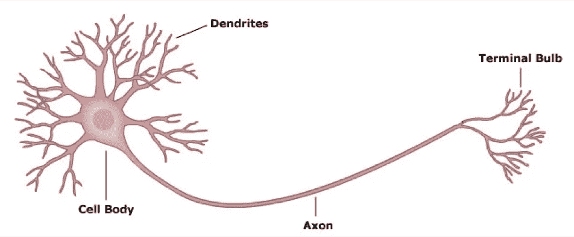
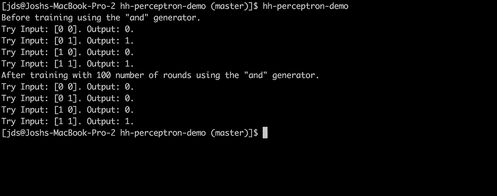

# 神经网络的最简单介绍

> 原文：<https://towardsdatascience.com/the-simplest-introduction-to-neural-networks-6b618e7c8b10?source=collection_archive---------2----------------------->

## 30 天写作挑战

这是我的[30 天写作挑战](https://medium.com/@heldtogether/adventures-in-machine-learning-7eae4d9f951e) 的第 10 天。我每天都在努力写一篇短文，为我建立机器学习团队的新角色做准备。7 天发表了 7 篇文章，刚刚休了 2 天假。你可以在[我的机器学习之山——到达大本营](https://medium.com/@heldtogether/my-machine-learning-mountain-reaching-base-camp-4a4cb7fde2b0)阅读一周总结。

到目前为止，我一直专注于简单的数据科学算法。它们是强大的技术，因为它们实现起来很简单，但是组合起来比它们各部分的总和要大得多。然而，如果不真正深入到神经网络——人们在谈论人工智能时通常会想到的东西，这个系列就不完整。

让我们回到起点，想想生物神经元，即构成大脑的细胞。它们的工作方式启发了我们将要研究的神经网络。

简单地说，神经元被树突上的输入所激发。刺激可能来自一个神经或另一个神经元，这无关紧要。如果输入足够强，轴突就会放电，另一端会有输出。同样，这可能是另一个神经元或神经，它实际上是在移动你的肌肉。想象一下装满咖啡杯的刺激。如果咖啡杯溢出，它就会被激活。不同的神经元会被不同水平的输入激活。有些只需要一点点刺激，有些需要很多刺激。

我们可以非常简单地用数学建模。如果所有输入`x`的总和乘以权重`w`大于或等于*激活阈值* `theta`，则神经元`f(x)`为 1。否则就是零分。

训练一个非常简单的单神经元神经网络(技术上是一个*感知器*)是非常容易的。如果我们知道我们所期望的结果(即监督学习)，那么新的激活阈值被计算出来:

计算每个神经元的新权重:

不要让符号让你分心。它们很容易计算。每次你训练神经元时，激活阈值会向最佳值靠近一点，每个输入的权重都会得到调整。

我已经编写了一个示例脚本[来训练一个有两个输入的神经元，只有当两个输入都激活时才激活它](https://github.com/heldtogether/hh-perceptron-demo)。它首先在几轮训练前分配随机权重和随机激活阈值。

在训练之前，输出是完全错误的。即使只经过 100 轮训练，该模型也能为任何给定的输入生成正确的输出。

这只是一个简单的例子来介绍神经网络的概念。它很琐碎，不太可能对任何现实世界的问题有用。不过，你应该知道我们所说的神经元是什么意思，以及我们如何使用一些输入的预期结果来稍微接近产生正确输出的权重和激活阈值。

神经网络的真正力量是当你把很多很多的神经元结合起来，创建一个大的网络。您可以解决的问题类型会显著增加。在下一篇文章中，我们将看到如何修改这个例子来解决一个更复杂的问题。

*这是我的* [*30 天写作挑战*](https://medium.com/@heldtogether/adventures-in-machine-learning-7eae4d9f951e) *中的一个帖子。我是一名软件工程师，试图理解机器学习。我没有博士学位，所以我将用简单的语言和大量的例子来解释事情。*

*关注我的*[*Twitter*](https://twitter.com/heldtogether)*查看我的最新帖子。如果你喜欢这篇文章，请点击下面的心形按钮来分享——这将有助于其他人看到它。*