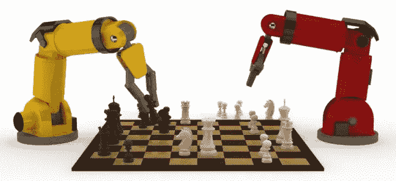

# 监督学习和非监督学习的简单、深刻而复杂的世界

> 原文：<https://towardsdatascience.com/the-simply-deep-yet-convoluted-world-of-supervised-vs-unsupervised-learning-a737d560c979?source=collection_archive---------3----------------------->

人工智能(AI)很像生活中的关系。有时候，你投入的东西很简单，就能得到你想要的结果。其他时候，我们只能说，过程变得有点复杂，有时结果并不完全是你预想的那样。换句话说，你可以在两种关系中输入相同的内容，但是不同的路径会导致不同的结果。然而，两者都是学习过程。在人工智能的世界里，这被称为有监督和无监督的深度学习——和大多数关系一样，你输入的内容和你得到的输出之间的最短距离并不总是众所周知的直线。

## 什么是深度学习？

在我们深入研究什么是有监督的和无监督的深度学习之前，你应该知道深度学习是从一个叫做机器学习的过程进化而来的。机器学习采用一种算法或一套规则，在没有特定编程的情况下创建输出。想想社交网络如何从你的帖子中挖掘数据。例如，你和你的朋友去你最喜欢的寿司店吃饭，并在网上分享你的经历——你喜欢什么，觉得不喜欢什么，照片，你会回来吗——一旦你将这些输入到你的社交网络，一种算法就会收集关于你输入的珍闻，提取你喜欢什么，不喜欢什么的模式，甚至根据你的照片提取你的长相。该算法可能会发现，你大约 23 岁，每月与朋友在这种特定类型的餐厅吃饭两次，喜欢加州卷鳗鱼寿司。然后，它会根据这些数据向你发送广告。机器学习反复收集关于输入的信息，尽管没有被告知如何这样做或在哪里寻找这些信息。

深度学习将它提升了一个档次。它接受您的输入，发现它可以对其进行分类而不产生问题(有监督的)或聚集未标记的信息，尝试对其进行分类以便有意义(无监督的)，然后接受该输入并创建某种可行的输出。这是一个分层的体系结构，能够理解从一层到另一层非常抽象的数据。这就是深度学习如何模拟人脑的多方面复杂性——它的神经通路处理大量信息，这些信息在它有意义(或没有意义)之前是没有意义的。

## 有监督的深度学习:通向期望的接吻路径

当你的上司在工作中监视你时会发生什么？像大多数人一样，这让你抓狂，所以你倾向于选择阻力最小的方式，找到最没有挑战性的方法来快速完成工作，同时满足你上司的期望，对吗？假设某个主管训练你处理信贷申请。所述主管知道那些申请中有什么，并且知道任何申请的预期结果是批准还是不批准。你从培训中学习了如何以最佳方式工作，以达到期望的结果，即你的主管需要的结果。有监督的深度学习就是这样。我们人类倾向于在一个特定的层次中处理:我们接受生活的输入，并基于我们的经验(训练)，我们组织这些输入，以便我们先前的知识可以理解它，处理它到一些预期的结果。受监督的深度学习属于保持简单愚蠢(KISS)路径，这是一条阻力最小的路径，可以实现一些预期。

有监督的深度学习非常适合决策:以我们的信用卡为例。银行接受你的申请，并根据其风险类别进行审核，然后决定是否批准你的申请。程序要点如下:

应用程序是来自客户的输入

银行将来自应用程序的数据输入到算法中

该算法从过去的应用中注意到数据遵循特定的路径(建模)

例如:婚姻状况-单身，已婚，离婚，丧偶都有一个是或否的答案

该算法采用银行确定的申请数据、是或否答案，并遵循其流程图(路径规则)

当算法决定数据属于批准和未批准的主要类别时，数据流经该路径

给出批准或不批准的预期决定

客户被批准，是一个快乐的营员或没有被批准，并想知道如何固定他的信用评分(必须把它扔进去)。

监督深度学习不仅仅是你典型的开灯关灯二元函数。该算法将标准分类为银行的风险预期，将风险处理为两个决策之一。这种分类方法被称为二项式分类(两个选择)或多类(两个以上的选择)。

## 无监督的深度学习:探索未知的旅程

如果有监督的深度学习是获得预期输出的途径，那么无监督的深度学习会获取相同的输入，并试图在避开某些输出之前理解它。以你最好的朋友为例，让我们去参观艺术博物馆。你们都被一幅玫瑰画迷住了。你们中的一个人从字面上理解，另一个人从象征上理解。对你来说，一朵玫瑰只是一朵玫瑰，而你想去看梵高的展览。对你的朋友来说，玫瑰是黄色的，而它应该是红色的，你的朋友不明白为什么这幅画代表友谊而不是爱情。在一切准备就绪之前，梵高是不存在的——直到你的朋友沉思那朵玫瑰，以及为什么她现在的关系挂在博物馆的墙上，这一切才发生。

无监督的深度学习没有目标，没有对输入的期望。它依靠探索各种可能性来得出一些结论。当你可以去参观梵高的展览时，你的朋友却在苦苦思索如何将友谊和爱情带给一个人幸福生活的所有途径分类，以及如何从错误中吸取教训。

## 决策时间:如果你当时知道你现在所知道的

人类是主观上有知觉的生物，其决策过程更多地迎合意外(无监督的深度学习)而不是预期(有监督的深度学习)。电脑没有人的因素。他们没有经验。他们只有数据集、函数和“思维”,这些都是基于以有序或无序的方式将信息汇集在一起的层。

随着神经网络和人工智能变得更加复杂，[深度学习算法](https://www.quora.com/What-is-the-difference-between-supervised-and-unsupervised-learning-algorithms)也是如此。你可以在监督、非监督或深度学习组合包中进行选择，以解决从信贷审批到令人难以置信的复杂机器人数据集的任何问题。还记得社交网络的例子吗？当你上传图像时，一种叫做卷积神经网络(CNN)的东西在得出你大约 23 岁的结论之前挑选出特征，汇集相关数据:餐馆、朋友笑、朋友皱眉、面部识别、背景识别。将这些小组组合分类，你的形象就充分说明了你是谁以及你是如何生活的。想象一下，他们会从你上传的视频中发现什么？然而，有时生命不得不在不受 knowns 监督的情况下展开，重建(自动编码)数据驱动的宇宙，而自组织地图将模糊的数据模式转化为二维(想想地形图)，这让你进一步思考为什么玫瑰的任何其他名字只是反向传播(眨眼)。