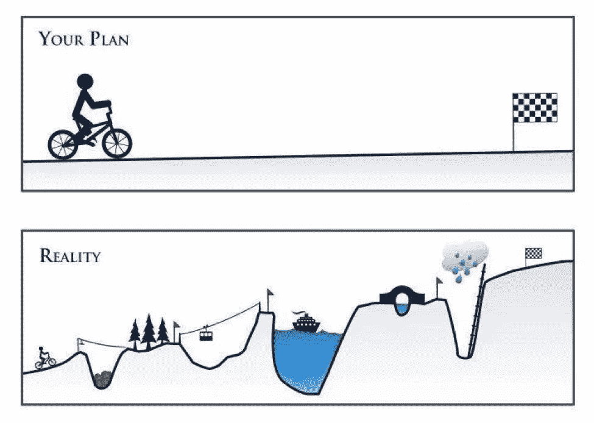

# 数据科学的十大谬误

> 原文：<https://towardsdatascience.com/the-ten-fallacies-of-data-science-9b2af78a1862?source=collection_archive---------2----------------------->

Photo by [Gert Boers](https://unsplash.com/@geboers?utm_source=medium&utm_medium=referral) on [Unsplash](https://unsplash.com?utm_source=medium&utm_medium=referral)

数据科学专业的学生和新员工对世界的看法更加理想化，而他们在处理行业中的真实数据科学问题时经常会面临一些问题，在这两者之间存在一个隐藏的鸿沟。所有这些新的大学数据分析课程(几乎都是新开设的课程)都旨在教授学生编码、统计、数据争论等基础知识。然而，在行业内的实际数据科学工作中，人们期望你克服的那种挑战却很少出现。

分析课程提供数据(通常还有工具)并要求您生成预期结果，而行业角色可能既没有提供数据，也没有提供适当的工具，甚至连预期结果的构成都不知道。此外，行业文章通常有更严格的截止日期，没有支持，请求分析的人对统计的理解也有限。

在获取执行一些有用的分析工作所需的技能的背景下，大学课程有意降低了许多障碍，以便让您专注于核心的数据科学部分，这是理所当然的。课程材料不断向前推进，介绍统计分布、假设检验、分类器和各种工具，如 R、SPSS、Python 和 RapidMiner。最后，在掌握了基础知识之后，您会得到一个干净的数据集，并被要求比较随机森林和其他类型的分类器的性能。

不要误解我的意思，这种类型的学习是你以后职业生涯中可能从事的工作类型的基础，但它几乎和任何种类的书本学习一样有用。这些理想化的项目与更现实的工作实践之间有一个漫长、痛苦且永无止境的重新组合。这些是新手数据科学家在他们的新角色中第一次遇到的一系列谬误，通常伴随着哭泣和咬牙切齿。

1.  **数据存在。**

不可避免的是，对特定分析工作的请求会预先假定构成该工作基础的数据的可用性。这可能看起来是最基本的假设，但如果被要求分析某个数据集，却发现它不存在、不可访问、缺少通用标识符或在太高的级别上汇总/总结，这种情况并不罕见。在任何任务开始时要问的第一个问题是，在你去追逐兔子洞，或者更不明智地，同意完成分析的具体期限之前，底层数据是否存在。在最糟糕的情况下，你可能会孤立无援，没有数据，但却有一种迫切的期望去完成你无法完成的分析。在这种情况下，你很容易对潜在数据的瑞士奶酪进行分析，这将不可避免地导致错误的结论，并显示出官员的极端无礼。如果数据完全缺失，早点喊，经常喊。如果有一些不完整的数据要处理，也大声说出来，但不要把它作为一个通用的借口来关闭工具，直到完美的数据集被数据工程的侏儒们神奇地整理出来。

**2。数据是可访问的。**

太好了，你得到了一个确认，你所依赖的数据集实际上存在于某个地方，而且传闻中基本上是完整的。现在，下一个障碍是这些数据是否能在合理的时间内提供给你。其中往往包括公司内部不同部门之间相互竞争的优先事项，或者外部顾问、长期离职的员工或第三方公司囤积的数据，这些公司希望通过出售访问权来快速获利。提供对孤立信息的免费和方便的访问可能不符合名义上的数据所有者的最佳利益，无论是因为法律、合同或财务限制，还是仅仅为了保持他们目前的角色。即使在个别公司内部，你也会发现，对于看似完全合理的数据要求，你会被毫不客气地拒之门外。哪里有钱可赚，特别是如果在数据管道的任何一点都有外部参与者，您会发现单行 SQL 查询被呈现为一些具有同样庞大账单的庞大项目。因此，任何精明的数据科学家的目标都是成为你自己的数据管道的每一个阶段的共同管理者，以便每个数据片段的所有权至少在某种程度上服从任何数据请求。

**3。数据是一致的。**

出于显而易见的原因，最好是找到一个结构良好、自洽且定义明确的一致数据集。发现一个数据文件突然从 19 列切换到 20 列，然后又切换回来，或者同一数据的不同版本之间的列排序发生变化，这是多么令人高兴啊！与所有不受欢迎的意外一样，这种最后的小故障往往会在最后一刻出现——当您调用 R Studio 中的 **read.csv()** 函数来正确查看数据时。即使数据*看起来*一致，当你看到像不可靠的 UTF-8 字符这样的事情，或者在一个文件中改变日期格式，从 *YYYYMMDD* 到 *MM-DD-YY* 或一些类似的废话时，还是会有一场名副其实的咒骂、辱骂和揪头发的狂欢。要记住的基本原则是，特别是依赖于遗留系统的数据管道，除非数据馈送是由数据科学家或数据工程师设计的，否则它很容易返回各种 cruft 来响应不同的操作条件。

**4。数据是相关的。**

如果一切顺利，初露头角的数据科学家可能会发现他们期待已久的数据集既不是最新的，也不是分析所需的粒度级别。谷歌分析，可以说是最广泛使用的网络相关用户行为的来源，有一些令人烦恼的问题，使其无法进行详细的分析。首先，很难唯一地识别网络用户，其次，令人不安的问题是 GA 显示的是总页面浏览量的“估计”，而不是实际的统计数据。因此，由于不相关的数据，听起来合理的请求变得不可能。例如，如果您被要求预测登录到网站 X 的客户的保留率，那么 GA 数据馈送本身几乎没有用处。

**5。数据直观易懂。**

有太多次，我等着收到一个数据集，一旦交付和检查，最终看起来就像一些古代亚述泥板一样难以辨认。特定于域的代码、截断的文本字段、缺少查找表以及缺少或命名不当的标题字段都会导致数据难以理解。严格按照垃圾输入/垃圾输出策略工作意味着，在最好的情况下，任何无法解释的数据在输出中都会被忽略，在最坏的情况下，当您在寻找类似于 *HEADER_1* 的字段背后的含义时，会导致一系列额外的问题。除非作为任何分析的一部分，对所提供的数据有一个很好的文档描述，否则你不会知道你是在测量苹果还是橘子。

**6。数据可以被处理。**

太好了，您现在有一个 600MB 的 CSV 文件，您需要使用 Excel VLOOKUP 函数与另一个 600MB 的 CSV 文件冲突…在一台过时且配置不足的笔记本电脑上。可能让新手数据科学家，尤其是那些进入更成熟的大型企业的数据科学家感到惊讶的是，数据科学工具通常与 IT 领域的其他软件应用程序没有什么不同。开源工具不受欢迎，没有安装权限，或者任何工具都必须符合一些没有人见过的虚假的神奇的 IT 安全认证。我见过 IT 人员要求对某些成熟的软件包进行详细的安全审计。我见过功能完善、市场领先的软件应用被行业 IT 老板拒绝，因为供应商“太便宜”或“不是 XYZ 的指定供应商”。

除了围绕处理大型数据集的简单技术问题之外，还可能存在一个阴谋 IT 规则和法规，这使得不可能获得足够的处理工具来处理手头的任务。我听说过有人被迫使用 Excel 执行 V-lookup，作为连接两个数据集的一种方式，因为没有人会为他们提供任何更好的机制。这种短期 IT 限制的下一个结果是，处理一个文件可能需要几个小时，如果进行一些编码和并行处理，几分钟就可以自动完成。

7 .**。分析可以很容易地重新执行。**

你还记得三个月前你帮我做的分析吗？这是更新后的营销关系数据，你能帮我快速重新运行一遍吗，谢谢！！！对…人们，从哪里开始！！！这就好比有人递给你一张拼图，并要求你在超快的时间内重新制作，而事实是，就在你弄乱它并把它放回盒子之前，它是完整的。或者要求住在破旧的房子里，因为在过去的某个时候它是可以居住的。除非您明确地设置一个可重复执行的分析，并保持数据源是最新的，否则更新并重新导入所有内容以获得更新的分析很可能会是一个很大的麻烦。这还没有考虑您使用的数据是否是静态的，或者您需要做什么来解释任何数据库模式变化或对任何其他输入的更改。

因此，如果你被要求执行一项听起来像是主要的分析工作，设计 bugger 以便它可以很容易地重新运行，理想情况下只需点击一个按钮，只需你自己付出最少的努力。

**8。我们要去的地方不需要加密。**

啊，是的，经典。您已经完成了分析，编写了一份不错的报告和一些关于该问题的幻灯片，现在您需要将数据发送给某人进行审查。我只是将数据和所有客户的详细信息以纯文本形式粘贴到一封电子邮件中，会有什么问题呢？嗯，首先，自动完成给联系人名单中错误的人的电子邮件，并把你的皇冠上的宝石送到天知道的地方，并不太困难。或者，就像我以前的一位同事，他错误地将一家公司的详细财务分析发送给了竞争对手。

Need to use company-wide standard data encryption huh?

信息安全领域的优秀人员要求您发送的任何数据都要加密，这是有原因的。安全剧场是首要的，屁股遮盖可能是第二位的，但是除了安全的外表之外，还有很多合理的理由。

在将任何东西发送给任何人之前，你要做的第一件事就是就适当的加密级别以及原始数据和最终分析的访问权限达成一致。理想情况下，只在安全的系统上工作，不太可能被遗忘在出租车上或被爱管闲事的室友访问。如果需要的话，你必须为加密标准而战…不要妥协。很可能你自己的个人安全标准会比 It 政策更懂技术，更安全，所以坚持使用它们！

如果你不允许安装一些 GPG 客户端(因为这将违反安全政策)，加密必须使用加密文件格式，如密码保护的 Excel 或加密的 zip。你说什么？加密的 zip 文件被电子邮件服务器拦截，客户端没有 SFTP 或文件共享服务器？**强悍**。永远不要为了“仅此一次”而走捷径，从而损害您的数据安全标准。在一天结束的时候，你将被留下来提着水桶，而那个对你大喊分析的人将在你寻找另一份工作的时候快乐地离开。

**9。分析结果易于分享和理解。**

让我们面对现实吧——你的大多数听众对于如何评价任何基本的详细分析没有丝毫的线索。他们会支吾搪塞，假装理解，因为无知的表现会被视为软弱。他们会要求你用更多的特性来增加你的分析，声称分析需要“在使用之前被数学证明”，并且使用各种各样的干扰和托词来隐藏他们的困惑。有些人只是寻找某些 p 值，有些人依靠“直觉”,但你会看到你的详细分析被怀疑、质疑和忽视。或者换句话说……任何足够先进的分析都将与魔术无法区分。因此，你的主要工作是将那些不太倾向于数字的人的结果翻译成他们容易理解的语言，不管你是否回答了已经提出的问题。

10。你要找的答案首先就在那里。

有点像寻找复活节彩蛋，有一种隐含的理解，即任何数据科学项目的预期目标实际上都是可以实现的，只要花一点时间在一些工具的帮助下进行搜索。然而，与同名的复活节兔子不同，没有人会故意在你的数据中加入有助于证明某些事情的真知灼见。想知道为什么这个月你的网站点击率下降了吗？想搞清楚哪些客户更喜欢产品 X 而不是产品 Y？这些问题预先装载了一个预期的结果，通常不利于适当的科学调查。