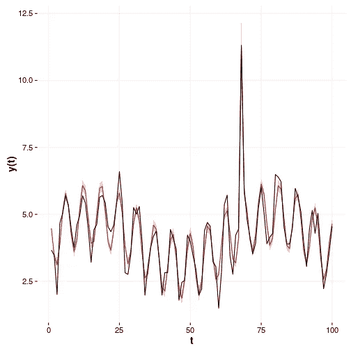
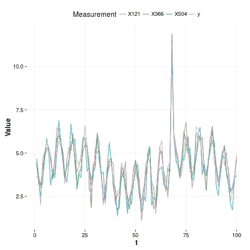
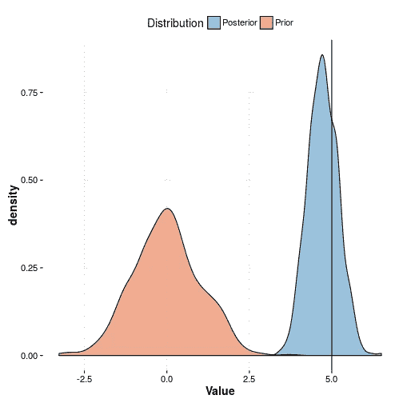
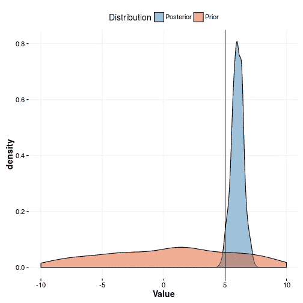
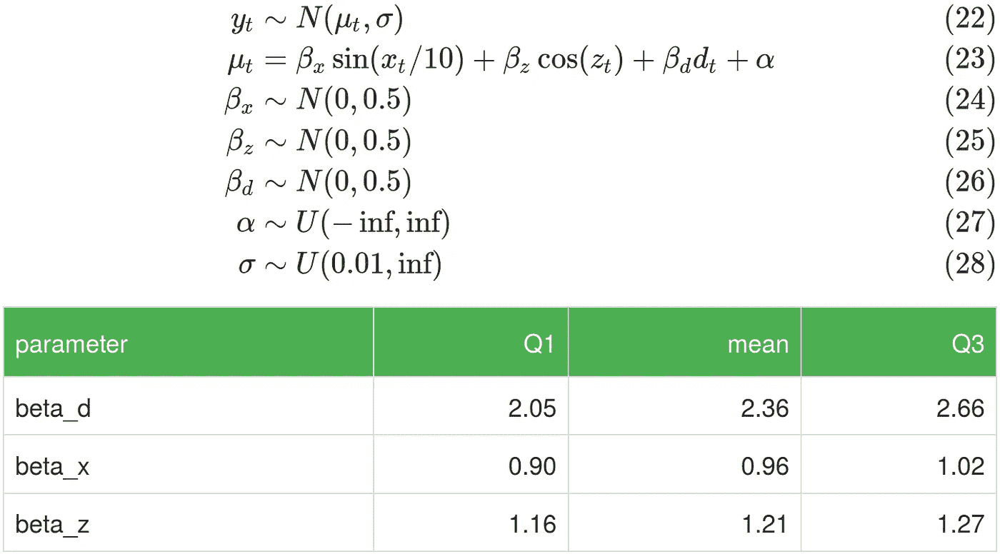
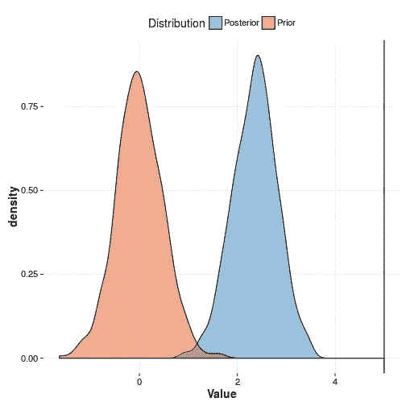

# 贝叶斯先验和过度拟合的真相

> 原文：<https://towardsdatascience.com/the-truth-about-bayesian-priors-and-overfitting-84e24d3a1153?source=collection_archive---------3----------------------->

你有没有想过一个先验和观测数据相比有多强？这不是一件完全容易概念化的事情。为了减少这种麻烦，我将带你做一些模拟练习。这些是思考的成果，不一定是建议。然而，我们将贯穿的许多考虑将直接适用于将贝叶斯方法应用于特定领域的日常生活。我们将从创建一些从已知流程生成的数据开始。过程如下。

它以一个循环过程为特征，一个事件由变量 **d** 表示。该事件只有一次观察，因此这意味着最大似然法总是将无法用其他数据解释的一切都分配给该变量。这并不总是想要的，但这就是生活。数据和最大似然拟合如下。

您可以注意到的第一件事是，最大可能性超过前面的 **d** 参数 20.2%，因为真实值是 5。

现在想象一下，我们用贝叶斯方法来做这件事，拟合生成过程的参数，而不是函数形式。因此，我们将在没有任何先验知识的情况下对β参数进行采样，并观察结果。在下图中，您将看到真实值为 **y** ，3 条线对应于拟合后验分布的 3 个独立样本。

非常类似于最大似然的例子，除了现在我们也知道可信区间和贝叶斯方法给我们的所有其他好处。我们可以快速总结一下β参数。因此，我们可以看到，即使我们有贝叶斯方法，我们仍然过度拟合。

现在到了正题！与数据相比，先验有多强？

# 关于薄弱的前科和无知

为了分析先验的强度，我们将不断设置更严格的先验，看看结果会怎样。请记住，令人高兴的情况是我们知道真相。我们将从建立一个如下所示的模型开始，这意味着我们将只给贝塔分配先验，而不分配截距。

因此，该模型符合与之前相同的过程，但是引入了弱先验。这里的先验知识表明，β参数都是高斯分布，它们周围有很多方差，这意味着我们对这些值应该是多少不是很有信心。如果你看上面的表格，我们没有先验，这基本上意味着我们的先验是负无穷大和无穷大之间的均匀分布，你可以看到推论没有太大的不同。

需要注意的一点是，可信区间没有缩小，这意味着模型关于每个参数的不确定性大致相同。这是为什么呢？对于第一个模型中的初学者来说，即使我们“相信”无穷大是每个参数的合理猜测，采样器还是找到了方法。每个参数的后验分布的平均值在模型之间几乎是相同的。那太好了。两个无限不同的先验导致相同的平均推断。让我们试着看看先验知识会在多大程度上改变平均推断。请在此处查看新型号描述。

对于我们的推断，这看起来像什么？看起来是这样的！

差别仍然不大，所以我们再缩小 10 倍。

在这里我们完全可以看到不同之处。查看下表中参数**β**d 的平均值。从 6.03 到 4.73，变化了 21%。现在，这一平均值与真实值仅相差 5.4%。

但是让我们花点时间来思考这个问题。为什么会这样？原因是你的知识可以充实。有时比数据更重要。所以你在这个领域的经验应该被考虑在内，并根据证据进行权衡。现在由你来用数学的方式陈述你的经历，这就是我们在上一个模型中所做的。在你开始反驳我的推理之前，看一下我们绘制的最后一个先验和后验的图，以及我们生成过程中的点估计。

如你所见，先验在真实值附近，但并没有真正覆盖它。这不一定是件坏事，因为无知会让数据把你带向疯狂的方向。下图显示了一个例子，我们绘制了模型三的先验和模型三的后验。很明显，数据被允许将值驱动到过高的值，这意味着我们过度拟合了。这正是最大似然法遭受维数灾难的原因。我们不应该对此感到惊讶，因为我们实际上已经告诉模型，值很可能达到 10。

我们可以从中总结出一条经验。

> *你的先验越弱，你就越能模拟最大似然解。*

# 关于前科累累和过于自信

如果最后一章是关于陈述你的想法和对你的领域知识有信心，那么夸大这一点和过分自信也是危险的。为了说明这一点，让我们做一个小例子，我们说，贝塔围绕 0 摆动，标准差为 0.5，是前一个宽度的一半。现在看一下参数估计。

很明显，我们在这里过于自信，结果现在与事实相差甚远。然而，我认为这是一个相当理智的先验。为什么？因为我们和手头的问题没有关系，在这种情况下最好保守一点。因此我们是成功的。我们陈述了我们的想法，而“一”数据点更新了很多。现在想象一下如果我们有两个呢？因此，也许一个数据点能够更新我们的观点并不是那么糟糕，也许首先保守一点也不是一个坏主意？

当然，是否建议保守取决于手头的应用程序。对于一个在证据面前确定嫌疑人是否确实有罪的应用程序来说，怀疑“证据”可能是很自然的，而对于一项潜在的投资来说，它可能会付出更高的风险，并接受更高的错误率，以期大获全胜。

# 结论

那么我们从这一切中学到了什么呢？好吧，希望你明白了设定优先顺序不是一夜之间就能学会的。需要练习才能有感觉。然而，这些原则非常明显。我会给你一些关于如何设定前科的核心建议。

*   总是把先验设定在你相信真理的附近
*   始终设定先验，使它们反映与你试图预测的现象相同的数量级
*   不要过于自信，给怀疑留有空间
*   永远不要使用完全没有信息的先验知识
*   尽可能避免使用均匀分布
*   总是总结你所有先前的结果，这样即使没有可用的数据，你的模型仍然可以预测你观察到的反应的数量级
*   要小心，要诚实！永远不要对你希望是真实的结果假设非常有用的先验知识。如果你相信它们是真的，那也没关系。在你看到不同之前，不要放心。

黑客快乐！

*原载于*[*doktormike . github . io*](http://doktormike.github.io/blog/The-truth-about-priors-and-overfitting/)*。*