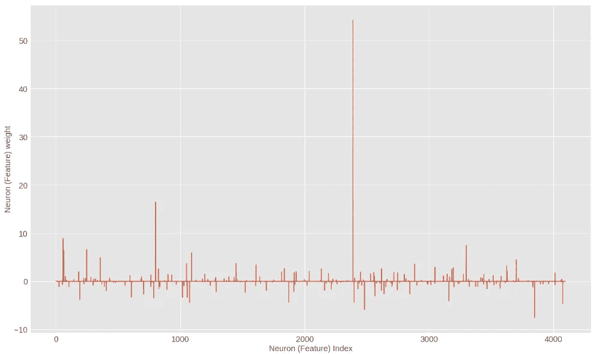
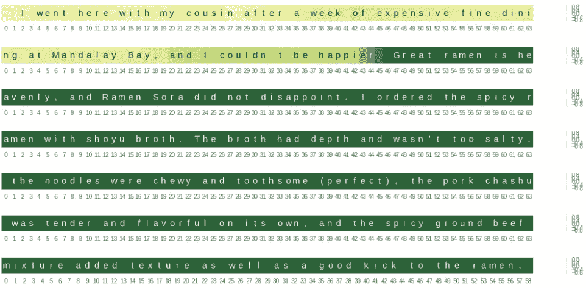
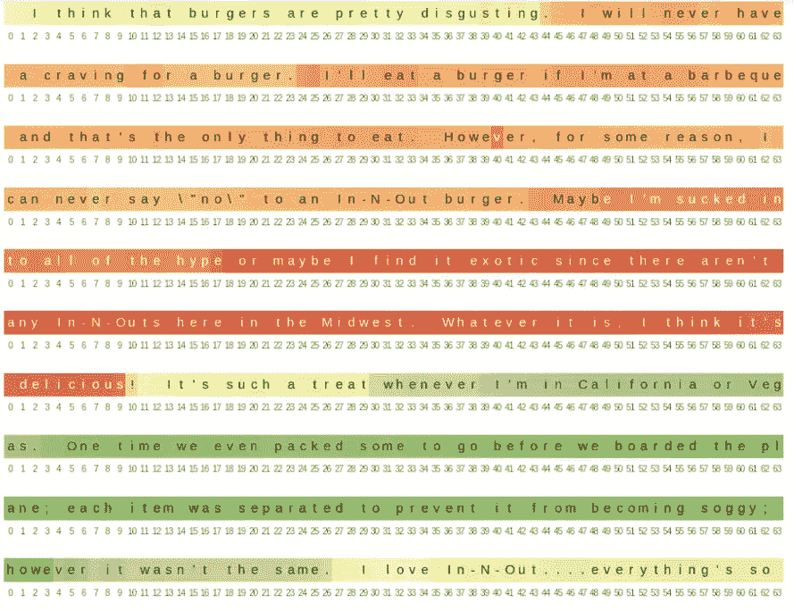
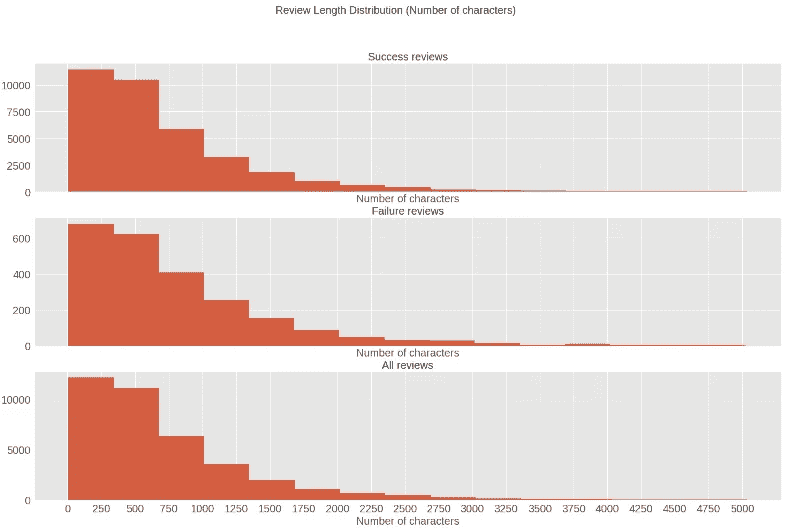

# 一个神经元不合理的有效性

> 原文：<https://towardsdatascience.com/the-unreasonable-effectiveness-of-one-neuron-998fd5298bd3?source=collection_archive---------6----------------------->

从[https://rakeshchada.github.io/Sentiment-Neuron.html](https://rakeshchada.github.io/Sentiment-Neuron.html)交叉发布

(**我所有的实验和可视化都可以在** [**这个**](https://github.com/rakeshchada/generating-reviews-discovering-sentiment/blob/master/Sentiment-Neuron-Yelp.ipynb) **jupyter 笔记本**中查看)。

我最近看到一篇研究论文( [*拉德福德等人，*](https://arxiv.org/abs/1704.01444) )让我很着迷。作者发现一个**单个神经元**捕捉了整篇文章的情感。他们甚至更进一步，表明即使在没有监督的情况下，它在情感分类任务上表现得非常好。什么不是！他们甚至通过固定神经元的值来生成连贯的文本。

尽管这不是第一次有人发现这种可解释的神经元。 [Karpathy et al.](https://arxiv.org/abs/1506.02078) 举例来说，发现了在引号内激活的神经元， *if* 语句中的代码块等。这在[这篇](https://karpathy.github.io/2015/05/21/rnn-effectiveness/)伟大的博文中有详细解释。事实上，那篇文章启发了我这篇文章的名字:)然而，感情是一种高级的表达。它更多的是对文本语义的深入理解，而不仅仅是它的句法结构。单个神经元捕捉到整个情绪的事实令人难以置信。这意味着单个浮点数是对一个段落的情感进行分类所需要的全部。多迷人啊。！

我个人想更详细地探索这一点。谢天谢地，作者已经开源了他们训练了大约一个月的模型。)以及他们的一些代码库。我添加了情绪神经元热图可视化，并做了一些其他的修改。我选择了张等人在[、](https://arxiv.org/abs/1509.01626)中介绍的 Yelp 评论二进制数据集进行分析。总共有大约 60 万条评论。

## 语言模型

这一切都是从字符级语言建模任务开始的。目标是在一段文本中一次预测一个字符。与单词级建模相比，字符级建模的一个优势是它固有的捕获词汇表外单词的能力。作者训练了具有 4096 个单元的乘法 LSTM 模型。每个字符被编码成一个 64 维向量，LSTM 一次处理 64 个字符。他们使用的亚马逊评论数据集有大约 8200 万条产品评论。

## 情感神经元发现

引起我兴趣的第一个问题是——作者最初是如何发现这种情绪神经元的？我的意思是，在输出层大约有 4096 个神经元。他们是否想象每个人都在试图寻找某种模式？也许不是。但如果你仔细阅读这篇论文，你会发现他们使用 L1 正则化在这 4096 个神经元的基础上训练了线性模型。假设有一个具有 4096 个特征的模型，那么发现这个特定的特征将归结为特征贡献(权重)的问题。如果单个神经元解决了几乎整个分类任务，那么它的贡献应该是非常高和显著的。

让我们看看情绪神经元是否也是如此。这是我通过在 Yelp 数据集上进行情感分类训练得出的特征贡献图。

Feature importances with L1 regularization

哇！事实上，有一个特征具有很大的权重。一定是情绪神经元。事实上，我们甚至可以在 4096 个神经元的列表中得到它的索引。如果你看一下[笔记本](https://github.com/rakeshchada/generating-reviews-discovering-sentiment/blob/master/Sentiment-Neuron-Yelp.ipynb)，你会看到它的索引是 2388。还有少数其他神经元的贡献相对较高。我们最终会看到它们。

## 无监督学习

既然我们已经发现情绪神经元对最终情绪有很大影响，那么看看训练数据大小对其学习能力的影响将会很有趣。作者做了这个实验。他们从零训练数据开始，逐渐增加，直到性能达到极限。这导致了一个有趣的发现。即使有了**零标记数据**，情绪神经元也能够非常准确地预测情绪！*无监督学习效果极佳！*在不使用任何人工标注数据的情况下，在语言建模任务上训练该模型。然后，在没有任何监督训练的情况下，该模型中的一个特征被用于对另一项任务(情感分类)进行预测。这也类似于典型的迁移学习设置，这是计算机视觉任务中的常见技术。

此外，性能很快就会达到上限(10–100 个示例，具体取决于任务)。这意味着 ***拥有 100 万个手动标记的示例与拥有 100 个示例*** 对模型性能的影响是一样的。如果以前发现了这种模式，可以节省大量的标记工作和成本！

对于我们的 Yelp 分类任务，我通过使用情感神经元值的阈值来尝试对数据集进行无监督分类。当输出通过一个双曲正切门时，如果输出是正的，我预测正类，如果输出是负的，我预测负类。在没有任何训练的情况下，这给了我一个 **~93.67%** 的任务准确率。这是相当惊人的！

## 情感神经元的可视化

获得对正在发生的事情的直觉的一个好方法是将事情视觉化。可视化对于 LSTMs 来说可能是一个挑战，但幸运的是，在这种情况下，我们只需要跟踪一个神经元。卡帕西在可视化 RNNs 方面做了一些奇妙的工作。遵循类似的想法，我构建了一些方便的 python 函数来帮助可视化情绪神经元。由于这是一个字符级模型，我们可以在情绪神经元处理每个字符时跟踪它的值。然后，这些值可以表示为情绪热图。下面可以看到一个这样的热图:

Sentiment Heat map for a review

你可以观察到情绪神经元准确地跟踪状态，没有受到一次性负面词汇的影响，如**昂贵**或**失望**。

下面是另一个负面评论:

看到像“**不好”**、“**慢”**、“**大声”**等短语时，神经元如何在负方向上改变其状态，这真的很好。此外，尽管短语“**有一些好馅饼的城镇”**听起来很积极，但整体情绪没有受到影响。( [**注意**](http://www.wildml.com/2016/01/attention-and-memory-in-deep-learning-and-nlp/) [机制](http://distill.pub/2016/augmented-rnns/)有人吗？)

太好了！它在较大的文本上表现如何？

太棒了！尽管文本篇幅很长，但它还是相当准确地捕捉到了情感的所有变化。冗长的文本是递归神经网络通常努力解决的问题！

好了，我们现在对情感神经元如何成功处理文本有了一些直觉。理解失败案例中发生的事情也同样有趣。

这里有一个例子:

嗯有意思！这里发生了几件事。首先，在评论的开始有*讽刺*。神经元无法捕捉到这一点，并将其视为积极情绪。然后神经元成功捕捉到了清晰的负面评论。最后，评论继续称赞*的另一家*餐厅。从技术上来说，这部分的情绪是积极的，但它只是与另一家餐厅相关联。总的来说，我有点理解这对于情绪神经元来说是一个多么艰难的案例。

虽然在一些情况下，神经元发生了什么还不清楚。让我们看看下面的例子。

这种情绪不知何故总是停留在积极的区域，尽管明显存在消极的短语！

## 句子更新结束

如果你看所有的图，你会发现一个共同的模式。情感神经元的值在句子的结尾得到重大更新(通常在看到一个“**”之后)。**”)。这意味着神经元会将整个段落分成一系列句子，并在处理每个句子后更新情感值。对于一个角色级别的模型来说，这是一个非常有趣的结果！

## 情绪变化

看看情感值在文本范围内如何变化可能会有所帮助。下图就是分析这一点的一种方式。

Sentiment value shifts for a review

我在寻找一些与句子中相对位置相关的移位模式。但是在这些情节中没有明显的模式。

## 评论长度的影响

我们之前已经看到神经元能够很好地处理大型评论。现在让我们试着想象情绪神经元成功和失败的情况下长度的分布。如果长度影响了性能，这个图应该清楚地表明。

Review Length Distribution for Success, Failure and All reviews

所有的分布(成功和失败)看起来都和真实的分布一样。这意味着*回顾长度与神经元*的表现没有相关性。那是相当大的新闻！

## 其他重要的神经元

当我们可视化特征贡献时，我们注意到一些具有更高贡献的其他神经元。我试着在评论中追踪他们的状态，就像我对情感神经元所做的那样。下面是一个这样的可视化。

Visualization of other important neurons

不过，我看不出任何明显的模式。你可以参考[笔记本](https://github.com/rakeshchada/generating-reviews-discovering-sentiment/blob/master/Sentiment-Neuron-Yelp.ipynb)了解更多这样的可视化。随意玩，如果你发现任何有趣的模式，请发帖。

## 监督培训

我们已经看到了情绪神经元在零监督下的表现。我还尝试在整个 yelp 数据集上训练模型。最佳线性模型(具有 l2 正则化和 0.001 学习率的逻辑回归)给出了 me ~ **94.86%** 的准确度。这仅比仅使用情感神经元的无监督训练提高了约 1%。这与作者的主张是一致的，即额外的监督只在一定程度上有帮助，并且性能很快就达到极限。

## 文本生成

我们一直在谈论的神经网络被训练来预测下一个字符。所以如果我们不从中生成一些样本，那就不公平了:)！

当被要求以“嗯”开始时，下面是它生成的内容。

`Hmm what a waste of film not to mention a Marilyn movie for nothing.`

嗯，那还不错！

有趣的部分是通过固定情感神经元的值来生成样本。下面是一些生成的样本。

*   **情绪** = 1.0 和**起始短语** =“这是”= > `This is a great album with a quality history of the group.`
*   **感悟** = -1.0 和**起始短语** = "可能" = > `It might have been good but I found myself skipping pages to get to the end.`

我试着用“我不能”这样的短语作为开头语来欺骗它，但是把情绪固定为积极的。但它仍然做得很好，如下图所示。

*   **情绪= 1.0** = > `I can't wait to try the other flavors - and I have a ton of them on hand just in case one should have gone out for a trip or need a "big new place" and they are delicious.`
*   **人气= -1.0** = > `I can't believe I bought this book.`

令人高兴的是，生成的短语是连贯的，像人类一样，也符合预期的情绪。

也就是说，有时生成的文本并不完全符合情感。

*   **情绪= -1.0** 和**起始短语** =【伟大】=>=`Great DVD with the original production leaving good video and audio quality.`

关于生成的有趣之处在于，它也可以被视为获得单个神经元直觉的一种方式。为此，我尝试通过固定其他重要神经元的值来生成文本。例如，将神经元 801 的值固定为-1.0 会生成此文本。

*   `This is the greatest movie ever! Ever since my parents had watched it back in the 80s, I always watched it.`

它(神经元 801)似乎与情绪有某种关联。

修复不同的值(甚至多个值一起)并查看生成的文本是一个有趣的练习。这样生成的样本可以看[笔记本](https://github.com/rakeshchada/generating-reviews-discovering-sentiment/blob/master/Sentiment-Neuron-Yelp.ipynb)。

## 接下来呢？

我们看到了一些有趣的事情。这些结果应该是一个巨大的激励因素，投入更多的研究语言建模和前训练/迁移学习的自然语言处理。单词向量( [word2vec](https://code.google.com/archive/p/word2vec/) 、 [GloVe](https://nlp.stanford.edu/projects/glove/) 等)通常是目前深度学习 NLP 任务中使用的唯一一种预训练输出。我还对扩大/缩小数据集范围并进行类似分析的结果感到兴奋。例如，对于情感神经元的这种离散存在的假设之一(由作者提出)是，情感是评论的语言建模的强预测特征。那么，我们能否通过手动控制训练数据集的分布来发现这种离散的&可解释神经元呢？作为一个例子，我们是否可以通过将我们的训练数据作为不同主题的新闻语料库来发现**主题神经元**？总的来说，这里的想法是使训练数据非常领域/任务特定，看看我们是否可以通过语言建模恢复任何可解释的神经元。这可以在多个域/任务上完成。

另一种方法是扩大域。这意味着你要在你的训练集中包含尽可能多的数据(来自几个领域)，做类似的分析，看看你是否能发现任何可以解释的东西。有许多公开可用的数据集来做这样的分析。

对于这项任务，将单词级语言建模与字符级语言建模进行比较也是很有趣的。

有无限的可能性，我对任何与此相关的未来工作感到兴奋！

*PS:我一直在努力增加我的神经网络知识，我认为实现东西是一种很好的学习方式。我正在做的是一系列不同的任务。如果你也有兴趣，可以跟着* [*这个*](https://github.com/rakeshchada/learning-deep-learning) *资源库！*