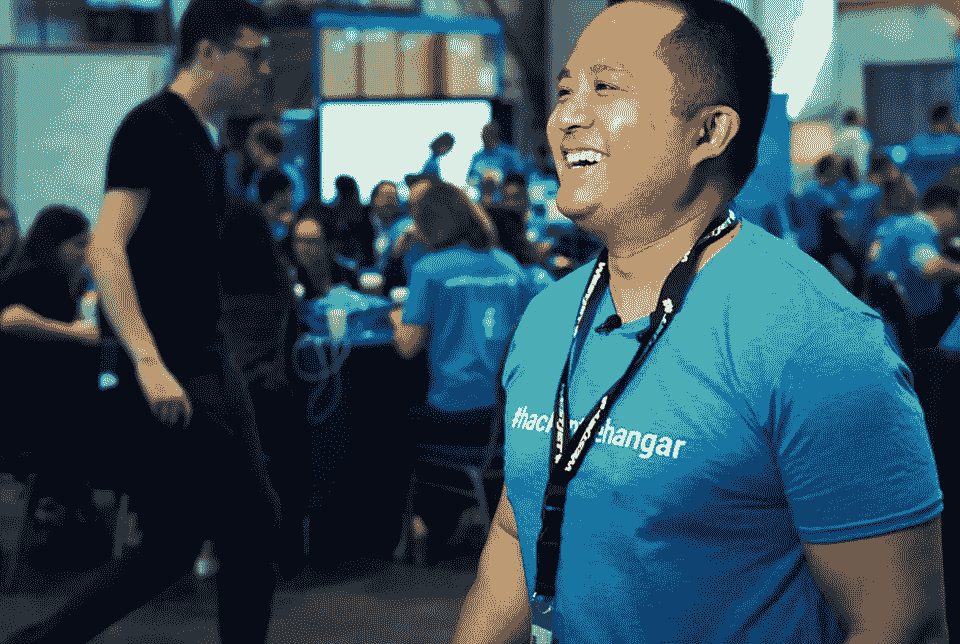
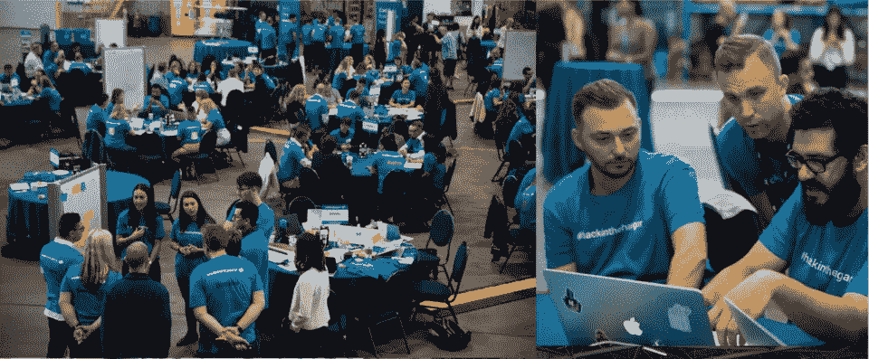
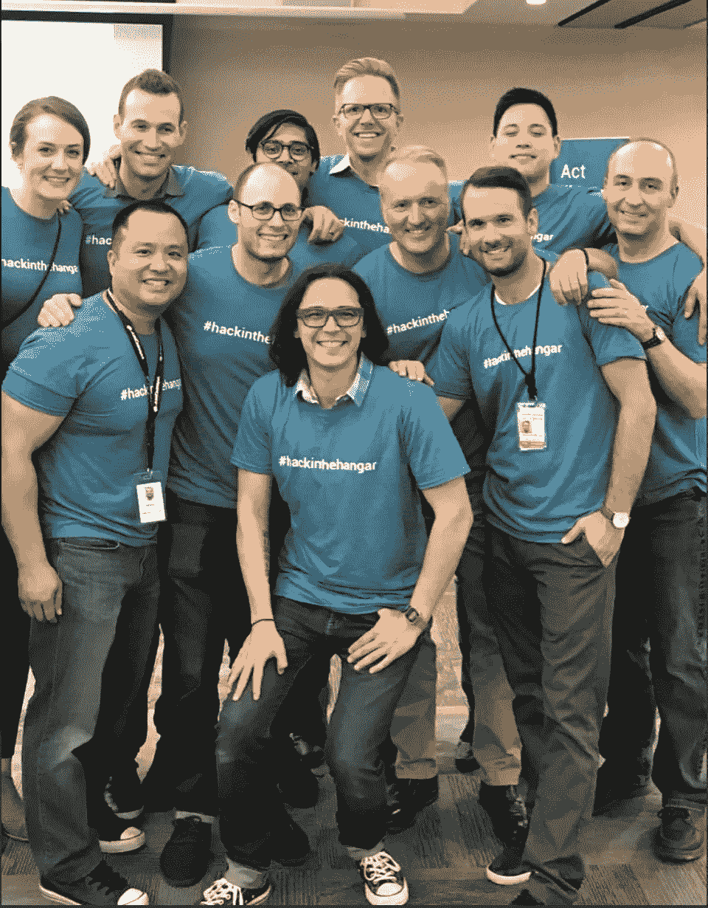
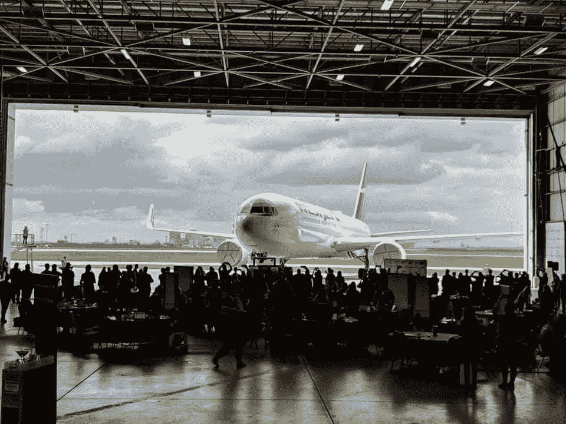

# 韦斯特杰特推动航空公司走向未来

> 原文：<https://towardsdatascience.com/the-westjetter-propelling-an-airline-into-the-future-6e1dd2e68452?source=collection_archive---------14----------------------->

Alfredo C. Tan, Chief Digital and Innovation Officer, WestJet

如今，数字颠覆司空见惯。它发生得如此频繁，以至于当它发生时，它不再像以前那样令人印象深刻。然而，它不断提醒许多传统组织的首席管理人员，他们需要进行转型，以跟上不可预测的市场和不稳定的环境。

随着这家加拿大航空公司逐渐成为一个全球成功的故事，WestJet 新任首席数字和创新官 Alfredo C. Tan 被赋予了推动这一新方向的任务。在短短的 20 年里，西捷航空在北美、中美洲、加勒比海和欧洲建立了 13，000 多名员工和 100 多个目的地，并通过合作伙伴关系在 20 多个国家建立了 175 个目的地。

与几乎所有行业一样，全球旅游业和旅游业也经历了重大变化。这个价值 7.6 万亿美元的行业的商业模式发生了显著转变，部分原因是 Airbnb 和优步等颠覆者。航空业也不能幸免。受传统运营和严格监管的影响，转型的愿望不是短时间内可以实现的。

由[航空中心](https://centreforaviation.com/analysis/reports/airline-disruption-it-will-happen-in-the-next-decade---but-no-one-is-preparing-for-it-339418)发布的这份 2017 年报告承认了这些变化:

> 与其他任何行业相比，航空公司都受制于 70 年前设计的晦涩难懂的监管框架，其目的除了防止新的进入之外别无它用。这是一个资本密集型的高度工会化的行业，由传统模式主导，仍然专注于购买和飞行昂贵的金属。但从本质上讲，航空产品只是另一种消费零售产品。因此，它同样容易受到剧变的影响……我们所知道的航空业到 2025 年将会面目全非，因为其基本特征将被彻底根除。这一过程将会加速，因为商业航空的每个关键方面都会出现混乱:飞行和销售。

我有幸与 Alfredo C. Tan 坐在一起，探讨他的西捷之旅，以及他对在一个已有成就的组织中引发一些必要变革的愿景。

# 痴迷于加入赋予互联网一代权利的运动

阿尔弗雷多记得思科系统公司“赋予互联网一代力量”的广告。这一强有力的信息描绘了一个被网络和市场的最终连接所改变的世界。当时，作为一名法医学和生物学的学生，他觉得自己错过了成为 dot.com 公司诞生这一不可思议浪潮的一部分的机会。

当他毕业时，他在《财富》杂志上读到一篇关于顶级商学院毕业生拒绝蓝筹股公司去硅谷追逐新的淘金热的文章。阿尔弗雷多不会放过任何一个机会，他学会了如何编码，并沉浸在计算机和技术课程中。很快，他在 Bell Nexia 从事系统工程和设计，并最终带领一个工程师团队在世贸中心灾难期间帮助恢复纽约和多伦多电信公司之间的连接。一路上，阿尔弗雷多一直在寻找愿意教他的导师:

> 专业领域的大多数事情，即使没有接受过正规教育，你也能做得很出色。有了足够的指导、求知欲、才能、勇气和激情，你几乎可以在任何地方获得成功。

无论是在加拿大贝尔，他学会了建立大规模的战略联盟、企业营销和战略，还是在 MSN.ca，他接触到了颠覆性的在线广告、媒体销售和互联网营销，还是在雅虎！阿尔弗雷多在移动、搜索和企业合作伙伴关系领域工作，他的旅程体现了他整个职业生涯中的学习咒语。

# 脸书:改变一切的平台

如果你能预见未来，知道十年内你的公司刚刚进入 S&P500，你会毫不犹豫地加入。在 2008 年，这一点几乎不明显，阿尔弗雷多挣扎着决定离开一份充满无限机会的令人惊叹的工作，这家公司仍然是一个社交网络的互联网巨头，人们认为它被高估了，没有明确的盈利战略，没有真正的市场差异，很容易像 MySpace 或 Friendster 一样半途而废。对他来说，2008 年旅行归来的那一刻是决定性的时刻。他记得，

> 在我 2007 年旅行回来之前，我在刚认识的人之间交换了电子邮件地址。到我 2008 年去旅行的时候，每个人都只交换脸书的身份证。在 12 个月内，从电子邮件到脸书的移动是不真实的。脸书真正构建的是大规模的身份认同。它真正拥有的是人——22 亿人。而且随着它的不断成长，它继续是无懈可击的。

他选择冒险去脸书，尽管所有的指导和建议都是相反的。他在那里待了 8 年，最后两年与东南亚和拉丁美洲高增长市场的领导团队一起工作。这些学习改变了生活，定义了职业。

# 为什么传统商业不能适应市场变化？

尽管脸书和社交网络在全球范围内取得了诸多成就，但企业仍未完全接受跟上动态市场步伐所需的变革。

阿尔弗雷多指出了谷歌、网飞、脸书、微软、优步、苹果和亚马逊等颠覆者。这些公司有不同的方式来建立他们的创新文化。他们之间有什么共同点？

1.  他们带着一种紧迫感前进
2.  他们崇拜速度
3.  他们不怕变化

这是对传统公司运营方式的两极化观点。

作为 WestJet 的首席数字和创新官，Alfredo 的经历使他对未来的挑战已经成熟。WestJet 认识到变革的必要性和支持变革的文化。作为一家传统公司，它的行为与阿尔弗雷多习惯的环境大相径庭。来自技术领域，有一个共同的理解，一个共同的思维方式，因为技术不是你需要说服人们投资的东西。

> 这是公司 DNA 中的固有基因。

在大多数传统公司中，数字化并不是公司成功的基础。成功来自组织内的其他实践。挑战变成了说服公司里的一群人投资你认为正确的东西。

阿尔弗雷多认为，大多数领导者和员工都明白世界已经发生了巨大变化，但还不清楚数字化如何成为竞争优势。教育和赢得人们的心和思想有一个过程，即“在他们看到之前相信它”。高管们相信变革是西捷航空的新常态。员工真正的兴趣和动力激发了 Alfredo 的灵感，使之成为现实。

# 西捷航空有史以来第一次黑客马拉松

#HackintheHangar WESTJET

换一种方式思考需要时间。你不能简单地说一句就假设人们明白了。正如他继续了解一个无限复杂的行业一样，Alfredo 和他的团队反过来需要以一种帮助整个公司理解数字化和创新对业务的影响的方式来教育和讲述这个故事，没有行话，也没有炒作。

这很快就有了结果。西捷航空忠诚度副总裁达西·莫纳汉(d'Arcy Monaghan)和产品开发经理朗达·雷诺兹(Rhonda Reynolds)与阿尔弗雷多接触，讨论为高端旅客开发解决方案，然后这些解决方案可以惠及西捷航空的所有乘客。阿尔弗雷多刚上任几周，并不认为他和他已经受到限制的团队有能力独自解决这个问题。

虽然最初的想法是在来自不同部门的一群人之间进行头脑风暴，但它很快演变为包括阿尔弗雷多在技术行业的一些朋友。随着越来越多的人听说这件事，他们就越想参与进来。内核发展成了全天黑客马拉松的想法，这是一场开发无缝优质客户体验的比赛，于是#HackInTheHangar 诞生了。

#HackintheHangar WESTJET

Alfredo 邀请了一些最大的技术公司和系统集成商，如 Adobe、脸书、亚马逊、德勤数字、谷歌、松下航空电子、Twitter、LinkedIn、Snapchat、Hootsuite、IBM、Salesforce、Huge Inc .等。总共有 17 家公司及其 120 名来自技术、创意和设计背景的人员与 37 名 WestJetters 和 12 名 WestJet 的高级旅行者配对参加了这次为期一天的活动。正如阿尔弗雷多指出的:

*最初，这个非常简单的想法在公司引发了这场运动，旨在回答几个关键问题:*

*我们如何向 13000 人展示我们可以用不同的方式解决问题，共同创造新的体验？*

*更重要的是，以更大的速度:*

我们如何让非技术人员在黑客文化中解决问题？

*我们如何赢得全球技术社区的尊重，从而获得灵感并与我们合作完成我们的数字和创新使命，共同创造旅行的未来？*

*我如何赢得组织中关键高管的支持，我需要他们的支持才能取得成功？*

这次活动的评委是经过精心挑选的。目标是展示在一天之内开发出的令人惊叹的想法和解决方案，让他们理解并宣传 Alfredo 对公司的愿景。

# 恰好会开飞机的数码公司

WestJet Plane at the #HackintheHangar

一天结束时，西捷航空的高管们几乎不需要说服。客户体验副总裁 Louis Saint-Cyr 指出，有遗留行为的航空公司限制了他们能为客户做的事情。黑客马拉松揭示了西捷航空需要适应日益数字化的旅客旅程。他证实了该行业目前在创新和监管之间的推拉作用产生了运营限制。尽管如此，路易斯看到了巨大的可能性:

> 这次黑客马拉松揭示了我们如何围绕这些结构性限制进行创新。我们如何以数字方式增强一线人员的能力，并增加 WestJetters 以技术定制客户体验而闻名的软技能？
> 
> …想想客户旅行过程中遇到的障碍:到达机场的时间、拿行李的等待时间、办理登机手续——这些都会增加压力。通过利用社交媒体的情感框架并将其与旅客旅程相结合，我们可以直接解决这些障碍，从而改变旅客的航空旅行。
> 
> …总的来说，通过将顾客资料与他们在飞机上、网站上和机场的期望结合起来，我们可以在顾客体验方面取得显著进步。

西捷航空首席执行官艾德·西姆斯(Ed Sims)宣布，在 24 个月内，西捷航空将成为一家碰巧会开飞机的数字公司。它向技术社区和领导团队发出了一个信号，即这次黑客马拉松不仅仅是一个附带项目；这将是公司的未来。

> 西捷航空的首次黑客马拉松代表了西捷航空向更具创新思维的文化转变。我们将快速行动，快速学习，快速建设。我们现在有机会以不同的方式做事，在旅游领域进行前所未有的创新。我们的目标是让产品远远超出顾客的期望。" ~Ed Sims，WestJet 总裁兼首席执行官

阿尔弗雷多的下一步？

> 黑客马拉松和由此产生的想法都是戏剧和理论，直到你开始建设。我们必须构建我们认为有吸引力的功能，以及我们将在未来研究的其他功能。创新是一种文化心态，但它来自于建设。

这些出色的想法将为未来五年发展这些能力奠定基础。此外，鉴于黑客马拉松后重复举办更多活动的巨大需求，WestJet 计划举办不同主题的年度活动。

在很短的时间内，黑客马拉松产生的接受度，灌输了一种将黑客文化嵌入公司的思想，作为解决问题的一种方式，并授权跨职能团队在有限的时间内自我组织和发明解决方案。

> 我们会找到一种方法，让它在组织中普及，这样，想要修正流程的机组人员就可以召集一群人来创建一个解决方案，然后在几天内提交给预算审批。它让黑客马拉松规模更小，团队规模更小，声势更小。希望这能影响 13000 人开始这样想。
> 
> 我们才刚刚开始…最终，如果我是唯一一个负责数字和创新文化的人，我会在工作中失败。所有西杰特人都应该拥抱它和未来。

Alfredo C. Tan 的口头禅是保持好奇和不断学习，在最初的 90 天里，他推动组织以不同的方式思考，学习新的做事方式，并挑战他们想象力的极限。

这篇文章起源于[福布斯](https://www.forbes.com/sites/cognitiveworld/2018/07/24/the-westjetter-propelling-an-airline-into-the-future/#3d728ccd44da)。