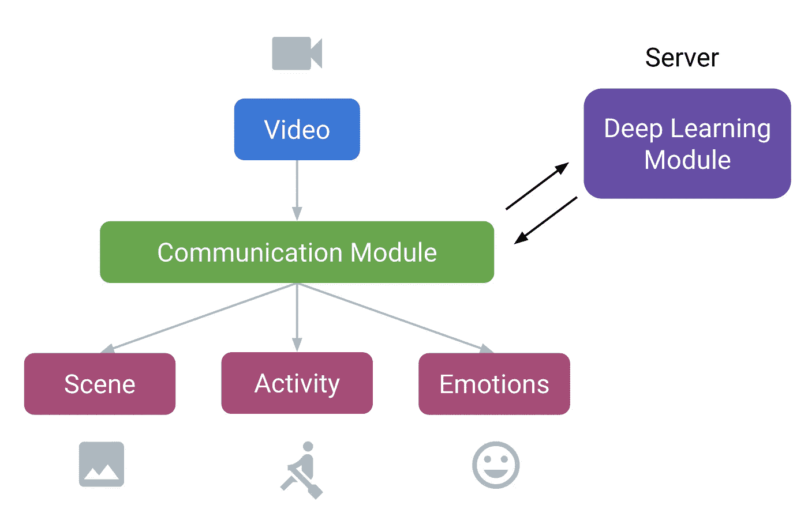
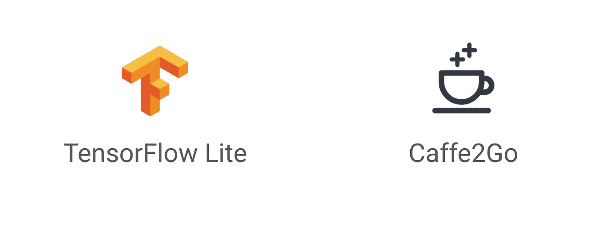
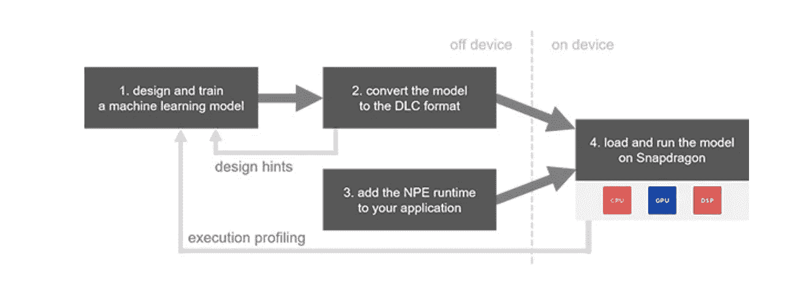
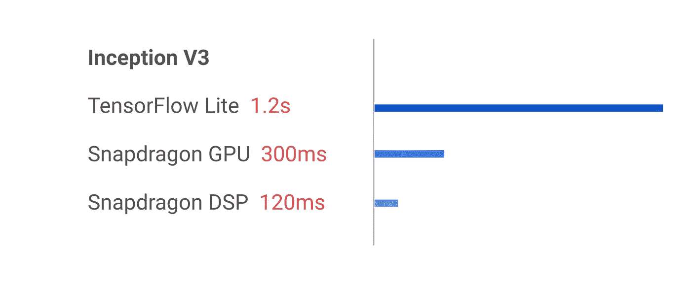
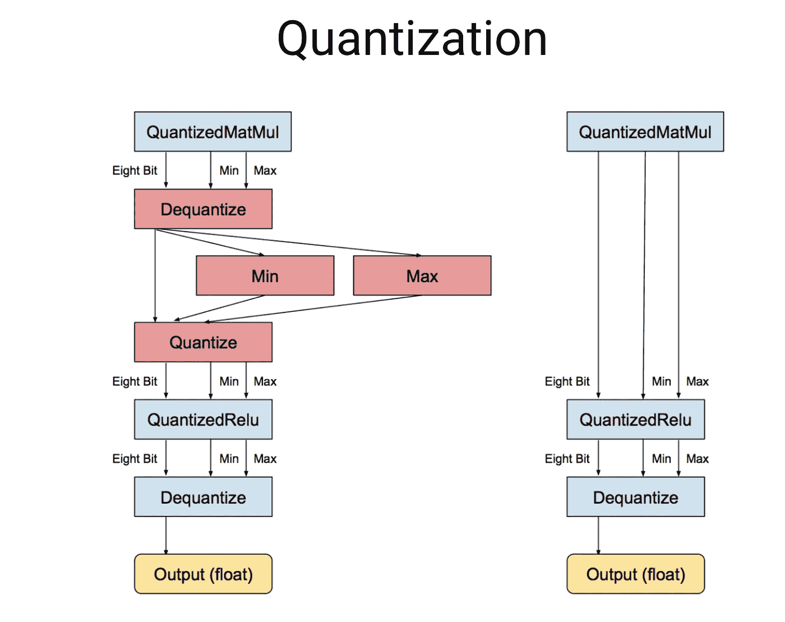

# 在移动设备上运行深度学习推理的是什么和不是什么

> 原文：<https://towardsdatascience.com/the-what-and-what-not-of-running-deep-learning-inference-on-mobile-81aa394ad27d?source=collection_archive---------8----------------------->

这个概念在我的草稿中已经存在很长时间了，我已经意识到缺乏相关的文档仍然会导致混乱，所以，我想把我的经验和理解发表出来。

文章假设，深度学习如何工作的基础知识以及它们的实现。假设是，有一个模型在服务器或本地笔记本电脑上训练和工作，以预测事物。

现在，如果你想在移动设备上做类似的事情，有多种方法，我们将一步一步地讨论相同的方法。从示例的角度来看，假设您有视频，并且希望通过深度学习模块对其进行处理，并获得输出的分析指标。

整个解释将集中于在移动设备上实现上述框图时做什么和不做什么。

# **1。将数据发送到服务器进行处理**

这里的想法是建立通信模块，它与服务器通信，将内容发送到服务器，让服务器推断数据，并将元数据发送回设备。

**优势:**

> 移动开发团队和数据科学团队之间的交流没有任何问题，发送数据和获取数据

**缺点:**

> -->极高的延迟
> - >互联网可用性，与服务器同步(完全是另一个问题)
> ->-**隐私**(无法将数据发送到我的手机之外)

这个缺点不容忽视，这就引出了下一个重要的想法，

有各种各样的方法可以达到同样的目的，我们将逐一讨论它们的利弊。这方面最简单的方法是

# 2.使用开发框架的现有包装器

我们将从著名的、容易开始考虑的开发框架开始。

几乎没有相同方向的图书馆，

## **TensorFlow Lite**

这是 Tensorflow 的移动版本，不会有太多的学习曲线，因为文档和支持都维护得很好。训练模型并在移动设备上运行推理，就好像您在本地计算机上运行一样。

**优点:**

> ->围绕模型转换运行的工作量最小，来自数据科学和移动开发团队的知识转移有限。
> - >比服务器方法相对更快
> - >无平台依赖性

**缺点:**

> ->大型号尺寸
> - >与笔记本电脑运行时相比超级慢

## 咖啡 2Go:

这曾经是由脸书的 Caffe 团队支持的，现在，他们已经将它作为 PyTorch 的一部分嵌入其中。我没有做过这个的最新版本，但是，我会根据我一年前的经验给出我的分析。

**优点:**

> -->同样，从开发到生产的努力是最小的，如果你在 Caffe
> - >上工作，比服务器方法和 tensorflow lite
> - >相对更快，没有平台依赖性

**缺点:**

> ->大型号尺寸
> - >又来了，相比笔记本时间超级慢
> - >在我使用的时候非常不稳定(一年前)

在这个阶段，与服务器模式相比，我们已经大大提高了我们的性能，但是，这仍然不是我们可以开箱即用的东西。上述方法的主要问题是速度和模型大小，我们将尝试单独解决每个问题

## **加工速度:**

为了解决速度问题，我们将尝试在计算机上解决相同问题的相同路线，解决方案很简单，使用更好的硬件，特别是 GPU 的引入改变了事情

同理，如果能在移动上使用硬件加速或者特定的硬件，就有加速的可能。这就引出了如何在手机上有效利用硬件的探索之路。
这导致将整个硬件空间分为两种类型:

**受控硬件:**

称之为一致的原因是，在不同型号的变化中，除了一些小的变化外，硬件方面没有什么大的变化。因此，在苹果设备上开发硬件特定模型更容易，这导致了对可用硬件能力的探索。

有趣的是，我们在那个时间点接触到了 metal 框架，它刚刚发布了卷积内核操作，作为他们框架升级的一部分。我们使用金属框架围绕操作员建立了模型，它工作速度非常快！( ***盗梦空间 V3:150 毫秒*** )

考虑到苹果最新的机器学习移动框架，金属的用法现在已经无关紧要了。

**CoreML！**

> 转换->加载->推断！

它支持大多数主要的运营商和图书馆。几乎所有库中的模型转换包装器都是可用的。在您感兴趣的任何框架中开发，使用可用的包装器将您的模型转换为 core ML 格式，然后加载模型并获得结果，您可以在少于 6 行代码中看到结果。

**不受控制的硬件:**
Android 可以在这里找到，因为不同制造商在硬件方面有很大的差异

这个平台本身有点复杂，要用我们为苹果做的同样的方式来解决它。我们的目标是通过硬件专用库来解决这一问题，如高通神经处理 SDK，它使用 snapdragon 820+手机额外的硬件功能。

这个 SDK API 使用 snapdragon 的 GPU 和 DSP 功能，在推理方面让事情变得更快。流程与 Core ML 相同，在任何开发框架中训练，转换模型，使用 SDK 在设备上使用。

侧写！

这种方法粗略地解决了我们对速度的想法——至少在一个基本的方式上，根据你各自的应用程序，速度可以做更多的升级。

## 模型尺寸:

默认情况下，如果从服务器直接移植到移动设备，模型的大小会非常大。模型越大，它消耗的内存就越多，当用户注意到所有这些事情时，事情就会变得非常困难，并且您不希望每次升级模型时都迫使用户下载千兆字节的数据。更大的模型还有各种其他的技术难题。因此，解决方案是减小尺寸，这就让我们遵循一些有趣的方法。

**量化:**
将 float 或 double 值转换为 int 值，这导致模型大小减少了 4 倍，从技术上讲，做所有这些事情有点棘手，但是，有足够的资源来检查它。

我发现 P [彼得·沃顿的](https://petewarden.com/2016/05/03/how-to-quantize-neural-networks-with-tensorflow/)文章在当时非常有用，我建议每个人在尝试使用市场上现有的东西之前先浏览一下。

> [https://Pete warden . com/2017/06/22/what-ive-learned-on-neural-network-quantization/](https://petewarden.com/2017/06/22/what-ive-learned-about-neural-network-quantization/)

几个月前，甚至 tensorflow 也正式发布了相同的支持代码

> [https://www.tensorflow.org/performance/quantization](https://www.tensorflow.org/performance/quantization)

出于同样的原因，苹果的 Core ML 已经开始支持 16 位精度，而不是 32 位精度。

> [https://developer . apple . com/documentation/coreml/reducing _ the _ size _ of _ your _ core _ ml _ app](https://developer.apple.com/documentation/coreml/reducing_the_size_of_your_core_ml_app)

**模型剪枝:**
通过了解哪些模型权重不是那么有用，从模型中移除不重要的节点权重。

> [https://Jacob Gil . github . io/deep learning/pruning-deep-learning](https://jacobgil.github.io/deeplearning/pruning-deep-learning)
> 
> [https://arxiv.org/pdf/1611.06440.pdf](https://arxiv.org/pdf/1611.06440.pdf)

**网络优化:**
了解什么是需要的，什么不是，这是一个重要的方面。
人们必须相应地优化网络，比如用 1d 卷积替换全连接。如果一个人足够了解他们的网络，还有其他各种方法可以做到这一点。

# 结论:

我将以回答故事的标题来结束我的发言

## **什么不该做？**

如果数据是图像/视频，不要使用基于服务器的方法。您可以使用基于服务器的小文本和基于语音的数据。

## 怎么办？

考虑到我的经验，在如何处理这个问题上没有单一的解决方案，它应该完全基于你想要解决什么样的问题。

话虽如此，如果问题是基于图像的，那么，我强烈建议围绕硬件特定的库编写您自己的包装器，这可以很好地提高模型速度并支持模型大小操作，您最终可能会这样做。

附言:我在 tensorflow lite 上的实验已经很老了，请随时再做一次实验，因为他们可能已经根据行业更新了他们的模块。

你可能也有兴趣探索百度图书馆的移动版本 paddle-mobile。我还没有完全做好这方面的工作，但是我听到了一些很好的分析评论。话虽如此，据我所知，目前的图书馆还不稳定

> [https://github.com/PaddlePaddle/paddle-mobile](https://github.com/PaddlePaddle/paddle-mobile)

我想提出的另一个非常重要的建议是，使用 ONNX 作为开发中模型序列化/去序列化的首选格式。一年左右你会感谢我的。

> [https://github.com/onnx/onnx](https://github.com/onnx/onnx)T10[https://onnx.ai/](https://onnx.ai/)

**MnasNet**

如果你正在跟进谷歌最近的论文，你一定注意到了最近关于移动深度学习架构搜索的论文，这听起来非常有趣，我建议浏览一下这篇论文，这可能会给你一些关于设计网络以使其移动高效的见解。

> [https://arxiv.org/pdf/1807.11626.pdf](https://arxiv.org/pdf/1807.11626.pdf)

这些观点完全基于我一年前的实验和经验，可能对你不起作用。所以，请随时反对，如果内容偏离事实，我将非常乐意根据最新的标准进行编辑。