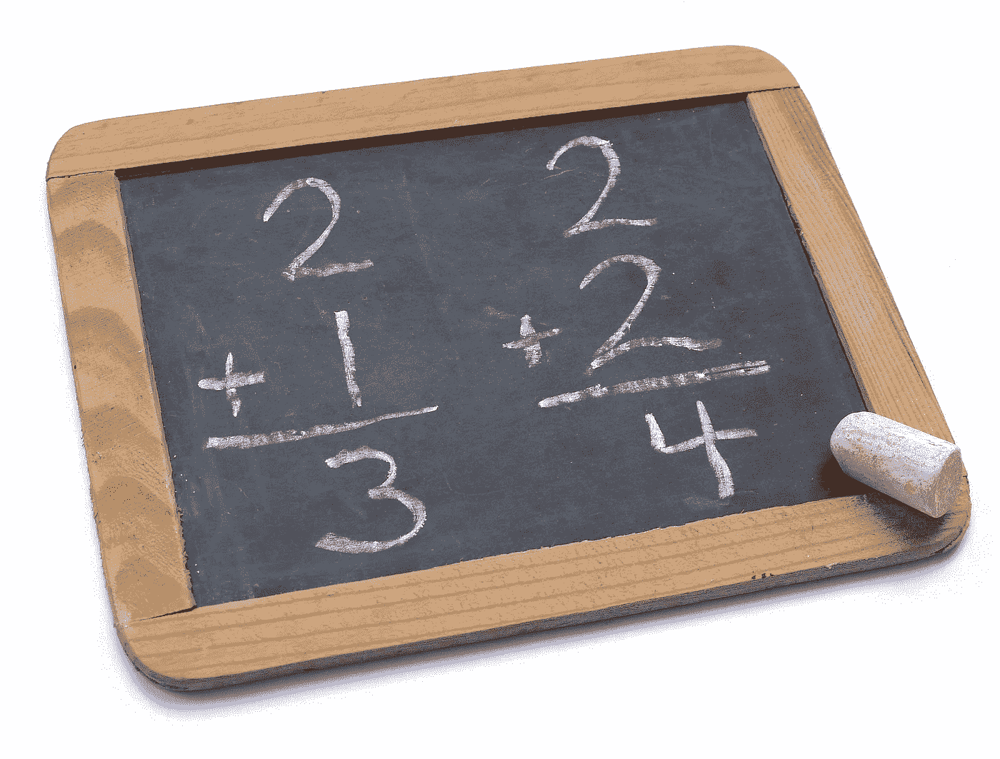

# 话加起来！

> 原文：<https://towardsdatascience.com/the-words-add-up-why-baseball-usa-india-cricket-d31b595b8df4?source=collection_archive---------7----------------------->

Image by [Julia_S](https://pixabay.com/users/julia_s-4109630/?utm_source=link-attribution&utm_medium=referral&utm_campaign=image&utm_content=3789462) from [Pixabay](https://pixabay.com/?utm_source=link-attribution&utm_medium=referral&utm_campaign=image&utm_content=3789462)

当你学习数学的时候，你有没有想过除了数字之外的东西？如果 1 + 2 = 3，那你为什么不能说“绿色+水果=苹果？”

今天，当我们向人工智能的[婴儿大脑](https://medium.com/towards-data-science/ai-why-now-a18166631ea3)教授人类世界时，事实证明我们可以做到。为了教会机器理解人类语言，我们必须教会它们单词之间的关系。一种方法是用大量文本训练一个算法。幸运的是，我们的社会擅长的一件事是生成大量的文本！

我遇到的第一个尝试是马尔可夫链技术。马尔可夫链的思想是，你可以通过知道当前事件来预测一系列事件中下一步的概率。想想手机上的自动完成功能是如何工作的。

通过用示例数据训练机器，您可以预测一个序列的下一个可能结果。马尔可夫链有很多有趣的应用，比如计算机生成的音乐。如果你用自然语言训练它们，你可以创造出表面上看起来像语言的句子，而且通常是非常有趣的。看看“[schmimpsum](http://www.schmipsum.com/)”，它可以让你根据各种来源生成填充文本，包括莎士比亚和公司使命声明:

> 我们的市民聚集在一起向博伊西市的哈佛大学学习。积极主动地计划绝对诚实、勤奋、能力、智慧和全面的计划。

然而，马尔可夫链对于语言学应用来说过于简单。单词之间有许多比“很可能被用作下一个单词”更有用的关系。

# 输入 Word2Vec

随着计算语言学领域的发展，计算机已经发明了许多不同的单词表示法。在数学上产生惊人结果的那个叫做 *Word2Vec* ，由谷歌发明，于 2013 年发表。你可能会天真地想象计算机会给每个词汇分配一个唯一的 ID 号，而不是给这个词分配一个数字向量。如果你回忆一下你的几何，这些向量就像坐标一样，可以通过加法和减法来操作。[0 1] + [1 2] = [1 3]以此类推。

为了获得 Word2Vec 如何工作的心理模型，可以把它想象成试图根据单词的意思在图表上排列单词。您希望看似相关的单词在图表上彼此靠近，因此它们的坐标是接近的。所以“妈妈”和“姐姐”将会彼此靠近。当然，两个维度不足以代表所有的关系。“Pup”像“kitten”一样，因为它们是幼小的动物，但它也像“dog”、“pet”和“seal”…你很快就会用不完。所以在计算机中，我们倾向于使用几百维而不是二维。在这个过程的开始，单词被随机放在图表上，然后算法被输入大量的示例文本。每当单词在句子中彼此靠近时，它们在图表上就彼此靠近一点。给定足够多的示例文本，图表最终编码了大量关于单词如何关联的知识。

结果，正如“Word2Vec”的名字所暗示的，每个单词最终都被分配了一个向量。然后，有趣的事情开始了，你可以像这样[做一些有趣的数学运算](https://code.google.com/archive/p/word2vec/):

*国王+(女人-男人)=王后*

*巴黎+(意大利-法国)=罗马*

换句话说，在我们的图表上，无论首都意味着什么，都是在一个特定的“方向”上，所以如果你把意大利推向那个方向，你就会到达罗马。好玩！一个有趣的应用是在[语言翻译](https://www.technologyreview.com/s/519581/how-google-converted-language-translation-into-a-problem-of-vector-space-mathematics/)中，毕竟为什么“two-English+Spanish = dos”不会呢？事实上，一个更加复杂的系统[现在支持谷歌翻译，甚至可以在以前从未遇到过的语言对之间进行翻译。](https://research.googleblog.com/2016/11/zero-shot-translation-with-googles.html)

将事物转化为向量的整个概念也适用于其他问题领域。来自餐馆预订网站 OpenTable 的数据科学家们尝试对他们的数据使用向量表示。例如，他们发现，如果你在市中心一家牛排店的名字前加上“天井”,你会发现这家牛排店有一个很大的天井！或者，如果你正在旅行，想在家里找一家与你最喜欢的餐馆相似的餐馆。[他们发现](https://www.slideshare.net/SparkSummit/using-data-science-to-transform-opentable-into-delgado-das)

*旧金山阿基罗餐厅+芝加哥=芝加哥正木寿司*

如果你很好奇，可以看看这个矢量类型模型列表，其中包括了其他领域的论文和例子。我最喜欢的一个是[棒球模型](https://github.com/airalcorn2/batter-pitcher-2vec/blob/master/batter_pitcher_2vec.ipynb)，它将击球手和投手的统计数据编码成向量。它包括一些有趣的例子，如寻找球员的“反手二重身”。例如:

*迈克·特劳特–左撇子+右撇子=布莱斯·哈珀*

除了充满乐趣之外，这种数学还让我们更接近一种自动化的方式，让机器了解现实世界实体之间的关系——这种事情太复杂，太令人厌倦，无法通过显式枚举来教授。结果可以用来回答现实世界的问题。