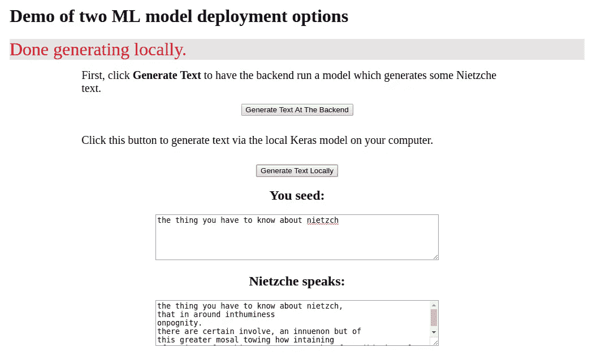
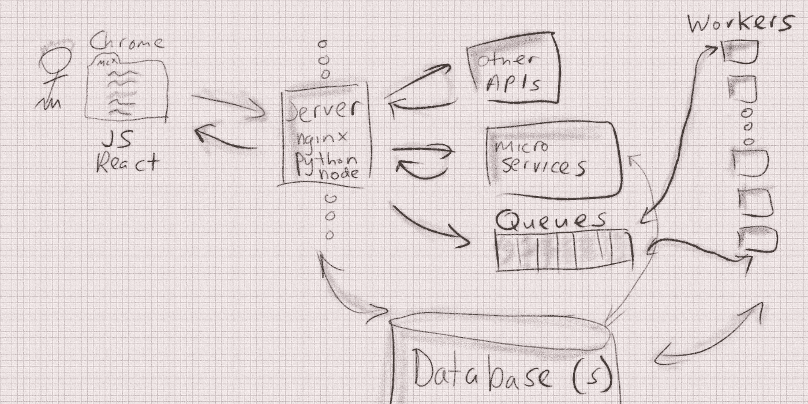
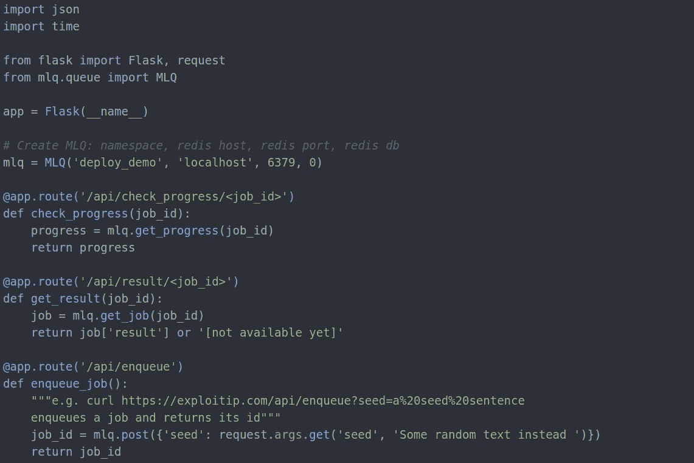
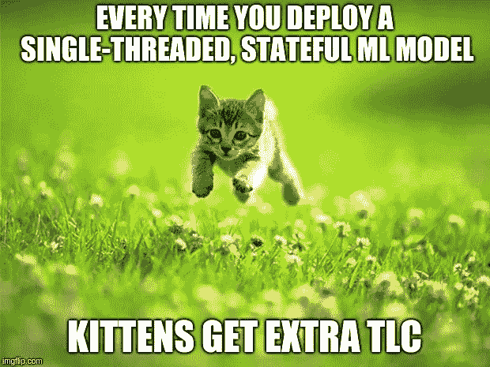

# 部署 ML 模型有两种非常不同的方式，下面是两种方式

> 原文：<https://towardsdatascience.com/there-are-two-very-different-ways-to-deploy-ml-models-heres-both-ce2e97c7b9b1?source=collection_archive---------1----------------------->

如果一个 ML 模型用 Jupyter 做了一个预测，周围有人听吗？

大概不会。部署模型是使它们有用的关键。


这不仅适用于您正在构建产品的情况，在这种情况下，部署是必要的——它也适用于您正在为管理生成报告的情况。十年前，高管们不会质疑假设，把自己的数字输入 Excel 表格，看看有什么变化，这是不可想象的。今天，一个密不透风的 matplotlib 数字的 PDF 可能会给初级副总裁留下深刻印象，但在经验丰富的高管眼中，它很可能会引发对 ML 的怀疑。

> 不要帮助带来人工智能炒作周期的结束！

因此，ML 模型的部署成为热门话题，仅仅是因为没有多少人知道如何去做；看到你既需要数据科学又需要工程技能。正如我最近发现的，有两种真正不同的方法来部署模型:传统的方法，和一个更近的选择，老实说，让我大吃一惊。

在本文中，我将为这两种部署提供一个简单明了的最佳实践模板。和往常一样，对于动觉学习者，如果你想测试一下，可以直接跳到代码[这里](https://github.com/tomgrek/ml-deployment-demo)，我实际上在这里[部署了这个代码](https://exploitip.com/)。我知道不是每个人都喜欢在阅读时跳来跳去；看起来是这样的:



I didn’t train the model for long; it’s not the point of this article!

# 如何部署 ML 模型

如果你是分析师出身，你可能不理解 web 应用架构，所以让我先说明一下。抱歉，如果这是过于简单化和人为解释！但是我见过太多的“ML 模型部署”,它们实际上只是包装在 Flask 中的 XGBoost，我知道这是一个真正的问题。

用户(这里的左边)使用的浏览器只运行 Javascript、HTML 和 CSS。那是前端。它可以调用后端服务器来获取结果，然后处理和显示结果。后端服务器应该尽快响应前端的请求；但是后端可能需要与数据库、第三方 API 和微服务对话。后端也可能应用户的请求生成缓慢的作业——比如 ML 作业，它应该将这些作业放入队列中。(请记住，用户通常必须以某种方式验证自己)。



Commonly, the frontend might be built with JS and/or React, and the backend with Python (and Django or Flask) or NodeJS (and Express).

现在，让我们谈谈分布式 web 应用程序架构。

一般来说，为了可伸缩性，我们希望运行尽可能多的后端实例。这就是为什么上图中‘服务器’有气泡冒出来的原因；他们代表“更多的这些”。因此，每个实例必须保持无状态:处理完 HTTP 请求并退出。在请求之间不要在内存中保留任何东西，因为**一个客户端的第一个请求可能会发送到一个服务器，随后的请求会发送到另一个**。

如果我们有一个长时间运行的端点，这是很糟糕的:它会占用我们的一个服务器(比如说…做一些 ML 任务)，使它无法处理其他用户的请求。我们需要保持 web 服务器的响应性，并让它移交长时间运行的任务，使用某种共享持久性，以便当用户检查进度或请求结果时，任何服务器都可以报告。此外，工作和部分工作应该能够由尽可能多的工人并行完成。

答案是先进先出(FIFO)队列。后端只是简单地将作业排队。工人从队列中挑选并处理作业，执行训练或推理，并在完成后将模型或预测存储到数据库中。

有了库 [MLQ](https://github.com/tomgrek/mlq) ，以下就是后端 web 服务器的全部需求——一个让作业排队的端点，一个检查作业进度的端点，一个在作业完成时提供作业结果的端点。



真正部署 ML 模型的架构是这样的:

1.  后端服务器从用户的网络浏览器接收请求。它被包装在 JSON 中，但是语义上类似于:“明天是星期三，我们今天卖出了 10 台。明天我们会接到多少客户支持电话？”
2.  后端将作业{星期三，10}推入队列(与后端本身分离的某个位置，比如 MLQ 的 Redis)。队列回答“谢谢，让我们称之为作业 ID 562”。
3.  后端回复用户:“我会计算的。它的 ID 是 562。请稍候”。后端可以免费为其他用户服务。
4.  用户的 web 浏览器开始显示“请稍候”微调按钮。
5.  工作人员——至少是那些当前没有处理另一个作业的工作人员——不断地轮询作业队列。工作线程可能存在于另一台服务器/计算机上，但它们也可能是同一台计算机上的不同线程/进程。工作人员可能有 GPU，而后端服务器可能不需要。
6.  最终，一个工人将获得该作业，将它从队列中移除，并处理它(例如，通过某个 XGBoost 模型运行{星期三，10})。它会将预测保存到数据库中。假设这一步需要 5 分钟。
7.  同时，用户的 web 浏览器每 30 秒轮询一次后端，询问作业 562 是否已经完成。后端检查数据库是否存储了 id=562 的结果，并相应地进行回复。我们的多个水平后端中的任何一个都能够满足用户的要求。您可能会认为共享数据库是一个单点故障，您是对的！但是，我们单独提供了副本和一些故障转移机制，可能是分片/负载平衡，所以一切都很好。
8.  五分钟多一点后，用户投票得到一个结果，我们就可以提供给用户了。

还涉及到一点点，主要是处理弹性和持久性(如果工作人员在工作中途离线怎么办？如果用户的输入是垃圾，导致作业失败怎么办？)但这是最基本的。这是一个非常简单的 MLQ 工人模板。它只是等待，直到接收到一个作业，然后对作业参数运行一个函数并存储结果。您可以在同一个服务器或分布式服务器上并行运行尽可能多的这些东西。如果你查看回购协议，你会找到尼采/张量流 RNN 模型的完整代码。

有几个很好的排队框架可用，或者可以形成合适队列的东西，包括 Celery、Dask、ZeroMQ、native Redis 和一个库，我最近把它变成了一个易于使用的版本，用于部署不复杂的辅助项目: [MLQ](https://github.com/tomgrek/mlq) 。卡夫卡也是一个东西，但是普通读者会知道我不喜欢过度架构的、基于 Java 的项目。MLQ 不成熟；我不是想在这里推销。用芹菜代替严肃的项目。

本周，我花了一些时间与 NVIDIA 交流，并询问了他们关于作业排队的规范解决方案(具体来说，在我的情况下，这样我就可以让每个使用 Jupyter 笔记本电脑的工作人员都可以使用 GPU farm，而无需他们同时尝试提交作业)。还没有，但我确信他们正在努力。在那之前，用排队系统手工推出解决方案是唯一的办法。

(在那次会议上，大家可能也很感兴趣:每个人都认为 MXNet 是一个非常好的框架，也许是最好的——但遗憾的是，它可能正在被淘汰)。

# 实时？

您可能想知道，ML 队列如何与实时应用程序一起工作？答案是:同样的方式，但是由于延迟的原因(比如工业物联网)并不理想。队列入口点可以是分布式的，所以真正的技巧在于数据库如何处理它。此外，普遍的看法是，人们不会接受私人数据被发送到后端，这也是“边缘的 ML”成为热门话题的另一个原因。如果推断所需的所有数据都可以在一个地方获得，我们就在那里进行推断。所以，没有进一步告别:

# 如何部署一个 ML 模型，以 2


所以，可怜的被诽谤的前端工程师进来了，每个人都认为线性代数意味着一个接一个地做计算，但他却是你的团队中最受欢迎的人。事实证明，他可能并不是一个傻瓜，但也许只是在等待时机，直到 Javascript 的人工智能工具赶上 Python。最近，他们做到了。

一言以蔽之，**现在可以从 Javascript 使用 Tensorflow 了**。起初，我对谷歌宣布的这种想法不屑一顾，这可能意味着用蹒跚、残缺的模型进行推理，这些模型必须符合某种模式(最多有 12 个过滤器的单个卷积层，FP-8 等)。也只有推论！肯定不是训练。Javascript 怎么可能做到这一点。

我大错特错了！

在这篇文章中，我不想把重点放在用 Javascript 训练模型上——这非常酷，但并不总是非常实用——而是为训练好的模型提供一种替代的部署模式。记住**你的** **训练好的模型将会对全世界**开放。任何人都可以复制它，看看层是什么样子，并窃取所有的参数。我想我会说这是不可避免的，你的模型可能没有你想象的那么特别:任何竞争优势都在于你可以部署模型修订的数据和速度。当然，你在模型上构建的产品有多棒。无论如何，要小心。

# 首先，建立一个模型

TensorflowJS 可以在用户的网络浏览器中执行**任何 Keras 模型**。而且，通过 Web GL，它们是**硬件加速的！我没有确切的数字，但据我所知，它对我很有效。肯定没有 Python 快，但我肯定随着时间的推移 JS 会赶上来的。**

对于本文，我复制了官方 Tensorflow Keras 文本生成 LSTM 示例的代码并运行它来构建一个模型。我完整的 Jupyter 笔记本在这里。

然后，将模型导出到 TFJS。你可能需要`pip install tensorflowjs`。然后:

```
import tensorflowjs as tfjs
tfjs.converters.save_keras_model(model, '.')
```

在目录中，你现在可以找到`model.json`和`group1-shard1of1`。

# 接下来，建立一个使用该模型的网站

现在所有的 Tensorflow JS 示例都使用 Yarn，我知道这有点过时了(当我做更多可视化工作时，`yarn`成为了新的热点，而`npm`是老狗；现在反过来了)。让我们暂时抛开前端的反复无常。

无论如何，希望你有*纱线*和一个工作的*节点*安装(至少版本 9)。对于一个服务于前端模型的网站的最小例子，你可以[克隆我的回购](https://github.com/tomgrek/ml-deployment-demo)。

实际的 Javascript 代码并没有那么有趣。关于从缓冲区创建张量有一些样板文件，但是实际使用这个模型需要做的就是:

```
model = await tf.loadModel('[https://mydomain.com/model.json'](https://exploitip.com/model.json'));
output = model.predict(input);
```

完整的端到端前端(和后端)部署示例是我的报告中的。

维奥拉。硬件加速的 Keras 型号，您甚至不需要后端。

# 限制

除了你的网络架构可以被所有人看到之外，我能想到的最大缺点是，在许多实际应用中*并不是所有的数据*都可以在前端获得。在我工作的地方，当用户输入一个查询时，我们从 Elasticsearch 获取大量数据，并对这些数据运行一个模型(实际上是几个)。向前端发送这么多数据是不可行的。

即使是这样，你也可能想对*的每次预测*收费，一旦你进入 Javascript 领域，这是不可能的。

# 最后

很简单:

*   使用队列
*   不要占用你的后端网络服务器；将任何 ML 过程与提供资产和端点的行为分开
*   确保一切都是无状态的，并且能够并行运行
*   考虑前端部署



Not really. They all get momentarily sad.

我希望你喜欢这篇文章并从中有所收获！如果你这样做了，请点赞并关注，和/或在这里或在 [@tomgrek](http://twitter.com/tomgrek) 提供反馈。我在旧金山建造人工智能，并且总是喜欢和其他的书呆子/人工智能爱好者交谈，所以请随意通过任何方式联系。