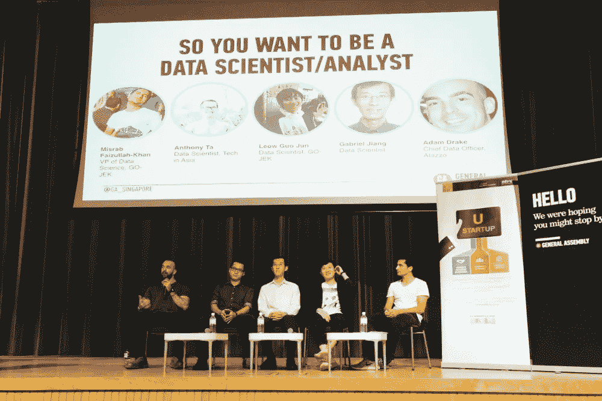
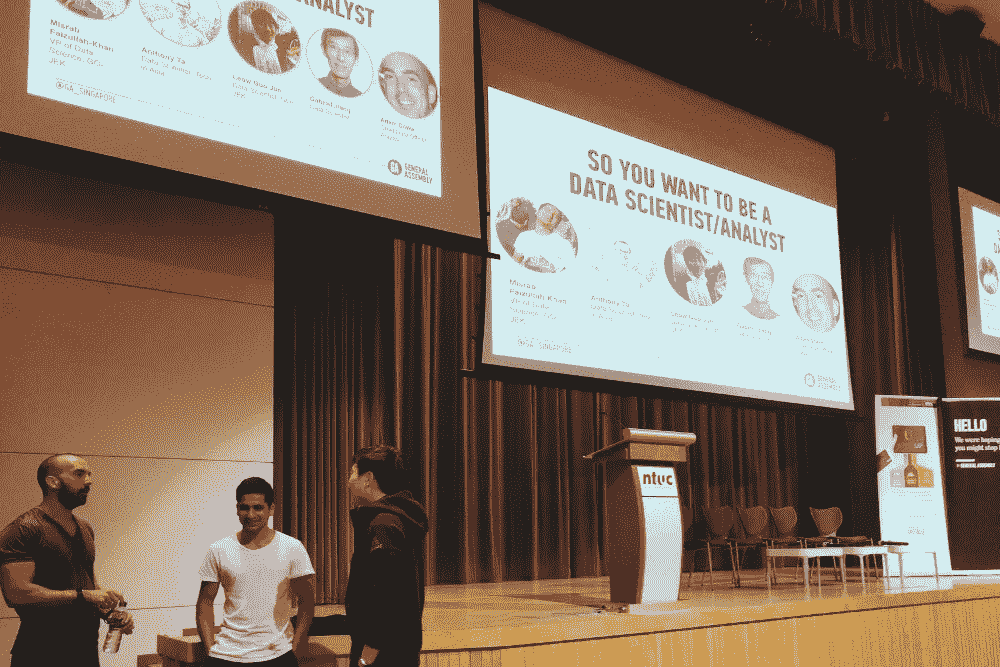
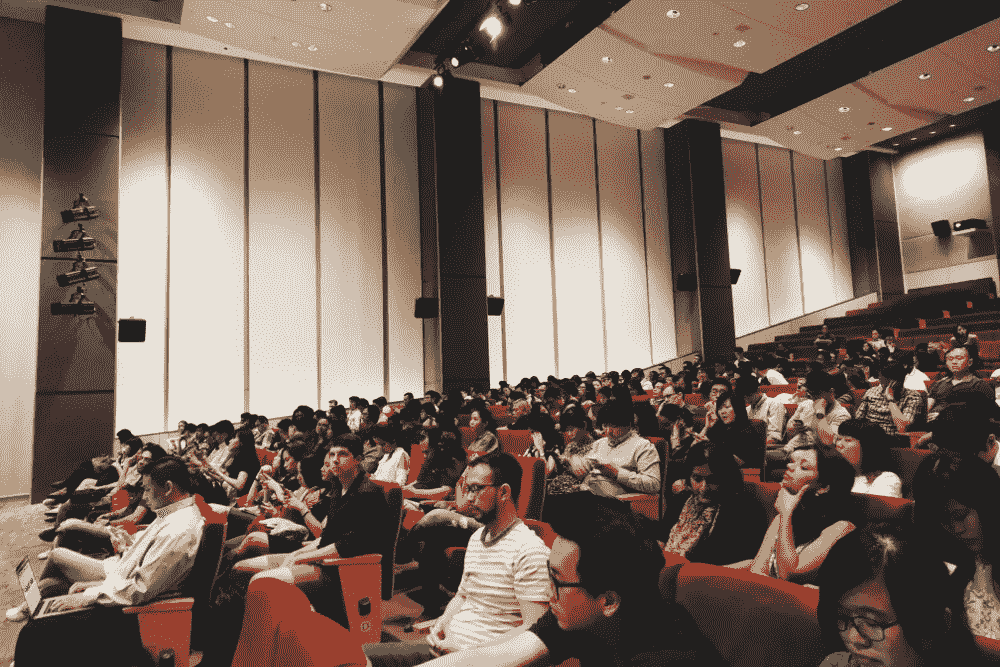

# 成为数据科学家需要知道的事情

> 原文：<https://towardsdatascience.com/things-you-need-to-know-about-becoming-a-data-scientist-2467a3f61457?source=collection_archive---------4----------------------->

*读者您好！这篇文章(以及我所有的文章)的更新版本在我的网站上免费提供:*[*Victoria . dev*](https://victoria.dev)*—感谢阅读！*

我最近参加了一个由大会在新加坡主办的题为“所以你想成为一名数据科学家/分析师”的小组讨论。该小组介绍了职业生涯不同阶段的专业人士，并为有希望的观众提供了丰富的信息，包括如何找到数据科学家工作的技巧，以及揭穿该领域神话的故事。

# 小组成员

**米斯拉布·费祖拉-汗** —数据科学副总裁、*戈 _JEK*
**安东尼·塔** —数据科学家、*亚洲科技*
**利奥·郭俊** —数据科学家、*戈 _JEK*
**加百列·江** —数据科学家
**亚当·德雷克** —首席数据官、*阿塔佐*

这里有一个讨论要点的纲要，为简洁起见进行了解释。

# 一天的生活是什么样的？

我们大多是“数据管理员”数据处理的很大一部分始于数据清理，并由数据清理组成。没有高质量的数据，你不会得到准确的结果。了解应该如何清理数据在很大程度上包括与数据分析没有直接关系的技能。为了充分理解你希望解决的问题，你需要与相关人员交谈。重要的是，每个人都了解项目的所有元素，以及这些元素的确切名称。以“销售额”为例，根据谈话对象的不同，计算方式可能会有所不同。

# 什么是数据“科学家”与数据“分析师”？

这很大程度上取决于你工作的公司。“Data [insert modifier]”只是历史上被称为“业务分析”的工作领域的一个新的区别在较小的公司中，与任何其他职位一样，一个人可能会在“数据科学家”的头衔下处理各种与数据相关的任务在一个拥有更多员工和更精细专业化分工的大公司中，你可能会有一个处理较少技术方面的“数据分析师”，和一个工作技术性很强并涉及定量学习或机器学习的“数据科学家”。

数据科学/分析领域足够新，以至于职称的标准定义还没有达成一致。考虑职位时，关注公司而不是头衔。

# 应该加入创业公司还是大公司？

没有错误的答案。了解自己的工作风格和偏好将有助于指导你的决定。

创业公司通常提供更多的自由和更少的微观管理。这也意味着你必须接受更少的指导，并且需要能够自己解决问题、学习和进步。

在一家大公司，你可能会经历更多的结构，并被期望遵循非常明确的既定流程。你的工作范围可能会比创业时更集中。总的来说，你会体验到更少的自由，但是对你的期望却更加确定。

最后，尤其是在你职业生涯的初期，不要太看重选择这个或那个。如果你喜欢这家公司，不管是大公司还是小公司，试一试。如果几个月后你对那里不满意，那就换一家试试。没有什么职业决策是永恒的。

同样值得注意的是，即使你第一次就找到了喜欢的公司，一两年后换公司对你最有利。你一生中获得的大部分加薪将发生在职业生涯的头十年。假设你被 A 公司聘为初级数据科学家，为期两年——两年后，你就不再是初级了。比方说，你现在可以在数据科学家的职位上获得 30%的加薪，但两年后 A 公司不太可能给你加薪 30%。在这一点上，是时候找到 B 公司，在你的简历上多写几年的经验，然后可能再次换公司。你不会在一家公司呆上几十年就挣大钱——你永远都是初级开发人员。

总体而言，对于数据科学候选人来说，最重要的技能是软技能。好奇心、韧性和良好的沟通技巧至关重要。坚持，尤其是在适应快速变化的行业时，是非常重要的。最有前途的候选人对这个领域有足够的热情去学习他们能学到的一切，甚至是他们工作范围之外的东西。像编码和算法这样的硬技能是可以教授的——是软技能让优秀的候选人脱颖而出。

黑客技能也至关重要。这并不一定意味着你可以写代码。掌握整体概念、了解算法、有足够的好奇心不断学习的人会比只会写代码的人走得更远。在熟悉基本导航点的基础上建立黑客技能需要创造力。有能力提出以新的方式使用可用工具的解决方案——这就是黑客技能。

设计思维是另一个重要的资产。能够理解系统如何在技术和业务层面上集成是非常有价值的。如果你能看到全局，你更有可能找到不同的方法来完成总体目标。

你可能认为在简历上看到流行语会让你作为候选人看起来更有吸引力——更多时候，这是一个危险信号。把“高级机器学习”放在简历上，然后证明自己不懂基本算法，看起来不太好。最能说明你的是你的项目和你申请的工作之外的兴趣。这个行业的热门话题变化很快——你最好对基本原理有一个扎实的掌握，并有广泛的经验，而不是随便说出什么趋势。

# 人类在数据科学领域有前途吗？机器什么时候会取代我们？

这不是数据科学独有的问题，许多历史例子已经存在。金融投资是一个很好的例子——过去你可以让一个人进行计算和预测，现在计算机可以自动完成很多工作，每天对风险和可能的回报做出决策。

就像在其他已经接受自动化的行业一样，人类不会被取代的地方是人的因素。你仍然需要人来处理沟通、创新、好奇、解释和理解问题……所有这些都是企业中人的基本方面。

最终，机器和更多的自动化将使人类的工作变得不那么痛苦。通过自动化世俗的东西，比如数据净化，人类的思想被解放出来去开发更有趣的东西。

# 数据驱动自动化的未来应用是什么？

法律是自动化的下一个很好的候选对象。使用数据评估风险的程序可以处理很多问题。

医学是另一个通过数据进步的成熟领域。放射科医生，你的日子屈指可数:图像检测来找你了。整个诊断学领域将会彻底改变。

数据科学最近一个特别有趣的应用是语言翻译。通过观察不同语言的句子结构和口语的相似性，我们能够根据相似的单词在语言结构中占据的“空间”对它们进行分类。

保险业——最初的数据科学行业——已经并将继续变得非常自动化。随着使用数据评估风险的能力增强，我们开始看到新的创新保险产品推出。电子商务公司现在可以为客户退回产品的风险购买保险——如果没有我们今天拥有的数据的可访问性，很难做到这一点。

# 我如何推动数据驱动的决策，并让我的老板同意我的观点？

这是一个有内涵的问题。归根结底，这取决于公司的数据文化和决策路径。我们经历过为管理层工作，他们说，“我们已经做出了决定，我们只需要数据来证明。”显然，这是一个艰难的工作岗位。

一般来说，问问你自己，“我让我的老板看起来很好吗？”你可能会听到这些，然后想，“为什么我要让我的老板得到所有的荣誉？”—但是谁在乎呢？让他们去邀功吧。如果你能做出好的工作，你就让你的团队看起来不错。如果你让你的团队看起来不错，你对你的团队和老板来说就是不可或缺的。不可或缺的人会被倾听。

# 你对初露头角的数据科学家有什么最好的建议？

不要太热衷于太快定义自己。如果你过于缩小你的关注范围，尤其是在你学习的时候，你可能会陷入成为“技术 A，第 3 版”专家的境地，而公司正在寻找第 4 版的专家。它发生了。

总体而言，对基本面的广泛理解对你更有价值。也许你开始写代码，并决定你不喜欢它，但发现你真的很擅长设计大局观的东西和领导团队，你最终成为了技术领导。这甚至会因你工作的公司而异，所以要保持灵活性。

你最好的选择是追随你所热爱的，并尝试理解广泛的整体概念。花大部分精力学习永恒的东西，比如像 TensorFlow 这样热门话题下的基础技术。用对当地情况、不同公司和产品的广泛了解来武装自己。

如果你专门专注于学习代码，学好一门语言就更容易学习其他语言。确保你了解基本知识。

# TL；it 博士:

**亚当:**多说不要放弃。
**安东尼:**【为人】勇敢，而且事必躬亲。
**加布里埃尔:**要有创意。
**郭俊:**值得付出痛苦。
**米斯拉布:**自我评估，保持反馈循环。

[General Assembly](https://twitter.com/GA_Singapore) 是众多对数据科学职业感兴趣的学校和资源之一。如果你想了解更多，我强烈推荐这篇文章。祝你好运！

*原载于*[*vickylai . io*](https://vickylai.io/verbose/to-be-a-data-scientist/)*。*