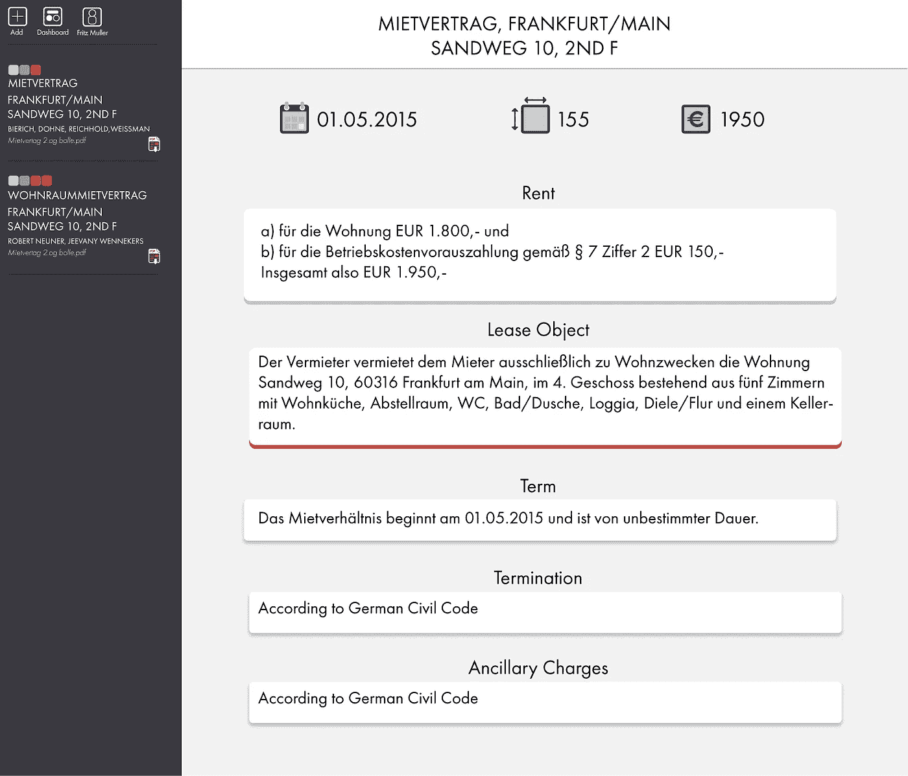
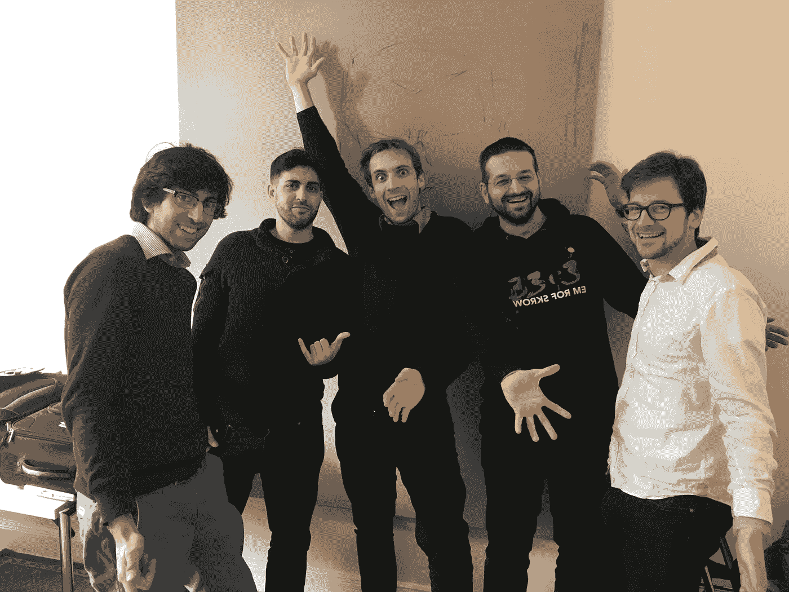

# 这是合同风险管理的个性化指南

> 原文：<https://towardsdatascience.com/this-is-contranalyst-your-personalized-guide-to-contract-risk-management-a77573b80f66?source=collection_archive---------2----------------------->

**使用黑客马拉松从 legal JOIN tech 选择合同、风险、大数据；**

势不可挡。如果有人问我，我会用这个词来形容柏林法律科技黑客马拉松。进一步的描述也适用，但是让我们暂时忘记它，从头开始。

大数据如何帮助合法用户？哪里有适合培训 IT 系统的充足数据？我们能满足更广泛受众的哪些需求？这些都是我们小组开始活动时提出的问题。

这基本上带来了我们小组在实际黑客会议开始时试图匹配的两种观点:

1.  客户需要什么？换句话说，从问题和需求导向的角度来看待它。
2.  什么是容易实现和利用的？也就是说，从可能的解决方案和可行性的角度来看一看。

请注意，在订购透视图时，我们坚持“客户至上”的方法。解决了一个需求，一个业务很可能会随之而来。

在这样的讨论中，我们专业知识和背景的多样性派上了用场。随着所有这些力量的投入，很快，我们预期产品的图像实现了:
contra analyst，用户的“个人”合同分析师，显示特定合同的风险以及总体风险敞口的概述(例如，有多少份合同有潜在的无效条款)。

既然大局已定，就让黑客攻击开始吧…

这个过程是反复进行的，小组全体成员轮流讨论，专题专家轮流准备，小组成员轮流讨论。首先，从时间的角度来看，这被证明是最有效的。另一方面，随着定期锐化迭代，理解很快增加，学习很容易。

在第一轮，马可创造了第一个模型；Xavier 从仪表板设计开始，Idan 负责图表设计，律师们解释了合同的重点，并开始提供合同示例作为输入。将工作并行化，并为了一个共同的目标朝着同一个方向努力。由于黑客马拉松期间的主动联系，我们还获得了免费使用 OCR(光学字符识别)解决方案的机会，该解决方案能够解决 PDF 文档到文本的转换，并简化文本识别过程。很快就看到了第一批成果，已经开始显示什么是可能的。出乎意料的是，我们将要完成我们的项目。

An impression of a single contract within ContrAnalyst

然而，很快，第一个障碍出现了:在将第一个合同输入到模型中进行训练之后，我们慢慢地有了一个更好的图像，与很难实现的事情相比，什么是立即可行的，并且需要合理的努力。我们最初测试子句有效性的任务对于一天半的黑客马拉松来说有点太大了。对于小组的大部分成员来说，这有助于我们了解必要的工作以及学习模型的合适输入。

现在，重新聚焦时间。作为开始，我们决定在合同中使用更标准、更容易访问的信息:剩余期限。我们只有很少的训练集(大约 40 份不同的合同)，即使这样也很困难；机器学习可以提供惊人的解决方案，但总是以足够多的可用数据为代价；因此，我们提出了进一步降低复杂性的想法，并手动创建了关于术语的不同子句，涵盖了最重要的变体，但大多数都具有某种程度上相似的结构。

最后，通过共同努力，我们从不同的角度和角度研究了这个主题，并在演示中自豪地展示了一个可视化原型，展示了一个仪表板和一个可能的工具结构。我们对结果很满意，柏林法律技术黑客马拉松的评审团也很喜欢，我们很高兴获得了第三名。

The dashboard overview in the tool.

感谢评审团、活动的赞助商和价格，更感谢组织者以令人难以置信的动力和精神举办了这场伟大的活动！

The final autors: Marco, Idan, Xavier, Nuri and Baltasar

**团队**(您可以通过媒体联系我们或在 LinkedIn 上找到我们):

*   我们的设计师 Idan Nesher 能够让几乎所有东西看起来都很吸引人
*   Marco Scaravelli，意大利人，我们的 IT 和机器学习专家
*   Xavier Lavayssière，法国人，也是我们当中最关注顾客的人
*   努里·卡德姆，律师，非常喜欢
*   巴尔塔萨·塞韦茨，前 IT 业人士，后成为律师
*   大卫，另一位律师，不幸地在演讲前离开了

该团队的方法与硅谷最受欢迎的一句名言完美契合:

> “试过了。曾经失败过。没关系。再试一次。再次失败。失败得更好。”
> (塞缪尔·巴克特在沃斯沃德何)