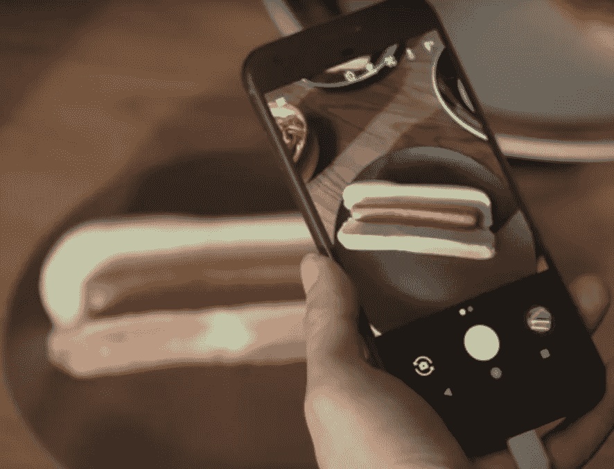

# 杰哈和托普对 JAMA《适应人工智能》的思考

> 原文：<https://towardsdatascience.com/thoughts-on-jamas-adapting-to-artificial-intelligence-by-jha-and-topol-9965d6f6c25d?source=collection_archive---------3----------------------->

当记者写下人工智能在医疗保健领域的颠覆性力量时，他们往往会专注于放射学和病理学，这是有充分理由的。这两项交易都涉及从可量化的图像数据中解读模式——在从面部识别到热狗分类的几项研究和商业应用中，人工智能已经证明了这一点。

**在每篇文章中，房间里的大象是放射科医生和病理学家的未来？**

我今天了解到，这个问题去年在《美国医学会杂志》的一篇题为“[适应人工智能，放射科医生和病理学家成为信息专家](https://jamanetwork.com/journals/jama/article-abstract/2588764)”的文章中得到了正面回答

标题足够有趣。然后我看到两位作者是索拉博·贾(放射学家)和埃里克·托普，我知道我必须从防火墙后面偷偷拿出一份拷贝。大多数关注医疗保健的人都知道托普。他是一个书籍作者，医学博士，见解深刻，固执己见，但专业如此。我读过 Jha 在医疗保健博客[上的帖子](http://thehealthcareblog.com/blog/tag/saurabh-jha/)和[在 Twitter 上关注他](https://twitter.com/roguerad?lang=en)(值得)。他聪明、直言不讳、与众不同。一半的乐趣是看着他在传统的医疗文化中一往无前，而且做得很好。我想这些人在这件事上花了不少时间。以下是他们不得不说的话:

人工智能将取代放射学家和病理学家今天所做的许多工作。

Jha 博士和托普博士粉碎了任何认为人工智能将无法做大多数放射学家和病理学家今天所做的事情的想法。他们引用了创业公司和大公司已经被证明比人类更有效的例子。他们用了 2 页文章的一半来阐述这个明白无误且令人信服的观点——不管你喜不喜欢，这都在发生。句号。现在是适应这一新现实的时候了。

"为了避免被计算机取代，放射学家必须允许自己被计算机取代."

在第 2 页中，为真正的测试做好了准备。贾和托普博士将如何处理“人类的下一步是什么”这一部分？

随之而来的是引人入胜。我重读了三遍。这是一部接一部的戏剧:

**放射科医生和病理科医生*到底是什么？***

用贾和托普博士的话说:

“放射科医生的主要目的是提供医疗信息；图像只是获取信息的一种手段。放射科医生更适合被认为是专门从事医学成像的“信息专家”。

这类似于病理学家，他们也是信息专家。病理学家和放射科医生在本质上是相似的，因为他们都从图像中提取医学信息。"

值得概括一下:

*   放射科医生和病理学家是一样的，因为他们的主要工作是解释图像。
*   如果不是信息专业，图像解释和结果交付是什么？
*   图像是达到目的的手段——你们真的是信息专家。

那是一些元的东西。但是放射科医生和病理科医生会如何看待重新定义他们的价值主张呢？在多年学习阅读非常具体的图像以获得非常具体的模式后，他们认为自己是信息专家吗？就此而言，对于仅仅是信息专家的初级保健医生来说，诊断考试是不是达到目的的手段？

现在，谁在乎。这是一个大胆的开场白。如此大胆，以至于作者继续加倍强调需要大胆的笔触。

**你的两个领域早已拥抱科技。在你做的许多更复杂的任务上，人工智能比你做得更好。受过训练的鸽子可以做你的工作。**

在你指责我胡编乱造之前，以下是他们的原话:

“病理学家已经接受了机器和技术……人工智能可以执行病理学家更复杂的任务，在某些情况下，具有更高的准确性……尽管此类研究需要对更多样化的组织类型进行大规模验证，但在放射学和病理学领域，人工智能显然可以处理许多任务。为了强调放射学和病理学之间的共性，研究人员使用操作性条件反射训练鸽子在乳房 x 光片上发现异常钙化，并在组织学上检测乳腺癌。

舞台已经搭好(以我的鸽子比你的优等生聪明为例)，贾博士和托普提出了我确信会被许多人视为异端的观点:

你的两个学科应该合并成一个单一的实体，称为信息专家。

那是巨大的。你们两个的职位都不需要再存在了。它们应该被合并。忘记图像，坚持附加值:解释更难的图像(尽管前一段认为这项任务的时间不多了)，建议进一步的测试，并指导临床医生。你仍将是“医生的医生”你不会得到你的头衔，也不会做你被训练去做的事。

我知道这些家伙不会让人失望的。

**人工智能+人类=对于那些跨越人机界限的人来说，生产力和影响力更大**

杰哈和托普认为，“一个信息专家，在人工智能的帮助下，有可能管理整个非洲城镇的筛查工作。”

当然是真的。那些学会跨越人/机器世界的人会面临新的机会和影响。然而，我更希望使用这种观点的人承认这种新的供需现实的负面影响。

我想当蒸汽动力针织机来到[取代它们的时候，这是对针织者的鼓励。养马的人可能确信亨利·福特的努力会在某种程度上改善他们的生活。几代人之后，在底特律制造业经济崩溃前不久，他的经理们可能向他们的工厂工人推销了同样的小说。](http://thehealthcareblog.com/blog/2015/11/02/the-surprising-story-of-the-original-luddite/)

请再告诉我一次，当一个人可以做成千上万我们曾称之为放射科医生的工作时，我们真正需要多少“信息专家”？

既然这样，我们就放他们一马吧。毕竟，他们只是提议烧毁两个学科。

**信息专家应该接受不同方面的培训。**

“受训者只需掌握足够的医学物理学知识，就能提高医学图像的次优质量。信息专家应该学习贝叶斯逻辑、统计学和数据科学，并了解基因组学和生物统计学等其他信息来源，因为他们可以将不同来源的数据与患者的临床状况相结合。”

除了“你不应该再以任何可识别的方式被训练成放射科医生或病理学家”之外，我不知道该如何解释这个问题。如果我的解释是合理的，它回避了一个问题:这真的是放射学和病理学特定的进化所需要的吗？或者这是放射科医生和病理学家应该考虑申请的新的和需要的子学科的情况吗？那么现有的被 AMA 认可的医学分支学科[医学信息学](https://www.amia.org/clinical-informatics-board-review-course/board-exam)呢？另一次…

合并两个不同的医学专业可能会遇到阻力，每个专业都有独特的教学、传统、认证和报销

我会带爆米花。

“联合起来，放射学家和病理学家可以随着人工智能的兴起而繁荣发展。”

嗯嗯好吧。只要我们不再是放射学家和病理学家，对吗…？

**“工作岗位不丢；相反，角色被重新定义；人类被迫从事需要人类元素的任务。”**

告诉那些被解雇的放射科医生吧。

鉴于他们传达的信息的严重性(和诚实性),他们的结束语令人惊讶地乐观。他们也不仅仅是有点矛盾。我猜他们在这个问题上有过激烈的争论——也许是和 JAMA 的编辑们，也许是彼此。

总之，这篇文章非常有趣。这是我在同行评审的医学杂志上见过的最大胆的文章，它不带任何歉意地提出了一个有争议的、充满政治意味的话题。支持变革必要性的证据令人信服。在我看来，要求开设新专业是正确的。我不确定这种需求代表了放射科医生和病理科医生的自然进化，而不是他们的下坡路。无论哪种方式，放射科医生，病理学家，临床医生和管理人员在阅读这篇文章后会有很多要考虑的。向杰哈博士和托普博士致敬。