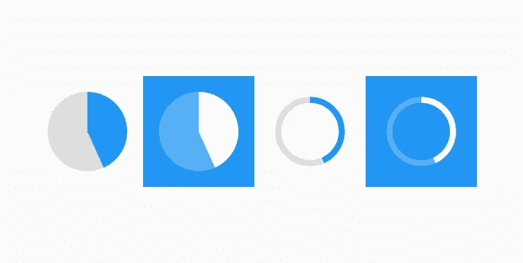

# 公司级仪表板的三个常见错误

> 原文：<https://towardsdatascience.com/three-common-mistakes-with-company-level-dashboards-88d636f1bf5d?source=collection_archive---------5----------------------->

公司级仪表板很特殊。他们掌握着所有部门和业务领域最重要的关键绩效指标(KPI)。

从首席执行官到最新的团队成员，组织中的每个人都被吸引到公司级仪表板。这使得它们不仅是一个报告工具，也是一个聚焦工具。因此，需要多加小心。

在这篇短文中，我概述了公司级仪表板的三个常见错误。

## **1。没有一致的设计美学**

公司仪表板应该是组织数据可视化的黄金标准。这意味着:标准化的图表、一致的调色板和结构良好的布局。

然而，这很少实现。通常，我发现每个部门的仪表板都有非常不同的外观和感觉——逐步上升到不一致的公司级仪表板。

这通常是由于不同的分析师以他们自己的方式为仪表板做出贡献，并且没有一个总体的团队/个人关注用户体验。

不一致的设计意味着用户必须更加努力地提取他们需要的信息。导致混乱和误读数据。

一个设计良好的公司级仪表板在所有图表中具有一致的外观和感觉。例如，轴在标度和数字格式上都是标准化的。图表以一致的网格模式对齐。每个仪表板和每个图表的过滤器按钮都在同一个位置。标题和描述在位置和字体上都是一致的。颜色从同一个调色板标准化，允许用户轻松地从一个图表移动到下一个图表。

## 2.太复杂了

就在上周，我看到了一个公司级的仪表板，向用户展示了 24 个不同的指标。用户还可以选择通过原始数字或比率进行切换，有效地给了他们 48 种不同的指标来消化。这么多的信息造成了混乱。

仪表板上太多的复杂性会麻痹查看者，导致用户要么完全忽略信息，要么只关注熟悉的指标。[研究告诉我们，管理者在做商业决策时会偏向于熟悉的标准和数据。](https://medium.com/@chrisdowsett/research-on-data-use-in-business-part-two-the-findings-445707901edc)

需要设计公司级别的仪表板，以便只显示关键的 KPI。深入和复杂的分析不应出现在公司层面的仪表板上。相反，它们应该只存在于部门或项目级别的仪表板中。

我见过的最好的公司级仪表板有一个顶级仪表板，上面有收入或新用户增长等 uber KPIs，每个部门还有一个仪表板，显示他们的前 6 个(或更少)KPI。

如前所述，公司级仪表板既是一种报告工具，也是一种聚焦工具，因此应该尽可能保持其简单性。

## **3。优化所有格式的用户体验**

决策的节奏越来越快，人们期望企业领导可以在需要时通过他们的所有设备获得信息。

然而，我很少看到针对移动优化的仪表板。相反，我们仍然希望用户从桌面访问数据。这对一些人来说可能没问题，但我很少看到高层领导坐在办公桌前。他们经常从一个会议跑到另一个会议，只带着一个 iPad 或手机。

为了满足数据用户的需求，公司级仪表板需要对所有用户可用——这意味着在所有设备上；手机、台式机或 iPad。

我曾在几次与高层领导的会议中被抓到，他们有自己的 iPad，想看一些数据，但看不清楚仪表盘。这是我早期学到的一课，它教会我确保我构建的每个新仪表板都是移动友好的。

***

公司级仪表板为组织设定了数据可视化的标准。如果它们设计得很差，那么其他仪表板和报告也会设计得很差，增加了数据被错误读取或者更糟，根本不被使用的可能性。

然而，一个设计良好的公司级仪表板可以为清晰明了的报告创造条件。它通过提供一组简单、易于理解的 KPI 来帮助用户，这些 KPI 可以帮助部门集中精力并与共同的目标保持一致。它还可以通过设置预期标准来提升整个组织的数据可视化。清晰明了的报告对于用户体验和鼓励用户在决策中正确使用数据都很重要。