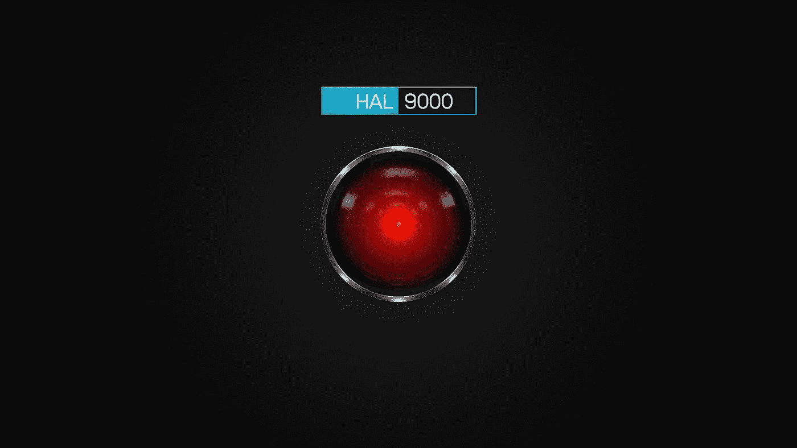

# 应对机器崛起的三种方式

> 原文：<https://towardsdatascience.com/three-ways-to-react-to-the-rise-of-the-machines-fd43db7b2c85?source=collection_archive---------7----------------------->

该系统于 1997 年 8 月 4 日上线。战略防御中不包括人类决策。天网开始以几何速度学习。它在东部时间 8 月 29 日凌晨 2 点 14 分有了自我意识。在恐慌中，他们试图拔掉插头。”

科幻迷可能会记得这句话来自*终结者 2:审判日*。作为一个孩子，它描绘的场景完全吓坏了我。这不是第一部机器变得有自我意识的电影。斯坦利·库布里克的 *2001:太空漫游*以哈尔 9000 平静、单调但令人毛骨悚然的话语而闻名:“对不起戴夫，恐怕我做不到”。

20 世纪 70-90 年代的电影和小说不乏描述数字化、计算机化技术转化为人类意识状态的场景。直到不久前，人工智能还被视为计算机化学习的快速发展，这将导致向智能生命形式的突然转变。一项技术能够自我意识并不是一个不现实的终结游戏。例如，这个视频表明，技术能够通过一种自我意识的“国王的智者”测试。

从今天的镜头来看，我们应该是既欣慰又担忧的。我们应该松一口气，因为《T4》中的天网事件并没有发生。我们仍然没有达到真正取代人脑复杂性的人工智能水平。毫无疑问，人工智能已经走了很长的路，但它目前只能可靠地取代人类做出的最简单、最可预测的决定。即使机器能够在 Jeopardy 或 Go 中获胜，也是因为它们可以在任何给定的时间点处理比人类更复杂的场景，但只能在*定义的可能性宇宙*内。最初的想法仍然是机器人无法企及的。

不过，我们应该感到担心，因为它正以比任何人预测的更普遍的方式发展。人工智能并不像几十年前预期的那样是政府或军事组织的专有财产。它属于我们所有人。它正在世界各个角落成长和发展。它受制于我们改进技术的本能冲动，这可能会使它势不可挡。没有单个芯片需要销毁，就像《终结者》中的那样。在这种民主化和无孔不入的形式下，也许没有什么能阻止 AI 的成长。许多人会说，也没有什么能控制它。

# 我们为什么要担心 AI？

虽然 Alexa 变得有自我意识并订购大量由汤姆·塞立克主演的电影的可能性很小(我听说她是一个粉丝)，但我们应该出于非常不同的原因担心人工智能——经济原因。历史上曾有一段时期，普通工人确实在技术发展中失败了，而我们可能正处于这样一个时期的开端——而且是一个漫长的时期。

历史上只有一个时期能与我们自上世纪 70 年代以来经历的技术发展的大规模增长相媲美:工业革命，尤其是在英国和美国。工业革命推动了巨大的社会和经济变革，导致手工工作被机器取代，人口大规模流动，人口财富分配的中断，以及全球贸易的永久性变化。

NYU 大学的鲍勃·艾伦教授是一位专家经济学家，他经常从历史对比中寻找对当今问题的见解。在我参加的 Bob 最近的一次演讲中，他展示了一些非常详细的分析结果，这些分析是他对工业革命和过去 30-40 年间的生产率和工资进行的。回顾英国 1770 年至 1890 年的工业变革时期，鲍勃研究了其对生产率增长和实际工资增长(即基于收入的基本商品的可负担性)的影响。这张图表总结了他的发现:

模式很明显。在工业革命的前 60 年，投资者以牺牲工人为代价获得了利益。只是从 1830 年开始(鲍勃认为，所有主要的机械化变革都已完成)，工资才开始随着生产率的增长而变动。鲍勃的分析也显示了美国类似的结果。

从今天的情况来看，两者有很强的相似性。自 20 世纪 70 年代以来，我们一直处于一个类似的时期，工人们正在失去他们从技术发展中获得的那份好处。下图显示了美国长期趋势的发展:

从 1980 年到今天这段时间尤其令人担忧。我们是否应该像工业革命那样，期待工资水平很快会赶上来？鲍勃·艾伦对此持悲观态度，我能理解为什么。我们才刚刚处于人工智能革命的开端，迄今为止只有一小部分工作受到了影响，这种破坏还要持续几十年。普通工人可能需要蹲下来做长期工作。

# 我们的三个选择

我们没有一个带着奥地利-美国口音的机器人可以及时送回去解决这种破坏正在造成的新的不平等，但我们能做些什么来控制它吗？我不想在这里假装有任何答案，但我经常听到关于这个问题的三种观点:

1.  干预主义:要求政策干预的呼声越来越高。在我最近参加的一次演讲中，著名经济学家罗伯特斯基德尔斯基勋爵(Lord Robert Skidelsky)的一句话让我记忆犹新:“现在，即使是技术乌托邦主义者也不得不相信政策干预”。如果我们认为它对人们的福祉有害或需要工作，是否有可能减缓甚至停止 AI？这需要什么样的政策或国际机构才能有效？
2.  自由放任:我敢说，我听到的大多数观点都属于这一类。让我们乘风破浪，期待最好的结果。这是由什么驱动的？一种我们无法实际控制或预测将会发生什么的感觉？人们对人工智能的兴趣如此之深，以至于愿意拿自己的经济福祉冒险，看看它最终会走向何方？一种信念，即使不是在我们的有生之年，事情最终总会在经济上达到平衡？
3.  **用人工智能对抗人工智能:**也许这个领域最有趣的工作是试图预测一些威胁人们经济福祉的可能发展，以及使用人工智能方法来应对这些威胁的可能性。[麦肯锡全球研究所](https://www.mckinsey.com/~/media/McKinsey/Global%20Themes/Digital%20Disruption/Harnessing%20automation%20for%20a%20future%20that%20works/MGI-A-future-that-works-Executive-summary.ashx)的研究帮助我们更好地理解不同的工作是如何“自动化”的，而像 [Doyne Farmer](https://www.oxfordmartin.ox.ac.uk/people/407) 这样的学术工作有望更好地揭示当机器人抢走他们的工作时，某些人类技能集将如何“可移植”。

与此同时，当我们下定决心的时候，在世界的某个地方，另一种技术正在被迭代，这种技术将在未来几年里或好或坏地改变我们的生活。

时间不多了。你会选择哪个选项？

*参见* [*此处*](https://www.nature.com/news/lessons-from-history-for-the-future-of-work-1.22825) *了解鲍勃·艾伦研究的更多细节。*

最初我是一名纯粹的数学家，后来我成为了一名心理计量学家和数据科学家。我热衷于将所有这些学科的严谨性应用到复杂的人的问题上。我也是一个编码极客和日本 RPG 的超级粉丝。在[*LinkedIn*](https://www.linkedin.com/in/keith-mcnulty/)*或*[*Twitter*](https://twitter.com/dr_keithmcnulty)*上找我。*