# 英国 A&E 就诊和急诊入院的时间序列分析和预测

> 原文：<https://towardsdatascience.com/time-series-analysis-and-forecasting-for-a-e-attendances-and-emergency-admission-in-england-53e41a93be35?source=collection_archive---------6----------------------->

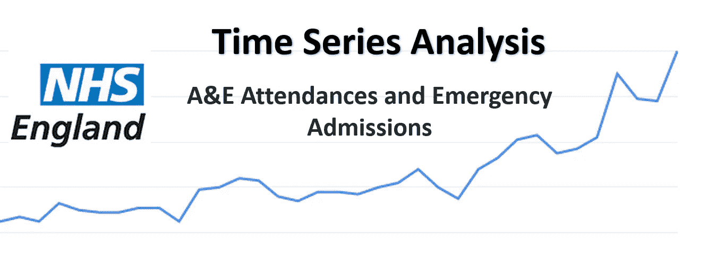

# **简介:**

这个项目的目标是分析和预测实时序列数据。这些报告和数据集来自 [NHS 英格兰网站](https://www.england.nhs.uk/statistics/statistical-work-areas/ae-waiting-times-and-activity/ae-attendances-and-emergency-admissions-2018-19/)，该网站报告了英格兰国家医疗服务机构和独立部门组织的事故和急诊人数。

数据周期从 2010 年 8 月开始，到 2018 年 7 月结束。正如你所注意到的，我已经将注意力集中在“总出席人数”这一主要栏目上，并计划将其扩展到其他栏目，如果有人对该分析感兴趣的话。以下是数据集的屏幕截图:

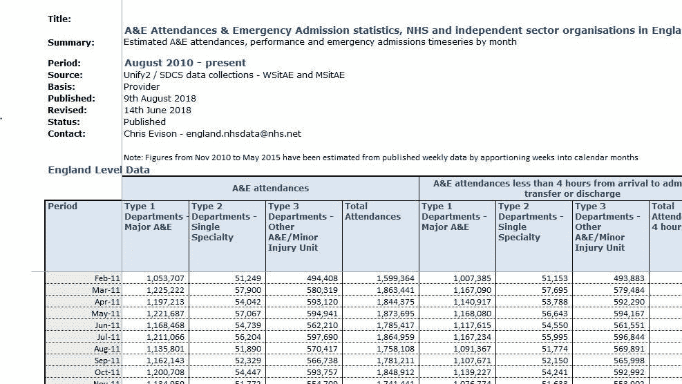

# 关于时间序列分析:

时间序列分析是数据科学的重要课题之一。在这种类型的分析中，数据科学家尽可能准确地预测未来，这就是所谓的预测。我们可以想到大量的应用和想法，其中时间序列分析和预测可以有利于决策。[在我之前的文章(点击这里)](https://www.linkedin.com/pulse/machine-learning-healthcare-middle-east-ahmed-qassim/)中，我讨论了医疗保健领域的一个应用。然而，让我们想一想不同领域的更多应用。

1)您可以使用时间序列分析，通过分析历史事件来预测或预报您的网站在未来的点击量和点击数。

2)预测或预测股票或黄金的价格和走势。

3)制造商预测生产和消耗率的另一个应用程序。..等等

# 价值主张:

我认为，对于数据科学家来说，思考项目的潜在价值以及它如何为决策者带来好处是非常重要的。这是我个人在一个项目开始时所做的。

对于这个项目，我相信通过预测和预测每月的 A&E(事故和紧急情况)出勤，许多重要的决定可以很容易地做出。无论是关于医疗和非医疗的股票购买或员工招聘和他们的工作时间表。此外还要为招待与会者做一些后勤准备。因此，将有助于提高服务质量和减少病人的等待时间。

该项目:

我将使用 R 中的时间序列包来分析和预测 *Total A & E 英国 NHS 的出勤情况*。以下是主要步骤的总结:

1.加载库和数据集

2.时间序列绘图和分析

3.探测

4.分解

5.均值和朴素方法预测

6.线性回归预测

7.ARIMA 模型预测

8.参考

注意:我是通过 Jupyter 笔记本环境使用 R 的。

# **加载库和数据集**

在本节中，我将加载所需的库、数据集，然后进行一些数据辩论:

```
library(dplyr)library(urca)library(forecast)library(dygraphs)require(ggplot2)
```

正在加载数据集:

```
df <- read.csv ( file= ".. A&E admissions.csv", header = TRUE, sep = "\t")
```

更改标题名称，使其对 r 更友好。现在“总出席人数”列将表示为“TA”:

```
setnames ( df, old= c("Period","Total.Attendances), new=c("dateTime", "TA")
```

检查 ta 列中缺失的数据:

```
summary(is.na(df$TA))*> Mode   FALSE**> logical      96*
```

看来没有丢失数据，太好了！现在，我将使用 POSIX 函数将“dateTime”列转换为带有时区说明的日期时间对象:

```
to.POSIXct <- function(col) {*## Function to create a POSIXct time series*

  *## Create a character vector from the numeric input*dateStr <- paste(as.character(col))*## Return the POSIXct time series object*as.POSIXct( strptime(dateStr, "%d/%m/%Y"))}df$dateTime <- to.POSIXct(df$dateTime)class(df$dateTime)>'POSIXct' 'POSIXt'
```

# **时间序列绘图与分析**

现在，将 TA 转换为时间序列类:

```
TA.ts <- ts ( df[,'TA'] , frequency = 12,  start=c(2010,8), end= c(2018,7) )class(TA.ts)> 'ts'
```

时间序列摘要:

```
summary(TA.ts)*> Min. 1st Qu.  Median    Mean 3rd Qu.    Max.**> 1599364 1784570 1871972 1875892 1950438 2176022*
```

绘制英国每月 A&E 总出勤率

```
plot.ts(TA.ts, main = "Monthly Total A&E Attendance in England",  
         xlab = "Year", ylab = "TA")
```

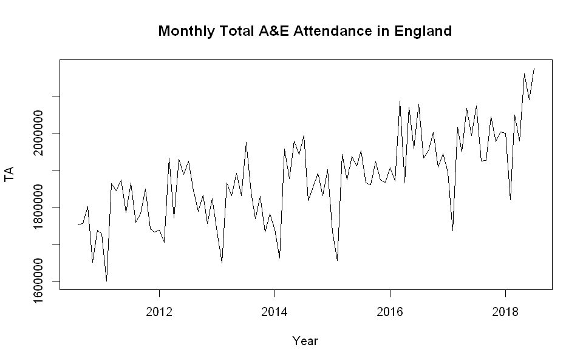

绘制 A&E 在英国的季度和年度总出勤率:

```
TA.ts.qtr <- aggregate (TA.ts, nfrequency = 4)
TA.ts.yr <- aggregate (TA.ts, nfrequency = 1)plot.ts(TA.ts.qtr, main = "Quarterly Total A&E Attendance in England", xlab = "Year", ylab = "TA")
plot.ts(TA.ts.yr, main = " Yearly Total A&E Attendance in England", xlab = "Year", ylab = "TA")
```

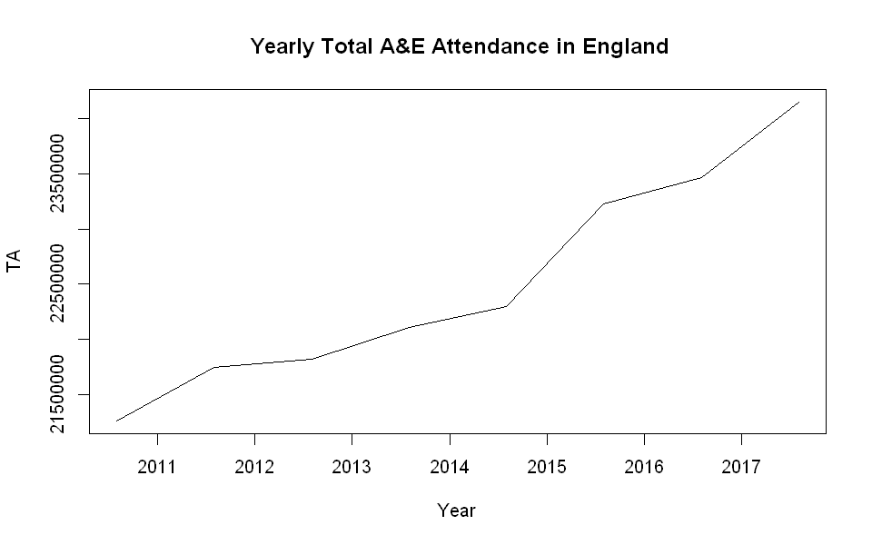

绘制直方图和箱线图，以检查 TA 分布:

```
hist (TA.ts, breaks = 20, main = paste('Distribution of Total A&E Attendance in England'), xlab = "TA")
```

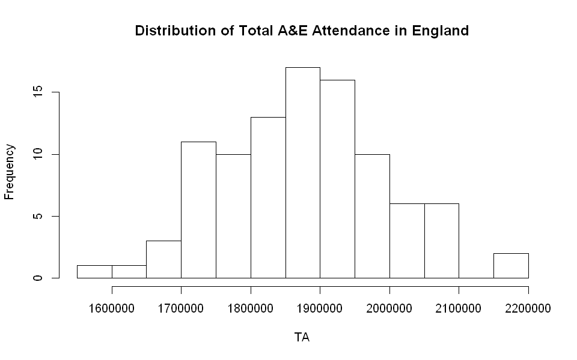

```
boxplot(TA.ts ~ cycle(TA.ts), xlab = "Month", ylab = "TA", main = "Monthly Total A&E Attendance in England - Boxplot")
```

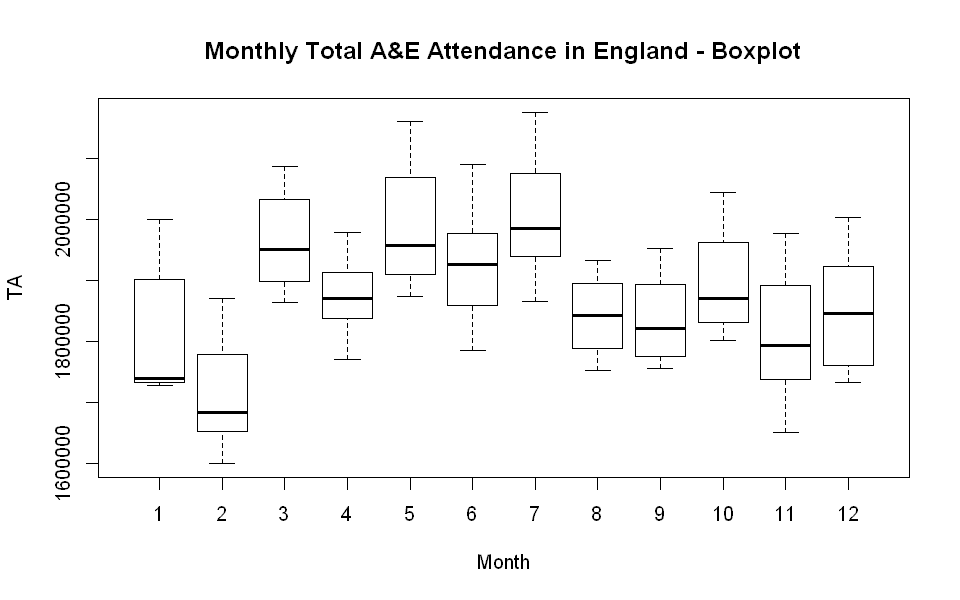

我们可以注意到 TA 在同一个月和其他月份之间的分布和变化。5 月、7 月和 3 月分别是过去 8 年中最繁忙的月份。

# 探测

现在，仔细看看过去 8 年的与会者总数。这可以通过应用移动平均技术来实现，以便平滑趋势信号。我们将计算 6、12、24 和 36 个月的平均值，以控制趋势平滑度。

```
par(mfrow = c(2,2))plot(TA.ts, col="gray", main = "Half Year Moving Average Smoothing")
lines(ma(TA.ts, order = 6), col = "red", lwd=3)plot(TA.ts, col="gray", main = "1 Year Moving Average Smoothing")
lines(ma(TA.ts, order = 12), col = "blue", lwd=3)plot(TA.ts, col="gray", main = "2 Year Moving Average Smoothing")
lines(ma(TA.ts, order = 24), col = "green", lwd=3)plot(TA.ts, col="gray", main = "3 Year Moving Average Smoothing")
lines(ma(TA.ts, order = 36), col = "yellow4", lwd=3)
```

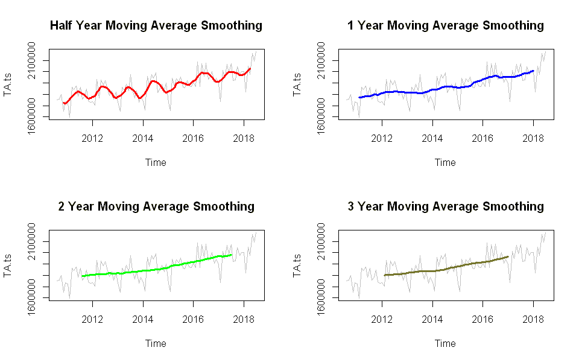

我们可以看到，在过去的几年中，A&E 与会者的人数几乎呈线性增长。

接下来，让我们检查从 2010 年到 2017 年英国人口对 A&E 出席人数的影响。首先，我必须收集英格兰人口的时间序列数据。幸运的是，我在[英国国家统计网站](https://www.ons.gov.uk/)找到了想要的数据。

```
Eng.Pop <- read.csv(file= ".. /England Pop.csv", header = TRUE,  sep = ",")head(Eng.Pop)*> Year Population**> 2010 52642500**> 2011 53107200**> 2012 53493700**> 2013 53865800**> 2014 54316600**> 2015 54786300*
```

创建带有刻度(1000)的时间序列人口数据

```
pop.ts <- ts((Eng.Pop$Population)/1000, frequency = 1, start= 2010, end= 2017)
```

地块人口时间序列:

```
plot(pop.ts, main = "England Popuation", xlab = "Year", ylab = "Number of People in 1,000")
```

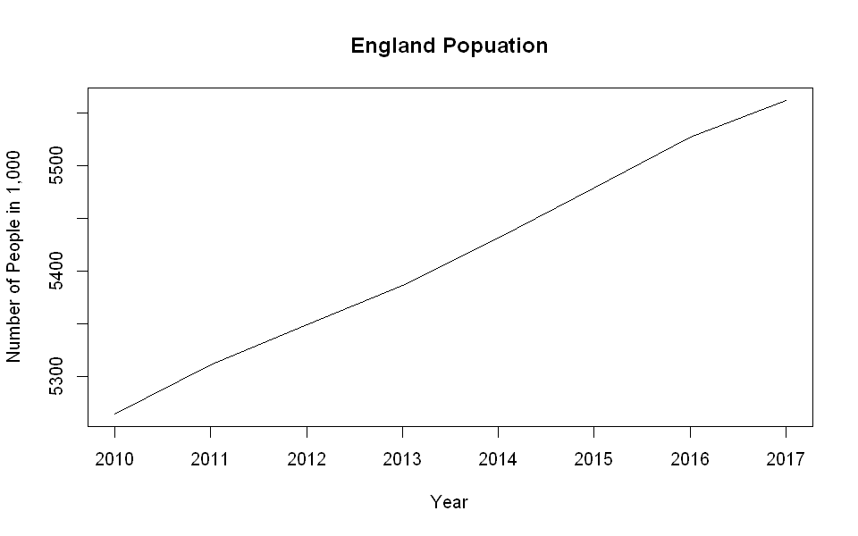

现在，让我们从每年的 A&E 总出勤数据中去除英国人口上升的影响，然后比较两条曲线:

```
par(mfrow = c(1,2))
plot.ts((TA.ts.yr/pop.ts), lwd=2,col = "red", main = "Yearly Total A&E Attendance in England Adjusted by Population", xlab = "Year", ylab = "TA")
plot.ts(TA.ts.yr, col = "blue", lwd=2, main = " Yearly Total A&E Attendance in England", xlab = "Year", ylab = "TA")
```


我们可以明显地注意到，在 2010 年至 2017 年期间，英国人口数量的增加对 A&E 每年的总出席人数影响甚微。从 2011 年年中到 2014 年年中，与会者人数几乎保持不变。然后曲线从 2014 年年中开始跳跃到 2015 年底。需要额外的调查和数据来研究为什么英格兰在 2014 年底开始收到突然大量的事故和紧急情况。

# 分解

在这一步中，我们将把时间序列数据分解成三个部分:趋势、季节和剩余部分。剩余分量必须是稳定的(随机噪声)。换句话说，均值和方差必须是常数。另外，自协方差函数不依赖于时间。

我将对 TA 的记录时间序列使用 STL(使用黄土的季节和趋势分解)分解:

```
autoplot( stl(log(TA.ts), s.window="periodic", robust=TRUE))
```

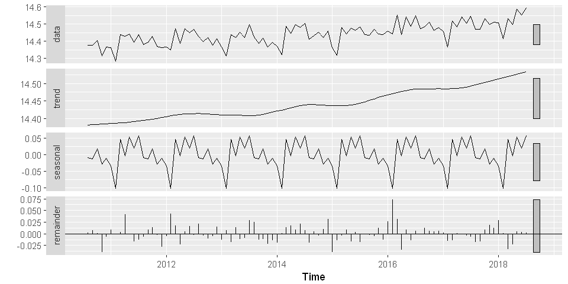

现在，我们必须检查和测试剩余的数据，以确保它是稳定的。首先，我们将绘制自相关函数和偏自相关函数:

```
par(mfrow = c(1,2))
Acf(TA_rem, main ="ACF for Remainder")
Pacf(TA_rem, main ="PACF for Remainder")
```

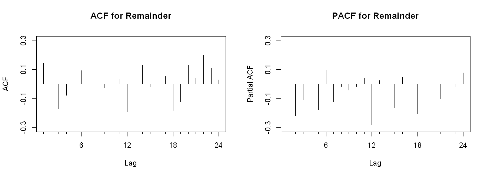

ACF 没有明显的滞后，也没有季节效应，这意味着自协方差不依赖于时间。让我们通过绘制剩余部分的箱线图来检查常数均值和方差:

```
boxplot(TA.ts_rem ~ cycle(TA.ts), xlab = "Month", ylab = "TA", main = "Boxplot of Total Attendance Remainder")
```

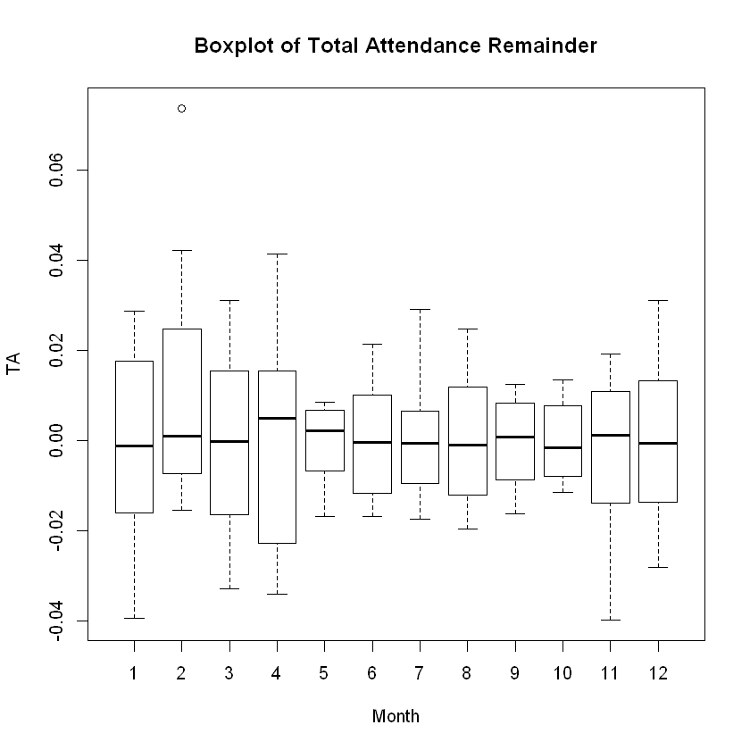

平均值和方差是常数(无显著变化)。此外，我将应用单位根检验(KPSS 检验)来检查信号。KPSS 检验的零假设表明数据是稳定的，我们将寻找任何证据来拒绝零假设。

```
TA.ts_rem %>% ur.kpss()  %>% summary()*####################### 
# KPSS Unit Root Test # 
#######################*> Test is of type: mu with 3 lags.> Value of test-statistic is: 0.0287 

> Critical value for a significance level of: 
                10pct  5pct 2.5pct  1pct
> critical values 0.347 0.463  0.574 0.739
```

检验统计值小于 10%临界值，表明通过了零假设，数据是稳定的。

# **意味着&天真的方法预测**

在这里，我们将应用一些基本模型来预测 12 个月(从 2018 年 8 月至 2019 年 7 月)的 A&E 出席总人数。平均法就是取所有样本点的平均值。而天真和天真的季节性预测使用上一期进行下一期预测。

```
TA.fit.sa <- meanf(TA.ts, h = 12)
TA.fit.na <- naive(TA.ts, h = 12)
TA.fit.sna <- snaive(TA.ts, h = 12)
plot.ts(TA.ts, main = "Monthly Total Attendance NHS in England", xlab = "Year", ylab = "TA", xlim = c(2010, 2019))
lines(TA.fit.sa$mean, col = "blue")
lines(TA.fit.na$mean, col = "green")
lines(TA.fit.sna$mean, col = "red")
legend("topleft",lty=1,col=c("blue","green", "red"), cex = 0.75, legend=c("Mean method","Naive method", "Seasonal naive method"))
```

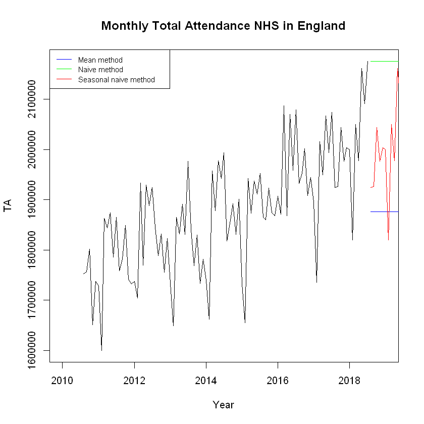

# 线性回归预测

首先，将拟合时间序列线性回归模型，然后使用“预测”包以 80%和 95%的置信区间预测 12 个月的值(从 2018 年 8 月到 2019 年 7 月):

```
fit.lm_TA.ts <- tslm(TA.ts ~ trend+season)frcst.lm <- forecast(fit.lm_TA.ts, h = 12, level = c(80,95))plot.ts(TA.ts, main = "Monthly Total A&E Attendance in England", xlab = "Year", ylab = "TA", xlim = c(2010,2019))lis(frcst.lm$fitted, col = "b
```

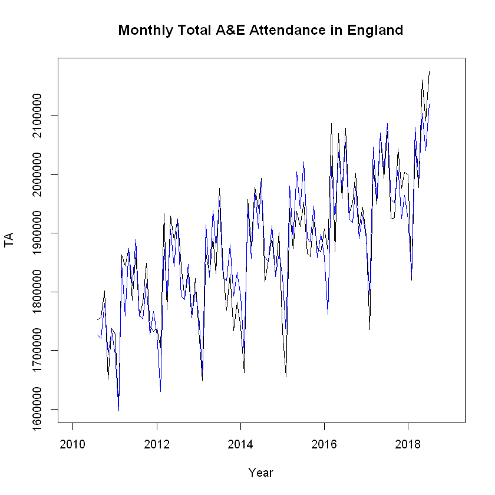

线性回归模型表现相当好，因为我们将拟合数据(蓝色)与实际数据(黑色)进行了对比。接下来，让我们通过检查残差来评估模型。残差均值和方差必须随时间保持不变，如下所示:

```
boxplot(residuals(fit.lm_TA.ts) ~ cycle(TA.ts), xlab = "Month", ylab = "TA", main = "Boxplot of Residuals")
```

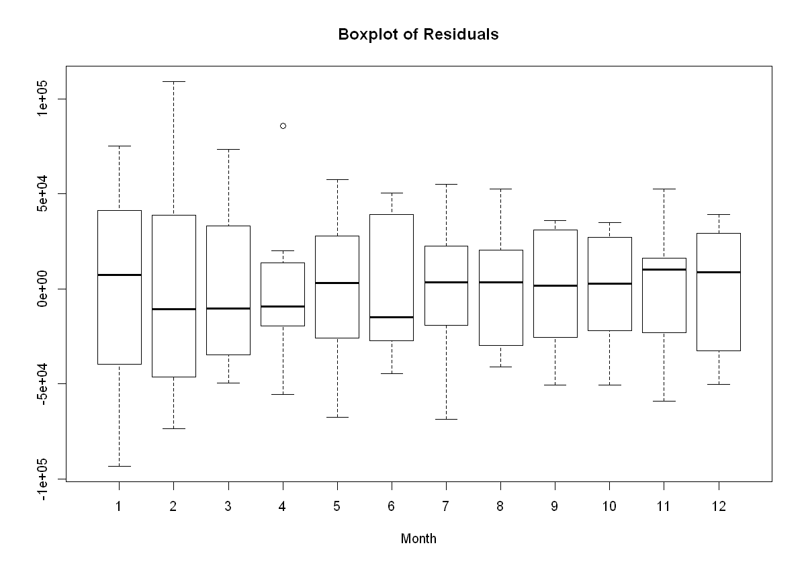

拟合值和实际值之间的散点图:

```
df[,"TA.fitted"] <- as.numeric(fit.lm_TA.ts$fitted.values)plot(df$TA, df$TA.fitted, main = "Scatterplot between fitted & actual values", xlab = "Fitted Value", ylab = "Actual")
abline(0, 1, col="blue")
```

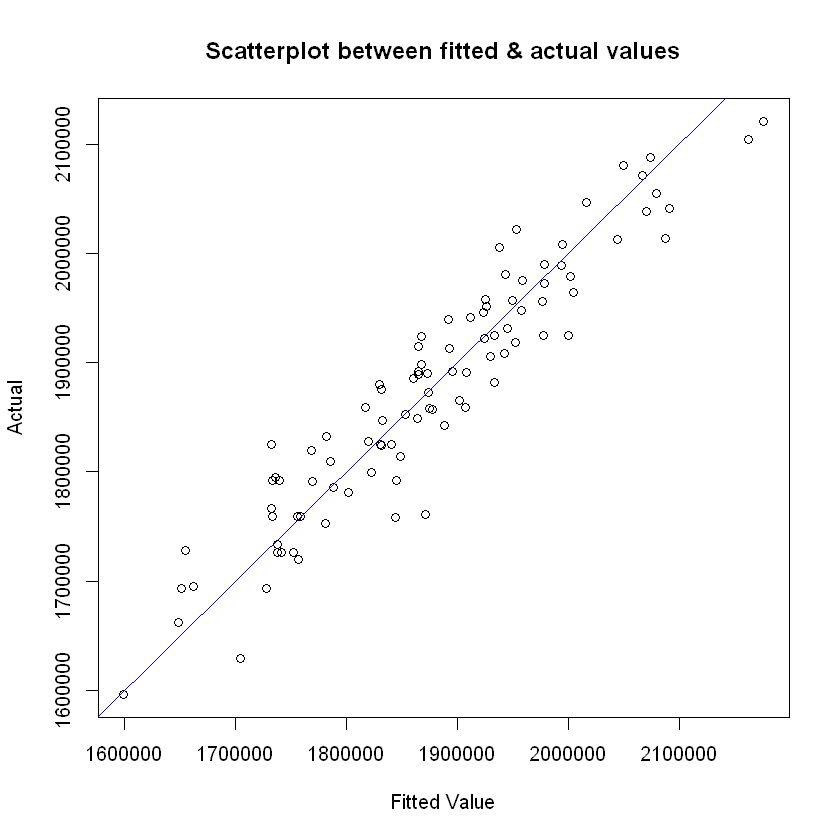

绘制并列出 2018 年 8 月至 2018 年 7 月的一年预测:

```
plot.ts(TA.ts, main = "Monthly Total Attendance NHS in England", xlab = "Year", ylab = "TA", xlim = c(2010,2019))
lines(frcst.lm$mean, col = "blue")
```

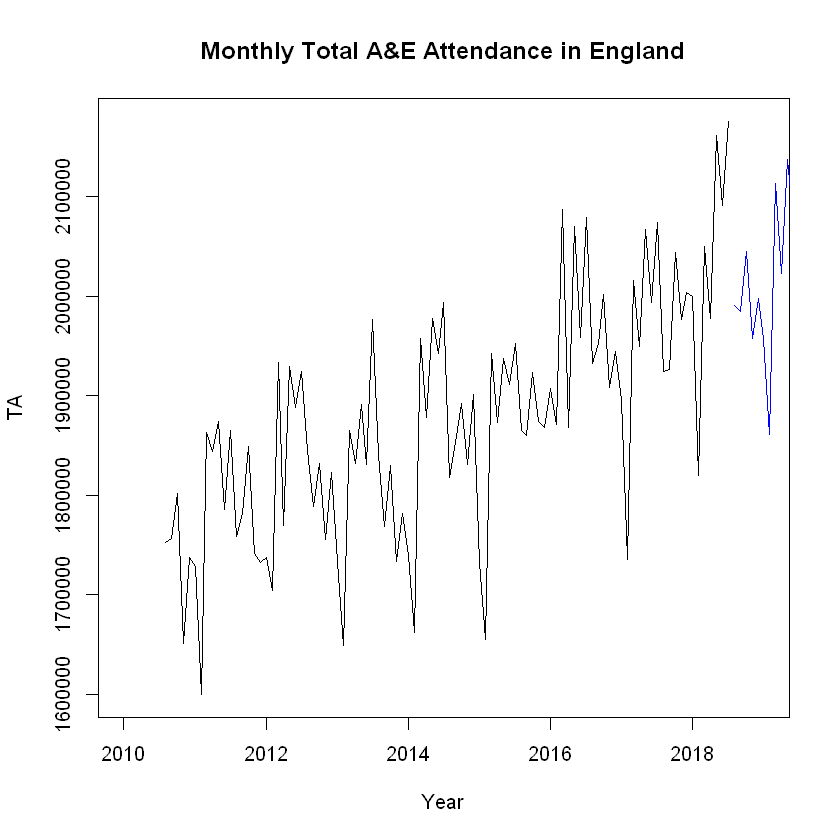

```
frcst.lm*> Point          Forecast   Lo 80   Hi 80   Lo 95   Hi 95*
*> Aug 2018        1990708 1932450 2048965 1901013 2080402*
*> Sep 2018        1984479 1926222 2042736 1894784 2074174*
*> Oct 2018        2045357 1987100 2103614 1955662 2135051*
*> Nov 2018        1957509 1899252 2015766 1867814 2047204*
*> Dec 2018        1997633 1939376 2055890 1907939 2087328*
*> Jan 2019        1957718 1899461 2015975 1868023 2047413*
*> Feb 2019        1860605 1802347 1918862 1770910 1950299*
*> Mar 2019        2113073 2054816 2171330 2023378 2202768*
*> Apr 2019        2022652 1964395 2080909 1932957 2112347*
*> May 2019        2137346 2079089 2195603 2047651 2227040*
*> Jun 2019        2073922 2015664 2132179 1984227 2163616*
*> Jul 2019        2153840 2095583 2212097 2064145 2243535*
```

# ARIMA 模型预测

ARIMA 代表自回归综合移动平均线。这是时间序列预测的另一种方法。事实上，这是时间序列预测中最广泛使用的方法。

在本节中，我们将对季节性调整数据进行差分变换，以获得平稳信号。然后通过实验得出非季节性 ARIMA 模型的 p，d，q 参数。然后，为季节性 ARIMA 模型设置 P，D，Q 值。最后，将季节性 ARIMA 和自动 ARIMA 模型的结果进行比较。这是《预测原理和实践》一书中的图表摘要，介绍了使用 ARIMA 模型进行预测的一般过程


记住 ARIMA(p，D，q)(P，D，Q)模型:

p =非季节性部分的自回归部分的阶

d =非季节性部分涉及的一阶差异度

q =非季节性部分的移动平均部分的顺序

P =季节部分的自回归部分的阶

D =季节部分涉及的一阶差异度

Q =季节性部分的移动平均部分的阶数

首先，我们将分解数据，然后在没有季节成分的情况下重新构建— seasadj()函数:返回经季节调整的数据:

```
TA.ts %>% stl(s.window='periodic') %>% seasadj() -> TA.ts_seasadj
autoplot(TA.ts_seasadj, main= " Seasonal Adjusted Monthly A&E Attendance", lwt= 3)
```

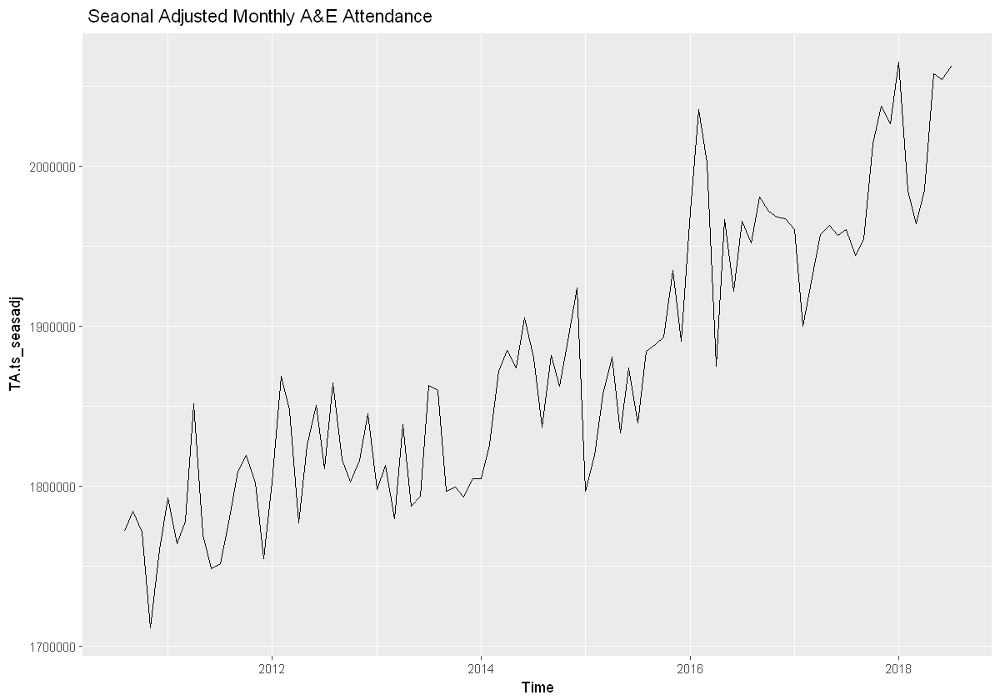

```
ggtsdisplay(TA.ts_seasadj, main="Seasonal Adjusted Data with ACF and PACF plots")
```

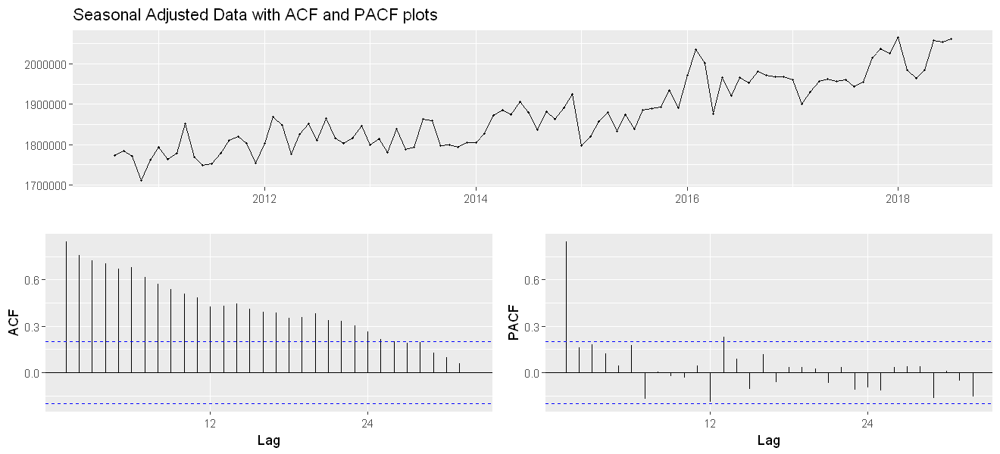

显而易见，我们可以看到季节性调整数据并不是稳定的。让我们用 KPSS 单位根检验来复查一下:

```
TA.ts_seasadj %>% ur.kpss() %>% summary()*####################### 
# KPSS Unit Root Test # 
#######################* 

> Test is of type: mu with 3 lags. 

> Value of test-statistic is: 2.2591 

> Critical value for a significance level of: 
                10pct  5pct 2.5pct  1pct
> critical values 0.347 0.463  0.574 0.739
```

测试统计值远高于临界值的 1%。这意味着信号不是稳定的。为了做到这一点，我们将应用一种叫做差分的有用的变换。差异可以通过消除时间序列水平的变化，从而消除(或减少)趋势和季节性，帮助稳定时间序列的平均值。

```
TA.ts_seasadj %>% diff() -> TA.ts_diff
ggtsdisplay(TA.ts_diff, main="Differencing Seasonal Adjusted Data with ACF and PACF plots")
```


ACF 图和 PACF 中的一些显著滞后将帮助我们确定 AR 和 MA 的 p 和 q 值。但总的来说，信号看起来是平稳的，让我们用 KPSS 单位根检验再次确认:

```
TA.ts_diff %>% ur.kpss() %>% summary()*####################### 
# KPSS Unit Root Test # 
#######################*> Test is of type: mu with 3 lags.> Value of test-statistic is: 0.0547> Critical value for a significance level of: 
                10pct  5pct 2.5pct  1pct
> critical values 0.347 0.463  0.574 0.739
```

测试统计值小于 10%临界值，这意味着数据是稳定的。这意味着一个差分变换足以获得静态数据。让我们评价和比较几个 ARIMA 模型——ARIMA(0，1，2)、ARIMA(1，1，2)和 ARIMA(1，1，1):

```
*# ARIMA(0,1,2)*summary(Arima (TA.ts_seasadj, order= c(0,1,2)))*> Series: TA.ts_seasadj* 
*> ARIMA(0,1,2)**> Coefficients:*
*>          ma1      ma2*
*>       -0.4453  -0.2117*
*> s.e.   0.0999   0.0937**> sigma^2 estimated as 1.459e+09:  log likelihood=-1136.32*
*> AIC=2278.64   AICc=2278.9   BIC=2286.3**> Training set error measures:*
*>                 ME     RMSE      MAE       MPE     MAPE      MASE        ACF1*
*> Training set 8044.3 37593.57 29865.46 0.3906696 1.586877 0.5389833 -0.05881525*
```

—

```
# ARIMA(1,1,2)
summary(Arima (TA.ts_seasadj, order= c(1,1,2)))*> Series: TA.ts_seasadj* 
*> ARIMA(1,1,2)* 

*> Coefficients:*
*>          ar1      ma1      ma2*
*>      -0.0782  -0.3745  -0.2516*
*> s.e.   0.3092   0.2901   0.1742*

*> sigma^2 estimated as 1.474e+09:  log likelihood=-1136.29*
*> AIC=2280.58   AICc=2281.02   BIC=2290.8*

*> Training set error measures:*
*>                   ME     RMSE      MAE      MPE     MAPE      MASE       ACF1*
*> Training set 7978.19 37581.15 29927.57 0.387108 1.589947 0.5401043 -0.0523739*
```

—

```
# ARIMA(1,1,1)
summary(Arima (TA.ts_seasadj, order= c(1,1,1)))*> Series: TA.ts_seasadj* 
*> ARIMA(1,1,1)**> Coefficients:*
*>         ar1      ma1*
*>       0.2644  -0.7487*
*> s.e.  0.1427   0.0907**> sigma^2 estimated as 1.477e+09:  log likelihood=-1136.91*
*> AIC=2279.82   AICc=2280.08   BIC=2287.48**> Training set error measures:*
*>                    ME     RMSE      MAE       MPE     MAPE      MASE       ACF1*
*> Training set 8057.644 37831.55 29899.12 0.3908637 1.589457 0.5395909 -0.019330*
```

ARIMA(0，1，2)是最好的，因为平方误差比系数值低得多。此外，它还具有最低的 AIC、BIC 和误差测量值，如 RMSE。让我们拟合选择的模型，检查残差，最后预测 12 个月:

```
fit*_TA.ts <- Arima (TA.ts_*seasadj, order= c(0,1,2))
checkresiduals(fit_TA.ts, lag = 10)*> Ljung-Box test*

*> data:  Residuals from ARIMA(0,1,2)*
*> Q* = 7.0949, df = 8, p-value = 0.5264*

*> Model df: 2\.   Total lags used: 10*
```


残差几乎呈正态分布，略有偏斜。除了在第 12 个阶段，ACF 没有显示出显著的数值。具有显著 p 值的 Ljung-Box 检验得出结论，残差是随机的(白噪声)。

从 2018 年 8 月到 2019 年 7 月的 12 个月预测:

```
frcst_TA.ts = forecast (fit_TA.ts, h=12)plot(frcst_TA.ts)
```

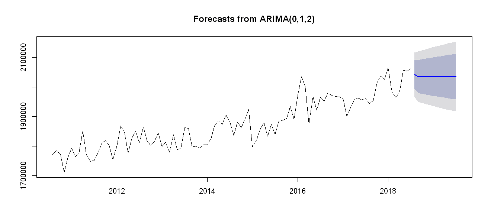

经过多次迭代后，我将季节部分(P，D，Q)的值估计为(1，1，1)。接下来，将拟合、评估和预测季节性 ARIMA 模型:

```
fit.seas_TA.ts <- Arima (TA.ts, order= c(0,1,2), seasonal=c(1,1,1))summary(fit.seas_TA.ts)*> Series: TA.ts* 
*> ARIMA(0,1,2)(1,1,1)[12]* 

*> Coefficients:*
*>           ma1      ma2     sar1     sma1*
*>       -0.5537  -0.2862  -0.3102  -0.6428*
*> s.e.   0.1050   0.1036   0.1416   0.1891*

*> sigma^2 estimated as 1.741e+09:  log likelihood=-1005.48*
*> AIC=2020.96   AICc=2021.74   BIC=2033.06*

*> Training set error measures:*
*>                    ME     RMSE      MAE       MPE     MAPE      MASE*
*> Training set 3386.278 37856.27 28465.13 0.1337672 1.513877 0.5137116*
*>                      ACF1*
*> Training set -0.009264586*
```

所有平方误差都远低于系数的绝对值。AIC 和 BIC 的表现优于非季节性 ARIMA 模型(0，1，2)。同样，我们需要确保残差是随机的，并且是非结构化的:

```
checkresiduals(fit.seas_TA.ts)*> Ljung-Box test*

*> data:  Residuals from ARIMA(0,1,2)(1,1,1)[12]*
*> Q* = 23.202, df = 20, p-value = 0.279*

*> Model df: 4\.   Total lags used: 24*
```


直方图分布有点偏斜，但模型仍然通过了永盒测试。p 值显著，ACF 图中没有显著的滞后。因此，我们现在有了一个季节性 ARIMA 模型，它通过了检查，可以进行预测了。该模型对未来一年的预测如下所示:

```
frcs.seas*_TA.ts <- forecast (fit.seas_*TA.ts, h=12)
summary(frcs.seas_TA.ts)*> Forecast method: ARIMA(0,1,2)(1,1,1)[12]*

*> Model Information:*
*> Series: TA.ts* 
*> ARIMA(0,1,2)(1,1,1)[12]* 

*> Coefficients:*
*>           ma1      ma2     sar1     sma1*
*>       -0.5537  -0.2862  -0.3102  -0.6428*
*> s.e.   0.1050   0.1036   0.1416   0.1891*

*> sigma^2 estimated as 1.741e+09:  log likelihood=-1005.48*
*> AIC=2020.96   AICc=2021.74   BIC=2033.06*

*> Error measures:*
*>                    ME     RMSE      MAE       MPE     MAPE      MASE*
*> Training set 3386.278 37856.27 28465.13 0.1337672 1.513877 0.5137116*
*>                      ACF1*
*> Training set -0.009264586*

*> Forecasts:*
*>          Point Forecast   Lo 80   Hi 80   Lo 95   Hi 95*
*> Aug 2018        2021727 1968205 2075248 1939872 2103581*
*> Sep 2018        2014485 1955875 2073094 1924849 2104121*
*> Oct 2018        2070211 2010979 2129444 1979623 2160800*
*> Nov 2018        1990520 1930671 2050369 1898988 2082052*
*> Dec 2018        2024607 1964148 2085067 1932142 2117072*
*> Jan 2019        1981844 1920780 2042907 1888455 2075233*
*> Feb 2019        1880516 1818854 1942178 1786212 1974820*
*> Mar 2019        2139569 2077315 2201824 2044359 2234780*
*> Apr 2019        2036234 1973392 2099076 1940126 2132342*
*> May 2019        2161701 2098278 2225124 2064703 2258698*
*> Jun 2019        2092552 2028553 2156552 1994674 2190431*
*> Jul 2019        2175445 2110872 2240018 2076689 2274200*
```

ARIMA 12 个月预测图(0，1，2) (1，1，1) [12]:

```
plot(frcs.seas_TA.ts)
```

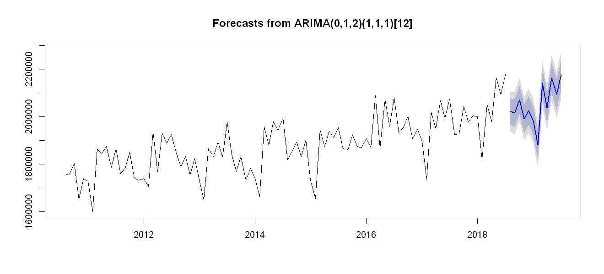

另一方面，我们可以使用 auto.arima()来完成大部分工作。它将给出以下结果:

```
fit_TA = auto.arima(TA.ts, max.p=5, max.q=5,
                   max.P=2 , max.Q=2, max.order=5, max.d=2, max.D=2, 
                   start.p=0, start.q=0, start.P=0, start.Q=0)
frcst*_TA = forecast(fit_*TA, h=12)
summary(frcst_TA)*> Forecast method: ARIMA(1,0,0)(1,1,1)[12] with drift**> Model Information:*
*> Series: TA.ts* 
*> ARIMA(1,0,0)(1,1,1)[12] with drift**> Coefficients:*
*>          ar1     sar1     sma1      drift*
*>       0.4134  -0.2152  -0.7774  2753.7605*
*> s.e.  0.1001   0.1514   0.2567   225.8097**> sigma^2 estimated as 1.667e+09:  log likelihood=-1016.63*
*> AIC=2043.26   AICc=2044.03   BIC=2055.41**> Error measures:*
*>                     ME     RMSE      MAE        MPE     MAPE      MASE*
*> Training set -1930.433 37268.02 28165.95 -0.1540752 1.507049 0.5083123*
*>                    ACF1*
*> Training set 0.01430932**> Forecasts:*
*>          Point Forecast   Lo 80   Hi 80   Lo 95   Hi 95*
*> Aug 2018        2015362 1962792 2067932 1934963 2095761*
*> Sep 2018        1997133 1940272 2053995 1910171 2084096*
*> Oct 2018        2044986 1987423 2102549 1956951 2133021*
*> Nov 2018        1958307 1900624 2015989 1870089 2046524*
*> Dec 2018        1994969 1937266 2052671 1906720 2083217*
*> Jan 2019        1949321 1891615 2007027 1861067 2037575*
*> Feb 2019        1857882 1800176 1915589 1769627 1946137*
*> Mar 2019        2115227 2057520 2172934 2026972 2203482*
*> Apr 2019        2015541 1957834 2073247 1927286 2103795*
*> May 2019        2131158 2073452 2188864 2042904 2219412*
*> Jun 2019        2066159 2008456 2123863 1977909 2154410*
*> Jul 2019        2147445 2089755 2205135 2059215 2235674*
```

绘制 ARIMA 12 个月的预测(1，0，0) (1，1，1) [12]:

```
plot(frcst_TA)
```

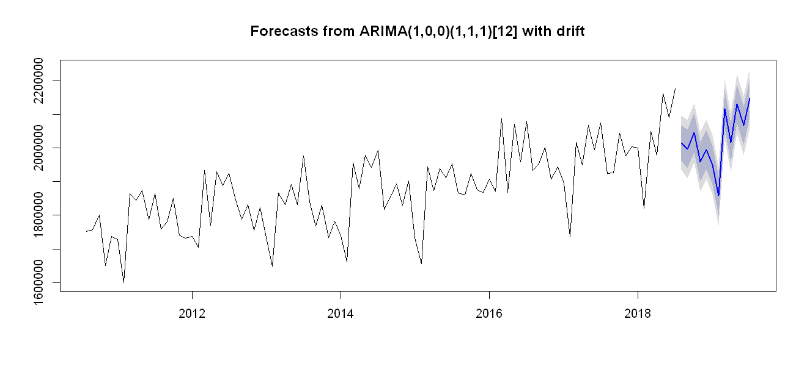

# 预测摘要

最后，让我们将季节性朴素线性回归、ARIMA(0，1，2)(1，1，1)和自动 ARIMA(1，0，0)(1，1，1)的所有预测结果合并到一个名为 summary.ts 的数据框架中，然后绘制线图:

```
summary.ts*>    Seas.Naive	Linear.Reg	ARIMA	Auto.ARIMA*
*> Aug-18	1924663	1990708	2021727	2015362*
*> Sep-18	1925961	1984479	2014485	1997133*
*> Oct-18	2044137	2045357	2070211	2044986*
*> Nov-18	1976971	1957509	1990520	1958307*
*> Dec-18	2003954	1997633	2024607	1994969*
*> Jan-19	2000086	1957718	1981844	1949321*
*> Feb-19	1820012	1860605	1880516	1857882*
*> Mar-19	2049785	2113073	2139569	2115227*
*> Apr-19	1978084	2022652	2036234	2015541*
*> May-19	2161779	2137346	2161701	2131158*
*> Jun-19	2091318	2073922	2092552	2066159*
*> Jul-19	2176022	2153840	2175445	2147445*
```

— — -

```
summary(summary.ts)>       Seas.Naive        Linear.Reg          ARIMA           Auto.ARIMA     
> Min.   :1820012   Min.   :1860605   Min.   :1880516   Min.   :1857882  
> 1st Qu.:1964219   1st Qu.:1977789   1st Qu.:2008494   1st Qu.:1985803  
> Median :2002020   Median :2010143   Median :2030421   Median :2015451  
> Mean   :2012731   Mean   :2024570   Mean   :2049118   Mean   :2024458  
> 3rd Qu.:2060168   3rd Qu.:2083709   3rd Qu.:2104307   3rd Qu.:2078426  
> Max.   :2176022   Max.   :2153840   Max.   :2175445   Max.   :2147445
```


# **参考文献**

其实我看过很多文章练习时间序列分析。毕竟，最有用的一本是《预测:原理与实践》,作者是罗布·J·海曼，乔治·阿萨纳索普洛斯

此外，我从微软获得的课程和证书(应用机器学习)也非常有益。除了关于时间序列分析的有价值的信息之外，还有动手实验。