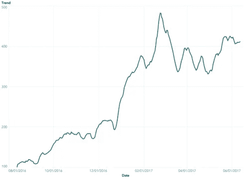
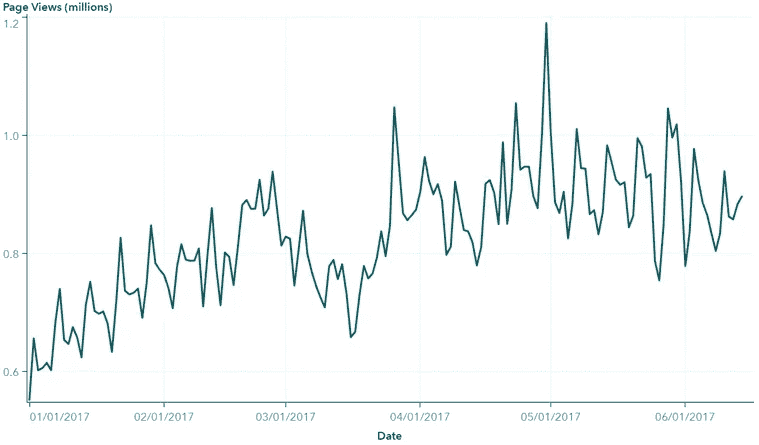
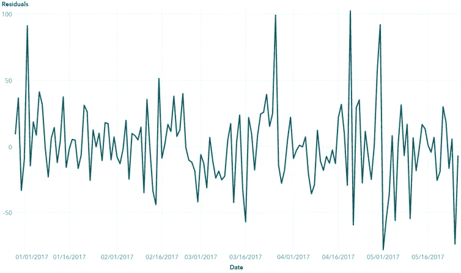
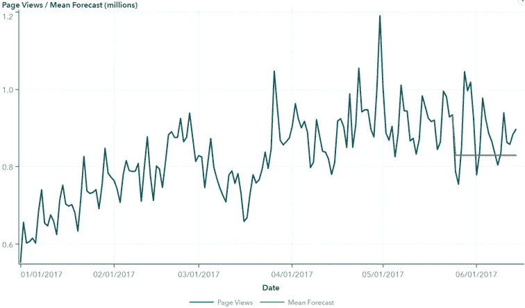
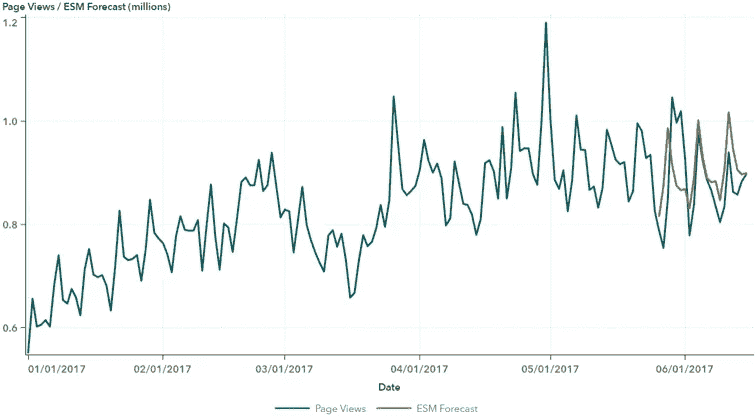
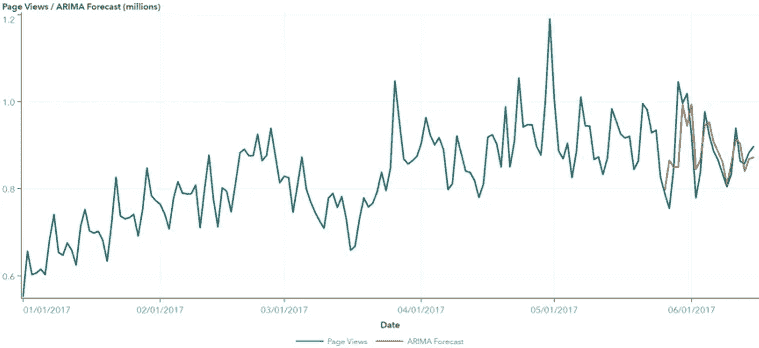
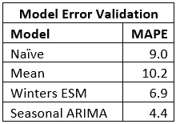

# 假人的时间序列——三步过程

> 原文：<https://towardsdatascience.com/time-series-for-dummies-the-3-step-process-447fb642a6f1?source=collection_archive---------13----------------------->

克里斯·圣·杰尔&肖恩·安肯布鲁克，Zencos

在一顿令人满意的中餐外卖后，你心不在焉地打开了免费的幸运饼干。瞥了一眼里面的财富，你读到，“你的一个梦想将会实现。”你一边嗤之以鼻，一边扔掉小纸片，把饼干放进嘴里。作为一个聪明、理性的人，你知道财富是微不足道的——没有人能预测未来。然而，这种想法可能是不完整的。有一种方法可以非常准确地预测未来:时间序列建模。

时间序列建模可能无法告诉你什么时候会遇到你一生的挚爱，或者你应该穿蓝色还是红色的领带去上班，但它非常擅长使用历史数据来识别现有的模式，并用它们来预测未来会发生什么。与大多数高级分析解决方案不同，时间序列建模是一种低成本的解决方案，可以提供强大的洞察力。

本文将介绍构建高质量时间序列模型的三个基本步骤:使数据稳定、选择正确的模型以及评估模型的准确性。本文中的例子使用了一家大型汽车营销公司的历史页面浏览量数据。

# 步骤 1:使数据稳定

时间序列涉及到数据的使用，这些数据是由等间距的时间增量(分钟、小时、天、周等)索引的。).由于时间序列数据的离散性，许多时间序列数据集在数据中内置了季节和/或趋势元素。时间序列建模的第一步是考虑现有的季节(一段固定时间内重复出现的模式)和/或趋势(数据向上或向下移动)。考虑到这些嵌入模式，我们称之为使数据稳定。趋势和季节性数据的例子可以在下面的图 1 和图 2 中看到。

*Figure 1: Example of Upward Trending Data*

*Figure 2: Example of Seasonal Data*

# 什么是平稳性？

正如我们之前提到的，时间序列建模的第一步是消除数据中存在的趋势或季节的影响，使其保持平稳。我们一直在讨论术语*平稳性*，但是它到底是什么意思呢？

平稳序列是指序列的平均值不再是时间的函数。对于趋势数据，随着时间的增加，序列的均值会随着时间的推移而增加或减少(想想房价随着时间的推移而稳步上升)。对于季节性数据，序列的平均值随着季节而波动(想想每 24 小时温度的上升和下降)。

# 我们如何实现平稳性？

有两种方法可以应用于实现平稳性，差分数据或线性回归。要计算差值，需要计算连续观察值之间的差值。要使用线性回归，您需要在模型中包含季节性组件的二进制指示变量。在我们决定应用这些方法中的哪一种之前，让我们来研究一下我们的数据。我们使用 SAS 视觉分析绘制了历史每日页面浏览量。

Figure 3: Time Series Plot of Raw Page Views

最初的模式似乎每七天重复一次，表示一周一季。随着时间的推移，页面浏览量持续增加，这表明有略微上升的趋势。对数据有了大致的了解后，我们应用了平稳性的统计检验，即扩展的 Dickey-Fuller (ADF)检验。ADF 检验是平稳性的单位根检验。我们不会在这里进入细节，但是一个单位根表示序列是否是非平稳的，所以我们使用这个测试来确定处理趋势或季节的适当方法(差异或回归)。基于上述数据的 ADF 测试，我们通过对一周中某一天的虚拟变量进行回归来去除七天季节，并通过对数据进行差分来去除趋势。由此产生的静态数据可以在下图中看到。

*Figure 4: Stationary Data After Removing Season and Trend*

# 步骤 2:构建时间序列模型

既然数据是稳定的，时间序列建模的第二步是建立一个基本水平的预测。我们还应该注意到，大多数基本水平的预测不需要第一步使你的数据稳定。只有更高级的模型才需要这样做，比如我们马上要讨论的 ARIMA 模型。

# 建立基础水平预测

时间序列模型有几种类型。要构建一个可以准确预测未来页面浏览量(或任何您感兴趣的预测)的模型，有必要确定适合您的数据的模型类型。

最简单的选择是假设 y 的未来值(您有兴趣预测的变量)等于 y 的最新值。这被认为是最基本的，或“天真模型”，其中最近的观察是明天最可能的结果。

第二种模型是平均模型。在这个模型中，数据集中的所有观察值被赋予相同的权重。y 的未来预测值计算为观测数据的平均值。如果数据是水平的，生成的预测可能相当准确，但如果数据是趋势性的或具有季节性成分，则提供的预测会非常差。使用平均模型对页面浏览量数据的预测值如下所示。

*Figure 5: Average (Mean) Model Forecast*

如果数据具有季节性或趋势性元素，那么基准水平模型的更好选择是实施指数平滑模型(ESM)。ESM 在上述简单模型和平均模型之间找到了一个合适的中间点，最近的观察值被赋予最大的权重，而所有以前的观察值的权重随着时间的推移呈指数递减。ESM 还允许将季节性和/或趋势性组件纳入模型。下表提供了 0.7 的初始权重以 0.3 的速率指数下降的示例。

*Table 1: Example of the exponentially decreasing effect of past observations of Y.*

在时间序列预测中，可以实施各种类型的 ESM。要使用的理想模型将取决于您拥有的数据类型。下表根据数据中的趋势和季节组合，提供了使用哪种 ESM 的快速指南。

*Table 2: Model Selection Table*

由于强七天季节和数据的上升趋势，我们选择了一个附加的冬季 ESM 作为新的基准水平模型。生成的预测很好地延续了轻微的上升趋势，并捕捉到了七天的季节。但是，数据中仍有更多模式可以删除。

*Figure 6: Additive Winters ESM Forecast*

# ARIMA 造型

在确定了最能解释数据中的趋势和季节的模型后，您最终有了足够的信息来生成一个像样的预测，如上图所示。然而，这些模型仍然是有限的，因为它们没有考虑到感兴趣的变量在以前的时间段内与其自身的相关性。我们将这种相关性称为自相关，这在时间序列数据中很常见。如果数据具有自相关性，就像我们的一样，那么就可以进行额外的建模来进一步改进基线预测。

为了捕捉时间序列模型中的自相关效应，有必要实施自回归综合移动平均(或 ARIMA)模型。ARIMA 模型包括说明季节和趋势的参数(如使用虚拟变量表示一周中的天数和差异)，但也允许包含自回归和/或移动平均项来处理数据中嵌入的自相关。通过使用适当的 ARIMA 模型，我们可以进一步提高页面浏览量预测的准确性，如下图 3 所示。

*Figure 7: Seasonal ARIMA Model Forecast*

# 步骤 3:评估模型准确性

虽然您可以看到所展示的每个模型的准确性都有所提高，但是直观地确定哪个模型的准确性最好并不总是可靠的。计算 MAPE(平均绝对百分比误差)是比较建议模型的整体预测精度的一种快速简便的方法-MAPE 越低，预测精度越好。比较前面讨论的每个模型的 MAPE，很容易看出季节性 ARIMA 模型提供了最佳的预测精度。请注意，有几种其他类型的比较统计数据可用于模型比较。

*Table 3: Model Error Rate Comparison*

# 摘要

总之，建立一个强大的时间序列预测模型的诀窍是尽可能多地去除噪声(趋势、季节和自相关)，这样数据中唯一剩下的未解释的运动就是纯粹的随机性。对于我们的数据，我们发现带有回归变量的季节性 ARIMA 模型提供了最准确的预测。与上面提到的简单模型、平均模型和 ESM 模型相比，ARIMA 模型的预测更加准确。

虽然没有时间序列模型能够帮助你的爱情生活，但有许多类型的时间序列模型可以帮助你预测从页面浏览量到能源销售的任何事情。准确预测您感兴趣的变量的关键是，首先，理解您的数据，其次，应用最符合您的数据需求的模型。

*最初发表于*[*【www.kdnuggets.com】*](https://www.kdnuggets.com/2018/03/time-series-dummies-3-step-process.html)*。*