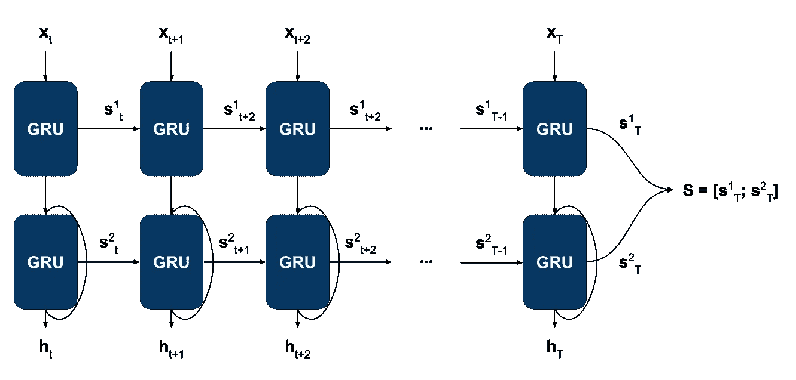
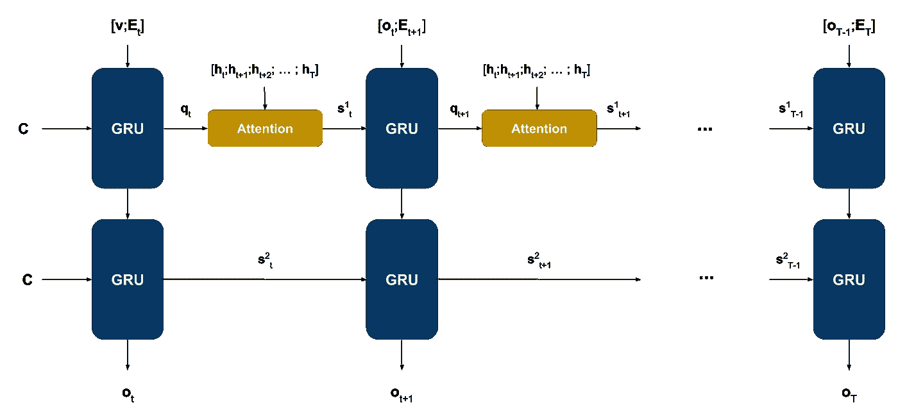
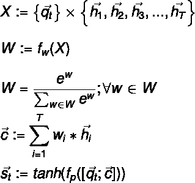
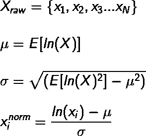
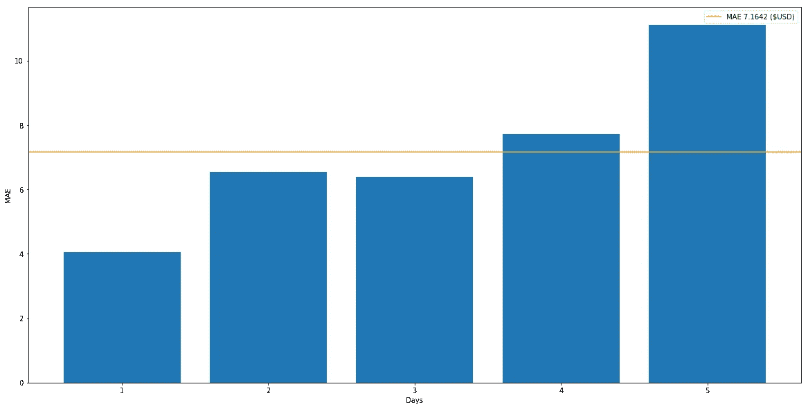
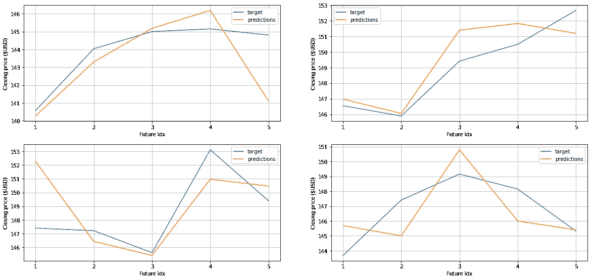
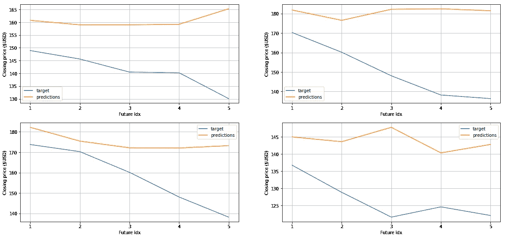

# 基于递归神经网络的时间序列预测

> 原文：<https://towardsdatascience.com/time-series-forecasting-with-rnns-ff22683bbbb0?source=collection_archive---------8----------------------->

在这篇文章中，我想给你一个我建立的预测时间序列数据的 RNN 模型的概述。这项工作的主要目标是设计一个模型，该模型不仅可以预测下一个时间步，还可以生成一系列预测，并利用多个行驶时间序列以及一组静态(标量)特征作为其输入。

# 模型架构

在高层次上，该模型利用了非常标准的序列到序列递归神经网络架构。其输入是预测时间序列的过去值，与其他驱动时间序列值(可选)和时间戳嵌入(可选)连接在一起。如果静态特征可用，模型也可以利用它们来调节预测。

## **编码器**

编码器用于将时间序列输入及其各自的时间戳嵌入[ **x** ]编码为固定大小的向量表示[ **S** ]。它还为单独的时间步长[ **h** ]产生潜在向量，这些潜在向量稍后用于解码器关注。为此，我利用了一个多层单向[递归神经网络](https://en.wikipedia.org/wiki/Recurrent_neural_network)，其中除了第一层之外的所有层都是[残差。](https://en.wikipedia.org/wiki/Residual_neural_network)

Fig. 1\. — Example 2-layer encoder

在某些情况下，您可能有太长的输入序列，可能会导致训练失败，因为 GPU 内存问题或大大降低它的速度。为了处理这个问题，该模型将输入序列与具有相同内核大小和步长的 1D [卷积](https://en.wikipedia.org/wiki/Convolution)进行卷积，然后将其馈送到 RNN 编码器。这将 RNN 输入减少了 **n** 倍，其中 **n** 是卷积核的大小。

## 语境

Fig. 2\. — Context layer

上下文层位于输入编码器和解码器层之间。它将编码器最终状态[ **S** ]与静态特征和静态嵌入连接起来，并产生一个固定大小的向量[ **C** ，该向量随后被用作解码器的初始状态。

## 解码器

解码器层被实现为具有[注意力](https://arxiv.org/pdf/1409.0473.pdf)的[自回归](https://en.wikipedia.org/wiki/Autoregressive_model)递归神经网络。每一步输入都是先前序列值和为该步骤嵌入的时间戳的串联。向解码器提供时间戳嵌入有助于模型学习季节性数据中的模式。

Fig. 3\. — Decoder layer

在第一步，编码器将上下文[ **C** ]作为初始单元值，并将初始序列值[ **v** 和第一时间戳嵌入[ **E** ]的串联作为单元输入。然后，第一层发出注意查询[ **q** ]，该查询被馈送到注意模块，该模块输出状态[ **s** ]，该状态然后被用作下一步骤中的单元状态。解码器的较低层不使用注意力。解码器[ **o** ]的输出是原始预测值，这些预测值随后与为该步骤嵌入的时间戳一起被馈送到下一步骤。

## **注意**

Fig. 4\. — Attention

注意允许解码器在解码期间选择性地访问编码器信息。这是通过学习加权函数来实现的，该加权函数将先前的单元状态[ **q** ]和编码器输出列表[ **h** ]作为输入，并输出每个编码器输出的标量权重。然后，它取编码器输出的加权和，将其与查询连接，并取非线性投影作为下一个单元状态。从数学上讲，这可以表述如下:

Eqn. 1\. — Attention function

# 数据准备

在本文中，我不会一步一步地指导如何为序列对序列学习问题准备数据，但我会尝试向您概述让模型工作所需的步骤。

首先，您需要确保时间序列要素的范围不与目标的范围重叠，并且最新的要素时间戳正好在第一个目标时间戳之前。此外，如果您有任何静态特性(例如聚合统计)，它们需要聚合到最后一个特性时间戳。我知道这听起来是显而易见的，但有时真的很容易忽略，并为您的模型表现如此之好而兴奋，只是发现您将未来的信息泄露到了您的训练数据集中。

数据，包括特征和目标，需要被标准化为神经网络模型的合适范围。这通常意味着在 **-1** 和 **1** 之间的某处。我决定采用的标准化方案是首先采用一个**对数**来消除任何潜在的偏差，然后计算一个**平均值**和**标准偏差**。然后，网络的输入是日志的 z 分数。

Eqn. 2\. — Features normalization

对于目标值，有多个标准化选项。例如，可以使用我在上面描述的类似方法预测最新输入值(如果输入值为 0，这可能是一个问题)或归一化绝对值的相对变化。

# 结果

作为本文的一个例子，我使用上面描述的模型来预测 Shopify 股票未来五个交易日的收盘价，给定过去六十个交易日的数据。内核/步距= 5 的输入序列卷积层用于将编码器 RNN 输入大小从 60 步减少到 12 步。

Chart 1\. — Shopify closing price

有人可能会说，在不考虑新闻等其他因素的情况下，股价是不可预测的(即使这样也很难)。这就是为什么我决定使用另外六个报价器(苹果、亚马逊、谷歌、脸书、微软和 IBM)作为模型的输入，以便它可以学习它们之间可能的相关性。使用的特征是每日开盘价、最高价、最低价、收盘价(OHLC)和成交量。我用“spread”(`abs(high-low)`)和每个特征的过去 60 天平均值作为静态输入来扩充时间序列特征。

Chart 2\. — MAE by day

*图表 2。*显示每天的平均绝对误差。我们可以看到，我们对未来的预测越深入，就越糟糕。从直觉上来说，这是有意义的，因为该模型对下一个交易日的预测比五天后的预测更好。

正如每一个机器学习模型一样，有模型做出非常好的预测的成功，也有预测不太好的失败。以下是这种情况的一些例子。

Chart 3\. — Successes

Chart 4\. — Failures

# 结论

递归神经网络是对序列数据建模的有力工具。本文中描述的模型可以应用于从销售预测到能源消耗预测的许多问题。它可以根据多元输入序列和标量输入来调整其预测，这使得它足够灵活，可以合并多个数据源。Tensorflow 实现的模型可以在[这里](https://github.com/marekgalovic/articles/tree/master/darn)找到。

如果你喜欢这篇文章，请推荐给其他人。另外，如果你有任何建议，请在下面留下你的评论。