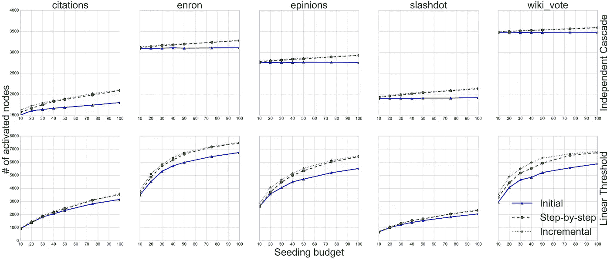
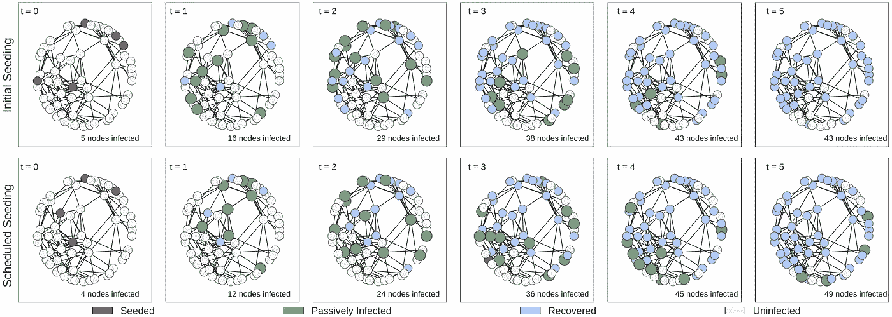
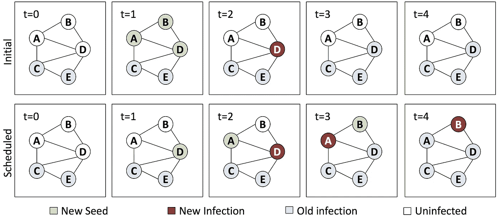

# 时机很重要:社交网络中预定的影响力最大化

> 原文：<https://towardsdatascience.com/timing-matters-scheduled-influence-maximization-in-social-networks-2736543fffed?source=collection_archive---------12----------------------->

Influence spread

社交网络领域中的一个高度研究的主题是搜索有影响力的节点，当这些节点被播种(即被有意激活)时，可以通过病毒传染过程进一步激活网络的大部分。实际上，文献中提出了各种数学模型来描述这种扩散过程的动态特性，并提出了不同的解决方案来最大化这种模型的影响。
然而，这些解决方案中的大多数集中在选择一组在扩散过程的初始阶段被播种的节点。

我们最近的出版物( [PDF](http://bigdatalab.tau.ac.il/wp-content/uploads/2018/07/timing-matters.pdf) ) [发表在 IEEE 计算社会系统汇刊(D. Goldenberg，A. Sela 和 E. Shmueli)](https://ieeexplore.ieee.org/document/8424548/) 上，该出版物是特拉维夫大学大数据实验室[研究的一部分，提出了一种预定播种方法，该方法不仅旨在找到要播种的最佳节点集，还旨在找到执行这些播种的正确时机。
更具体地说，我们确定了现有传染模型的三个不同属性，可通过预定方法利用这些属性来提高激活节点的总数:](http://bigdatalab.tau.ac.il/)

1.  随机动力学
2.  社会效应递减
3.  状态依赖播种

通过分别分析这些属性，我们通过理论和经验评估证明了调度播种方法相对于传统初始播种方法的优势。
我们的分析显示，当使用计划播种方法时，感染节点的最终数量提高了 10%-70%。

# 随机动力学

在图 1 中，我们展示了随机动力学中调度方法的优势，其中延迟播种可以在激活节点数量方面获得高达 30%的改善:

Fig 1: Comparing Scheduling seeding approaches in stochastic diffusion models.

因为延迟播种决策可以避免播种预算的不必要花费，所以通过最大化对网络的总影响，这些预算单元可以用于新的目标。

# 社会效应递减

通过分析具有复杂传染特性和随时间递减效应的扩散模型，我们发现预定播种方法可以通过“及时”利用播种预算来改善总影响。图 2 展示了在社会效应递减的线性阈值模型下，初始播种策略和预定播种策略的最佳可能结果的比较:

Fig 2: Dynamics of the diffusion process for Initial and Scheduled seeding approaches on the Dolphins network

正如我们所看到的，通过为第三时间步节省单个播种预算单位，调度方法成功地激活了 49 个节点，而不是传统初始播种方法中的仅 43 个。

# 状态依赖播种

在播种动作本身的结果取决于邻居节点的激活状态的设置中，播种的定时可以起到至关重要的作用。在图 3 中，我们展示了一个例子，在这个例子中，为了被激活，一个种子节点需要有至少一半的邻居已经被激活。

Figure 3: An example of scheduling advantage in state-dependent seeding dynamics.

通过逐步实施播种行动，我们可以利用累积激活过程并在播种结束时获得更大的总影响力。

# 总结

我们的发现有可能开辟一个新的研究领域，专注于寻找播种行动的正确时机，从而有助于提高我们对信息传播动力学的理解，并设计更好的影响最大化策略。对于每个提出的属性，我们考虑了一个简化的传染模型，允许我们隔离特定属性对预定播种方法的成功的贡献。然后，我们展示了一个极简的玩具示例，展示了通过预定播种方法获得的好处。我们还进行了理论分析，以比较调度播种方法和传统初始播种方法的性能。最后，我们展示了一组经验模拟实验，这些实验比较了调度和初始播种方法在许多真实世界社交网络拓扑上的性能。在整个工作中，我们尽量保持分析的简单性。
例如，在展示有利于计划播种方法的三个属性时，我们将每个属性与其他属性隔离开来。
未来的工作可能会进一步分析这些属性的不同组合，这可能会呈现它们之间的非平凡的相互作用。例如，虽然随机性的存在被证明是支持延迟播种行为的有力论据，但是社会效应递减的存在可能需要尽快播种节点。对这种情况的初步探索可以在我们以前的工作中找到([主动病毒营销:将持续的主动播种努力纳入扩散模型](https://medium.com/@dimgold/incorporating-continuous-active-viral-marketing-by-using-cambridge-analytica-concepts-75f1d845628c))，其中分析了状态依赖播种的动态以及随机性和社会效应递减的存在。

我们的评估主要基于利用真实网络拓扑的理论分析和模拟。在未来，用额外的真实世界数据(如用户的购买历史)来丰富我们的模拟会很有趣。此外，进行现场实验来比较通过预定播种方法和初始播种方法获得的采用率将是有见地的。总之，我们相信我们的发现有潜力打开一个全新的研究领域，专注于寻找播种行动的正确时机，从而帮助我们提高对扩散动力学的理解，并设计更好的策略来塑造社会行为。