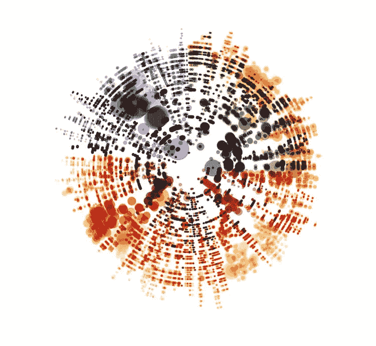

# 数据可视化技巧

> 原文：<https://towardsdatascience.com/tips-for-data-visualization-c00d505db7cf?source=collection_archive---------7----------------------->

您的数据取决于您理解和交流数据的能力，这就是为什么选择正确的可视化/图表至关重要。如果您不能有效地展示数据，关键的见解可能会丢失。信息可以用几种不同的方式可视化，每种方式都更能提供特定的洞察力。

处理数据时，首先要理解你想要讲述的故事或你试图强调的关系。这将有助于选择正确的形象来传达你的信息。

在开始可视化数据之前，您应该了解**常见的数据类型:**

1.  定量——可以计数或测量；数字的
2.  分类—可以根据组或类别进行排序
3.  离散-具有有限数量的可能值
4.  连续-测量，其值在一个范围内

理解**数据关系**对于数据可视化过程非常重要。下面列出了常见的数据关系:

👉时间序列—跟踪一段时间内指标值的变化

👉名义比较-比较子类别的数量值

👉相关性—包含两个或更多变量的数据，这些变量之间可能存在正相关性或负相关性

👉部分到整体的关系——与整体相比的数据子集

👉分布—显示围绕中心值的数据分布

👉偏差-显示数据点之间的相互关系，以查看任意给定点与平均值的差距

👉排名-显示两个或多个值在相对大小上的相互比较

**其他提示:**

使用图标增强理解，减少额外的标签/图例

使用逻辑层次对数据集进行排序

以一种让受众能够简单比较数值的方式来可视化数据

使用注释或标注突出显示重要信息

用一种颜色代表每个类别，在整个演示文稿/仪表盘中保持一致

不要使用三维图表——它可能会扭曲对信息的理解

避免在一个视图中使用超过 5 种颜色

不要使用分散注意力的背景色或有渐变的颜色