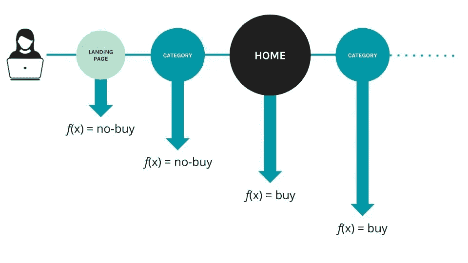
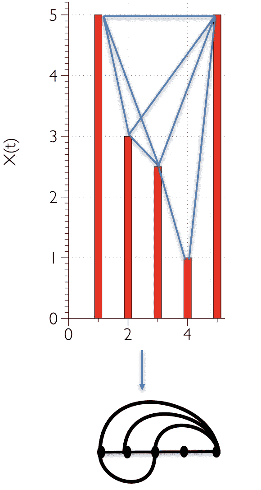
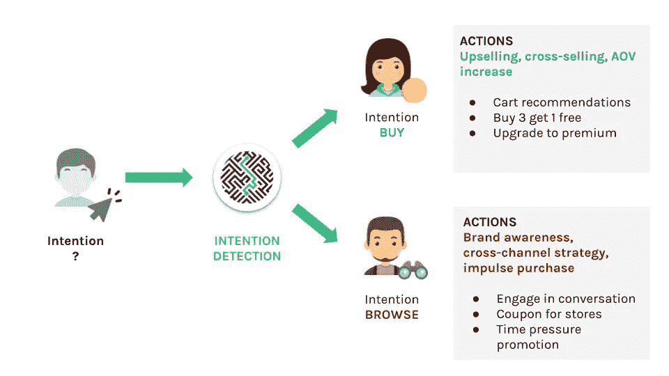

# 买还是不买？这是一个问题

> 原文：<https://towardsdatascience.com/to-buy-or-not-to-buy-that-is-the-question-3a4d99330dcc?source=collection_archive---------11----------------------->

## 如何用图论区分积极消费者和橱窗购物者？

## 从实时信号中了解购物者的真实意图

> “预测很难。尤其是关于未来。”尼尔斯·玻尔(也许)

即使电子商务销售额达到历史最高水平，大多数访问某个电子商务网站的人也更有可能[不买东西就离开，反之亦然](https://www.smartinsights.com/ecommerce/ecommerce-analytics/ecommerce-conversion-rates/)。

> 作为电子商务副总裁，如果知道我们的模型可以在你的店铺点击几下后识别出有动机的顾客，你会怎么做(剧透:只有**六个**)？对于积极主动的购物者和漫不经心的购物者，哪些是正确的互动策略？

任何一个优秀的销售助理都知道，消费者通过语言和身体行为展示出他们真正兴趣的清晰线索:他们如何在过道里走动，他们问什么问题，他们的穿着等等..如果这在现实世界中是真的，那么在数字世界中，当没有脸可以阅读时，会发生什么呢？

如果用户正在浏览我们的网站，用尽可能少的“点击”来检测她真正的购物意图肯定会非常有帮助:在大数据时代，我们实际上可以跟踪(匿名)浏览我们商店的用户，并精确记录他们的行动。我们能否利用消费者留下的所有数字面包屑，将预测的艺术转化为推销的艺术？

在 [Tooso](https://tooso.ai/) ，我们正在通过*人工智能*和*机器学习*帮助市场上一些最大和最具创新性的零售商转变网上购物。由于我们的[渠道](https://medium.com/tooso/server-less-is-more-98d4275c37ae)已经每天从几个电子商务网站获取数百万新事件，我们处于一个理想的位置，可以尝试使用数据来回答我们的问题:

> 人工智能能在他们的在线旅程中多久(如果有的话)发现真正想买东西的用户？

想象一下你的数码商店的可能性:如果你知道哪些用户会购买，哪些不会，你如何改变你的网站？Tooso 的产品专家正在与我们的零售客户合作，为不同类型的用户开发不同的驱动因素:如果用户的意图是购买，我们可以努力进行追加销售，优化购物车体验。


If the user wants to buy, let’s help him buy more.

另一方面，如果目的是浏览，我们可以尝试让用户受到启发并参与进来:增加品牌知名度，建议跨渠道行动，等等。


If the user is casually browsing, let’s get him involved.

在*这篇*博文中，我们将从数据科学的角度解释我们是如何完成这项任务的，并且我们将概述一些由于我们的进展而正在开发的产品功能。**初步结果表明，只需在网站上进行六次操作，我们就能够可靠地预测购买客户！**我们还希望通过对真实数据进行研究友好的许可，为零售业的人工智能社区做出进一步的贡献:更多信息请见结束语，现在是科学时间。

> 几个月前，我们启动了 **Tooso 实验室**。该项目的启动旨在通过将我们的愿景、技能组合和专有数据集与我们在行业和学术界的知名研究人员网络相匹配，为新旧人工智能问题带来新的跨学科解决方案；“点击流预测问题”是我们选择用新方法解决的第一个问题。
> 
> 这份进展中的报告是 Tooso 实验室和 Lucas Lacasa 博士持续合作的结果[，Lucas Lacasa 博士是](http://www.maths.qmul.ac.uk/~lacasa/main.html)[玛丽女王大学](https://en.wikipedia.org/wiki/Queen_Mary_University_of_London)应用数学高级讲师，一位了不起的物理学家，一位相当不错的篮球运动员，也是 Tooso 的好朋友。

## 从点击流数据到预测

> "也许因为我永远不会成为人类，所以我对人类很感兴趣."**杰夫林赛**

我们将通过使问题更精确一点和上下文更明确一点来开始我们的深入探讨。你可以把你最喜欢的电子商务网站想象成一个网络，即一个正式的结构，其中*节点*是网站中的页面，而*边*是页面之间的链接:用户登陆该网站后，可以通过在每个页面/节点重复动作来导航网络，如下图所示:


Navigating the network: a shopper’s journey from landing page to the final checkout.

每个用户将在网络中无数可能的路径中仅选择一个:一些路径将是许多用户共同的(例如，从登录页面到主页)，一些将是相对罕见的(例如，通过产品描述中的一些链接从一个 SKU 到另一个)；一些路径会以购买结束(就像上面的红色路径)，但是大部分会在中途中断，也就是当用户*离开*商店*而没有*购买时。

多亏了我们的 [Apache 许可的](https://www.apache.org/licenses/LICENSE-2.0) Tooso Analytics 标签，我们的大数据仓库存储了用户路径中的所有动作，因此示例中的事件将被记录为类似下面的列表:

```
USER 123, TIME 1537517055, URL /landing123, PAGE TYPE landing
USER 123, TIME 1537517059, URL /category1, PAGE TYPE category
USER 123, TIME 1537517065, URL /index, PAGE TYPE home
USER 123, TIME 1537517100, URL /category2, PAGE TYPE category
USER 123, TIME 1537517200, URL /product-01231312, PAGE TYPE sku
USER 123, TIME 1537517210, URL /cart, PAGE TYPE cart
USER 123, TIME 1537517290, URL /checkout, PAGE TYPE checkout
```

如果我们不是取一个用户，而是取几千个用户，那么得到的集合将会是一个很长的路径列表，其中一些会包含一些购买事件，而大多数不会；列表中的每条路径都是一个独立的时间序列，由严格按时间顺序排列的单个事件组成。

> 我们的目标是训练机器很好地预测人类行为，这样就有可能从一些初始事件中了解用户是否会购买某些东西。

因此，我们的*训练*设置将涉及向我们的人工智能输入序列，以训练我们的预测模型:


Training settings: from labeled sequences to the trained model.

我们的*离线预测*设置将包括输入 *1，2，..将 n 个*事件添加到训练好的模型中，并记录对购买行为的预测，以测量几个序列长度的准确性(直觉上，事件越多，预测应该越好):



Offline prediction settings: the model predicts binary buying outcome at each time step in the sequence.

一旦我们对模型的准确性感到满意，就可以以一种简单明了的方式为具有*在线预测*的实时自适应产品提供动力(假设有一个可靠的系统来接收点击流数据并做出相应的反应)。

既然问题的边界已经明确设定，现在是真正有趣的时候了:我们如何教会机器预测人类购物者？

## 物理学拯救世界

> "向酒吧女招待解释物理定律应该是可能的。"——阿尔伯特·爱因斯坦

从点击流数据中预测购物行为(或者更一般地说，导航模式)的问题已经在学术界和工业界用几种方法进行了研究:从高阶马尔可夫链(如这篇 [PLOS 论文](https://journals.plos.org/plosone/article?id=10.1371/journal.pone.0102070)中)，到 [RNN 论文](https://en.wikipedia.org/wiki/Recurrent_neural_network)中(如这篇由乐天支持的 [SIGIR 论文](http://sigir-ecom.weebly.com/uploads/1/0/2/9/102947274/paper_6.pdf))，最近的论文[表明，即使一个简单的时间戳也可能是一个非常强大的预测特征。](https://dl.acm.org/citation.cfm?id=2813521)

> 作为 Tooso 实验室跨学科哲学的一部分，我们有兴趣以全新的眼光看待这个问题；特别是，我们从开发“廉价的”(从计算的角度来看)方法开始，与更传统的“繁重的”算法相比，这些方法可以在实时设置中有效地使用，而不会损失准确性。

我们的跨学科方法植根于物理学，特别是所谓的可见性图(书呆子警告:查看[这篇 PNAS 论文](http://www.pnas.org/content/105/13/4972))。如果您考虑一个通用时间序列，可以通过将可以“看到”彼此的数据点(作为节点)链接在一起来构建可见性图(例如，直观地，您可以在它们之间画一条直线，而不穿过中间点):



Getting edges out of a time series through the “visibility” criterion.

这种看似无害的转变开启了建模技术的宇宙，因为可见性图已经成功地用于描述时间序列的结构和各种设置中的潜在动力学(例如，[预测阿尔茨海默病](https://www.ncbi.nlm.nih.gov/pubmed/20714909)和[湍流](http://iopscience.iop.org/article/10.1088/1742-5468/2015/08/P08031/meta))。

成熟可见性分析的关键要素是“[主题](https://journals.aps.org/pre/abstract/10.1103/PhysRevE.93.042309)”，这是“接近”节点之间的连接模式，其中“接近”是通过在时间维度上遍历图形计算的滑动窗口来定义的。例如，对于尺寸为 4 的窗口，可能的图案/样式只有六个，并且它们可以通过简单的不等式检查容易地计算出来(全部细节[在此](https://arxiv.org/pdf/1512.00297.pdf)):


For a window size of 4, there are only six possible motifs.

虽然看起来很简单，但这些图案已经被证明是一种有用的组合工具，可以用来描述混沌过程和其他类型的复杂数据。用这些新概念武装起来(感谢物理！)，如何才能接近我们在零售界的原始问题？极客读者可能已经知道答案:我们将把我们的用户轨迹转换成可见性图，并使用“主题”作为特征来回答我们的分类问题:用户会在这个会话中买东西吗？

## 意图分类的第一步

> "一个好的预测者并不比其他人更聪明，他只是更好地组织了他的无知. " **—匿名**

作为我们的第一个游乐场，我们从我们的在线用户数据集中提取了大约 500，000 条真实客户的点击流轨迹。在对更一般的“购买与不购买”分类问题感兴趣的同时，第一个问题是通过可见性图用*最简单的*可能模型可以预测什么。

简单有两个天然的优点:首先，简单的模型更容易理解、调试和改进，为我们以后可能想要尝试的任何火箭科学的东西提供了良好的基线；其次，简单的模型更容易在实时、低延迟的环境中设计:因为我们的最终目标是改善我们合作伙伴网站上数百万用户的购物体验，所以在准确性、速度和维护成本之间取得平衡至关重要。

我们的基本预处理相当简单:对于每个轨迹，我们基于传统的电子商务事件类型(例如，1 =页面视图，2 =产品视图等)，将系列中的事件映射到整数(例如，1，2，3，4 …)。).因此，我们的示例路径为`user 123`:

```
URL /landing123, PAGE TYPE landing
URL /category1, PAGE TYPE category
URL /index, PAGE TYPE home
URL /category2, PAGE TYPE category
URL /product-01231312, PAGE TYPE sku
URL /cart, PAGE TYPE cart
URL /checkout, PAGE TYPE checkout
```

将成为序列:

```
1 -> 1-> 1 -> 1 -> 2 -> 3 -> 4
```

从如此创建的约 500，000 个整数序列中，我们提取了一个平衡样本(~50%/50%)的`buy` vs `no-buy`链，保留了序列标签，但*移除了购买事件*:当我们输入序列来训练我们的模型时，算法因此不能使用购买事件来预测购买(因为那将是*人类欺骗*多于*人工智能*)。看着这样转化的数据，连(训练有素！)人眼可以突出一些有趣的特征:

*   根据行业经验，我们预计`buy`序列通常比`no-buy`包含更多的“添加到购物车”事件，事实也确实如此；
*   在`buy`序列中的用户通常会少看*件*件商品，而不是多看*件*件商品，就好像他们的购买偏好在他们的头脑中更加清晰地表达出来。

由于我们的可视化图形机制，我们现在可以对过程采取更“整体”的观点，并实际使用上述特征作为我们的时间序列的一般图形描述的一部分。虽然有更多的数据需要准备(剧透:我们将在未来几个月发布一篇完整的研究论文)，但现在我们很乐意分享上述简单预测问题的结果:


Buy vs no-buy sequence prediction accuracy with different models.

> 这是什么意思？在我们的可视性图表示上的 SVM 分类器已经拥有 86%的预测准确性。这意味着，给定一个序列和一个标签`buy`对`no-buy`，该模型几乎可以在 10 次中分辨出 9 次哪个标签是正确的！

这是令人难以置信的第一步:通过利用原始时间序列的非常简单的特征，我们能够在数据中发现足够的模式，从而在预测购物行为方面取得非常重要的结果。

很明显，虽然这对于我们基于可见性的特征提取来说确实令人鼓舞，但一个更现实的用例——如我们的介绍部分所描述的——是*仅从少数数据点预测购物行为*:为了为我们的合作伙伴释放商业价值，我们真正想要的是以下问题的答案:

> 当用户轨迹中只有 1，2，3，… N 个事件时，该模型在计算购物事件是否可能在序列的后期发生方面有多好？

为了回答这个进一步的问题，我们从预处理的数据集中提取了每个轨迹的第一个 *m* 点( *m =* 4，5，…)；像往常一样，我们随机丢弃`no-buy`轨迹来平衡我们的类。跳过乏味的细节，这些是基于可见性的分类(通过十重交叉验证评估)的结果，用于 *m* = 4，5，6:


Prediction accuracy with SVM at different values of m *(i.e number of actions taken in the sequence).*

一点都不差！

> 在目标网站上仅仅六个动作之后(产品视图、页面视图等。)，模型 10 次中有 7 次能够准确判断出用户是否要买某个产品！

最后，请注意，我们在现有文献中做了一些健全性检查:尽管在实现细节上有很大不同，但该模型实现的总体准确性水平与一些最先进的同行评审的[论文](http://www.mit.edu/~dbertsim/papers/Stochastic%20Networks/Dynamic%20Classification%20of%20Online%20Customers.pdf)相当。因此，我们的主要贡献是双重的:

*   首次将可见性图理论应用于点击流预测场景；
*   仅使用*极其简单、易于计算*且理论上很容易理解的特性来实现最佳精度。

正如预期的那样，我们计划在未来几个月发布一份关于我们工作的完整研究报告，并进行一些更正式的比较。

## 下一步措施和结束语

> “真正的奢侈是定制。”—拉普·艾尔坎恩

通过可见性图表进行购物预测是我们第一个“公开”的 Tooso 实验室项目:

> 我们*确实*相信更好的科学造就更好的商业，清晰的商业用例可以释放伟大科学的潜力。

我们认为，在我们拥有的资源、时间和机会范围内，为整个领域做出贡献是我们的使命和公司 DNA 的核心部分:生产优秀的产品和推进该领域并不是相互排斥的目标，但它们确实是一枚硬币的两面。

作为这一全新领域的下一步，我们设定了三个中期目标:

*   在 [arXiv](https://arxiv.org/) 上发布一篇研究文章的预印版本，包括模型的所有细节:预处理、特征选择、验证等。；如果时间和社区的兴趣允许的话，我们也可以选择准备一个更好的版本在这个空间的会议上展示；
*   对我们的模型做进一步的迭代:当然*我们可以用这么少的信息获得如此大的成功*，但没有理由就此止步:从搜索行为开始(当然！)，我们会更深入，看看用更复杂的特性会获得多少精度；
*   以研究友好型许可证发布部分原始数据集——仍需要完成一些重要的工作，以确保数据匿名、有用和一致，但进一步为零售业的人工智能社区做出贡献的前景令人兴奋。

在产品方面，我们的团队已经在与我们的业务合作伙伴讨论如何最好地利用我们新模型的预测，努力阐明有趣的“基于意图的”工作流程的细节。



Intent-based workflow, a.k.a.“to each according to his intention”.

无论这项激动人心的工作会产生什么样的产品功能，有一点是肯定无疑的:我们将越来越接近*的完全购物个性化*的承诺，让网上商店无缝地修改他们的行为，以适应每一个单独的客户。

真正的奢侈确实是定制。

## 再见，太空牛仔


我们总是从学术界和行业从业者那里寻找疯狂的新想法。如果你对我们空间里的问题感兴趣，从 NLP 到时间序列分析，请伸手与[jacopo . taglia bue @ tooso . ai](mailto:jacopo.tagliabue@tooso.ai)分享你的故事。

别忘了从 [Linkedin](https://www.linkedin.com/company/tooso) 、 [Twitter](https://twitter.com/tooso_ai) 和 [Instagram](https://www.instagram.com/tooso_ai/) 上的 [Tooso](http://tooso.ai/) 获取最新消息。

## 感谢

感谢安德烈·波洛尼奥利、亚历山大·维考特伦和整个 Tooso 团队对本文前几稿的有益评论。

特别感谢卢卡斯·拉卡萨，他确保我只是温和地毁掉了我们一起做的出色工作:所有剩下的错误当然都是我的，而且仅仅是我的。